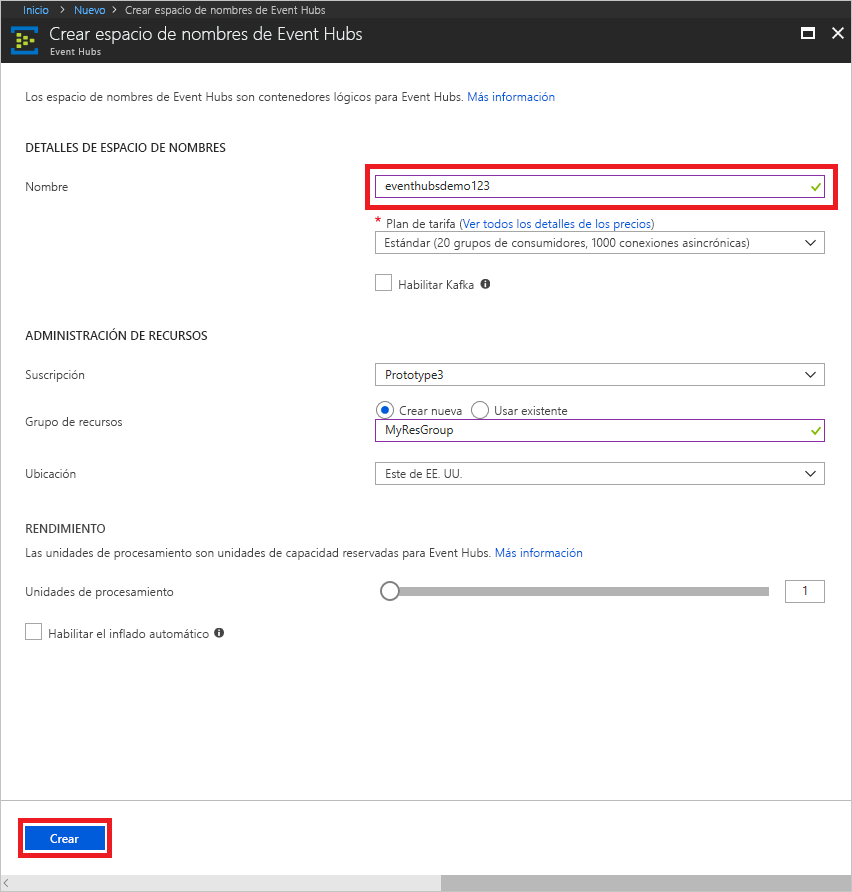
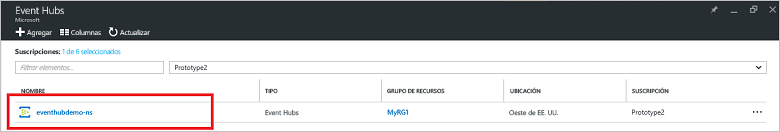
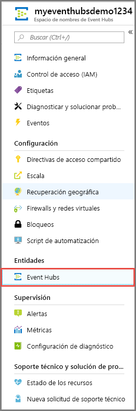
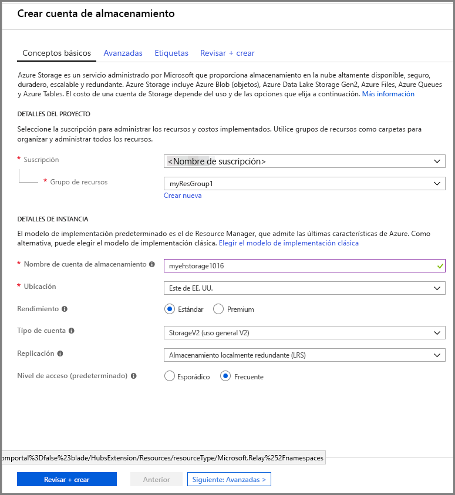
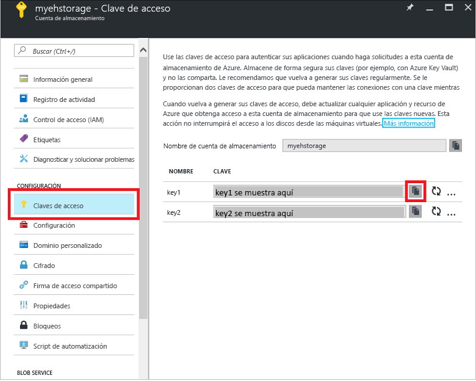

# Guía de inicio rápido de Azure: Procesamiento de flujos de eventos mediante Azure Portal y .NET

Azure Event Hubs es una plataforma de streaming de datos y servicio de ingesta de gran escalabilidad capaz de recibir y procesar millones de eventos por segundo. En esta guía de inicio rápido se muestra cómo crear un centro de eventos mediante [Azure Portal](https://portal.azure.com) y, a continuación, enviar a un centro de eventos y recibir del mismo utilizando el SDK de .NET Standard.

Para completar esta guía de inicio rápido, necesita una suscripción de Azure. Si no tiene una, [Creación de una cuenta gratuita][] antes de empezar.

## Requisitos previos

Para completar esta guía de inicio rápido, asegúrese de que dispone de lo siguiente:

- [Visual Studio 2017 Update 3 (versión 15.3, 26730.01)](http://www.visualstudio.com/vs) o posterior.
- [SDK de .NET Standard](https://www.microsoft.com/net/download/windows), versión 2.0 o posterior.

## Creación de un grupo de recursos

Un grupo de recursos es una recopilación lógica de recursos de Azure. Todos los recursos se implementan y administran en un grupo de recursos. Para crear un grupo de recursos haga lo siguiente:

1. En el panel de la izquierda, seleccione **Grupos de recursos**. A continuación, haga clic en **Agregar**.

   ![][1]

2. Escriba un nombre único para el grupo de recursos. El sistema comprueba de forma inmediata para ver si el nombre está disponible en la suscripción de Azure seleccionada actualmente.

3. En **Suscripción** haga clic en el nombre de la suscripción de Azure en la que desea crear el grupo de recursos.

4. Seleccione una ubicación geográfica para el grupo de recursos.

5. Haga clic en **Crear**.

   ![][2]

## Creación de un espacio de nombres de Event Hubs

Un espacio de nombres de Event Hubs proporciona un contenedor con un único ámbito, al que hace referencia su nombre de dominio completo, en el que puede crear uno o varios centros de eventos. Para crear un espacio de nombres en el grupo de recursos mediante el portal, haga lo siguiente:

1. Inicie sesión en [Azure Portal][] y haga clic en **Crear un recurso** en la parte superior izquierda de la pantalla.

2. Haga clic en **Internet de las cosas** y, luego, en **Event Hubs**.

3. En **Crear espacio de nombres**, especifique el nombre del espacio de nombres. El sistema realiza la comprobación automáticamente para ver si el nombre está disponible.

   

4. Después de asegurarse de que el nombre del espacio de nombres está disponible, elija el plan de tarifa (Básico o Estándar). Elija también una suscripción de Azure, el grupo de recursos y la ubicación en la que se va a crear el recurso.
 
5. Haga clic en **Crear** para crear el espacio de nombres. Puede que tenga que esperar unos minutos hasta que el sistema aprovisione totalmente los recursos.

6. En la lista de espacios de nombres del portal, haga clic en el espacio de nombres recién creado.

7. Haga clic en **Directivas de acceso compartido** y después en **RootManageSharedAccessKey**.
    
8. Haga clic en el botón Copiar para copiar la cadena de conexión **RootManageSharedAccessKey** en el Portapapeles. Guarde esta cadena de conexión en una ubicación temporal, como el Bloc de notas, para usarla más adelante.
    
## Creación de un centro de eventos

Para crear un centro de eventos en el espacio de nombres, haga lo siguiente:

1. En la lista de espacios de nombres de Event Hubs, haga clic en el espacio de nombres recién creado.      
   
     

2. En la ventana del espacio de nombres, haga clic en **Event Hubs**.
   
    

1. En la parte superior de la ventana, haga clic en **+ Agregar Centro de eventos**.
   
    
1. Escriba el nombre del centro de eventos y, a continuación, haga clic en **Crear**.
   
    

Felicidades Ha usado el portal para crear un espacio de nombres de Event Hubs y un centro de eventos dentro de ese espacio de nombres.

## Creación de una cuenta de almacenamiento para el host de procesador de eventos

El host de procesador de eventos es un agente inteligente que simplifica la recepción de eventos desde Event Hubs mediante la administración de puntos de control persistentes y recepciones paralelas. Para los puntos de comprobación, el host de procesador de eventos requiere una cuenta de almacenamiento. El ejemplo siguiente muestra cómo crear una cuenta de almacenamiento y cómo obtener sus claves para el acceso:

1. Inicie sesión en [Azure Portal][Azure Portal] y, luego, haga clic en **Nuevo** en la parte superior izquierda de la pantalla.

2. Haga clic en **Storage** y luego en **Cuenta de Storage**.
   
    

3. En el panel **Crear cuenta de almacenamiento**, escriba un nombre para la cuenta de almacenamiento. Elija una suscripción de Azure, el grupo de recursos y la ubicación en la que se va a crear el recurso. A continuación, haga clic en **Crear**.
   
    

4. En la lista de cuentas de almacenamiento, haga clic en la cuenta recién creada.

5. En la ventana de la cuenta de almacenamiento, seleccione **Claves de acceso**. Copie el valor de **key1** para usarla más adelante en este tutorial.
   
    

## Descarga y ejecución de los ejemplos

El siguiente paso es ejecutar el código de ejemplo que transmite los eventos a un centro de eventos y recibe esos eventos utilizando el host de procesador de eventos. 

En primer lugar, descargue los ejemplos [SampleSender](https://github.com/Azure/azure-event-hubs/tree/master/samples/DotNet/Microsoft.Azure.EventHubs/SampleSender) y [SampleEphReceiver](https://github.com/Azure/azure-event-hubs/tree/master/samples/DotNet/Microsoft.Azure.EventHubs/SampleEphReceiver) de GitHub o clone el [repositorio azure-event-hubs](https://github.com/Azure/azure-event-hubs).

### Remitente

1. Abra Visual Studio y en el menú **Archivo**, haga clic en **Abrir** y, a continuación, haga clic en **Proyecto o solución**.

2. Busque la carpeta del ejemplo **SampleSender** que descargó anteriormente de carpeta y haga doble clic en el archivo SampleSender.sln para cargar el proyecto en Visual Studio.

3. En el Explorador de soluciones, haga doble clic en el archivo Program.cs para abrirlo en el editor de Visual Studio.

4. Reemplace el valor `EventHubConnectionString` por la cadena de conexión que obtuvo al crear el espacio de nombres.

5. Reemplace `EventHubName` con el nombre del centro de eventos que creó dentro de ese espacio de nombres.

6. Desde el menú **Compilar**, haga clic en **Compilar solución** para asegurarse de que no hay errores.

### Receptor

1. Abra Visual Studio y en el menú **Archivo**, haga clic en **Abrir** y, a continuación, haga clic en **Proyecto o solución**.

2. Busque la carpeta del ejemplo **SampleEphReceiver** que descargó en el paso 1 y haga doble clic en el archivo SampleEphReceiver.sln para cargar el proyecto en Visual Studio.

3. En el Explorador de soluciones, haga doble clic en el archivo Program.cs para abrirlo en el editor de Visual Studio.

4. Reemplace los valores variables siguientes:
    1. `EventHubConnectionString`: reemplace con la cadena de conexión que obtuvo al crear el espacio de nombres.
    2. `EventHubName`: el nombre del centro de eventos que creó dentro de ese espacio de nombres.
    3. `StorageContainerName`: el nombre del contenedor de almacenamiento. Asígnele un nombre único y el contenedor se crea automáticamente cuando se ejecuta la aplicación.
    4. `StorageAccountName`: el nombre de la cuenta de almacenamiento que ha creado.
    5. `StorageAccountKey`: la clave de cuenta de almacenamiento que obtuvo en Azure Portal.

5. Desde el menú **Compilar**, haga clic en **Compilar solución** para asegurarse de que no hay errores.

### Ejecución de las aplicaciones

En primer lugar, ejecute la aplicación **SampleSender** y observe los 100 mensajes que se envían. Presione **ENTRAR** para finalizar el programa.

![][3]

A continuación, ejecute la aplicación **SampleEphReceiver** y observe cómo se reciben los mensajes en el host de procesador de eventos.

![][4]
 
## Limpieza de recursos

Puede usar el portal para quitar la cuenta de almacenamiento, el espacio de nombres y el centro de eventos. 

1. En Azure Portal haga clic en **Todos los recursos** en el panel a la izquierda. 
2. Haga clic en la cuenta de almacenamiento o el espacio de nombres que desea eliminar. Eliminar el espacio de nombres también quita cualquier centro de eventos dentro de él.
3. En la barra de menús en la parte superior de la pantalla, haga clic en **Eliminar**. Confirme la eliminación. 

## Pasos siguientes

En este artículo, ha creado un espacio de nombres de Event Hubs y otros recursos necesarios para enviar y recibir eventos de su centro de eventos. Para más información, continúe con el siguiente tutorial:

> [!div class="nextstepaction"]
> [Visualización de anomalías de datos en flujos de datos de Event Hubs](event-hubs-tutorial-visualize-anomalies.md)

[Creación de una cuenta gratuita]: https://azure.microsoft.com/free/?ref=microsoft.com&utm_source=microsoft.com&utm_medium=docs&utm_campaign=visualstudio
[Azure Portal]: https://portal.azure.com/
[1]: ./media/event-hubs-quickstart-portal/resource-groups1.png
[2]: ./media/event-hubs-quickstart-portal/resource-groups2.png
[3]: ./media/event-hubs-quickstart-portal/sender1.png
[4]: ./media/event-hubs-quickstart-portal/receiver1.png
