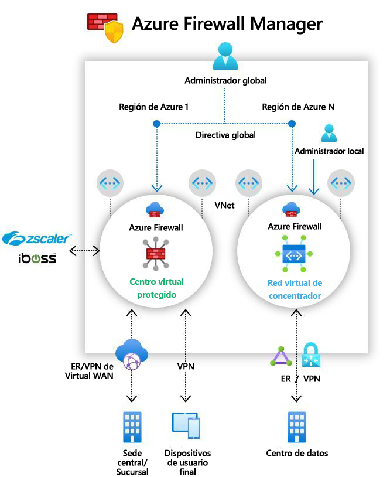

# ¿Qué es Azure Firewall Manager (versión preliminar)?

[!INCLUDE [Preview](../../includes/firewall-manager-preview-notice.md)]

Azure Firewall Manager (versión preliminar) es un servicio de administración de seguridad que proporciona una directiva de seguridad central y administración de rutas para perímetros de seguridad basados en la nube. 

Firewall Manager puede proporcionar administración de seguridad para dos tipos de arquitectura de red:

- **Centro virtual protegido**

   Un [centro de conectividad de Azure Virtual WAN](../virtual-wan/virtual-wan-about.md#resources) es un recurso administrado por Microsoft que permite crear fácilmente arquitecturas en estrella tipo hub-and-spoke. Cuando las directivas de seguridad y enrutamiento están asociadas a ese concentrador, se denomina *[centro virtual protegido](secured-virtual-hub.md)* . 
- **Red virtual de centro de conectividad**

   Se trata de una red virtual estándar de Azure que usted crea y administra. Cuando las directivas de seguridad están asociadas con este tipo de centro, se hace referencia a ellas como *red virtual de centro de conectividad*. En este momento, solo se admite la directiva de Azure Firewall. Puede emparejar las redes virtuales radiales que contengan los servidores y servicios de la carga de trabajo. También puede administrar los firewalls de redes virtuales independientes que no están emparejadas con ningún radio.

Para ver una comparación detallada entre los tipos de arquitectura de *centro virtual protegido* y *red virtual de centro de conectividad*, consulte [¿Cuáles son las opciones de arquitectura de Azure Firewall Manager?](vhubs-and-vnets.md)

## Características de Azure Firewall Manager (versión preliminar)

Azure Firewall Manager (versión preliminar) ofrece las siguientes características:

### Implementación y configuración centralizadas de Azure Firewall

Puede implementar y configurar de forma centralizada varias instancias de Azure Firewall que abarquen diferentes regiones y suscripciones de Azure. 

### Directivas jerárquicas (globales y locales)

Puede usar Azure Firewall Manager (versión preliminar) para administrar de forma centralizada las directivas de Azure Firewall en varios centros virtuales protegidos. Los equipos de TI centrales pueden crear directivas de firewall globales para aplicar la directiva de firewall a los equipos de toda la organización. Las directivas de firewall creadas localmente permiten un modelo de autoservicio de DevOps, lo que aumenta la agilidad.

### Integración con seguridad como servicio de terceros para la seguridad avanzada

Además de Azure Firewall, puede integrar los proveedores de seguridad como servicio (SECaaS) de terceros para proporcionar mayor protección de red para las conexiones de Internet de la red virtual y las ramas.

Esta característica solo está disponible en implementaciones de centros virtuales protegidos.

- Filtrado de tráfico de la red virtual a Internet (V2I)

   - Filtre el tráfico saliente de la red virtual con el proveedor de seguridad de terceros que prefiera.
   - Aproveche la protección de Internet avanzada con reconocimiento del usuario para sus cargas de trabajo en la nube que se ejecutan en Azure.

- Filtrado de tráfico de la rama a Internet (B2I)

   Aproveche la conectividad de Azure y la distribución global para agregar fácilmente el filtrado de terceros para escenarios de rama a Internet.

Para más información acerca de los proveedores de seguridad de confianza, consulte [¿Qué son los asociados de seguridad de confianza de Azure Firewall Manager (versión preliminar)?](trusted-security-partners.md)

### Administración de rutas centralizada

Enrute fácilmente el tráfico al centro de conectividad seguro para filtrar y registrar sin necesidad de configurar manualmente rutas definidas por el usuario (UDR) en redes virtuales de radios. 

Esta característica solo está disponible en implementaciones de centros virtuales protegidos.

Puede usar proveedores de terceros para el filtrado de tráfico de rama a Internet (B2I), en paralelo con Azure Firewall para rama a red virtual (B2V), red virtual a red virtual (V2V) y red virtual a Internet (V2I). También puede usar proveedores de terceros para el filtrado del tráfico V2I, siempre que Azure Firewall no sea necesario para B2V o V2V. 

## Disponibilidad en regiones

Las directivas de Azure Firewall se pueden usar en diferentes regiones. Por ejemplo, puede crear una directiva en Oeste de EE. UU. y usarla en Este de EE. UU. 

## Problemas conocidos

Azure Firewall Manager (versión preliminar) presenta los siguientes problemas conocidos:

|Problema  |Descripción  |Mitigación  |
|---------|---------|---------|
|Limitaciones del filtrado de terceros|El filtrado de tráfico V2I con proveedores de terceros no es compatible con Azure Firewall B2V y V2V.|Actualmente se está investigando.|
|Actualmente no se admite la división del tráfico|Actualmente no se admite la división del tráfico de PaaS público de Azure y de Office 365. Como tal, la selección de un proveedor de terceros para V2I o B2I también envía todo el tráfico de PaaS público de Azure y de Office 365 a través del servicio de asociados.|La división del tráfico en el centro de conectividad se está investigando actualmente.
|Un centro virtual protegido por región|No se puede tener más de un centro virtual protegido por región.|Cree varias WAN virtuales en una región.|
|Las directivas base deben estar en la misma región que la directiva local|Cree todas las directivas locales en la misma región que la directiva de base. Puede seguir aplicando una directiva que se creó en una región de un centro seguro desde otra región.|Actualmente se está investigando.|
|La comunicación entre centros no funciona con los centros virtuales protegidos|Aún no se admite la comunicación entre centros virtuales protegidos.|Actualmente se está investigando.|
|Todos los centros virtuales protegidos que comparten la misma WAN virtual deben estar en el mismo grupo de recursos.|Este comportamiento ya se alinea con los centros WAN virtuales en la actualidad.|Cree varias WAN virtuales para permitir que se creen centros virtuales protegidos en grupos de recursos diferentes.|
|La directiva de firewall no admite grupos de direcciones IP.|Los grupos de direcciones IP se encuentran en versión preliminar pública y, actualmente, solo se admiten en las reglas de firewall tradicionales.|Corrección en curso.

## Pasos siguientes

- Consulte [Información general sobre la implementación de Azure Firewall Manager (versión preliminar)](deployment-overview.md)
- Información sobre [centros de conectividad virtuales protegidos](secured-virtual-hub.md).