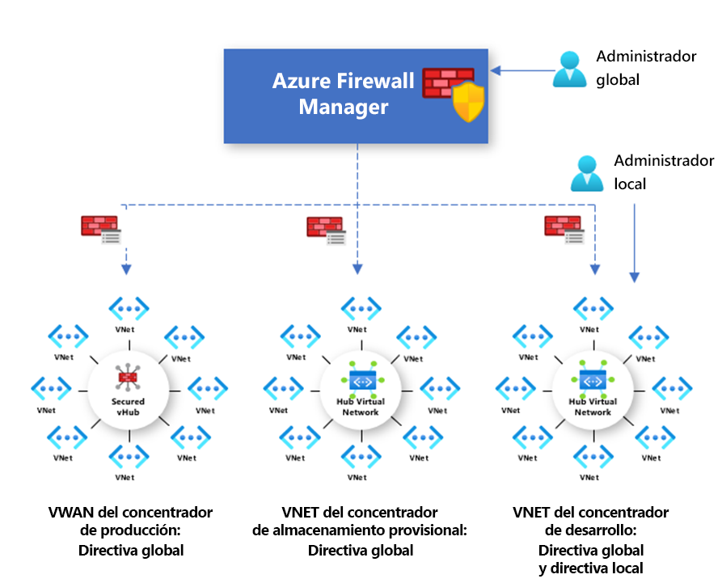

# Información general sobre las directivas de Azure Firewall Manager (versión preliminar)

[!INCLUDE [Preview](../../includes/firewall-manager-preview-notice.md)]

Directiva de firewall es un recurso de Azure que contiene NAT, red y colecciones de reglas de aplicación así como valores de inteligencia sobre amenazas. Es un recurso global que se puede utilizar en varias instancias de Azure Firewall en centros virtuales protegidos y redes virtuales de centros. Las directivas funcionan entre regiones y suscripciones.

## Creación y asociación de una directiva

Una directiva se puede crear y administrar de varias maneras, entre las que se incluyen Azure Portal, API REST, plantillas, Azure PowerShell y CLI.

También puede migrar las reglas existentes de Azure Firewall mediante el portal o mediante Azure PowerShell para crear las directivas. Para más información, consulte [Cómo migrar configuraciones de Azure Firewall a la directiva de Azure Firewall (versión preliminar)](migrate-to-policy.md). 

Las directivas se pueden asociar a uno o varios centros o redes virtuales. El firewall puede estar en cualquier suscripción asociada a su cuenta y en cualquier región.

## Directivas jerárquicas

Las nuevas directivas se pueden crear desde cero o heredar de directivas ya existentes. La herencia permite a DevOps crear directivas de firewall locales sobre la directiva base asignada de la organización.

Las directivas creadas con directivas primarias no vacías heredan todas las colecciones de reglas de la directiva primaria. Las colecciones de reglas de red heredadas de una directiva primaria siempre se priorizan por encima de las colecciones de reglas de red definidas como parte de una nueva directiva. La misma lógica también se aplica a las colecciones de reglas de aplicación. Las colecciones de reglas de red siempre se procesan antes que las colecciones de reglas de aplicación independientemente de la herencia.

El modo de inteligencia sobre amenazas también se hereda de la directiva primaria. Puede establecer el modo de inteligencia sobre amenazas en un valor diferente para invalidar este comportamiento, pero no puede desactivarlo. Solo es posible invalidarlo con un valor más estricto. Por ejemplo, si la directiva primaria está establecida en **solo Alerta**, puede configurar esta directiva local para **Alertar y denegar**.

Las colecciones de reglas NAT no se heredan porque son específicas de un firewall determinado.

Mediante la herencia, los cambios en la directiva primaria se aplican automáticamente a las directivas secundarias de firewall asociadas.

## Reglas y directivas tradicionales

Azure Firewall admite las reglas y las directivas tradicionales. En la siguiente tabla se comparan las directivas y las reglas:

|         |Directiva  |Reglas  |
|---------|---------|---------|
|Contains     |Configuración de NAT, red, reglas de aplicación e inteligencia sobre amenazas|Reglas de NAT, red y aplicación |
|Protege     |Centros virtuales y redes virtuales|Solo redes virtuales|
|Experiencia del portal     |Administración centralizada mediante Firewall Manager|Experiencia de firewall independiente|
|Compatibilidad con varios firewalls     |La directiva de firewall es un recurso independiente que se puede usar entre firewalls.|Exporte e importe manualmente reglas o use soluciones de administración de terceros |
|Precios     |Facturado en función de la asociación del firewall. Consulte [Precios](#pricing).|Gratuito|
|Mecanismos de implementación admitidos     |Portal, API REST, plantillas, Azure PowerShell y CLI|Portal, API REST, plantillas, PowerShell y CLI. |
|Estado de la versión     |Vista previa pública|Disponibilidad general|

## Precios

Las directivas se facturan en función de las asociaciones del firewall. Una directiva con una asociación de firewall o ninguna es gratuita. Una directiva con varias asociaciones de firewall se factura a una tarifa fija. Para más información, consulte [Precios de Azure Firewall Manager](https://azure.microsoft.com/pricing/details/firewall-manager/).

## Pasos siguientes

Para obtener información sobre cómo implementar una instancia de Azure Firewall, consulte [Tutorial: Protección de una red en la nube con la versión preliminar de Azure Firewall Manager en Azure Portal](secure-cloud-network.md).
