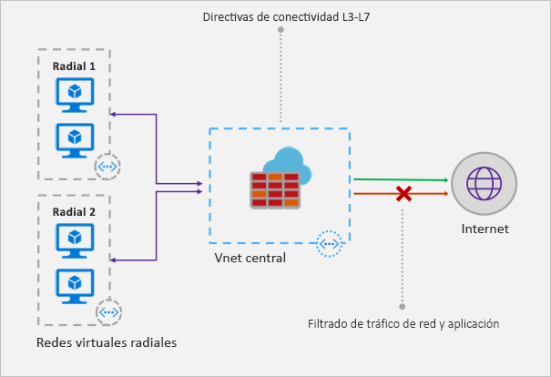

# ¿Qué es Azure Firewall?

Azure Firewall es un servicio de seguridad de red administrado y basado en la nube que protege los recursos de Azure Virtual Network. Se trata de un firewall como servicio con estado completo que incorpora alta disponibilidad y escalabilidad a la nube sin restricciones. 

Puede crear, aplicar y registrar directivas de aplicaciones y de conectividad de red a nivel central en suscripciones y redes virtuales. Azure Firewall usa una dirección IP pública estática para los recursos de red virtual, que permite que los firewall externos identifiquen el tráfico procedente de la red virtual.  El servicio está totalmente integrado con Azure Monitor para los registros y análisis.

## Características

Azure Firewall ofrece las siguientes características:

### Alta disponibilidad integrada
Gracias a la alta disponibilidad integrada, no se necesita ningún equilibrador de carga adicional y no es necesario configurar nada.

### Escalabilidad a la nube sin restricciones 
Azure Firewall puede escalarse verticalmente todo lo que sea necesario para acoger los flujos de tráfico de red cambiantes, por lo que no es necesario elaborar un presupuesto para el tráfico en su momento álgido.

### Reglas de filtrado de FQDN de aplicación

Puede limitar el tráfico HTTP/S saliente a una lista especificada de nombres de dominio completos (FQDN), lo que incluye caracteres comodín. Esta característica no requiere terminación de SSL.

### Reglas de filtrado de tráfico de red

Puede crear reglas de filtrado de red para *permitir* o *denegar* por dirección IP de origen y destino, puerto y protocolo. Azure Firewall tiene estado completo, de modo que puede distinguir los paquetes legítimos de diferentes tipos de conexiones. Las reglas se aplican y se registran en varias suscripciones y redes virtuales.

### Etiquetas FQDN

Con las etiquetas FQDN, puede permitir fácilmente el conocido tráfico de red del servicio de Azure a través del firewall. Por ejemplo, supongamos que quiere permitir el tráfico de red de Windows Update a través del firewall. Puede crear una regla de aplicación e incluir la etiqueta de Windows Update. Ahora, el tráfico de red de Windows Update puede fluir a través del firewall.

### Compatibilidad con SNAT saliente

Todas las direcciones IP de tráfico de red virtual salientes se convierten a direcciones IP públicas de Azure Firewall (traducción de direcciones de red de origen). Puede identificar y permitir el tráfico que se origina en la red virtual y se dirige a los destinos de Internet remotos.

### Compatibilidad con DNAT entrante

El tráfico de red entrante a la dirección IP pública de firewall se traduce (traducción de direcciones de red de destino) y se filtra para las direcciones IP privadas en las redes virtuales. 

### Registro de Azure Monitor

Todos los eventos se integran con Azure Monitor, lo que permite archivar registros en una cuenta de almacenamiento, transmitir eventos al centro de eventos o enviarlos a Log Analytics.

## Problemas conocidos

Azure Firewall presenta los siguientes problemas conocidos:

|Problema  |DESCRIPCIÓN  |Mitigación  |
|---------|---------|---------|
|Conflicto con la característica Just-in-Time (JIT) de Azure Security Center (ASC)|Si se accede a una máquina virtual mediante JIT, y está en una subred con una ruta definida por el usuario que apunta a Azure Firewall como puerta de enlace predeterminada, JIT de ASC no funcionará. Este es el resultado de un enrutamiento asimétrico: un paquete entra por medio de la dirección IP pública de la máquina virtual (JIT abrió el acceso), pero la ruta de vuelta es a través del firewall, que rechaza el paquete porque no se ha establecido una sesión en el firewall.|Para solucionar este problema, coloque las máquinas virtuales JIT en una subred independiente que no tenga una ruta definida por el usuario al firewall.|
|No se admite el modelo de concentrador y radio con emparejamiento global|Se usa el modelo de concentrador y radio en el que el concentrador y el firewall están implementados en una región de Azure y los radios en otra. No se admiten conexiones al concentrador a través del emparejamiento de VNet Global.|Esto es así por diseño. Para más información, consulte [Límites, cuotas y restricciones de suscripción y servicios de Microsoft Azure](../azure-subscription-service-limits.md#azure-firewall-limits).|
Las reglas de filtrado de red para protocolos que no son TCP/UDP (por ejemplo, ICMP) no funcionan con el tráfico enlazado a Internet|Las reglas de filtrado de red de protocolos que no son TCP/UDP no funcionan con la traducción SNAT a la dirección IP pública. Los protocolos que no son TCP/UDP no se admiten entre subredes de radio y redes virtuales.|Azure Firewall usa Standard Load Balancer, [que actualmente no admite SNAT para los protocolos IP](https://docs.microsoft.com/azure/load-balancer/load-balancer-standard-overview#limitations). Se están examinando opciones para admitir este escenario en una versión futura.|
|La NAT de destino (DNAT) no funciona para el puerto 80 y 22.|El campo del puerto de destino de la colección de reglas NAT no puede incluir el puerto 80 ni el 22.|Estamos trabajando para solucionar este problema en un futuro próximo. Mientras tanto, puede usar cualquier otro puerto como puerto de destino en las reglas NAT. Todavía se puede usar el puerto 80 o el 22 como el puerto traducido (por ejemplo, puede asignar la IP pública 81 a la IP privada 80).|
|Falta de compatibilidad entre PowerShell y CLI con ICMP|Azure PowerShell y CLI no admiten ICMP como protocolo válido en las reglas de red.|Aun así se puede usar ICMP como protocolo a través del portal y la API REST. Estamos trabajando para agregar pronto ICMP a PowerShell y CLI.|
|Las etiquetas FQDN requieren que se establezca una combinación protocolo: puerto|Las reglas de aplicaciones con las etiquetas FQDN requieren la definición de puerto: protocolo.|Puede usar **https** como valor de puerto: protocolo. Estamos trabajando para que este campo sea opcional cuando se usen etiquetas FQDN.|
|No se admite la posibilidad de mover un firewall a otro grupo de recursos o suscripción.|No se admite la posibilidad de mover un firewall a otro grupo de recursos o suscripción.|La compatibilidad con esta funcionalidad está en nuestro mapa de ruta. Para mover un firewall a otro un grupo de recursos o suscripción, debe eliminar la instancia actual y volver a crearla en el nuevo grupo de recursos o suscripción.|

## Pasos siguientes

- [Tutorial: Implementación y configuración de Azure Firewall mediante Azure Portal](tutorial-firewall-deploy-portal.md)
- [Implementación de Azure Firewall mediante una plantilla](deploy-template.md)
- [Creación de un entorno de prueba de Azure Firewall](scripts/sample-create-firewall-test.md)

