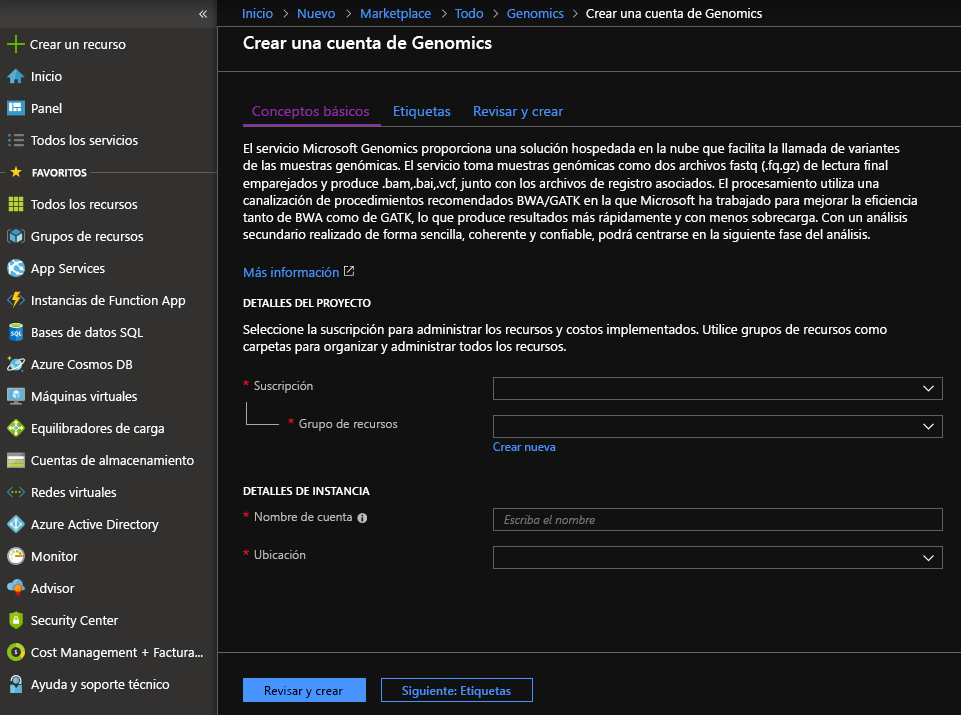
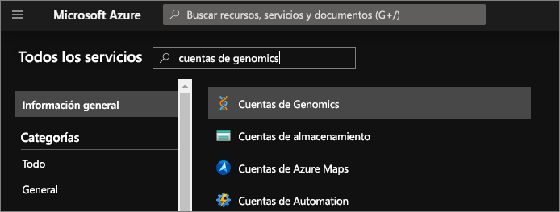
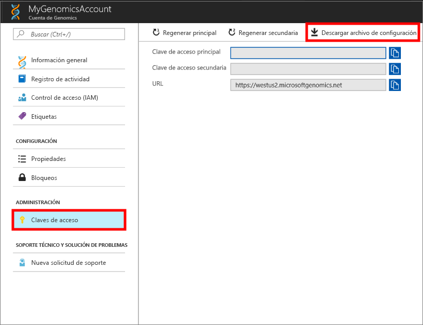
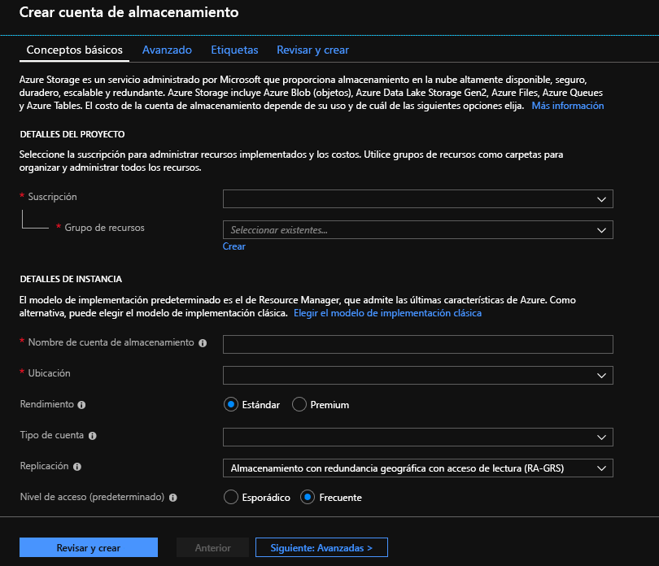

# <a name="quickstart-run-a-workflow-through-the-microsoft-genomics-service"></a>Inicio rápido: Ejecución de un flujo de trabajo mediante el servicio Microsoft Genomics

En este inicio rápido, se cargan los datos de entrada en una cuenta de Azure Blob Storage y se ejecuta un flujo de trabajo a través del servicio Microsoft Genomics mediante el cliente Genomics de Python. Microsoft Genomics es un servicio escalable y seguro para el análisis secundario que puede procesar rápidamente un genoma; este proceso empieza por lecturas de datos sin formato y produce lecturas alineadas y llamadas a variantes. 

## <a name="prerequisites"></a>Prerequisites

- Una cuenta de Azure con una suscripción activa. [Cree una cuenta gratuita](https://azure.microsoft.com/free/?ref=microsoft.com&utm_source=microsoft.com&utm_medium=docs&utm_campaign=visualstudio). 
- [Python 2.7.12 +](https://www.python.org/downloads/release/python-2714/), con `pip` instalado y `python` en la ruta de acceso del sistema. El cliente de Microsoft Genomics no es compatible con Python 3. 

## <a name="set-up-create-a-microsoft-genomics-account-in-the-azure-portal"></a>Configuración: Creación de una cuenta de Microsoft Genomics en Azure Portal

Para crear una cuenta de Microsoft Genomics, vaya a [Crear una cuenta de Genomics](https://portal.azure.com/#create/Microsoft.Genomics) en Azure Portal. Si aún no tiene una suscripción a Azure, cree una antes de crear una cuenta de Microsoft Genomics. 



Configure la cuenta de Genomics con la siguiente información, como se muestra en la imagen anterior. 

 |**Configuración**          |  **Valor sugerido**  | **Descripción del campo** |
 |:-------------       |:-------------         |:----------            |
 |Subscription         | Nombre de la suscripción|Esta es la unidad de facturación para los servicios de Azure. Para más información sobre su suscripción, consulte el artículo [Suscripciones](https://account.azure.com/Subscriptions). |      
 |Resource group       | MyResourceGroup       |  Los grupos de recursos le permiten agrupar varios recursos de Azure (cuenta de almacenamiento o cuenta genómica, entre otros) en un único grupo para una administración sencilla. Para más información, consulte [Grupos de recursos](https://docs.microsoft.com/azure/azure-resource-manager/resource-group-overview#resource-groups). Para conocer cuáles son los nombres de grupo de recursos válidos, consulte el artículo [Convenciones de nomenclatura](/azure/architecture/best-practices/resource-naming). |
 |Nombre de cuenta         | MyGenomicsAccount     |Elija un identificador de cuenta único. Para ver los nombres válidos, consulte [Convenciones de nomenclatura](/azure/architecture/best-practices/resource-naming). |
 |Location                   | Oeste de EE. UU. 2                    |    El servicio está disponible en Oeste de EE. UU. 2, Oeste de Europa y Sudeste Asiático. |

Puede seleccionar **Notificaciones** en la barra de menús superior para supervisar el proceso de implementación.


Para más información sobre Microsoft Genomics, consulte [¿Qué es Microsoft Genomics?](overview-what-is-genomics.md)

## <a name="set-up-install-the-microsoft-genomics-python-client"></a>Configuración: Instalación del cliente de Python de Microsoft Genomics

Necesita instalar tanto Python como el cliente de Python de Microsoft Genomics en su entorno local. 

### <a name="install-python"></a>Instalación de Python

El cliente de Python de Microsoft Genomics es compatible con Python 2.7.12 o una versión de 2.7.xx posterior. 2.7.14 es la versión que se sugiere. Puede encontrar [aquí](https://www.python.org/downloads/release/python-2714/) la descarga. 

> [!IMPORTANT]
> Python 3.x no es compatible con Python 2.7.xx.  MSGen es una aplicación de Python 2.7. Al ejecutar MSGen, asegúrese de que su entorno de Python activo usa una versión 2.7.xx de Python. Es posible que reciba errores al intentar usar MSGen con una versión 3.x de Python.

### <a name="install-the-microsoft-genomics-client"></a>Instalación del cliente de Microsoft Genomics

Utilice `pip` de Python para instalar el cliente de Microsoft Genomics `msgen`. Las siguientes instrucciones asumen que Python ya está instalado en el sistema. Si tiene el problema de que la instalación de `pip` no se reconoce, debe agregar Python y la subcarpeta de scripts a la ruta de acceso del sistema.

```
pip install --upgrade --no-deps msgen
pip install msgen
```

Si no desea instalar `msgen` como un archivo binario para todo el sistema ni modificar paquetes de Python en todo el sistema, utilice la marca `–-user` con `pip`.
Si utiliza la instalación basada en paquetes o setup.py, se instalan todos los paquetes necesarios. De lo contrario, los paquetes requeridos básicos para `msgen` son 

 * [Azure-storage](https://pypi.python.org/pypi/azure-storage). 
 * [Requests](https://pypi.python.org/pypi/requests). 

Puede instalar estos paquetes mediante `pip`, `easy_install` o mediante procedimientos `setup.py` estándar. 

### <a name="test-the-microsoft-genomics-client"></a>Prueba del cliente de Microsoft Genomics
Para probar el cliente de Microsoft Genomics, descargue el archivo de configuración de la cuenta de Genomics. En Azure Portal, vaya a la cuenta de Genomics, para lo que debe seleccionar **Todos los servicios** en la parte superior izquierda y después buscar y seleccionar las cuentas de Genomics.



Seleccione la cuenta de Genomics que acaba de crear, vaya a **Claves de acceso** y descargue el archivo de configuración.



Pruebe que el cliente de Python de Microsoft Genomics está trabajando con el siguiente comando:

```Python
msgen list -f "<full path where you saved the config file>"
```

## <a name="create-a-microsoft-azure-storage-account"></a>Creación de una cuenta de Microsoft Azure Storage 
El servicio Microsoft Genomics espera que las entradas se almacenen como blobs en bloques en una cuenta de almacenamiento de Azure. También escribe archivos de salida como blobs en bloques en un contenedor especificado por el usuario en una cuenta de almacenamiento de Azure. Las entradas y salidas pueden residir en diferentes cuentas de almacenamiento.
Si ya tiene los datos en una cuenta de almacenamiento de Azure, solo tiene que asegurarse de que se encuentran en la misma ubicación que la cuenta de Genomics. De lo contrario, se cobrarán cargos de salida cuando se ejecute el servicio Microsoft Genomics. Si aún no tiene una cuenta de Azure Storage, tendrá que crearla y cargar los datos. [Aquí](https://docs.microsoft.com/azure/storage/common/storage-create-storage-account) puede encontrar más información sobre las cuentas de Azure Storage, lo que incluye qué es una cuenta de almacenamiento y qué servicios proporciona. Para crear una cuenta de Azure Storage, vaya a [Crear cuenta de almacenamiento](https://portal.azure.com/#create/Microsoft.StorageAccount-ARM) en Azure Portal.  



Configure la cuenta de almacenamiento con la siguiente información, como se muestra en la imagen anterior. Utilice la mayoría de las opciones estándar para una cuenta de almacenamiento, especificando únicamente que la cuenta es de almacenamiento de blobs, no de uso general. El almacenamiento de blobs puede ser de dos a cinco veces más rápido para cargas y descargas.  El modelo de implementación predeterminado, el de Azure Resource Manager, es el recomendado.  

 |**Configuración**          |  **Valor sugerido**  | **Descripción del campo** |
 |:-------------------------       |:-------------         |:----------            |
 |Subscription         | Su suscripción de Azure |Para más información acerca la suscripción, consulte [Suscripciones](https://account.azure.com/Subscriptions). |      
 |Resource group       | MyResourceGroup       |  Puede seleccionar el mismo grupo de recursos que la cuenta de Genomics. Para conocer cuáles son los nombres de grupo de recursos válidos, consulte el artículo [Reglas de nomenclatura](/azure/architecture/best-practices/resource-naming) |
 |Nombre de la cuenta de almacenamiento         | MyStorageAccount     |Elija un identificador de cuenta único. Para saber cuáles son los nombres válidos, consulte [Reglas de nomenclatura](/azure/architecture/best-practices/resource-naming) |
 |Location                  | Oeste de EE. UU. 2                  | Para reducir tanto los cargos de salida como la latencia, utilice la misma ubicación que la de su cuenta de Genomics.  | 
 |Rendimiento                  | Estándar                   | El valor predeterminado es Estándar. Para obtener más detalles sobre las cuentas de almacenamiento Estándar y Premium, consulte [Introducción a Microsoft Azure Storage](https://docs.microsoft.com/azure/storage/common/storage-introduction)    |
 |Tipo de cuenta       | BlobStorage       |  El almacenamiento de blobs puede ser de dos a cinco veces más rápido que el uso general para cargas y descargas. |
 |Replicación                  | Almacenamiento con redundancia local                  | El almacenamiento con redundancia local replica los datos en el centro de datos de la región en la que creó la cuenta de almacenamiento. Para más información, consulte [Replicación de Azure Storage](https://docs.microsoft.com/azure/storage/common/storage-redundancy).    |
 |Nivel de acceso                  | Acceso frecuente                   | Un acceso frecuente indica los objetos a los que se accederá con mayor frecuencia en la cuenta de almacenamiento.    |

Luego, seleccione **Revisar y crear** para crear la cuenta de almacenamiento. Igual que hizo con la creación de su cuenta de Genomics, puede seleccionar **Notificaciones** en la barra de menús superior para supervisar el proceso de implementación. 

## <a name="upload-input-data-to-your-storage-account"></a>Carga de los datos de entrada en la cuenta de almacenamiento

El servicio Microsoft Genomics espera lecturas de extremos emparejados (archivos fastq o bam) como archivos de entrada. Puede elegir entre cargar sus propios datos o explorarlos mediante los datos de muestra disponibles públicamente que se le proporcionan. Si desea usar los datos de ejemplo disponibles públicamente, se hospedan aquí:

[https://msgensampledata.blob.core.windows.net/small/chr21_1.fq.gz](https://msgensampledata.blob.core.windows.net/small/chr21_1.fq.gz)
[https://msgensampledata.blob.core.windows.net/small/chr21_2.fq.gz](https://msgensampledata.blob.core.windows.net/small/chr21_2.fq.gz)

Dentro de la cuenta de almacenamiento, necesita crear un contenedor de blobs para los datos de entrada y un segundo contenedor de blobs para los datos de salida.  Cargue los datos de entrada en el contenedor de blobs de entrada. Se pueden utilizar varias herramientas para ello, como [Explorador de Microsoft Azure Storage](https://azure.microsoft.com/features/storage-explorer/), [BlobPorter](https://github.com/Azure/blobporter) o [AzCopy](https://docs.microsoft.com/azure/storage/common/storage-use-azcopy?toc=%2fazure%2fstorage%2fblobs%2ftoc.json). 

## <a name="run-a-workflow-through-the-microsoft-genomics-service-using-the-python-client"></a>Ejecución de un flujo de trabajo con el servicio Microsoft Genomics mediante el cliente de Python 

Para ejecutar un flujo de trabajo mediante el servicio Microsoft Genomics, edite el archivo *config.txt* para especificar el contenedor de almacenamiento de entrada y salida para los datos.
Abra el archivo *config.txt* que descargó de su cuenta de Genomics. Las secciones que necesita especificar son la clave de suscripción y los seis elementos de la parte inferior, el nombre de la cuenta de almacenamiento, la clave y el nombre del contenedor tanto de la entrada como de la salida. Para encontrar esta información, en Azure Portal vaya la opción **Claves de acceso** de su cuenta de almacenamiento, o bien hágalo directamente desde el Explorador de Azure Storage.  


Si desea ejecutar GATK4, establezca el parámetro `process_name` en `gatk4`.

De forma predeterminada, el servicio Genomics genera archivos VCF. Si prefiere una salida gVCF, en lugar de una salida VCF (equivalente a `-emitRefConfidence` en GATK 3.x y a `emit-ref-confidence` en GATK 4.x), agregue el parámetro `emit_ref_confidence` al archivo *config.txt* y establézcalo en `gvcf`,como se indica en la ilustración anterior.  Para volver a la salida VCF, quítela del archivo *config.txt* o establezca el parámetro `emit_ref_confidence` en `none`. 

### <a name="submit-your-workflow-to-the-microsoft-genomics-service-the-microsoft-genomics-client"></a>Envíe el flujo de trabajo al cliente del servicio Microsoft Genomics

Utilice el cliente de Python de Microsoft Genomics para enviar el flujo de trabajo con el siguiente comando:

```python
msgen submit -f [full path to your config file] -b1 [name of your first paired end read] -b2 [name of your second paired end read]
```

Puede ver el estado de los flujos de trabajo con el siguiente comando: 
```python
msgen list -f c:\temp\config.txt 
```

Una vez se complete el flujo de trabajo, puede ver los archivos de salida en la cuenta de Azure Storage, en el contenedor de salida que ha configurado. 

## <a name="next-steps"></a>Pasos siguientes
En este artículo, ha cargado datos de entrada de ejemplo en Azure Storage y ha enviado un flujo de trabajo al servicio Microsoft Genomics mediante el cliente de Python `msgen`. Para más información sobre otros tipos de archivo de entrada que pueden utilizarse con el servicio Microsoft Genomics, consulte las páginas siguientes: [Archivos FASTQ emparejados](quickstart-input-pair-FASTQ.md) | [BAM](quickstart-input-BAM.md) | [Varios archivos FASTQ o BAM](quickstart-input-multiple.md). También puede explorar este tutorial utilizando nuestro [tutorial de Notebook de Azure.](https://aka.ms/genomicsnotebook)
