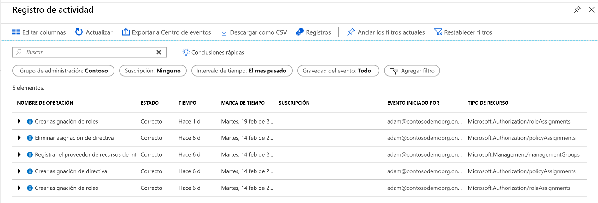

# Organización de los recursos con grupos de administración de Azure

Si su organización tiene varias suscripciones, puede que necesite una manera de administrar el acceso, las directivas y el cumplimiento de esas suscripciones de forma eficaz. Los grupos de administración de Azure proporcionan un nivel de ámbito por encima de las suscripciones. Las suscripciones se organizan en contenedores llamados "grupos de administración" y aplican sus condiciones de gobernanza a los grupos de administración. Todas las suscripciones dentro de un grupo de administración heredan automáticamente las condiciones que se aplican al grupo de administración. Los grupos de administración proporcionan capacidad de administración de nivel empresarial a gran escala con independencia del tipo de suscripciones que tenga.

A modo de ejemplo, puede aplicar directivas a un grupo de administración que limite las regiones disponibles para la creación de máquinas virtuales. Esta directiva se aplicaría a todos los grupos de administración, las suscripciones y los recursos de ese grupo de administración, al permitir únicamente que se creen máquinas virtuales en esa región.

## Jerarquía de los grupos de administración y las suscripciones

Puede compilar una estructura flexible de grupos de administración y suscripciones para organizar los recursos en una jerarquía para una administración unificada de las directivas y el acceso. El siguiente diagrama muestra un ejemplo de creación de una jerarquía para la gobernanza mediante grupos de administración.

Cree una jerarquía para poder aplicar una directiva, por ejemplo, limite las ubicaciones de las máquinas virtuales a la región Oeste de EE. UU. en el grupo "Producción". Esta directiva se heredará en ambas suscripciones de EA en ese grupo de administración y se aplicará a todas las máquinas virtuales de esas suscripciones. El propietario de recursos o suscripciones no puede modificar esta directiva de seguridad, lo que permite una gobernanza mejorada.

Otro escenario en el que usaría grupos de administración es para proporcionar acceso de usuario a varias suscripciones. Al mover muchas suscripciones bajo ese grupo de administración, puede crear una asignación de [control de acceso basado en rol](../../role-based-access-control/overview.md) (RBAC) en el grupo de administración que heredará ese acceso en todas las suscripciones.
Una asignación en el grupo de administración puede permitir a los usuarios acceder a todo lo que necesitan en lugar de realizar scripting para proporcionar control de acceso basado en rol sobre las distintas suscripciones.

### Hechos importantes acerca de los grupos de administración

- Se admiten 10 000 grupos de administración en un único directorio.
- Un árbol de grupo de administración puede admitir hasta seis niveles de profundidad.
  - Este límite no incluye el nivel raíz o de suscripción.
- Cada grupo de administración y suscripción admite solo un elemento primario.
- Cada grupo de administración puede tener muchos elementos secundarios.
- Todas las suscripciones y grupos de administración están dentro de una única jerarquía en cada directorio. Consulte [Hechos importantes acerca de los grupos de administración raíz](#important-facts-about-the-root-management-group).

## Un grupo de administración raíz para cada directorio

Cada directorio tiene un grupo de administración de nivel superior único denominado "raíz".
Este grupo de administración raíz está integrado en la jerarquía de manera que contiene todos los grupos de administración y suscripciones. Este grupo de administración raíz permite que las directivas globales y las asignaciones de control de acceso basado en rol (RBAC) se apliquen en el nivel de directorio. Los [administradores globales de Azure AD necesitan elevar sus privilegios inicialmente](../../role-based-access-control/elevate-access-global-admin.md) al rol Administrador de acceso de usuario de este grupo raíz. Después de esta elevación de los privilegios de acceso, puede asignar cualquier control de acceso basado en rol a otros usuarios o grupos del directorio para administrar la jerarquía. Como administrador, puede asignar su propia cuenta como propietario del grupo de administración raíz.

### Hechos importantes acerca de los grupos de administración raíz

- De forma predeterminada, el nombre para mostrar del grupo de administración raíz es **Grupo raíz de inquilino**. El identificador es el de Azure Active Directory.
- Para cambiar el nombre para mostrar, se debe asignar a su cuenta el rol de Propietario o Colaborador en el grupo de administración raíz. Para conocer los pasos para cambiar el nombre, consulte [Cambio del nombre de un grupo de administración](manage.md#change-the-name-of-a-management-group).
- El grupo de administración raíz no se puede mover ni eliminar, a diferencia de los demás.  
- Todas las suscripciones y los grupos de administración se incluyen en el grupo de administración raíz único del directorio.
  - Todos los recursos del directorio pertenecen al grupo de administración raíz para la administración global.
  - Las suscripciones nuevas pertenecen de manera predeterminada y automática al grupo de administración raíz cuando se crean.
- Todos los clientes de Azure pueden ver el grupo de administración raíz, pero no todos los clientes tienen acceso para administrar ese grupo de administración raíz.
  - Todos los usuarios con acceso a una suscripción pueden ver el contexto de dónde está esa suscripción en la jerarquía.  
  - A ninguno se le concede acceso de forma predeterminada al grupo de administración raíz. Los administradores globales de Azure AD son los únicos usuarios que pueden elevar sus propios privilegios para obtener acceso.  Una vez que tienen acceso, los administradores globales pueden asignar cualquier rol RBAC a otros usuarios para la administración.  

> [!IMPORTANT]
> Todas las asignaciones de acceso de los usuarios o de directivas en el grupo de administración raíz **se aplican a todos los recursos dentro del directorio**.
> Por este motivo, todos los clientes deben evaluar la necesidad de tener los elementos definidos en este ámbito.
> Las asignaciones de directivas y de acceso de usuario deberían ser obligatorias solo en este ámbito.  

## Instalación inicial de los grupos de administración

Cuando algún usuario comienza usando grupos de administración, se produce un proceso de configuración inicial. El primer paso es que el grupo de administración raíz se crea en el directorio. Una vez creado este grupo, todas las suscripciones existentes que existen en el directorio se convierten en elementos secundarios del grupo de administración raíz. El motivo de este proceso es asegurarse de que hay solo una jerarquía de grupos de administración en un directorio. La jerarquía única dentro del directorio permite a los clientes administrativos aplicar directivas y un acceso global que otros clientes dentro del directorio no puedan omitir. Nada que se haya asignado en la raíz se aplicará a toda jerarquía, lo cual incluye todos los grupos de administración, las suscripciones, los grupos de recursos y los recursos dentro de ese inquilino de Azure AD.

## Problemas para ver todas las suscripciones

Algunos de los directorios que empezaron a usar grupos de administración durante la versión preliminar (antes del 25 de junio de 2018) podrían experimentar el problema de que no estén todas las suscripciones en la jerarquía. El proceso para que todas las suscripciones estén en la jerarquía se implementó después de realizar una asignación de roles o directivas en el grupo de administración raíz del directorio. 

### Cómo resolver el problema

Hay dos opciones para resolver este problema.

1. Eliminar todas las asignaciones de roles y directivas del grupo de administración raíz
   1. Mediante la eliminación de todas las asignaciones de roles y directivas del grupo de administración raíz, el servicio repondrá todas las suscripciones en la jerarquía durante el siguiente ciclo nocturno.  Este proceso es para asegurarse de que no se ha dado ningún acceso accidental ni asignación de directiva a todas las suscripciones de los inquilinos.
   1. La mejor manera de realizar este proceso sin que afecte a los servicios es aplicar las asignaciones de roles o directivas un nivel por debajo del grupo de administración raíz. Después, puede quitar todas las asignaciones del ámbito raíz.
1. Llamar a la API directamente para iniciar el proceso de reposición
   1. Cualquier cliente del directorio puede llamar a las API *TenantBackfillStatusRequest* o *StartTenantBackfillRequest*. Cuando se llama a StartTenantBackfillRequest API, esta comienza el proceso de configuración inicial de mover todas las suscripciones a la jerarquía. Este proceso también inicia la aplicación de todas las suscripciones nuevas para que constituyan un elemento secundario del grupo de administración raíz. Este proceso se puede realizar sin cambiar ninguna asignación en el nivel raíz. Mediante una llamada a la API, acepta que todas las asignaciones de directivas o de acceso en la raíz se pueden aplicar a todas las suscripciones.

Si tiene preguntas acerca de este proceso de reposición, póngase en contacto con: managementgroups@microsoft.com  
  
## Acceso al grupo de administración

Los grupos de administración de Azure admiten el [control de acceso basado en rol (RBAC) de Azure](../../role-based-access-control/overview.md) para todos los accesos a recursos y las definiciones de roles.
Estos permisos se heredan en los recursos secundarios que existen en la jerarquía. Cualquier rol de RBAC integrado puede asignarse a un grupo de administración que heredará la jerarquía para los recursos.
Por ejemplo, el colaborador de máquina virtual del rol de RBAC puede asignarse a un grupo de administración. Este rol no tiene ninguna acción en el grupo de administración, pero se heredará en todas las máquinas virtuales de ese grupo de administración.

El gráfico siguiente muestra la lista de roles y las acciones admitidas en los grupos de administración.

| Nombre de rol de RBAC             | Crear | Cambiar nombre | Mover** | Eliminar | Asignar acceso | Asignar directiva | Lectura  |
|:-------------------------- |:------:|:------:|:------:|:------:|:-------------:| :------------:|:-----:|
|Propietario                       | X      | X      | X      | X      | X             | X             | X     |
|Colaborador                 | X      | X      | X      | X      |               |               | X     |
|Colaborador MG*             | X      | X      | X      | X      |               |               | X     |
|Lector                      |        |        |        |        |               |               | X     |
|Lector MG*                  |        |        |        |        |               |               | X     |
|Colaborador de directivas de recursos |        |        |        |        |               | X             |       |
|Administrador de acceso de usuario   |        |        |        |        | X             | X             |       |

*: Colaborador MG y Lector MG solo permiten a los usuarios realizar esas acciones en el ámbito del grupo de administración.  
**: Las asignaciones de roles en el grupo de administración raíz no son necesarias para mover una suscripción o grupo de administración a este grupo y desde este.  Consulte [Administración de los recursos con grupos de administración](manage.md) para más información acerca de cómo mover elementos dentro de la jerarquía.

### Asignación y definición de roles de RBAC personalizados

Los roles de RBAC personalizados no se admiten en los grupos de administración en este momento. Consulte el [foro de comentarios sobre los grupos de administración](https://aka.ms/mgfeedback) para ver el estado de este elemento.

## Auditoría de los grupos de administración mediante registros de actividad

Se admiten grupos de administración en el [registro de actividad de Azure](../../azure-monitor/platform/activity-logs-overview.md). Puede buscar todos los eventos que se producen en un grupo de administración en la misma ubicación central que otros recursos de Azure.  Por ejemplo, puede ver todos los cambios de asignaciones de roles o de asignación de directiva efectuados en un grupo de administración concreto.

Si observa las consultas en los grupos de administración fuera de Azure Portal, el ámbito de destino de los grupos de administración se parece a **"/providers/Microsoft.Management/managementGroups/{yourMgID}"** .

## Pasos siguientes

Para más información sobre los grupos de administración, consulte:

- [Creación de grupos de administración para organizar los recursos de Azure](create.md)
- [Cambio, eliminación y administración de los grupos de administración](manage.md)
- [Revisión de grupos de administración en el módulo de recursos de Azure PowerShell](/powershell/module/az.resources#resources)
- [Revisión de grupos de administración en la API REST](/rest/api/resources/managementgroups)
- [Revisión de grupos de administración en la CLI de Azure](/cli/azure/account/management-group)