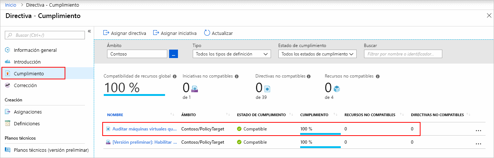
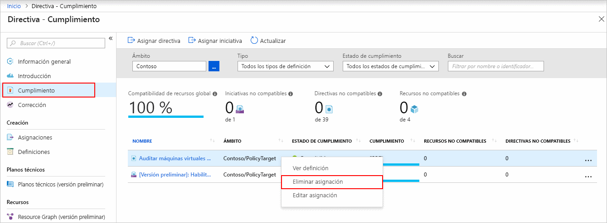

# Inicio rápido: Creación de una asignación de directiva para identificar recursos no compatibles mediante una plantilla de Resource Manager

El primer paso para entender el cumplimiento en Azure es identificar el estado de sus recursos.
Esta guía de inicio rápido lo guiará por el proceso de creación de una asignación de directiva para identificar las máquinas virtuales que no están usando discos administrados.

Al finalizar este proceso, habrá identificado correctamente máquinas virtuales que no utilizan discos administrados. _No son compatibles_ con la asignación de directiva.

## Prerequisites

Si no tiene una suscripción a Azure, cree una cuenta [gratuita](https://azure.microsoft.com/free/) antes de empezar.

## Creación de una asignación de directiva

En este inicio rápido, creará una asignación de directiva y asignará una definición de directiva integrada denominada _Auditoría de máquinas virtuales que no usan discos administrados_. Para una lista parcial de las directivas integradas disponibles, consulte los [ejemplos de Azure Policy](./samples/index.md).

Existen varios métodos de creación de asignaciones de directivas. En este inicio rápido se usa una [plantilla de inicio rápido](https://azure.microsoft.com/resources/templates/101-azurepolicy-assign-builtinpolicy-resourcegroup/).
Esta es una copia de la plantilla:

[!code-json[policy-assignment](~/quickstart-templates/101-azurepolicy-assign-builtinpolicy-resourcegroup/azuredeploy.json)]

> [!NOTE]
> El servicio Azure Policy es gratuito. Para más información, consulte la [Introducción a Azure Policy](./overview.md).

1. Seleccione la siguiente imagen para iniciar sesión en Azure Portal y abrir la plantilla:

   

1. Seleccione o escriba los siguientes valores:

   | Nombre | Value |
   |------|-------|
   | Subscription | Seleccione su suscripción a Azure. |
   | Resource group | Seleccione **Crear**, especifique un nombre y seleccione **Aceptar**. En la captura de pantalla, el nombre del grupo de recursos es _mypolicyquickstart\<Date in MMDD\>rg_. |
   | Location | Seleccione una región. Por ejemplo, **Centro de EE. UU**. |
   | Nombre de la asignación de directiva | Especifique un nombre para la asignación de directiva. Si lo desea, puede usar la definición de directiva en pantalla. Por ejemplo, **Auditoría de máquinas virtuales que no usan discos administrados**. |
   | Nombre del grupo de recursos | Especifique un nombre para el grupo de recursos donde desea asignar la directiva. En este inicio rápido se usa el valor predeterminado **[resourceGroup().name]** . **[resourceGroup()](../../azure-resource-manager/templates/template-functions-resource.md#resourcegroup)** es una función de plantilla que recupera el grupo de recursos. |
   | ID de definición de directiva | Especifique **/providers/Microsoft.Authorization/policyDefinitions/0a914e76-4921-4c19-b460-a2d36003525a**. |
   | Acepto los términos y condiciones indicados anteriormente | (Seleccionar) |

1. Seleccione **Comprar**.

Algunos recursos adicionales:

- Para buscar más plantillas de ejemplo, consulte [Plantillas de inicio rápido de Azure](https://azure.microsoft.com/resources/templates/?resourceType=Microsoft.Authorization&pageNumber=1&sort=Popular).
- Para ver la referencia de plantilla, vaya a la [referencia de plantilla de Azure](/azure/templates/microsoft.authorization/allversions).
- Para aprender a desarrollar plantillas de Resource Manager, consulte la [documentación de Azure Resource Manager](../../azure-resource-manager/management/overview.md).
- Para información sobre la implementación de nivel de suscripción, consulte [Create resource groups and resources at the subscription level](../../azure-resource-manager/deploy-to-subscription.md) (Creación de grupos de recursos y recursos en el nivel de suscripción).

## Identificación de recursos no compatibles

Seleccione **Cumplimiento** en el panel izquierdo de la página. A continuación, busque la asignación de directiva **Auditoría de máquinas virtuales que no usan discos administrados** que ha creado.

Si hay algún recurso existente no compatible con esta nueva asignación, aparecerá en la pestaña **Recursos no compatibles**.

Para más información, consulte [How compliance works](./how-to/get-compliance-data.md#how-compliance-works) (Funcionamiento del cumplimiento).

## Limpieza de recursos

Para quitar la asignación creada, siga estos pasos:

1. Seleccione **Cumplimiento** (o **Asignaciones**) en el lado izquierdo de página Azure Policy y busque la asignación de directiva **Auditoría de máquinas virtuales que no usan discos administrados** asignación de directiva que ha creado.

1. Haga clic con el botón derecho en la asignación de directiva **Auditoría de máquinas virtuales que no usan discos administrados** y seleccione **Eliminar asignación**.

   

## Pasos siguientes

En este inicio rápido se asigna una definición de directiva integrada a un ámbito y se evalúa su informe de cumplimiento. La definición de la directiva confirma que todos los recursos del ámbito son compatibles y se identifican cuáles no lo son.

Para más información sobre la asignación de directivas para garantizar la compatibilidad de los nuevos recursos, continúe con el tutorial para:

> [!div class="nextstepaction"]
> [Crear y administrar directivas](./tutorials/create-and-manage.md)