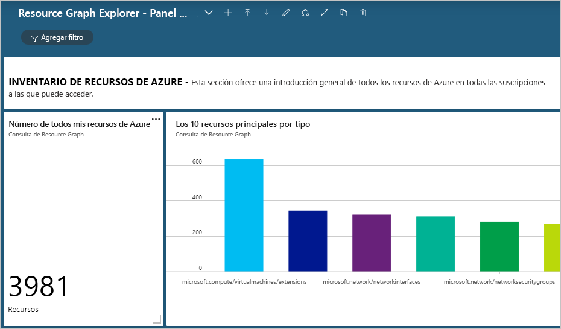
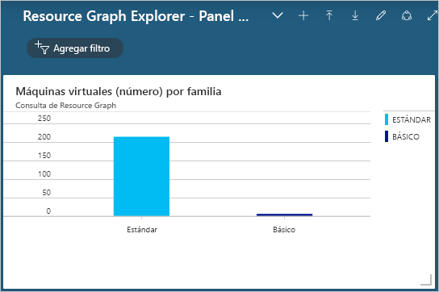

# <a name="quickstart-run-your-first-resource-graph-query-using-azure-resource-graph-explorer"></a>Inicio rápido: Ejecución de la primera consulta de Resource Graph mediante Azure Resource Graph Explorer

El poder de Azure Resource Graph está disponible directamente en Azure Portal mediante Azure Resource Graph Explorer. Resource Graph Explorer proporciona información de exploración sobre los tipos de recursos Azure Resource Manager y las propiedades que puede consultar. Resource Graph Explorer también proporciona una interfaz limpia para trabajar con varias consultas, evaluar los resultados e incluso convertir los de algunas consultas en un gráfico que se puede anclar a un panel de Azure.

Al final de este inicio rápido, habrá usado Azure Portal y Resource Graph Explorer para ejecutar la primera consulta de Resource Graph y anclar los resultados a un panel.

Si no tiene una suscripción a Azure, cree una cuenta [gratuita](https://azure.microsoft.com/free/) antes de empezar.

## <a name="run-your-first-resource-graph-query"></a>Ejecutar la primera consulta de Resource Graph

Abra [Azure Portal](https://portal.azure.com) para buscar y usar Azure Resource Graph Explorer y siga estos pasos para ejecutar la primera consulta de Resource Graph:

1. Seleccione **Todos los servicios** en el panel izquierdo. Busque y seleccione **Resource Graph Explorer**.

1. En la parte **Consulta 1** de la ventana, escriba la consulta `Resources | project name, type | limit 5` y seleccione **Ejecutar consulta**.

   > [!NOTE]
   > Como esta consulta de ejemplo no proporciona un modificador de ordenación como `order by`, es probable que al ejecutar esta consulta varias veces se produzca un conjunto diferente de recursos por solicitud.

1. Revise la respuesta de la consulta en la pestaña **Resultados**. Seleccione la pestaña **Mensajes** para ver los detalles de la consulta, incluido el número de resultados y la duración. Los errores, si los hay, se muestran en esta pestaña.

1. Actualice la consulta para que se aplique `order by` a la propiedad **Nombre**: `Resources | project name, type | limit 5 | order by name asc`. Luego, seleccione **Ejecutar consulta**.

   > [!NOTE]
   > Al igual que con la primera consulta, es probable que al ejecutar esta consulta varias veces se produzca un conjunto diferente de recursos por solicitud. El orden de los comandos de consulta es importante. En este ejemplo, el `order by` viene después del `limit`. Esto primero limitará los resultados de la consulta y después los ordenará.

1. Actualice la consulta para que primero se aplique `order by` a la propiedad **Nombre** y, después, `limit` a los cinco primeros resultados: `Resources | project name, type | order by name asc | limit 5`. Luego, seleccione **Ejecutar consulta**.

Cuando la consulta final se ejecuta varias veces, suponiendo que nada cambie en su entorno, los resultados devueltos serán coherentes y los que se esperan, ordenados por la propiedad **Nombre**, pero todavía limitados a los cinco primeros resultados.

### <a name="schema-browser"></a>Explorador de esquema

El explorador de esquema se encuentra en el panel izquierdo de Resource Graph Explorer. En esta lista de recursos se muestran todos los _tipos de recursos_ de Azure que son compatibles con Azure Resource Graph y que existen en un inquilino al que tiene acceso. Al expandir un tipo de recurso o las subpropiedades, se muestran las propiedades secundarias que se pueden usar para crear una consulta de Resource Graph. La selección del tipo de recurso coloca `where type =="<resource type>"` en el cuadro de consulta. La selección de una de las propiedades secundarias agrega `where <propertyName> == "INSERT_VALUE_HERE"` al cuadro de consulta. El explorador de esquema es una excelente manera de detectar las propiedades que se usan en las consultas. Asegúrese de reemplazar _INSERTAR\_VALOR\_AQUÍ_ por su propio valor y ajuste la consulta con condiciones, operadores y funciones para conseguir los resultados esperados.

## <a name="create-a-chart-from-the-resource-graph-query"></a>Creación de un gráfico a partir de la consulta de Resource Graph

Después de ejecutar la última consulta anterior, si selecciona la pestaña **Gráficos**, recibirá un mensaje que indica que el conjunto de resultados no es compatible con una visualización de gráfico circular. Las consultas que muestran resultados no se pueden convertir en un gráfico, pero las consultas que proporcionan recuentos de recursos sí. Mediante la consulta de ejemplo [Recuento de máquinas virtuales por tipo de sistema operativo](./samples/starter.md#count-virtual-machines-by-os-type), vamos a crear una visualización a partir de la consulta de Resource Graph.

1. En la parte **Consulta 1** de la ventana, escriba la siguiente consulta y seleccione **Ejecutar consulta**.

   ```kusto
   Resources
   | where type =~ 'Microsoft.Compute/virtualMachines'
   | summarize count() by tostring(properties.storageProfile.osDisk.osType)
   ```

1. Seleccione la pestaña **Resultados** y observe que en la respuesta de esta consulta se proporcionan recuentos.

1. Seleccione la pestaña **Gráficos**. Ahora, la consulta genera visualizaciones. En _Seleccione el tipo de gráfico..._ , cambie el tipo a _Gráfico de barras_ o _Gráfico de anillos_ para experimentar con las opciones de visualización disponibles.

## <a name="pin-the-query-visualization-to-a-dashboard"></a>Anclar la visualización de la consulta a un panel

Si tiene resultados de una consulta que se pueden visualizar, esa visualización de datos se puede anclar a uno de los paneles. Después de ejecutar la consulta anterior, siga estos pasos:

1. Seleccione **Guardar** y proporcione el nombre "Máquinas virtuales por tipo de SO". Luego, seleccione **Guardar** en la parte inferior del panel derecho.

1. Seleccione **Ejecutar consulta** para volver a ejecutar la consulta ahora que se ha guardado.

1. En la pestaña **Gráficos**, seleccione una visualización de datos. Seleccione **Anclar al panel**.

1. Seleccione la notificación del portal que aparece o seleccione **Panel** en el panel izquierdo.

La consulta ahora está disponible en el panel con el título del icono que coincide con el nombre de la consulta. Si la consulta no se guardó cuando se ancló, se denomina entonces "Consulta 1".

La consulta y la visualización de datos resultante se ejecutan y actualizan cada vez que se carga el panel, de forma que se proporcionan conclusiones dinámicas y en tiempo real al entorno de Azure directamente en el flujo de trabajo.

> [!NOTE]
> Las consultas que dan como resultado una lista también se pueden anclar al panel. La característica no está limitada a las visualizaciones de datos de las consultas.

## <a name="import-example-resource-graph-explorer-dashboards"></a>Importación de paneles de Resource Graph Explorer de ejemplo

Para proporcionar ejemplos de consultas de Resource Graph y cómo se puede usar Resource Graph Explorer para mejorar el flujo de trabajo de Azure Portal, pruebe estos paneles de ejemplo.

- [Resource Graph Explorer: panel de ejemplo 1](https://github.com/Azure-Samples/Governance/blob/master/src/resource-graph/portal-dashboards/sample-1/resourcegraphexplorer-sample-1.json)

  [](./media/arge-sample1-large.png#lightbox)

- [Resource Graph Explorer: panel de ejemplo 2](https://github.com/Azure-Samples/Governance/blob/master/src/resource-graph/portal-dashboards/sample-2/resourcegraphexplorer-sample-2.json)

  [](./media/arge-sample2-large.png#lightbox)

> [!NOTE]
> Los recuentos y gráficos de las capturas de pantallas anteriores del panel de ejemplo variarán en función del entorno de Azure.

1. Seleccione y descargue el panel de ejemplo que quiere evaluar.

1. En Azure Portal, seleccione **Panel** en el panel izquierdo.

1. Seleccione **Cargar** y, luego, busque y seleccione el archivo del panel de ejemplo descargado. A continuación, seleccione **Abrir**.

El panel importado se muestra automáticamente. Dado que ahora existe en Azure Portal, puede explorar y realizar cambios según sea necesario o crear paneles a partir del ejemplo para compartirlos con los equipos. Para más información sobre cómo trabajar con paneles, consulte [Creación y uso compartido de paneles en Azure Portal](../../azure-portal/azure-portal-dashboards.md).

## <a name="clean-up-resources"></a>Limpieza de recursos

Si quiere quitar los paneles de ejemplo de Resource Graph del entorno de Azure Portal, puede hacerlo con los pasos siguientes:

1. Seleccione **Panel** en el panel izquierdo.

1. En el menú desplegable de paneles, seleccione el panel de ejemplo de Resource Graph que quiere eliminar.

1. En el menú de la parte superior del panel, seleccione **Eliminar** y, luego, **Aceptar**.

## <a name="next-steps"></a>Pasos siguientes

- Obtener más información sobre el [lenguaje de consulta](./concepts/query-language.md)
- Obtener información sobre cómo [explorar recursos](./concepts/explore-resources.md)
- Ejecución de la primera consulta con la [CLI de Azure](first-query-azurecli.md)
- Ver ejemplos de [consultas de nivel principiante](./samples/starter.md)
- Ver ejemplos de [consultas de nivel avanzado](./samples/advanced.md)
- Comentarios sobre [UserVoice](https://feedback.azure.com/forums/915958-azure-governance)