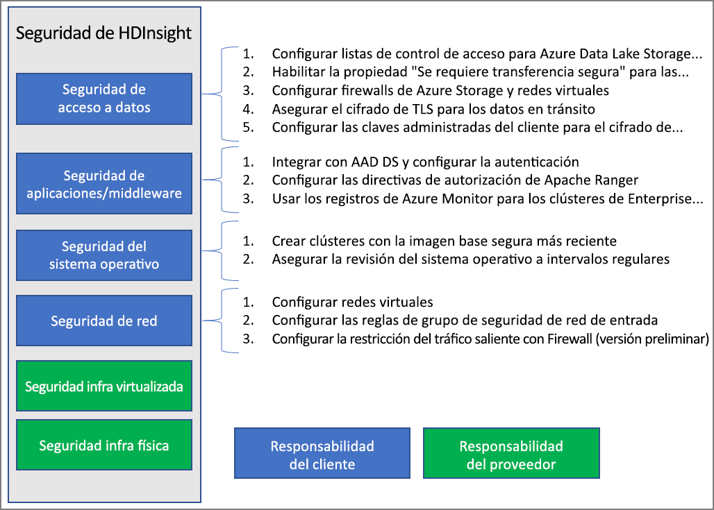

# Introducción a la seguridad de la empresa en Azure HDInsight

Azure HDInsight ofrece una serie de métodos para abordar las necesidades de seguridad de la empresa. De forma predeterminada, la mayoría de estas soluciones no están activadas. Esta flexibilidad le permite elegir las características de seguridad que considere más importantes y le ayuda a evitar pagar por características que no desea. Esto también significa que es su responsabilidad asegurarse de que las soluciones correctas estén habilitadas para su configuración y entorno.

En este artículo se analizan las soluciones de seguridad al dividir las soluciones de seguridad en los cuatro pilares de seguridad tradicionales: seguridad del perímetro, autenticación, autorización y cifrado.

En este artículo también se presenta **Enterprise Security Package (ESP) de Azure HDInsight** , que proporciona la autenticación basada en Active Directory, compatibilidad multiusuario y control de acceso basado en rol para clústeres de HDInsight.

## Pilares de seguridad de la empresa

Una forma de ver la seguridad empresarial divide las soluciones de seguridad en cuatro grupos principales basados en el tipo de control. Estos grupos también se denominan pilares de seguridad y son los siguientes: seguridad del perímetro, autenticación, autorización y cifrado.

### Seguridad del perímetro

La seguridad del perímetro en HDInsight se logra a través de [redes virtuales](../hdinsight-plan-virtual-network-deployment.md). Un administrador de empresa puede crear un clúster dentro de una red virtual y usar los grupos de seguridad de red (NSG) para restringir el acceso a la red virtual. Solo las direcciones IP permitidas en las reglas de NSG de entrada podrán comunicarse con el clúster de HDInsight. Esta configuración proporciona la seguridad del perímetro.

Todos los clústeres implementados en una red virtual también tendrán un punto de conexión privado que se resuelve a una dirección IP privada dentro de la red virtual para el acceso HTTP privado a las puertas de enlace del clúster.

### Authentication

[Enterprise Security Package](apache-domain-joined-architecture.md) de HDInsight proporciona la autenticación basada en Active Directory, la compatibilidad multiusuario y el control de acceso basado en rol. La integración con Active Directory se logra mediante el uso de [Azure Active Directory Domain Services](../../active-directory-domain-services/overview.md). Con estas funcionalidades, puede crear un clúster de HDInsight que se una a un dominio administrado de Active Directory. Luego puede configurar una lista de empleados de la empresa que pueden autenticarse e iniciar sesión en el clúster.

Con esta configuración, los empleados de la empresa pueden iniciar sesión en los nodos del clúster con sus credenciales de dominio. También pueden usar sus credenciales de dominio para autenticarse con otros puntos de conexión aprobados tales como Apache Ambari Views, ODBC, JDBC, PowerShell y las API REST para interactuar con el clúster. 

### Authorization

Un procedimiento recomendado que la mayoría de las empresas sigue es que no todos los empleados tengan acceso a todos los recursos de la empresa. Asimismo, el administrador puede definir directivas de control de acceso basado en rol para los recursos del clúster. Esto solo está disponible en los clústeres de ESP.

El administrador de Hadoop puede configurar el control de acceso basado en rol (RBAC) para proteger Apache [Hive](apache-domain-joined-run-hive.md), [HBase](apache-domain-joined-run-hbase.md) y [Kafka](apache-domain-joined-run-kafka.md) mediante los complementos de Apache Ranger. La configuración de las directivas RBAC permite asociar permisos a un rol de la organización. Esta capa de abstracción hace más fácil asegurar que los usuarios solo tengan los permisos necesarios para realizar sus responsabilidades laborales. Ranger también puede auditar el acceso a los datos de los empleados y todos los cambios que se realizan en las directivas de control de acceso.

Por ejemplo, puede configurar el administrador [Apache Ranger](https://ranger.apache.org/) para establecer las directivas de control de acceso para Hive. Esta funcionalidad garantiza el filtrado a nivel de fila y de columna (enmascaramiento de datos) y filtra los datos confidenciales de usuarios no autorizados.

### Auditoría

Auditar todos los acceso a los recursos de clúster, y los datos, es necesario para hacer seguimiento del acceso no autorizado o accidental de los recursos. Es tan importante como proteger los recursos de clúster de HDInsight contra usuarios no autorizados y proteger los datos.

El administrador puede ver y notificar todos los accesos a los recursos y los datos del clúster de HDInsight. El administrador también puede ver y notificar todos los cambios en las directivas de control de acceso creados en los puntos de conexión de Apache Ranger compatibles. 

Para acceder a los registros de auditoría de Apache Ranger y Ambari, así como a los registros de acceso ssh, [habilite Azure Monitor](../hdinsight-hadoop-oms-log-analytics-tutorial.md#cluster-auditing) y consulte las tablas que proporcionan registros de auditoría relacionados.

### Cifrado

Proteger los datos es importante para cumplir con los requisitos de cumplimiento y de seguridad de la organización. Además de restringir el acceso de empleados no autorizados a los datos, es necesario cifrarlos.

Ambos almacenes de datos para clústeres de HDInsight, Azure Blob Storage y Azure Data Lake Storage Gen1/Gen2 admiten el [cifrado de datos](../../storage/common/storage-service-encryption.md) en reposo para el servidor transparente. Los clústeres de HDInsight seguros funcionarán perfectamente con esta funcionalidad de cifrado de los datos en reposo en el lado servidor.

### Cumplimiento normativo

Las ofertas de cumplimiento de Azure se basan en varios tipos de controles, entre los que se incluyen certificaciones oficiales, atestaciones, validaciones, autorizaciones y evaluaciones generadas por empresas de auditoría de terceros independientes, así como enmiendas contractuales, autoevaluaciones y documentos de instrucciones para el cliente generados por Microsoft. Para obtener información sobre el cumplimiento de HDInsight, acceda al [Centro de confianza de Microsoft](https://www.microsoft.com/trust-center) y la [Información general sobre el cumplimiento de Microsoft Azure](https://gallery.technet.microsoft.com/Overview-of-Azure-c1be3942).

## Modelo de responsabilidad compartida

En la siguiente imagen se resumen las principales áreas de seguridad del sistema y las soluciones de seguridad que tiene disponibles en cada una de ellas. También se destacan las áreas de seguridad que son responsabilidad del cliente y qué áreas son responsabilidad de HDInsight como proveedor de servicios.

En la tabla siguiente se proporcionan vínculos a recursos para cada tipo de solución de seguridad.

| Área de seguridad | Soluciones disponibles | Parte responsable |
|---|---|---|
| Seguridad de acceso a datos | Configurar las [listas de control de acceso](../../storage/blobs/data-lake-storage-access-control.md) para Azure Data Lake Storage Gen1 y Gen2  | Customer |
|  | Habilitar la propiedad ["Se requiere transferencia segura"](../../storage/common/storage-require-secure-transfer.md) en las cuenta de almacenamiento | Customer |
|  | Configurar las redes virtuales y los [firewalls de Azure Storage](../../storage/common/storage-network-security.md) | Customer |
|  | Configurar los [puntos de conexión de servicio de red virtual de Azure](https://docs.microsoft.com/azure/virtual-network/virtual-network-service-endpoints-overview) para Cosmos DB y [Azure SQL DB](https://docs.microsoft.com/azure/sql-database/sql-database-vnet-service-endpoint-rule-overview) | Customer |
|  | Garantizar que el [cifrado TLS](../../storage/common/storage-security-tls.md) está habilitado para los datos en tránsito | Customer |
|  | Configuración de las [claves que administra el cliente](../../storage/common/storage-encryption-keys-portal.md) para el cifrado de Azure Storage | Customer |
| Seguridad de aplicaciones y middleware | Integración con AAD-DS y [configuración de la autenticación](apache-domain-joined-configure-using-azure-adds.md) | Customer |
|  | Configurar las directivas de [autorización de Apache Ranger](apache-domain-joined-run-hive.md) | Customer |
|  | Usar [registros de Azure Monitor](../hdinsight-hadoop-oms-log-analytics-tutorial.md) | Customer |
| Seguridad del sistema operativo | Crear clústeres con la imagen base segura más reciente | Customer |
|  | Garantizar la [revisión del sistema operativo](../hdinsight-os-patching.md) en intervalos regulares | Customer |
| Seguridad de las redes | Configurar una [red virtual](../hdinsight-plan-virtual-network-deployment.md) |
|  | Configurar las [reglas del grupo de seguridad de red (NSG) de entrada](../hdinsight-plan-virtual-network-deployment.md#networktraffic) | Customer |
|  | Configurar la [restricción del tráfico de salida](../hdinsight-restrict-outbound-traffic.md) con el firewall | Customer |
| Infraestructura virtualizada | N/D | HDInsight (proveedor de servicios en la nube) |
| Seguridad de la infraestructura física | N/D | HDInsight (proveedor de servicios en la nube) |

## Pasos siguientes

* [Planeamiento de clústeres de HDInsight con Enterprise Security Package](apache-domain-joined-architecture.md)
* [Configuración de clústeres de HDInsight con Enterprise Security Package](apache-domain-joined-configure.md)
* [Administración de clústeres de HDInsight con Enterprise Security Package](apache-domain-joined-manage.md)
