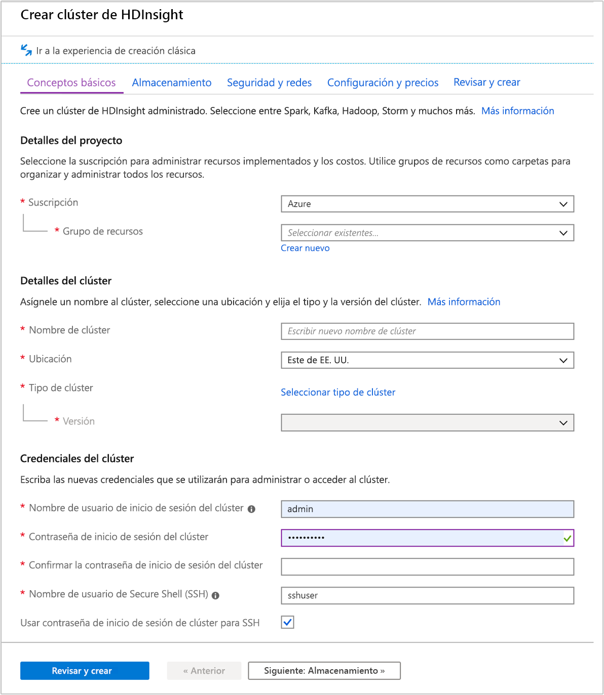
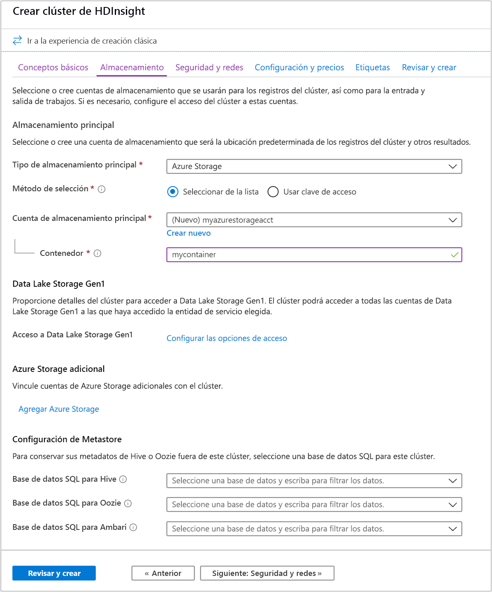
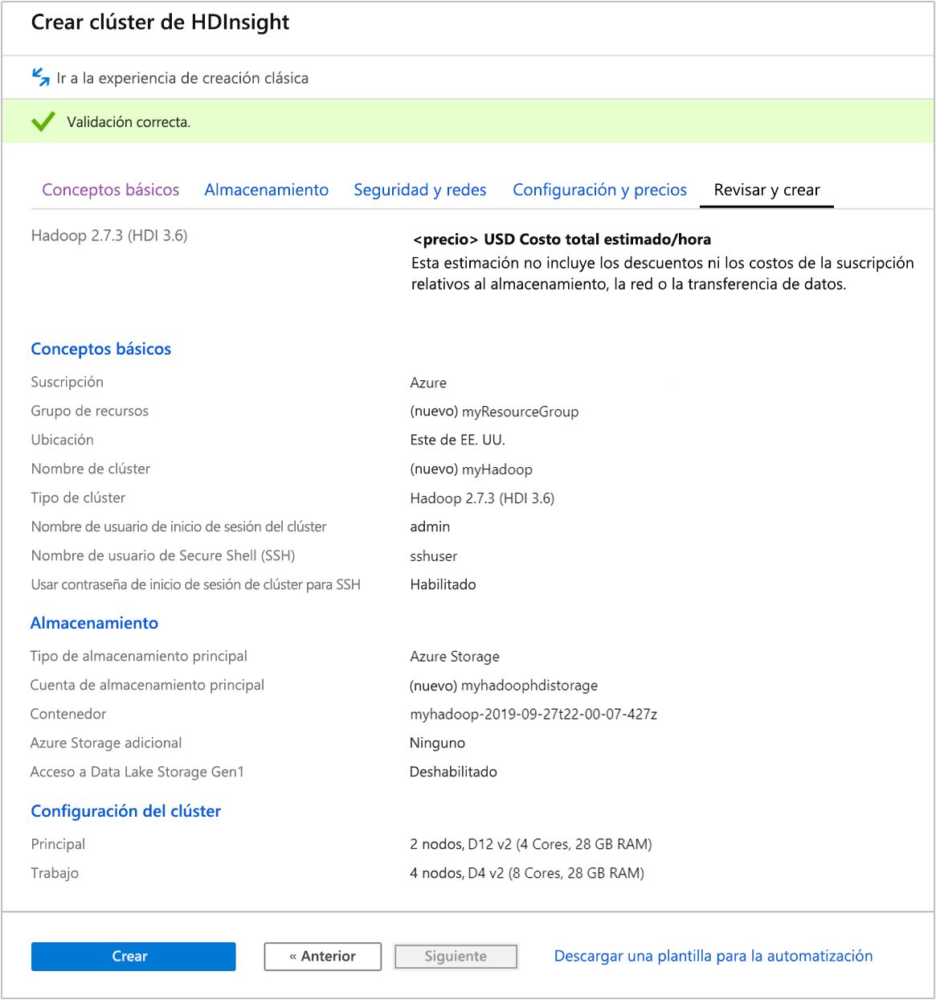
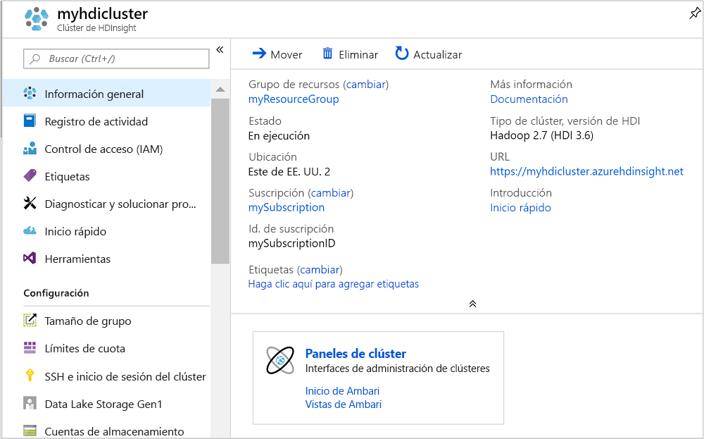
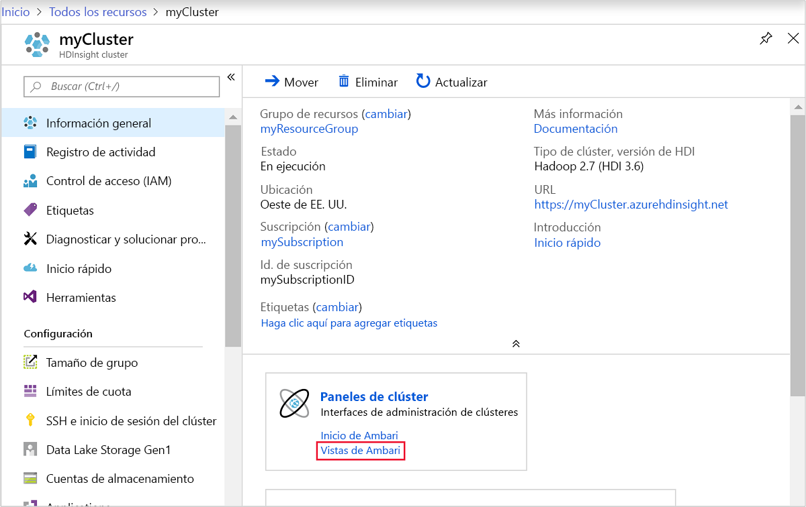
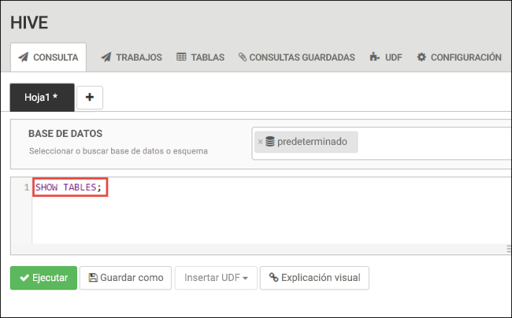
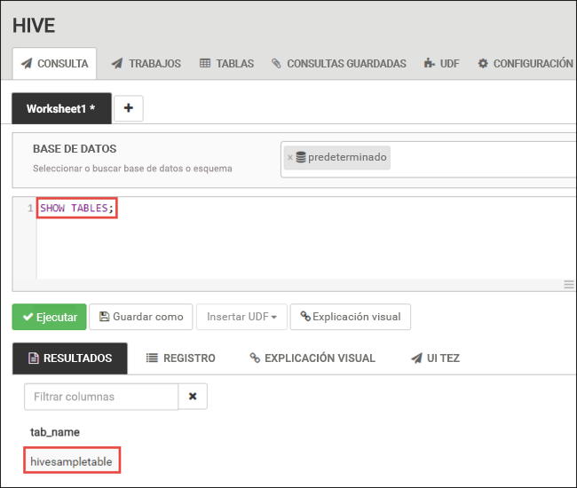
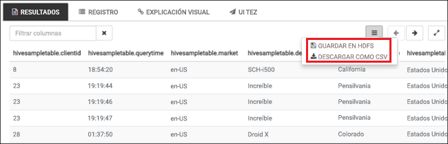
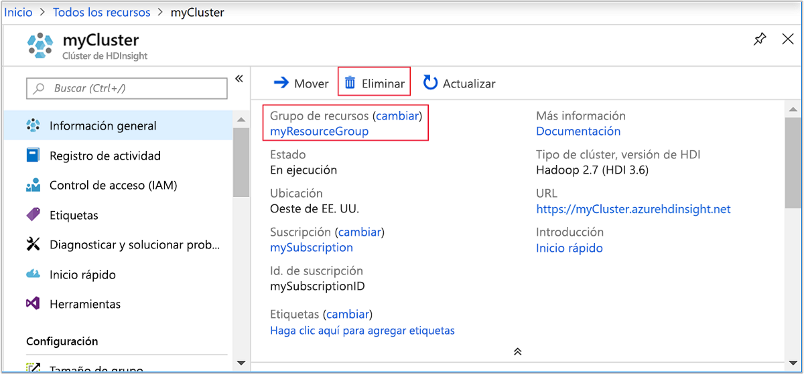

# <a name="quickstart-create-apache-hadoop-cluster-in-azure-hdinsight-using-azure-portal"></a>Inicio rápido: Creación de un clúster de Apache Hadoop en Azure HDInsight mediante Azure Portal

En este artículo, aprenderá a crear clústeres de Apache Hadoop en HDInsight con Azure Portal y a ejecutar trabajos de Apache Hive en HDInsight. La mayoría de los trabajos de Hadoop son por lotes. Se crea un clúster, se ejecutan algunos trabajos y luego se elimina el clúster. En este artículo, realizará las tres tareas. Para una explicación detallada de las configuraciones disponibles, consulte el artículo sobre la [configuración de clústeres en HDInsight](../hdinsight-hadoop-provision-linux-clusters.md). Para más información sobre el uso del portal para crear clústeres, consulte el artículo sobre la [creación de clústeres en el portal](../hdinsight-hadoop-create-linux-clusters-portal.md).

En este inicio rápido, usará Azure Portal para crear un clúster de Hadoop de HDInsight. También puede crear un clúster con la [plantilla de Azure Resource Manager](apache-hadoop-linux-tutorial-get-started.md).

Actualmente, HDInsight ofrece [siete tipos diferentes de clúster](../hdinsight-overview.md#cluster-types-in-hdinsight). Cada uno de estos tipos de clúster es compatible con un conjunto de componentes diferente. Todos los tipos de clúster son compatibles con Hive. Para ver una lista de los componentes compatibles con HDInsight, consulte [Novedades en las versiones de clústeres de Apache Hadoop proporcionadas por HDInsight](../hdinsight-component-versioning.md).  

Si no tiene una suscripción a Azure, cree una [cuenta gratuita](https://azure.microsoft.com/free/) antes de empezar.

## <a name="create-an-apache-hadoop-cluster"></a>Creación de un clúster de Apache Hadoop

En esta sección, crea un clúster de Hadoop en HDInsight con Azure Portal.

1. Inicie sesión en [Azure Portal](https://portal.azure.com).

1. En el menú superior, seleccione **+ Crear un recurso**.

    

1. Seleccione **Analytics** > **Azure HDInsight** para ir a la página **Crear clúster de HDInsight**.

1. En la pestaña **Básico**, especifique la siguiente información:

    |Propiedad  |Descripción  |
    |---------|---------|
    |Subscription    |  En la lista desplegable, seleccione la suscripción de Azure que se usa para el clúster. |
    |Resource group     | En la lista desplegable, seleccione el grupo de recursos existente o **Crear**.|
    |Nombre del clúster   | Escriba un nombre único global. El nombre puede tener un máximo de 59 caracteres, letras, números y guiones incluidos. Los caracteres primero y último del nombre no pueden ser guiones. |
    |Region    | En la lista desplegable, seleccione una región donde crear el clúster.  Elija una ubicación más cercana a usted para mejorar el rendimiento. |
    |Tipo de clúster| Seleccione **Seleccionar tipo de clúster**. A continuación, seleccione **Hadoop** como tipo de clúster.|
    |Versión|En la lista desplegable, seleccione una **versión**. Use la versión predeterminada si no sabe qué opción elegir.|
    |Nombre de usuario y contraseña de inicio de sesión del clúster    | El nombre de inicio de sesión predeterminado es **admin**. La contraseña debe tener un mínimo de 10 caracteres y contener al menos un dígito, una letra mayúscula y una letra minúscula, y un carácter no alfanumérico (excepto los caracteres ' " y `\). Asegúrese de **no proporcionar** contraseñas comunes, como "Pass@word1".|
    |Nombre de usuario de Secure Shell (SSH) | El nombre de usuario predeterminado es **sshuser**.  Puede proporcionar otro nombre para el nombre de usuario de SSH. |
    |Uso de la contraseña de inicio de sesión del clúster para SSH| Seleccione esta casilla para que el usuario de SSH tenga la misma contraseña que la proporcionada para el usuario de inicio de sesión del clúster.|

    

    Seleccione el botón **Siguiente: Almacenamiento >>**  para avanzar a la configuración de almacenamiento.

1. En la pestaña **Almacenamiento**, proporcione los valores siguientes:

    |Propiedad  |Descripción  |
    |---------|---------|
    |Tipo de almacenamiento principal|Use el valor predeterminado **Azure Storage**.|
    |Método de selección|Use el valor predeterminado **Seleccionar de la lista**.|
    |Cuenta de almacenamiento principal|Utilice la lista desplegable para seleccionar una cuenta de almacenamiento existente o bien elija **Crear nuevo**. Si crea una cuenta nueva, el nombre debe tener una longitud de entre 3 y 24 caracteres y solo puede contener números y letras minúsculas.|
    |Contenedor|Use el valor que se rellena automáticamente.|

    

    Cada clúster depende de una [cuenta de Azure Storage](../hdinsight-hadoop-use-blob-storage.md) o de una [cuenta de Azure Data Lake](../hdinsight-hadoop-use-data-lake-store.md). Se conoce como cuenta de almacenamiento predeterminada. El clúster de HDInsight y su cuenta de almacenamiento predeterminada deben estar en la misma región de Azure. Al eliminar los clústeres no se elimina la cuenta de almacenamiento.

    Seleccione la pestaña **Revisar y crear**.

1. En la pestaña **Revisar y crear**, compruebe los valores seleccionados en los pasos anteriores.

    

1. Seleccione **Crear**. Se tarda aproximadamente 20 minutos en crear un clúster.

    Una vez creado el clúster, verá la página de información general del clúster en Azure Portal.

    

## <a name="run-apache-hive-queries"></a>Ejecución de consultas de Apache Hive

[Apache Hive](hdinsight-use-hive.md) es el componente más popular de los que se usan en HDInsight. Hay muchas maneras de ejecutar trabajos de Hive en HDInsight. En este inicio rápido se usa la vista de Hive de Ambari desde el portal. Para conocer otros métodos para enviar trabajos de Hive, consulte [Uso de Hive en HDInsight](hdinsight-use-hive.md).

> [!NOTE]
> La vista de Apache Hive ya no está disponible en HDInsight 4.0.

1. Para abrir Ambari, desde la captura de pantalla anterior, seleccione **Panel de clúster**.  También puede ir a `https://ClusterName.azurehdinsight.net`, donde `ClusterName` es el clúster que creó en la sección anterior.

    

2. Escriba el nombre de usuario de Hadoop y la contraseña que especificó al crear el clúster. El nombre de usuario predeterminado es **admin**.

3. Abra la **vista de Hive** como se muestra en la siguiente captura de pantalla:

    

4. En la pestaña **CONSULTA**, pegue las instrucciones HiveQL siguientes en la hoja de cálculo:

    ```sql
    SHOW TABLES;
    ```

    

5. Seleccione **Execute**(Ejecutar). Aparecerá una pestaña **RESULTADOS** en la pestaña **CONSULTA** que mostrará información sobre el trabajo. 

    Cuando haya finalizado la consulta, la pestaña **CONSULTA** muestra los resultados de la operación. Verá una tabla denominada **hivesampletable**. Esta es una tabla de Hive de ejemplo que viene integrada en todos los clústeres de HDInsight.

    

6. Repita los pasos 4 y 5 para ejecutar la consulta siguiente:

    ```sql
    SELECT * FROM hivesampletable;
    ```

7. También puede guardar los resultados de la consulta. Seleccione el botón de menú de la derecha y especifique si quiere descargar los resultados como archivo CSV o almacenarlos en la cuenta de almacenamiento asociada al clúster.

    

Después de completar un trabajo de Hive, puede [exportar los resultados a una base de datos de Azure SQL o SQL Server](apache-hadoop-use-sqoop-mac-linux.md) y [visualizar los resultados con Excel](apache-hadoop-connect-excel-power-query.md). Para más información sobre el uso de Hive en HDInsight, consulte [Uso de Apache Hive y HiveQL con Apache Hadoop en HDInsight para analizar un archivo log4j de Apache de muestra](hdinsight-use-hive.md).

## <a name="clean-up-resources"></a>Limpieza de recursos

Después de completar el inicio rápido, puede ser conveniente eliminar el clúster. Con HDInsight, los datos se almacenan en Azure Storage, por lo que puede eliminar un clúster de forma segura cuando no se esté usando. Los clústeres de HDInsight se cobran aunque no se estén usando. Como en muchas ocasiones los cargos por el clúster son mucho más elevados que los cargos por el almacenamiento, desde el punto de vista económico tiene sentido eliminar clústeres cuando no se usen.

> [!NOTE]  
> Si avanza de *inmediato* al siguiente artículo para aprender a ejecutar operaciones de ETL con Hadoop en HDInsight, es posible que quiera mantener el clúster en ejecución. Esto es porque en el tutorial tendrá que crear un clúster de Hadoop de nuevo. Sin embargo, si no va a continuar con el próximo artículo de inmediato, debe eliminar el clúster ahora.

### <a name="to-delete-the-cluster-andor-the-default-storage-account"></a>Para eliminar el clúster o la cuenta de almacenamiento predeterminada

1. Vuelva a la pestaña de explorador en la que tenga Azure Portal. Estará en la página de información general del clúster. Si solo quiere eliminar el clúster, pero desea seguir conservando la cuenta de almacenamiento predeterminada, seleccione **Eliminar**.

    

2. Si quiere eliminar el clúster y la cuenta de almacenamiento predeterminada, seleccione el nombre del grupo de recursos (resaltado en la captura de pantalla anterior) para abrir la página del grupo de recursos.

3. Seleccione **Eliminar grupo de recursos** para eliminar el grupo de recursos, que contiene el clúster y la cuenta de almacenamiento predeterminada. Tenga en cuenta que, al eliminar el grupo de recursos, se elimina también la cuenta de almacenamiento. Si desea mantener la cuenta de almacenamiento, elija eliminar solo el clúster.

## <a name="next-steps"></a>Pasos siguientes

En este inicio rápido, ha aprendido a crear un clúster de HDInsight basado en Linux mediante una plantilla de Resource Manager y a realizar consultas básicas de Hive. En el siguiente artículo, aprenderá a realizar una operación ETL (extraer, transformar y cargar) con Hadoop en HDInsight.

> [!div class="nextstepaction"]
> [Extracción, transformación y carga de datos mediante Interactive Query en HDInsight](../interactive-query/interactive-query-tutorial-analyze-flight-data.md)
