# <a name="quickstart-get-started-with-apache-hadoop-and-apache-hive-in-azure-hdinsight-using-resource-manager-template"></a>Inicio rápido: Introducción a Apache Hadoop y Apache Hive en Azure HDInsight con la plantilla de Resource Manager

En este artículo, aprenderá a crear clústeres de [Apache Hadoop](https://hadoop.apache.org/) en HDInsight con una plantilla de Resource Manager y, a continuación, a ejecutar trabajos de Hive en HDInsight. La mayoría de los trabajos de Hadoop son por lotes. Se crea un clúster, se ejecutan algunos trabajos y luego se elimina el clúster. En este artículo, realizará las tres tareas.

En esta guía de inicio rápido, usará una plantilla de Resource Manager para crear un clúster de HDInsight Hadoop. También puede crear un clúster mediante [Azure Portal](apache-hadoop-linux-create-cluster-get-started-portal.md).  Puede ver plantillas similares en [Plantillas de inicio rápido de Azure](https://azure.microsoft.com/resources/templates/?term=hdinsight).

Actualmente HDInsight tiene [siete tipos diferentes de clúster](./apache-hadoop-introduction.md#cluster-types-in-hdinsight). Cada uno de estos tipos de clúster es compatible con un conjunto de componentes diferente. Todos los tipos de clúster son compatibles con Hive. Para ver una lista de los componentes compatibles con HDInsight, consulte [Novedades en las versiones de clústeres de Hadoop proporcionadas por HDInsight](../hdinsight-component-versioning.md)  

Si no tiene una suscripción a Azure, cree una [cuenta gratuita](https://azure.microsoft.com/free/) antes de empezar.

<a name="create-cluster"></a>
## <a name="create-a-hadoop-cluster"></a>Creación de un clúster de Hadoop

En esta sección, se crea un clúster de Hadoop en HDInsight mediante una plantilla de Azure Resource Manager. No es necesario tener experiencia en el uso de la plantilla de Resource Manager para seguir este artículo. 

1. Haga clic en el botón **Deploy to Azure** (Implementar en Azure) siguiente para iniciar sesión en Azure y abrir la plantilla de Resource Manager en Azure Portal. 
   
    <a href="https://portal.azure.com/#create/Microsoft.Template/uri/https%3A%2F%2Fraw.githubusercontent.com%2FAzure%2Fazure-quickstart-templates%2Fmaster%2F101-hdinsight-linux-ssh-password%2Fazuredeploy.json" target="_blank"></a>

2. Escriba o seleccione los valores como se sugiere en la siguiente captura de pantalla:

    > [!NOTE]  
    > Los valores que proporcione deben ser exclusivos y deben seguir las directrices de nomenclatura. La plantilla no realiza comprobaciones de validación. Si los valores proporcionados ya están en uso o no sigue las directrices, obtendrá un error después de haber enviado la plantilla.    
    
    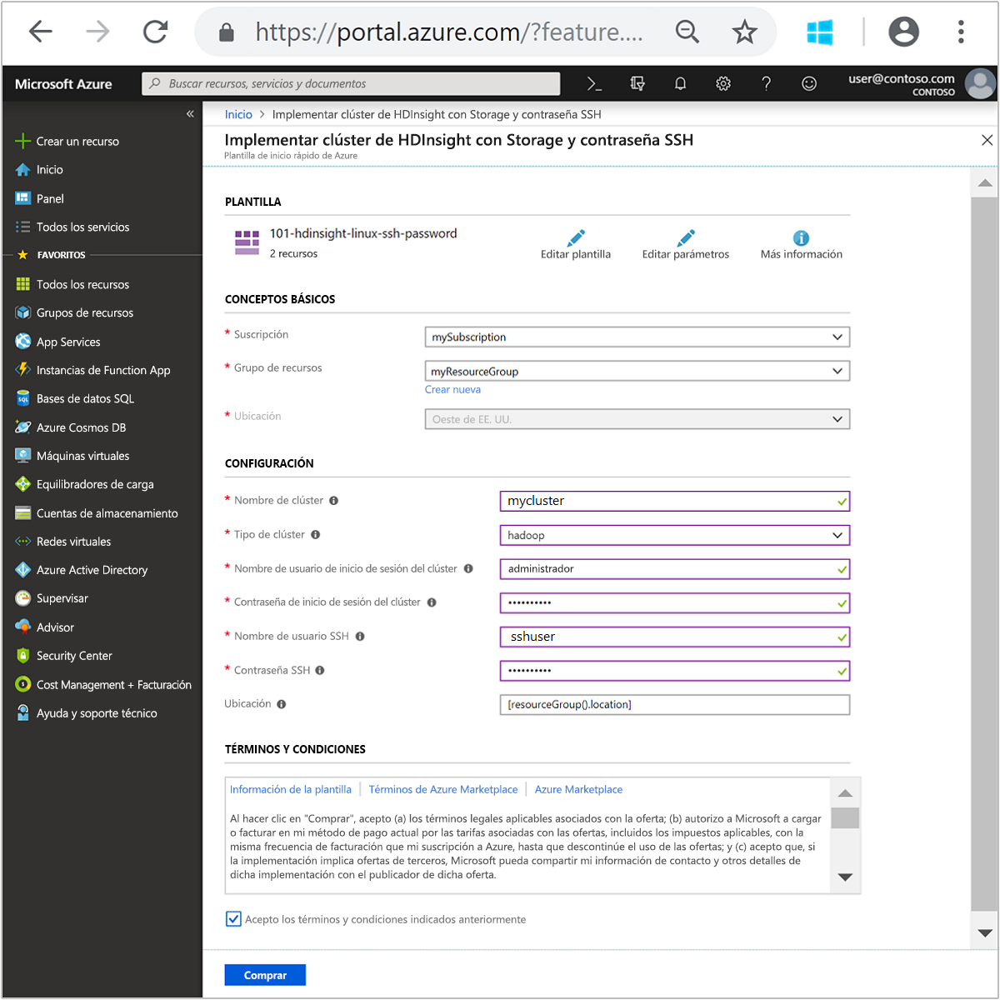

    Escriba o seleccione los siguientes valores:
    
    |Propiedad  |Descripción  |
    |---------|---------|
    |**Suscripción**     |  Seleccione su suscripción a Azure. |
    |**Grupos de recursos**     | Cree un grupo de recursos o seleccione uno existente.  Un grupo de recursos es un contenedor de componentes de Azure.  En este caso, el grupo de recursos contiene el clúster de HDInsight y la cuenta de Azure Storage dependiente. |
    |**Ubicación**     | Seleccione una ubicación de Azure en la que quiera crear el clúster.  Elija una ubicación más cercana a usted para mejorar el rendimiento. |
    |**Nombre del clúster**     | Escriba el nombre del clúster de Hadoop. Dado que todos los clústeres de HDInsight comparten el mismo espacio de nombres de DNS, este nombre debe ser único. El nombre solo puede incluir letras minúsculas, números, guiones y debe empezar por una letra.  Antes y después de cada guion debe ir un carácter que no sea otro guión.  El nombre debe tener entre 3 y 59 caracteres. |
    |**Tipo de clúster**     | Seleccione **hadoop**. |
    |**Nombre de inicio de sesión y contraseña del clúster**     | El nombre de inicio de sesión predeterminado es **admin**. La contraseña debe tener un mínimo de 10 caracteres y contener al menos un dígito, una letra mayúscula y una letra minúscula, y un carácter no alfanumérico (excepto los caracteres ' " y `\). Asegúrese de **no proporcionar** contraseñas comunes, como "Pass@word1".|
    |**Nombre de usuario y contraseña de SSH**     | El nombre de usuario predeterminado es **sshuser**.  El nombre de usuario de SSH se puede cambiar.  La contraseña de usuario de SSH tiene los mismos requisitos que la contraseña de inicio de sesión del clúster.|
       
    Algunas propiedades se han codificado de forma rígida en la plantilla.  Puede configurar estos valores desde la plantilla. Para más información acerca de estas propiedades, consulte este artículo sobre la [creación de clústeres de Apache Hadoop en HDInsight](../hdinsight-hadoop-provision-linux-clusters.md).

3. Seleccione **Acepto los términos y condiciones indicadas anteriormente** y, después, seleccione **Comprar**. Recibirá una notificación de que la implementación está en curso.  Se tarda aproximadamente 20 minutos en crear un clúster.

4. Una vez que se cree el clúster, recibirá una notificación de **Implementación correcta** con un vínculo **Ir al grupo de recursos**.  La página **Grupo de recursos** mostrará el nuevo clúster de HDInsight y el almacenamiento predeterminado asociado con el clúster. Cada clúster depende de una [cuenta de Azure Storage](../hdinsight-hadoop-use-blob-storage.md) o de una [cuenta de Azure Data Lake Storage](../hdinsight-hadoop-use-data-lake-store.md). Se conoce como cuenta de almacenamiento predeterminada. El clúster de HDInsight y su cuenta de almacenamiento predeterminada deben estar en la misma región de Azure. Al eliminar los clústeres no se elimina la cuenta de almacenamiento.

> [!NOTE]  
> Para conocer otros métodos de creación de clústeres y las propiedades que se usan en este tutorial, consulte [Creación de clústeres de Hadoop basados en Linux en HDInsight](../hdinsight-hadoop-provision-linux-clusters.md).       


## <a name="use-vscode-to-run-hive-queries"></a>Uso de VSCode para ejecutar consultas de Hive

Para averiguar cómo obtener las herramientas de HDInsight en VSCode, consulte [Uso de las herramientas de Azure HDInsight para Visual Studio Code](../hdinsight-for-vscode.md).

### <a name="submit-interactive-hive-queries"></a>Envío de consultas de Hive interactivas

Herramientas de HDInsight para VSCode permite enviar consultas de Hive interactivas a clústeres de consultas interactivas de HDInsight.

1. Si no tiene una carpeta de trabajo y un archivo de script Hive, créelos.

2. Conéctese a su cuenta de Azure y configure el clúster predeterminado, en caso de que todavía no lo haya hecho.

3. Copie y pegue el código siguiente en el archivo de Hive y guárdelo.

    ```hiveql
    SELECT * FROM hivesampletable;
    ```
4. Haga clic con el botón derecho en el editor de scripts y, después, seleccione **HDInsight: Hive Interactive** para enviar la consulta. Las herramientas también permiten enviar un bloque de código, en lugar del archivo de script completo mediante el menú contextual. Poco después, los resultados de la consulta aparecen en una pestaña nueva.

   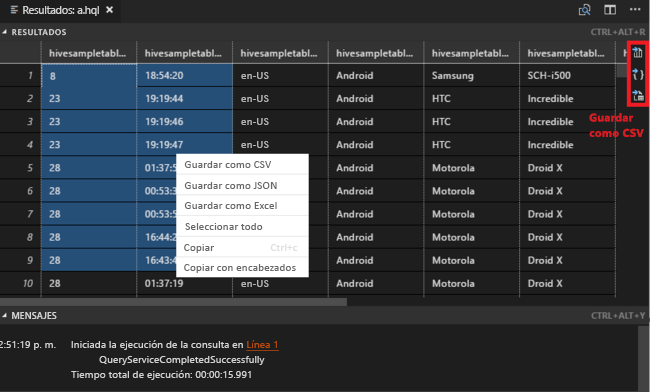

    - Panel **RESULTADOS**: puede guardar todo el resultado en forma de archivo CSV, JSON o de Excel en una ruta de acceso local, o bien seleccionar únicamente varias líneas.

    - Panel **MENSAJES**: al seleccionar el número de **Línea**, salta la primera línea del script en ejecución.

Una consulta interactiva tarda mucho menos en ejecutarse que un [trabajo por lotes de Apache Hive](#submit-hive-batch-scripts).

### <a name="submit-hive-batch-scripts"></a>Envío de scripts por lotes de Hive

1. Si no tiene una carpeta de trabajo y un archivo de script Hive, créelos.

2. Conéctese a su cuenta de Azure y configure el clúster predeterminado, en caso de que todavía no lo haya hecho.

3. Copie y pegue el código siguiente en el archivo de Hive y guárdelo.

    ```hiveql
    SELECT * FROM hivesampletable;
    ```
4. Haga clic con el botón derecho en el editor de scripts y, después, seleccione **HDInsight: Hive Batch** para enviar un trabajo de Hive. 

5. Seleccione el clúster al que desea realizar el envío.  

    Después de enviar un trabajo de Hive, la información de envío correcto y el identificador del trabajo aparecen en el panel **SALIDA**. El trabajo de Hive también abre el **EXPLORADOR WEB**, que muestra el estado y los registros del trabajo en tiempo real.

   

El [envío de consultas Apache Hive interactivas](#submit-interactive-hive-queries) tarda mucho menos tiempo que el envío de un trabajo por lotes.

## <a name="use-visualstudio-to-run-hive-queries"></a>Uso de VisualStudio para ejecutar consultas de Hive

Para averiguar cómo obtener las herramientas de HDInsight en Visual Studio, consulte [Uso de Data Lake Tools for Visual Studio](./apache-hadoop-visual-studio-tools-get-started.md).

### <a name="run-hive-queries"></a>Ejecución de consultas de Hive

Para crear y ejecutar consultas de Hive, tiene dos opciones:

* Crear consultas ad hoc
* Crear una aplicación de Hive

Para crear y ejecutar consultas ad hoc:

1. En el **Explorador de servidores**, seleccione **Azure** > **Clústeres de HDInsight**.

2. Haga clic con el botón derecho en el clúster en que desee ejecutar la consulta y, después, seleccione **Escribir una consulta de Hive**.  

3. Escriba las consultas de Hive. 

    El editor de Hive es compatible con IntelliSense. Data Lake Tools para Visual Studio es compatible con la carga de metadatos remotos cuando se edita un script de Hive. Por ejemplo, si escribe **SELECT * FROM**, IntelliSense enumera todos los nombres de tabla sugeridos. Cuando se especifica un nombre de tabla, IntelliSense enumera los nombres de columna. Las herramientas admiten casi todas las instrucciones DML de Hive, subconsultas y UDF integradas.
   
    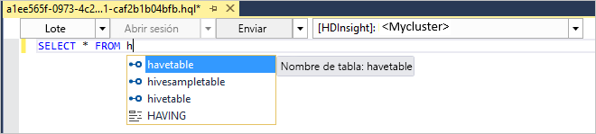
   
    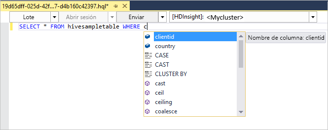
   
   > [!NOTE]  
   > IntelliSense solo sugiere los metadatos del clúster que se seleccionan en la barra de herramientas de HDInsight.
   > 
   
4. Seleccione **Enviar** o **Enviar (avanzado)**. 
   
    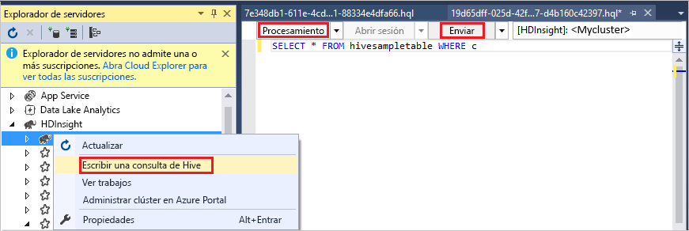

   Si selecciona la opción de envío avanzado, configure las opciones **Nombre del trabajo**, **Argumentos**, **Configuraciones adicionales** y **Estado de directorio** del script:

    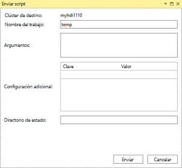

   Ejecución de consultas de Hive interactivas

   * Haga clic en la flecha abajo para elegir **interactivo**. 
   
   * Haga clic en **Ejecutar**.

   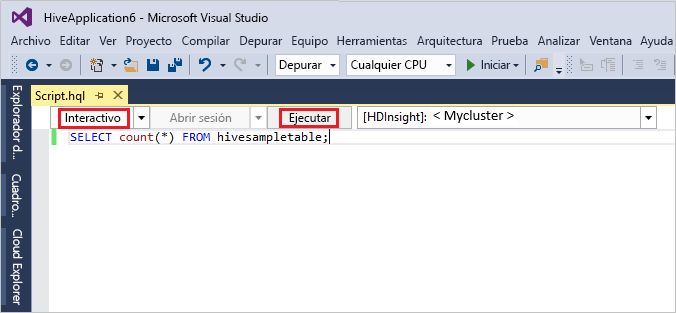

Para crear y ejecutar una solución de Hive:

1. En el menú **Archivo**, seleccione **Nuevo** y, a continuación, seleccione **Proyecto**.
2. En el panel izquierdo, seleccione **HDInsight**. En el panel del medio, seleccione **Aplicación Hive**. Escriba las propiedades y seleccione **Aceptar**.
   
    
3. En el **Explorador de soluciones**, haga doble clic en **Script.hql** para abrir el script.
4. Escriba las consultas de Hive y envíelas. (Consulte los pasos 3 y 4 más arriba)  


## <a name="run-hive-queries"></a>Ejecución de consultas de Hive

[Apache Hive](hdinsight-use-hive.md) es el componente más popular de los que se usan en HDInsight. Hay muchas maneras de ejecutar trabajos de Hive en HDInsight. En este tutorial se usa la vista de Hive de Ambari desde el portal. Para conocer otros métodos para enviar trabajos de Hive, consulte [Uso de Apache Hive en HDInsight](hdinsight-use-hive.md).

1. Para abrir Ambari, desde el icono **Paneles de clúster**, seleccione **Vistas de Ambari**.  También puede ir a **https://&lt;NombreDeClúster&gt;.azurehdinsight.net**, donde &lt;NombreDeClúster&gt; es el clúster que creó en la sección anterior.

    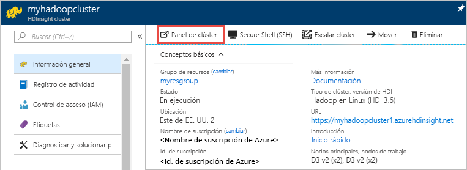

2. Escriba el nombre de usuario de Hadoop y la contraseña que especificó al crear el clúster. El nombre de usuario predeterminado es **admin**.

3. Seleccione **Vista de Hive 2.0** como se muestra en la captura de pantalla siguiente:
   
    

4. En la pestaña **CONSULTA**, pegue las instrucciones HiveQL siguientes en la hoja de cálculo:
   
        SHOW TABLES;

    
   
   > [!NOTE]  
   > Hive requiere un punto y coma.       


5. Seleccione **Execute**(Ejecutar). Aparecerá una pestaña **RESULTADOS** en la pestaña **CONSULTA** que mostrará información sobre el trabajo. 
   
    Cuando haya finalizado la consulta, la pestaña **CONSULTA** muestra los resultados de la operación. Verá una tabla denominada **hivesampletable**. Esta es una tabla de Hive de ejemplo que viene integrada en todos los clústeres de HDInsight.
   
    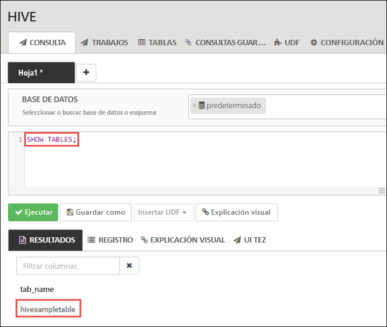

6. Repita los pasos 4 y 5 para ejecutar la consulta siguiente:
   
        SELECT * FROM hivesampletable;
   
7. También puede guardar los resultados de la consulta. Seleccione el botón de menú de la derecha y especifique si quiere descargar los resultados como archivo CSV o almacenarlos en la cuenta de almacenamiento asociada al clúster.

    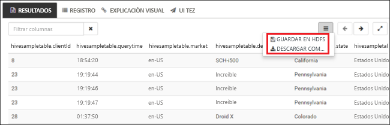

Después de completar un trabajo de Hive, puede [exportar los resultados a Azure SQL Database o Base de datos SQL Server](apache-hadoop-use-sqoop-mac-linux.md), y también puede [visualizar los resultados con Excel](apache-hadoop-connect-excel-power-query.md). Para más información sobre el uso de Hive en HDInsight, consulte [Uso de Apache Hive y HiveQL con Apache Hadoop en HDInsight para analizar un archivo log4j de Apache de muestra](hdinsight-use-hive.md).

## <a name="troubleshoot"></a>Solución de problemas

Si experimenta problemas con la creación de clústeres de HDInsight, consulte los [requisitos de control de acceso](../hdinsight-hadoop-create-linux-clusters-portal.md).

## <a name="clean-up-resources"></a>Limpieza de recursos
Después de completar el artículo, puede eliminar el clúster. Con HDInsight, los datos se almacenan en Azure Storage, por lo que puede eliminar un clúster de forma segura cuando no se esté usando. También se le cobrará por un clúster de HDInsight aunque no se esté usando. Como en muchas ocasiones los cargos por el clúster son mucho más elevados que los cargos por el almacenamiento, desde el punto de vista económico tiene sentido eliminar clústeres cuando no se estén usando. 

> [!NOTE]  
> Si avanza de *inmediato* al siguiente tutorial para aprender a ejecutar operaciones de ETL con Hadoop en HDInsight, es posible que quiera mantener el clúster en ejecución. Esto es porque en el tutorial tendrá que crear un clúster de Hadoop de nuevo. Sin embargo, si no va a continuar con el próximo tutorial de inmediato, debe eliminar el clúster ahora.

**Para eliminar el clúster o la cuenta de almacenamiento predeterminada**

1. Vuelva a la pestaña de explorador en la que tenga Azure Portal. Estará en la página de información general del clúster. Si solo quiere eliminar el clúster, pero desea seguir conservando la cuenta de almacenamiento predeterminada, seleccione **Eliminar**.

    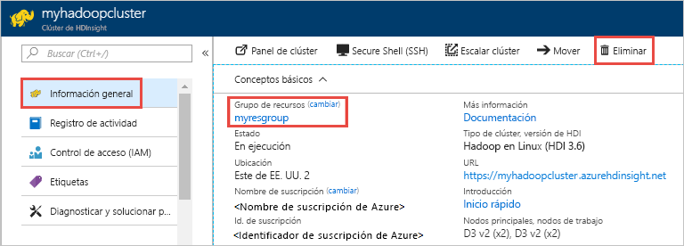

2. Si quiere eliminar el clúster y la cuenta de almacenamiento predeterminada, seleccione el nombre del grupo de recursos (resaltado en la captura de pantalla anterior) para abrir la página del grupo de recursos.

3. Seleccione **Eliminar grupo de recursos** para eliminar el grupo de recursos, que contiene el clúster y la cuenta de almacenamiento predeterminada. Tenga en cuenta que, al eliminar el grupo de recursos, se elimina también la cuenta de almacenamiento. Si desea mantener la cuenta de almacenamiento, elija eliminar solo el clúster.

## <a name="next-steps"></a>Pasos siguientes
En este artículo, ha aprendido cómo crear un clúster de HDInsight basado en Linux mediante una plantilla de Resource Manager y cómo realizar consultas básicas de Hive. En el siguiente artículo, aprenderá a realizar una operación ETL (extraer, transformar y cargar) con Hadoop en HDInsight.

> [!div class="nextstepaction"]
>[Extracción, transformación y carga de datos mediante Apache Hive en HDInsight ](../hdinsight-analyze-flight-delay-data-linux.md)

Si está preparado para empezar a trabajar con sus propios datos y necesita más información acerca de la forma en que HDInsight almacena los datos o de cómo obtener datos en HDInsight, consulte los siguientes artículos:

* Para más información sobre cómo HDInsight usa Azure Storage, consulte [Uso de Azure Storage con HDInsight](../hdinsight-hadoop-use-blob-storage.md).
* Para obtener información sobre cómo crear un clúster de HDInsight con Data Lake Storage, consulte [Quickstart: Set up clusters in HDInsight](../../storage/data-lake-storage/quickstart-create-connect-hdi-cluster.md) (Inicio rápido: Configuración de clústeres en HDInsight).
* Para más información sobre cómo cargar datos en HDInsight, consulte [Carga de datos en HDInsight](../hdinsight-upload-data.md).

Para más información sobre el análisis de datos con HDInsight, consulte los siguientes artículos:

* Para más información sobre el uso de Hive con HDInsight, como la ejecución de consultas de Hive desde Visual Studio, consulte este artículo sobre el [uso de Apache Hive con HDInsight](hdinsight-use-hive.md).
* Para más información sobre Pig, un lenguaje que se utiliza para transformar datos, consulte este artículo sobre el [uso de Apache Pig con HDInsight](hdinsight-use-pig.md).
* Para más información sobre MapReduce, una manera de escribir programas que procesan datos en Hadoop, consulte [Uso de MapReduce con HDInsight](hdinsight-use-mapreduce.md).
* Para más información sobre el uso de las herramientas de HDInsight para Visual Studio para analizar datos en HDInsight, consulte [Introducción al uso de herramientas de Hadoop en Visual Studio para HDInsight para ejecutar una consulta de Hive](apache-hadoop-visual-studio-tools-get-started.md).
* Para más información sobre el uso de las herramientas de HDInsight para VSCode para analizar datos en HDInsight, consulte [Uso de las herramientas de Azure HDInsight para Visual Studio Code](../hdinsight-for-vscode.md).


Si desea más información acerca de cómo crear o administrar un clúster de HDInsight, consulte los siguientes artículos:

* Para más información sobre cómo administrar el clúster de HDInsight basado en Linux, consulte [Administración de clústeres de HDInsight con la interfaz de usuario web de Apache Ambari](../hdinsight-hadoop-manage-ambari.md).
* Para más información acerca de las opciones que se pueden seleccionar al crear un clúster de HDInsight, consulte [Creación de clústeres de Hadoop basados en Linux en HDInsight](../hdinsight-hadoop-provision-linux-clusters.md).


[1]: ../HDInsight/apache-hadoop-visual-studio-tools-get-started.md

[hdinsight-provision]: hdinsight-provision-linux-clusters.md
[hdinsight-upload-data]: hdinsight-upload-data.md
[hdinsight-use-hive]: hdinsight-use-hive.md
[hdinsight-use-pig]: hdinsight-use-pig.md
