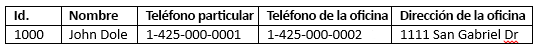
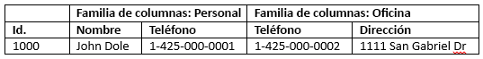

# <a name="quickstart-query-apache-hbase-in-azure-hdinsight-with-hbase-shell"></a>Inicio rápido: Consulta de Apache HBase en Azure HDInsight con el shell de HBase

En este inicio rápido, aprenderá a usar el shell de Apache HBase para crear una tabla de HBase, insertar datos y, luego, consultar la tabla.

Si no tiene una suscripción a Azure, cree una [cuenta gratuita](https://azure.microsoft.com/free/?WT.mc_id=A261C142F) antes de empezar.

## <a name="prerequisites"></a>Requisitos previos

* Un clúster de Apache HBase Consulte [Creación de un clúster](../hadoop/apache-hadoop-linux-tutorial-get-started.md#create-cluster) para crear un clúster de HDInsight.  Asegúrese de elegir el tipo de clúster **HBase**.

* Un cliente SSH. Para más información, consulte [Conexión a través de SSH con HDInsight (Apache Hadoop)](../hdinsight-hadoop-linux-use-ssh-unix.md).

## <a name="create-a-table-and-manipulate-data"></a>Creación de una tabla y manipulación de los datos

Para la mayoría de las personas, los datos aparecen en formato tabular:



En HBase (una implementación de [Cloud BigTable](https://cloud.google.com/bigtable/)), los mismos datos tienen un aspecto similar al siguiente:



Puede usar SSH para conectarse a clústeres de HBase y, después, usar el shell de Apache HBase para crear tablas de HBase e insertar y consultar datos.

1. Use el comando `ssh` para conectarse al clúster de HBase. Modifique el comando siguiente: reemplace `CLUSTERNAME` por el nombre del clúster y, luego, escriba el comando:

    ```cmd
    ssh sshuser@CLUSTERNAME-ssh.azurehdinsight.net
    ```

2. Use el comando `hbase shell` para iniciar el shell interactivo de HBase. Escriba el siguiente comando en la conexión SSH:

    ```bash
    hbase shell
    ```

3. Use el comando `create` para crear una tabla de HBase con dos familias de columnas. Escriba el comando siguiente:

    ```hbase
    create 'Contacts', 'Personal', 'Office'
    ```

4. Use el comando `list` para mostrar todas las tablas de HBase. Escriba el comando siguiente:

    ```hbase
    list
    ```

5. Use el comando `put` para insertar valores en una columna especificada en una fila especificada de una tabla determinada. Escriba el comando siguiente:

    ```hbase
    put 'Contacts', '1000', 'Personal:Name', 'John Dole'
    put 'Contacts', '1000', 'Personal:Phone', '1-425-000-0001'
    put 'Contacts', '1000', 'Office:Phone', '1-425-000-0002'
    put 'Contacts', '1000', 'Office:Address', '1111 San Gabriel Dr.'
    ```

6. Use el comando `scan` para buscar y devolver los datos de tabla `Contacts`. Escriba el comando siguiente:

    ```hbase
    scan 'Contacts'
    ```

7. Use el comando `get` para capturar el contenido de una fila. Escriba el comando siguiente:

    ```hbase
    get 'Contacts', '1000'
    ```

    Observará que los resultados son similares al uso del comando `scan` porque solo hay una fila.

8. Use el comando `delete` para eliminar un valor de celda de una tabla. Escriba el comando siguiente:

    ```hbase
    delete 'Contacts', '1000', 'Office:Address'
    ```

9. Use el comando `disable` para deshabilitar la tabla. Escriba el comando siguiente:

    ```hbase
    disable 'Contacts'
    ```

10. Use el comando `drop` para quitar una tabla de HBase. Escriba el comando siguiente:

    ```hbase
    drop 'Contacts'
    ```

11. Use el comando `exit` para detener el shell interactivo de HBase. Escriba el comando siguiente:

    ```hbase
    exit
    ```

Para más información sobre el esquema de tabla de HBase, consulte [Introduction to Apache HBase Schema Design](http://0b4af6cdc2f0c5998459-c0245c5c937c5dedcca3f1764ecc9b2f.r43.cf2.rackcdn.com/9353-login1210_khurana.pdf) (Introducción al diseño de esquema de Apache HBase). Para ver más comandos de HBase, consulte [Guía de referencia de Apache HBase](https://hbase.apache.org/book.html#quickstart).

## <a name="clean-up-resources"></a>Limpieza de recursos

Después de completar el inicio rápido, puede ser conveniente eliminar el clúster. Con HDInsight, los datos se almacenan en Azure Storage, por lo que puede eliminar un clúster de forma segura cuando no se esté usando. También se le cobrará por un clúster de HDInsight aunque no se esté usando. Como en muchas ocasiones los cargos por el clúster son mucho más elevados que los cargos por el almacenamiento, desde el punto de vista económico tiene sentido eliminar clústeres cuando no se estén usando.

Para eliminar un clúster, consulte [Eliminación de un clúster de HDInsight con el explorador, PowerShell o la CLI de Azure](../hdinsight-delete-cluster.md).

## <a name="next-steps"></a>Pasos siguientes

En este inicio rápido, aprendió a usar el shell de Apache HBase para crear una tabla de HBase, insertar datos y, luego, consultar la tabla. Para más información sobre los datos almacenados en HBase, en el siguiente artículo se muestra cómo ejecutar consultas con Apache Spark.

> [!div class="nextstepaction"]
> [Uso de Apache Spark para leer y escribir datos de Apache HBase](../hdinsight-using-spark-query-hbase.md)