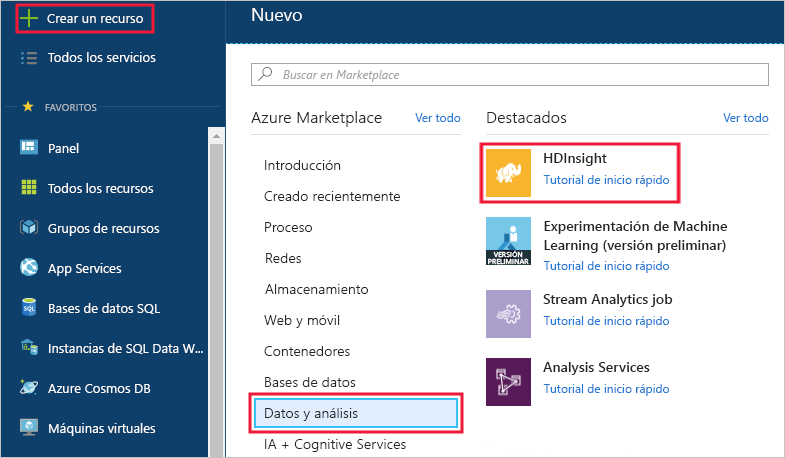
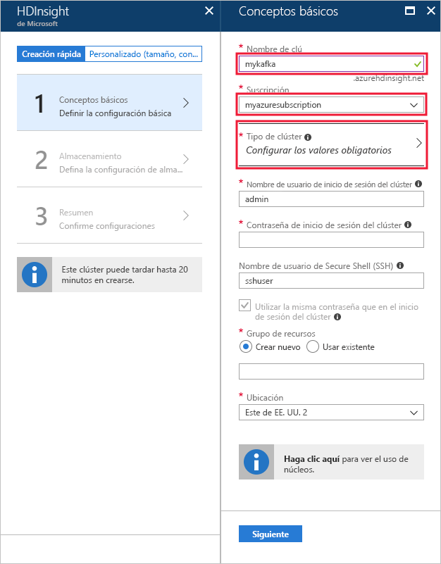
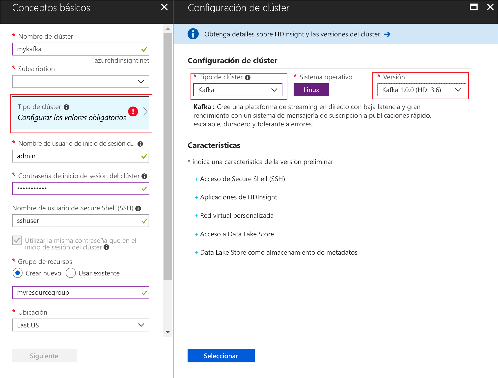
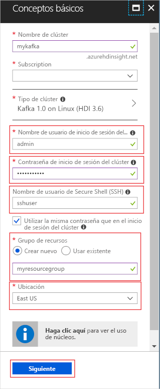
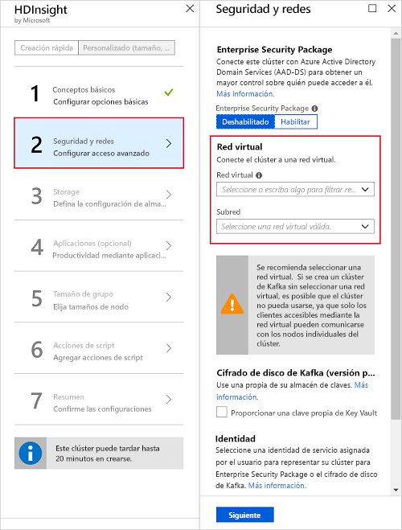
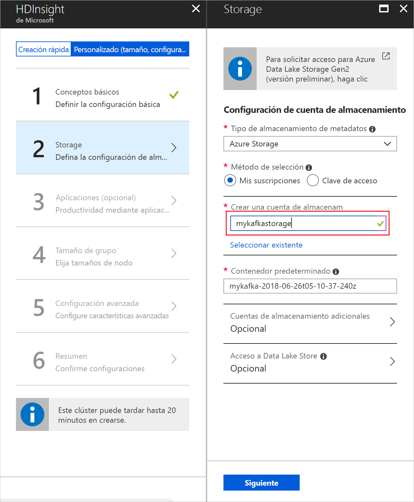
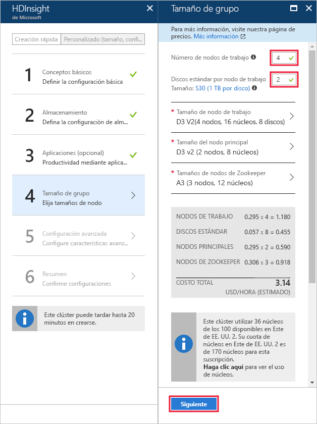
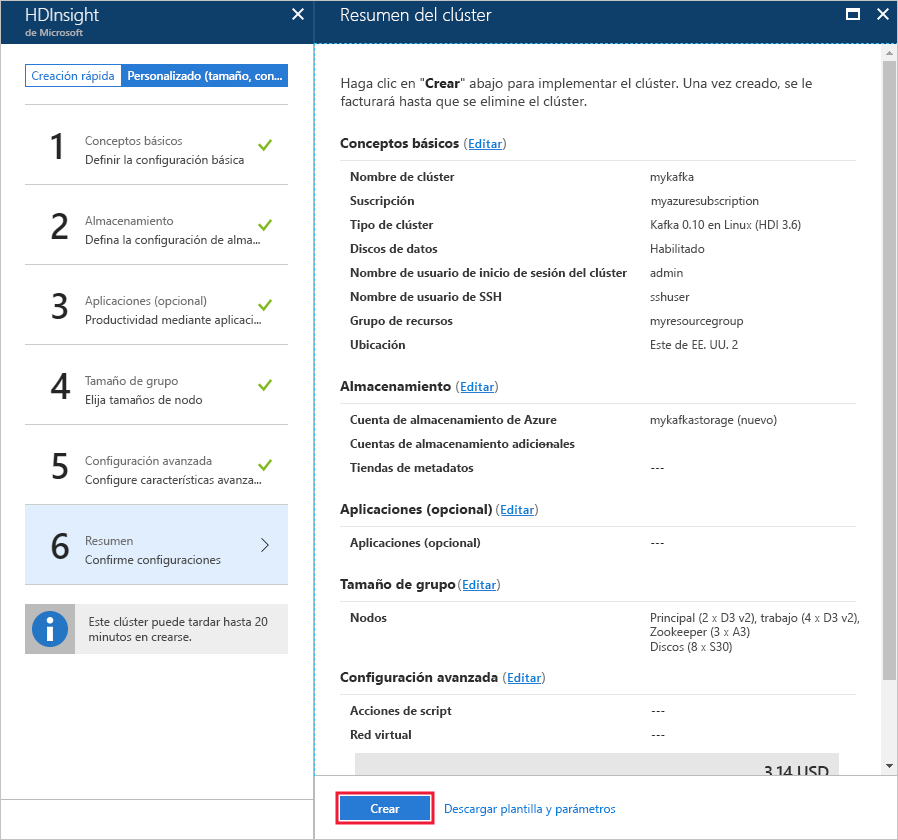

# <a name="quickstart-create-an-apache-kafka-on-hdinsight-cluster"></a>Inicio rápido: Creación de un clúster de Apache Kafka en HDInsight

Apache Kafka es una plataforma de streaming distribuida y de código abierto. A menudo se usa como agente de mensajes, ya que proporciona una funcionalidad similar a una cola de mensajes de publicación o suscripción. 

En esta guía de inicio rápido, aprenderá a crear un clúster de [Apache Kafka](https://kafka.apache.org) con Azure Portal. También aprenderá a usar las utilidades incluidas para enviar y recibir mensajes con Apache Kafka.

[!INCLUDE [delete-cluster-warning](../../../includes/hdinsight-delete-cluster-warning.md)]

> [!IMPORTANT]  
> Solo los recursos dentro de la misma red virtual pueden tener acceso a la API de Apache Kafka. En esta guía de inicio rápido, tendrá acceso al clúster directamente mediante SSH. Para conectar otros servicios, redes o máquinas virtuales con Apache Kafka, primero debe crear una red virtual y, a continuación, crear los recursos dentro de la red.
>
> Para más información, consulte el documento [Conexión a Kafka en HDInsight mediante una instancia de Azure Virtual Network](apache-kafka-connect-vpn-gateway.md).

## <a name="prerequisites"></a>Requisitos previos

* Una suscripción de Azure. Si no tiene una suscripción a Azure, cree una [cuenta gratuita](https://azure.microsoft.com/free/?WT.mc_id=A261C142F) antes de empezar.

* Un cliente SSH. Para más información, consulte [Conexión a través de SSH con HDInsight (Apache Hadoop)](../hdinsight-hadoop-linux-use-ssh-unix.md).

## <a name="create-an-apache-kafka-cluster"></a>Creación de un clúster de Apache Kafka

Siga estos pasos para crear un clúster de Apache Kafka en HDInsight:

1. Inicie sesión en el [Azure Portal](https://portal.azure.com).

2. En el menú de la izquierda, vaya a la opción **+ Crear un recurso** > **Analytics** > **HDInsight**.
   
    

3. En **Básico**, escriba o seleccione la siguiente información:

    | Configuración | Valor |
    | --- | --- |
    | Cluster Name | Un nombre exclusivo para el clúster de HDInsight. |
    | Subscription | Seleccione su suscripción. |
    
   Seleccione __Tipo de clúster__ para mostrar **Configuración del clúster**.
   
   

4. En __Configuración del clúster__, seleccione los valores siguientes:

    | Configuración | Valor |
    | --- | --- |
    | Tipo de clúster | Kafka |
    | Versión | Kafka 1.1.0 (HDI 3.6) |

    Seleccione **Seleccionar** para guardar la configuración del tipo de clúster y vuelva a __Básico__.

    

5. En __Básico__, escriba o seleccione la siguiente información:

    | Configuración | Valor |
    | --- | --- |
    | Nombre de usuario de inicio de sesión del clúster | El nombre de inicio de sesión al acceder a los servicios web o las API de REST hospedados en el clúster. Mantenga el valor predeterminado (admin). |
    | Contraseña de inicio de sesión de clúster | La contraseña de inicio de sesión al acceder a los servicios web o las API de REST hospedados en el clúster. |
    | Nombre de usuario de Secure Shell (SSH) | Inicio de sesión para acceder al clúster a través de SSH. De forma predeterminada, la contraseña es la misma que la de inicio de sesión en el clúster. |
    | Grupo de recursos | El grupo de recursos en el que se va a crear el clúster. |
    | Ubicación | La región de Azure donde se va crear el clúster. |

    > [!TIP]  
    > Cada región de Azure (ubicación) proporciona _dominios de error_. Un dominio de error es una agrupación lógica del hardware subyacente en un centro de datos de Azure. Todos los dominios de error comparten la fuente de energía y el conmutador de red. Las máquinas virtuales y los discos administrados que implementan los nodos en un clúster de HDInsight se distribuyen por estos dominios de error. Esta arquitectura limita el impacto potencial de errores del hardware físico.
    >
    > Para lograr la alta disponibilidad de los datos, seleccione una ubicación (región) que contenga __tres dominios de error__. Para información sobre el número de dominios de error de una región, consulte el documento sobre la [disponibilidad de las máquinas virtuales Linux](../../virtual-machines/windows/manage-availability.md#use-managed-disks-for-vms-in-an-availability-set).

   

    Seleccione __Siguiente__ para finalizar la configuración básica.

6. En esta guía de inicio rápido, deje la configuración predeterminada de seguridad. Para más información acerca de Enterprise Security Package, visite [Configurar un clúster de HDInsight con Enterprise Security Package mediante Azure Active Directory Domain Services](../domain-joined/apache-domain-joined-configure-using-azure-adds.md). Para obtener información acerca de cómo usar su propia clave de cifrado de disco de Apache Kafka, visite [Aporte su propia clave para Apache Kafka en Azure HDInsight (versión preliminar)](apache-kafka-byok.md)

   Si desea conectar su clúster a una red virtual, seleccione una red virtual desde la lista desplegable **Red virtual**.

   

7. Desde **Storage**, seleccione o cree una cuenta de Storage. Para seguir los pasos de este documento, deje los demás campos con los valores predeterminados. Use el botón __Siguiente__ para guardar la configuración de almacenamiento. Para más información sobre el uso de Data Lake Storage Gen2, consulte [Guía de inicio rápido: Configuración de clústeres en HDInsight](../../storage/data-lake-storage/quickstart-create-connect-hdi-cluster.md).

   

8. En __Aplicaciones (opcional)__, seleccione __Siguiente__ para continuar con la configuración predeterminada.

9. En __Tamaño de clúster__, seleccione __Siguiente__ para continuar con la configuración predeterminada.

    > [!IMPORTANT]  
    > Para garantizar la disponibilidad de Apache Kafka en HDInsight, la entrada del __número de nodos de trabajo__ debe establecerse en 3 o más. El valor predeterminado es 4.
    
    > [!TIP]  
    > Los **discos por entrada de nodo de trabajo** configuran la escalabilidad de Apache Kafka en HDInsight. Apache Kafka en HDInsight usa el disco local de las máquinas virtuales del clúster para almacenar datos. Como Apache Kafka tiene muchas E/S, [Azure Managed Disks](../../virtual-machines/windows/managed-disks-overview.md) se usa para proporcionar alto rendimiento y mayor espacio de almacenamiento por nodo. El tipo de disco administrado puede ser __Estándar__ (HDD) o __Premium__ (SSD). El tipo de disco depende del tamaño de máquina virtual que usan los nodos de trabajo (agentes de Apache Kafka). Los discos Premium se usan automáticamente con máquinas virtuales de las series DS y GS. Todos los otros tipos de máquina virtual usan discos estándar.

   

10. En __Configuración avanzada__, seleccione __Siguiente__ para continuar con la configuración predeterminada.

11. En **Resumen**, revise la configuración para el clúster. Use los vínculos __Edit__ (Editar) para cambiar cualquier configuración incorrecta. Por último, seleccione **Crear** para crear el clúster.
   
    
   
    > [!NOTE]
    > Un clúster puede tardar hasta 20 minutos en crearse.

## <a name="connect-to-the-cluster"></a>Conexión al clúster

1. Para conectarse con el nodo principal del clúster de Apache Kafka, use el siguiente comando. Reemplace `sshuser` por el nombre de usuario de SSH. Reemplace `mykafka` por el nombre del clúster de Apache Kafka.

    ```bash
    ssh sshuser@mykafka-ssh.azurehdinsight.net
    ```

2. Cuando se conecte por primera vez al clúster, es posible que el cliente SSH muestre una advertencia de que no se puede establecer la autenticidad del host. Cuando se le solicite, escriba __yes__ (sí) y presione __Entrar__ para agregar el host a la lista de servidores de confianza de su cliente SSH.

3. Cuando se le solicite, escriba la contraseña del usuario de SSH.

    Una vez que se haya conectado, verá información similar al texto siguiente:
    
    ```text
    Authorized uses only. All activity may be monitored and reported.
    Welcome to Ubuntu 16.04.4 LTS (GNU/Linux 4.13.0-1011-azure x86_64)
    
     * Documentation:  https://help.ubuntu.com
     * Management:     https://landscape.canonical.com
     * Support:        https://ubuntu.com/advantage
    
      Get cloud support with Ubuntu Advantage Cloud Guest:
        https://www.ubuntu.com/business/services/cloud
    
    83 packages can be updated.
    37 updates are security updates.


    Welcome to Apache Kafka on HDInsight.
    
    Last login: Thu Mar 29 13:25:27 2018 from 108.252.109.241
    ssuhuser@hn0-mykafk:~$
    ```

## <a id="getkafkainfo"></a>Obtención de la información del host de Apache Zookeeper y del agente

Cuando se trabaja con Kafka, debe conocer los hosts de *Apache Zookeeper* y del *agente*. Estos hosts se usan con la API de Apache Kafka y muchas de las utilidades que se incluyen con Kafka.

En esta sección, obtendrá la información de host de la API de REST de Apache Ambari en el clúster.

1. Instale [jq](https://stedolan.github.io/jq/), un procesador JSON de línea de comandos. Esta utilidad se usa para analizar documentos JSON y es útil para analizar la información de host. En la conexión SSH abierta, escriba el siguiente comando para instalar `jq`:
   
    ```bash
    sudo apt -y install jq
    ```

2. Configure las variables de entorno. Reemplace `PASSWORD` y `CLUSTERNAME` por la contraseña de inicio de sesión del clúster y el nombre del clúster, respectivamente y, después, escriba el comando:

    ```bash
    export password='PASSWORD'
    export clusterNameA='CLUSTERNAME'
    ```

3. Extraiga el nombre del clúster con las mayúsculas y minúsculas correctas. Las mayúsculas y minúsculas reales del nombre del clúster pueden no ser como cabría esperar, dependen de la forma en que se haya creado el clúster. Este comando obtendrá las mayúsculas y minúsculas reales, las almacenará en una variable y, después, mostrará el nombre con las mayúsculas y minúsculas correctas y el nombre que especificó anteriormente. Escriba el comando siguiente:

    ```bash
    export clusterName=$(curl -u admin:$password -sS -G "https://$clusterNameA.azurehdinsight.net/api/v1/clusters" | jq -r '.items[].Clusters.cluster_name')
    echo $clusterName, $clusterNameA
    ```

4. Para establecer una variable de entorno con la información de host de Zookeeper, use el comando siguiente:
    
    ```bash
    export KAFKAZKHOSTS=`curl -sS -u admin:$password -G http://headnodehost:8080/api/v1/clusters/$clusterName/services/ZOOKEEPER/components/ZOOKEEPER_SERVER | jq -r '["\(.host_components[].HostRoles.host_name):2181"] | join(",")' | cut -d',' -f1,2`
    ```

    > [!TIP]  
    > Este comando realiza una consulta directamente al servicio Ambari en el nodo principal del clúster. También puede acceder a Ambari mediante la dirección pública `https://$CLUSTERNAME.azurehdinsight.net:80/`. Algunas configuraciones de red pueden impedir el acceso a la dirección pública. Por ejemplo, mediante grupos de seguridad de red (NSG) para restringir el acceso a HDInsight en una red virtual.

    > [!NOTE]  
    > Este comando recupera todos los hosts de Zookeeper y, a continuación, devuelve solo las dos primeras entradas. Esto se debe a que quiere cierta redundancia en caso de que un host sea inaccesible.

5. Para comprobar que la variable de entorno se ha establecido correctamente, use el comando siguiente:

    ```bash
    echo $KAFKAZKHOSTS
    ```

    Este comando devuelve información similar al texto siguiente:

    `zk0-kafka.eahjefxxp1netdbyklgqj5y1ud.ex.internal.cloudapp.net:2181,zk2-kafka.eahjefxxp1netdbyklgqj5y1ud.ex.internal.cloudapp.net:2181`

6. Para establecer una variable de entorno con la información de host del agente de Apache Kafka, use el comando siguiente:

    ```bash
    export KAFKABROKERS=`curl -sS -u admin:$password -G http://headnodehost:8080/api/v1/clusters/$clusterName/services/KAFKA/components/KAFKA_BROKER | jq -r '["\(.host_components[].HostRoles.host_name):9092"] | join(",")' | cut -d',' -f1,2`
    ```

7. Para comprobar que la variable de entorno se ha establecido correctamente, use el comando siguiente:

    ```bash   
    echo $KAFKABROKERS
    ```

    Este comando devuelve información similar al texto siguiente:
   
    `wn1-kafka.eahjefxxp1netdbyklgqj5y1ud.cx.internal.cloudapp.net:9092,wn0-kafka.eahjefxxp1netdbyklgqj5y1ud.cx.internal.cloudapp.net:9092`

## <a name="manage-apache-kafka-topics"></a>Administración de temas de Apache Kafka

Kafka almacena flujos de datos en *temas*. Puede usar la utilidad `kafka-topics.sh` para administrar temas.

* **Para crear un tema**, use el comando siguiente en la conexión SSH:

    ```bash
    /usr/hdp/current/kafka-broker/bin/kafka-topics.sh --create --replication-factor 3 --partitions 8 --topic test --zookeeper $KAFKAZKHOSTS
    ```

    Este comando se conecta a Zookeeper mediante la información de host almacenada en `$KAFKAZKHOSTS`. Y, luego, crea un tema de Apache Kafka llamado **test**. 

    * Los datos almacenados en este tema se dividen en ocho particiones.

    * Cada partición se replica en tres nodos de trabajo del clúster.

        > [!IMPORTANT]  
        > Si ha creado el clúster en una región de Azure que proporciona tres dominios de error, use un factor de replicación de 3. De lo contrario, use un factor de replicación de 4.
        
        En regiones con tres dominios de error, un factor de replicación de 3 permite que las réplicas se distribuyan entre los dominios de error. En regiones con dos dominios de error, un factor de replicación de cuatro permite que las réplicas se distribuyan equitativamente entre los dominios.
        
        Para información sobre el número de dominios de error de una región, consulte el documento sobre la [disponibilidad de las máquinas virtuales Linux](../../virtual-machines/windows/manage-availability.md#use-managed-disks-for-vms-in-an-availability-set).

        > [!IMPORTANT]  
        > Apache Kafka no es compatible con dominios de error de Azure. Al crear réplicas de la partición de temas, puede que estas no se distribuyan correctamente con alta disponibilidad.

        Para garantizar la alta disponibilidad, use la [herramienta de reequilibrado de particiones de Apache Kafka](https://github.com/hdinsight/hdinsight-kafka-tools). Esta herramienta se debe ejecutar desde una conexión SSH en el nodo principal del clúster de Apache Kafka.

        Para obtener la máxima disponibilidad de los datos de Apache Kafka, debe reequilibrar las réplicas de las particiones del tema cuando:

        * Cree un nuevo tema o una partición

        * Escale verticalmente un clúster

* **Para mostrar temas**, use el comando siguiente:

    ```bash
    /usr/hdp/current/kafka-broker/bin/kafka-topics.sh --list --zookeeper $KAFKAZKHOSTS
    ```

    Este comando muestra los temas disponibles en el clúster de Apache Kafka.

* **Para eliminar un tema**, use el comando siguiente:

    ```bash
    /usr/hdp/current/kafka-broker/bin/kafka-topics.sh --delete --topic topicname --zookeeper $KAFKAZKHOSTS
    ```

    Este comando elimina el tema `topicname`.

    > [!WARNING]  
    > Si elimina el tema `test` que ha creado anteriormente, debe volver a crearlo. Se usa más adelante en este documento.

Para obtener más información acerca de los comandos disponibles con la utilidad `kafka-topics.sh`, use el siguiente comando:

```bash
/usr/hdp/current/kafka-broker/bin/kafka-topics.sh
```

## <a name="produce-and-consume-records"></a>Generación y consumo de registros

Kafka almacena *registros* en temas. Los registros se generan mediante *productores* y se consumen mediante *consumidores*. Los productores y consumidores se comunican con el servicio de *agente de Kafka*. Cada nodo de trabajo del clúster de HDInsight es un host de agente de Apache Kafka.

Use los pasos siguientes para almacenar registros en el tema de prueba que creó anteriormente y luego leerlos mediante un consumidor:

1. Para escribir registros en el tema, use la utilidad `kafka-console-producer.sh` desde la conexión SSH:
   
    ```bash
    /usr/hdp/current/kafka-broker/bin/kafka-console-producer.sh --broker-list $KAFKABROKERS --topic test
    ```
   
    Después de este comando, llega a una línea vacía.

2. Escriba un mensaje de texto en la línea vacía y presione ENTRAR. Escriba algunos mensajes de esta forma y, a continuación, use **Ctrl + C** para volver al símbolo del sistema normal. Cada línea se envía como un registro independiente al tema de Apache Kafka.

3. Para leer registros del tema, use la utilidad `kafka-console-consumer.sh` desde la conexión SSH:
   
    ```bash
    /usr/hdp/current/kafka-broker/bin/kafka-console-consumer.sh --bootstrap-server $KAFKABROKERS --topic test --from-beginning
    ```
   
    Este comando recupera los registros del tema y los muestra. Con `--from-beginning` se indica al consumidor que comience desde el principio del flujo, de modo que se recuperan todos los registros.

    > [!NOTE]
    > Si está utilizando una versión anterior de Kafka, reemplace `--bootstrap-server $KAFKABROKERS` por `--zookeeper $KAFKAZKHOSTS`.

4. Use __Ctrl + C__ para detener el consumidor.

También puede crear mediante programación los productores y consumidores. Para obtener un ejemplo del uso de esta API, consulte el documento [Producer y Consumer API de Apache Kafka](apache-kafka-producer-consumer-api.md).

## <a name="clean-up-resources"></a>Limpieza de recursos

Para limpiar los recursos creados por esta guía de inicio rápido, puede eliminar el grupo de recursos. Al eliminar el grupo de recursos, también se elimina el clúster de HDInsight asociado y otros recursos asociados al grupo.

Para quitar el grupo de recursos mediante Azure Portal:

1. En Azure Portal, expanda el menú en el lado izquierdo para abrir el menú de servicios y elija __Grupos de recursos__ para mostrar la lista de sus grupos de recursos.
2. Busque el grupo de recursos que desea eliminar y haga clic con el botón derecho en __Más__ (...) en el lado derecho de la lista.
3. Seleccione __Eliminar grupo de recursos__ y confirme la elección.

> [!WARNING]  
> La facturación del clúster de HDInsight se inicia una vez creado el clúster y solo se detiene cuando se elimina. Se facturan por minuto realizando una prorrata, por lo que siempre debe eliminar aquellos que ya no se estén utilizando.
> 
> Al eliminar un clúster de Apache Kafka en HDInsight se eliminan todos los datos almacenados en Kafka.

## <a name="next-steps"></a>Pasos siguientes

> [!div class="nextstepaction"]
> [Uso de Apache Spark con Apache Kafka](../hdinsight-apache-kafka-spark-structured-streaming.md)