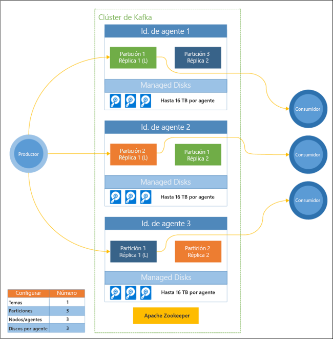

# Qué es Apache Kafka en HDInsight

[Apache Kafka](https://kafka.apache.org) es una plataforma de streaming distribuido de código abierto que se puede utilizar para compilar canalizaciones de datos de streaming en tiempo real y aplicaciones. Kafka también proporciona funcionalidad de agente de mensajería similar a una cola de mensajes, donde puede publicar y suscribirse a las transmisiones de datos con nombre. 

Las siguientes son características específicas de Kafka en HDInsight:

* Es un servicio administrado que proporciona un proceso de configuración simplificado. El resultado es una configuración a la que Microsoft da soporte y prueba.

* Microsoft ofrece un contrato de nivel de servicio (SLA) del 99,9 % de tiempo de actividad de Kafka. Para más información, vea el documento [Contrato de nivel de servicio para HDInsight](https://azure.microsoft.com/support/legal/sla/hdinsight/v1_0/).

* Utiliza Azure Managed Disks como memoria auxiliar para Kafka. Managed Disks puede ofrecer hasta 16 TB de almacenamiento por agente de Kafka. Para obtener información acerca de la configuración de discos administrados con Kafka en HDInsight, consulte [Increase scalability of Apache Kafka on HDInsight](apache-kafka-scalability.md) (Aumento de la escalabilidad de Apache Kafka en HDInsight).

    Para más información acerca de los discos administrados, consulte [Introducción a Azure Managed Disks](../../virtual-machines/windows/managed-disks-overview.md).

* Kafka se diseñó con una sola vista dimensional de bastidor. Azure separa un bastidor en dos dimensiones: dominios de actualización (UD) y dominios de error (FD). Microsoft proporciona herramientas que reequilibran las particiones de Kafka y las réplicas entre los dominios de actualización y de error. 

    Para más información, consulte el artículo sobre [Alta disponibilidad con Apache Kafka en HDInsight](apache-kafka-high-availability.md).

* HDInsight permite cambiar el número de nodos de trabajo (que hospeda el agente de Kafka) después de crear los clústeres. El escalado se puede realizar desde Azure Portal, Azure PowerShell y otras interfaces de administración de Azure. Para Kafka, debe volver a equilibrar las réplicas de la partición después de las operaciones de escalado. El reequilibrado de las particiones permite a Kafka aprovechar el nuevo número de nodos de trabajo.

    Para más información, consulte el artículo sobre [Alta disponibilidad con Apache Kafka en HDInsight](apache-kafka-high-availability.md).

* Azure Log Analytics puede usarse para supervisar Kafka en HDInsight. Log Analytics muestra información de nivel de máquina virtual, por ejemplo, métricas de disco y de NIC, además de las métricas de JMX de Kafka.

    Para más información, consulte [Análisis de registros para Apache Kafka en HDInsight](apache-kafka-log-analytics-operations-management.md).

### Arquitectura de Apache Kafka en HDInsight

El diagrama siguiente muestra una configuración típica de Kafka que usa grupos de consumidores, particiones y replicación para ofrecer la lectura paralela de eventos con tolerancia a errores:

Apache ZooKeeper administra el estado del clúster de Kafka. Zookeeper se creó para transacciones simultáneas, resistentes y de baja latencia. 

Kafka almacena los registros (datos) en **temas**. Los registros se generan mediante **productores** y se consumen mediante **consumidores**. Los productores envían registros a los **agentes** de Kafka. Cada nodo de trabajo del clúster de HDInsight es un agente de Kafka. 

Los temas particionan los registros entres los agentes. Al consumir registros, puede usar hasta un consumidor por partición para lograr el procesamiento en paralelo de los datos.

La replicación se emplea para duplicar las particiones entre los nodos, protegiendo contra las desconexiones de nodos (agente). Una partición con una *(L)* en el diagrama es la líder para la partición dada. El tráfico del productor se enruta al líder de cada nodo, con el estado administrado por ZooKeeper.

## ¿Por qué usar Apache Kafka en HDInsight?

Las siguientes son tareas y patrones comunes que pueden realizarse con Kafka en HDInsight:

* **Replicación de datos de Apache Kafka**: Kafka proporciona la utilidad MirrorMaker, que replica datos entre clústeres de Kafka.

    Para más información sobre el uso de MirrorMaker, consulte el artículo sobre la [replicación de temas de Apache Kafka con Apache Kafka en HDInsight](apache-kafka-mirroring.md).

* **Patrón de mensajería de publicación y suscripción**: Kafka proporciona una API de productor para publicar registros en un tema de Kafka. Al suscribirse a un tema, se utiliza la API de consumidor.

    Para más información, consulte [Inicio de Apache Kafka en HDInsight](apache-kafka-get-started.md).

* **Procesamiento de flujos**: Kafka se suele utilizar con Apache Storm o Spark para el procesamiento de flujos en tiempo real. Kafka 0.10.0.0 (versiones 3.5 y 3.6 de HDInsight) introdujo una API de streaming que permite generar soluciones de streaming sin necesidad de Storm ni Spark.

    Para más información, consulte [Inicio de Apache Kafka en HDInsight](apache-kafka-get-started.md).

* **Escalado horizontal**: Kafka particiona los flujos de los nodos del clúster de HDInsight. Los procesos del consumidor se pueden asociar con las particiones individuales para proporcionar equilibrio de carga al consumir los registros.

    Para más información, consulte [Inicio de Apache Kafka en HDInsight](apache-kafka-get-started.md).

* **Entrega en orden**: dentro de cada partición, los registros se almacenan en el flujo en el orden en que se recibieron. Al asociar un proceso de consumidor por partición, puede garantizar que los registros se procesan en orden.

    Para más información, consulte [Inicio de Apache Kafka en HDInsight](apache-kafka-get-started.md).

## Casos de uso

* **Mensajería**: como admite el patrón de publicación de mensajes y suscripción, Kafka a menudo se utiliza como agente de mensajería.

* **Seguimiento de la actividad**: Kafka proporciona un registro en orden, por lo que se puede utilizar para realizar un seguimiento y volver a crear actividades. Por ejemplo, las acciones del usuario en un sitio web o dentro de una aplicación.

* **Agregación**: mediante el procesamiento de las transmisiones, puede agregar información de distintas transmisiones para combinar y centralizar la información en datos operativos.

* **Transformación**: mediante el procesamiento de las transmisiones, puede combinar y enriquecer los datos de varios temas de entrada en uno o más temas de salida.

## Pasos siguientes

Use los vínculos siguientes para aprender a usar a Apache Kafka en HDInsight:

* [Guía de inicio rápido: Creación de una instancia de Apache Kafka en HDInsight](apache-kafka-get-started.md)

* [Tutorial: Uso de Apache Spark con Apache Kafka en HDInsight](../hdinsight-apache-spark-with-kafka.md)

* [Tutorial: Uso de Apache Storm con Apache Kafka en HDInsight](../hdinsight-apache-storm-with-kafka.md)
