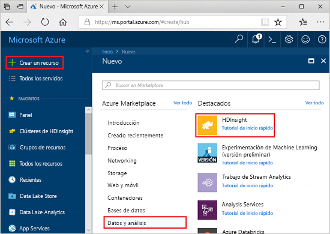
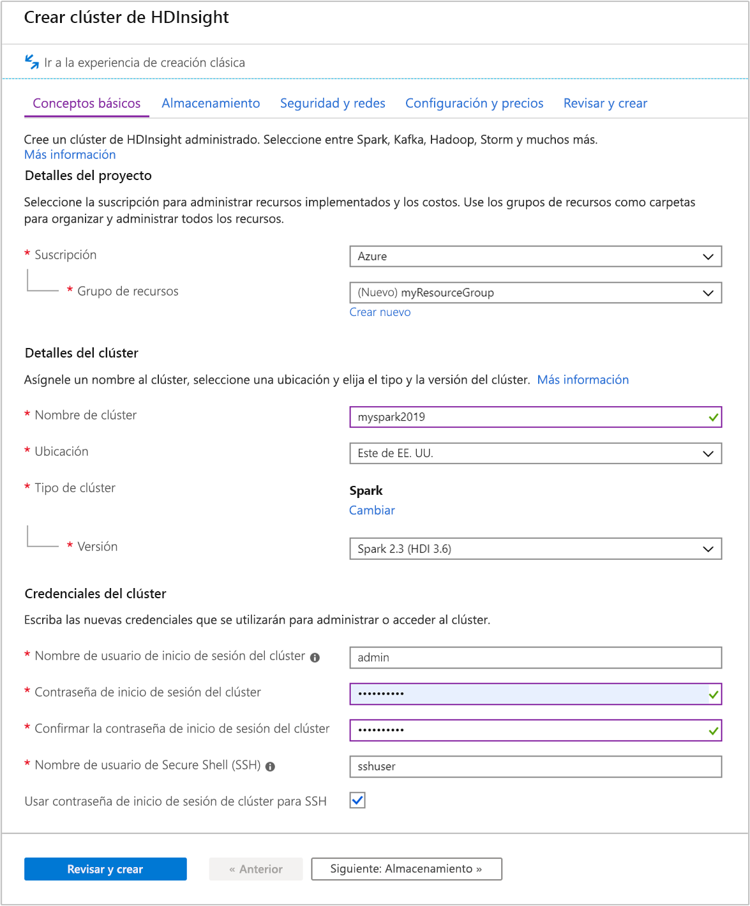
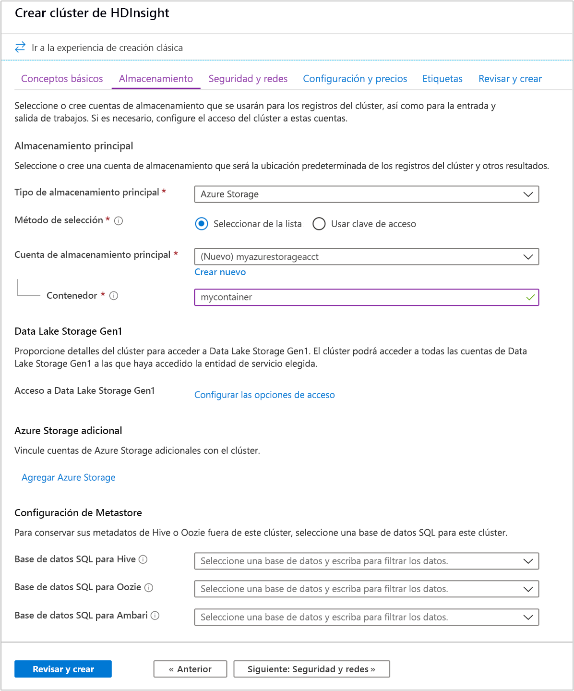

# <a name="quickstart-create-apache-spark-cluster-in-azure-hdinsight-using-azure-portal"></a>Inicio rápido: Creación de un clúster de Apache Spark en Azure HDInsight mediante Azure Portal

Aprenda cómo crear clústeres de Apache Spark en Azure HDInsight y cómo ejecutar consultas de Spark SQL en tablas de Hive. Apache Spark permite el análisis rápido de datos y procesamiento de clústeres con el procesamiento en memoria. Para información sobre Spark en HDInsight, consulte [Introducción a Apache Spark en HDInsight de Azure](apache-spark-overview.md).

En esta guía de inicio rápido, usará Azure Portal para crear un clúster de Spark de HDInsight. El clúster usa Azure Storage Blob como almacenamiento de clústeres. Para más información sobre el uso de Data Lake Storage Gen2, consulte [Guía de inicio rápido: Configuración de clústeres en HDInsight](../../storage/data-lake-storage/quickstart-create-connect-hdi-cluster.md).

> [!IMPORTANT]  
> La facturación de los clústeres de HDInsight se prorratea por minuto, tanto si se usan como si no. Por consiguiente, es aconsejable eliminar el clúster al terminar de usarlo. Para obtener más información, consulte la sección [Limpieza de recursos](#clean-up-resources) de este artículo.

Si no tiene una suscripción a Azure, cree una [cuenta gratuita](https://azure.microsoft.com/free/) antes de empezar.

## <a name="create-an-hdinsight-spark-cluster"></a>Creación de un clúster de Spark en HDInsight

1. En Azure Portal, seleccione **Crear un recurso** > **Analytics** > **HDInsight**.

    

1. En **Datos básicos**, proporcione los valores siguientes:

    |Propiedad  |Descripción  |
    |---------|---------|
    |Subscription  | En el menú desplegable, seleccione una suscripción de Azure usada para este clúster. La suscripción usada para este inicio rápido es **Azure**. |
    |Resource group | Especifique si desea crear un nuevo grupo de recursos o utilizar uno existente. Un grupo de recursos es un contenedor que almacena los recursos relacionados con una solución de Azure. El nombre del grupo de recursos usado para este inicio rápido es **myResourceGroup**. |
    |Nombre del clúster | Asigne un nombre al clúster de Spark de HDInsight. El nombre del clúster usado para este inicio rápido es **myspark2019**.|
    |Location   | Seleccione una ubicación para el grupo de recursos. La plantilla utiliza esta ubicación para crear el clúster, así como para el almacenamiento de clúster predeterminado. La ubicación usada para este inicio rápido es **Este de EE. UU.** |
    |Tipo de clúster| Seleccione **Spark** como el tipo de clúster.|
    |Versión del clúster|Este campo se rellenará automáticamente con la versión predeterminada una vez que se haya seleccionado el tipo de clúster.|
    |Nombre de usuario de inicio de sesión del clúster| Escriba el nombre de usuario de inicio de sesión del clúster.  El nombre predeterminado es *admin*. Use esta cuenta para iniciar sesión en Jupyter Notebook más adelante en la guía de inicio rápido. |
    |Contraseña de inicio de sesión de clúster| Escriba la contraseña de inicio de sesión del clúster. |
    |Nombre de usuario de Secure Shell (SSH)| Escriba el nombre de usuario de SSH. El nombre de usuario de SSH usado para este inicio rápido es **sshuser**. De manera predeterminada, esta cuenta comparte la contraseña con la cuenta de *nombre de usuario de inicio de sesión del clúster*. |

    

    Seleccione **Siguiente: Almacenamiento>>** para continuar en la página **Almacenamiento**.

1. En **Almacenamiento**, proporcione los valores siguientes:

    |Propiedad  |Descripción  |
    |---------|---------|
    |Tipo de almacenamiento principal|Use el valor predeterminado **Azure Storage**.|
    |Método de selección|Use el valor predeterminado **Seleccionar de la lista**.|
    |Cuenta de almacenamiento principal|Use el valor que se rellena automáticamente.|
    |Contenedor|Use el valor que se rellena automáticamente.|

    

    Seleccione **Revisar y crear** para continuar.

1. Seleccione **Revisar y crear** y, después, **Crear**. La creación del clúster tarda aproximadamente 20 minutos. El clúster debe crearse para poder pasar a la siguiente sesión.

Si surge un problema con la creación de clústeres de HDInsight, podría deberse a que no tiene los permisos adecuados para hacerlo. Para más información, consulte [Requisitos de control de acceso](../hdinsight-hadoop-create-linux-clusters-portal.md).

## <a name="create-a-jupyter-notebook"></a>Creación de un cuaderno de Jupyter

Jupyter Notebook es un entorno de cuaderno interactivo que admite varios lenguajes de programación. El cuaderno le permite interactuar con los datos, combinar código con el texto de marcado y realizar visualizaciones básicas.

1. Abra [Azure Portal](https://portal.azure.com).

1. Seleccione **Clústeres de HDInsight** y, a continuación, seleccione el clúster que creó.

    

1. En el portal, seleccione **Paneles de clúster** y, a continuación, **Jupyter Notebook**. Cuando se le solicite, escriba las credenciales de inicio de sesión del clúster.

   

1. Seleccione **Nuevo** > **PySpark** para crear un cuaderno.

   

   Se crea y se abre un nuevo cuaderno con el nombre Untitled(Untitled.pynb).

## <a name="run-spark-sql-statements"></a>Ejecución de instrucciones de Spark SQL

SQL (Lenguaje de consulta estructurado) es el lenguaje más común y ampliamente utilizado en la consulta y definición de datos. Spark SQL funciona como una extensión de Apache Spark para procesar datos estructurados, mediante la conocida sintaxis de SQL.

1. Compruebe que el kernel esté preparado. El kernel está preparado cuando aparece un círculo vacío junto al nombre del kernel en el cuaderno. Un círculo sólido indica que el kernel está ocupado.

    

    Al iniciar el cuaderno por primera vez, el kernel realiza tareas en segundo plano. Espere a que el kernel esté preparado.

1. Pegue el código siguiente en una celda vacía y presione **MAYÚS + ENTRAR** para ejecutar el código. El comando muestra las tablas Hive del clúster:

    ```PySpark
    %%sql
    SHOW TABLES
    ```

    Cuando se utiliza un cuaderno de Jupyter Notebook con el clúster de Spark en HDInsight, obtiene un valor de `sqlContext` preestablecido que puede usar para ejecutar consultas de Hive con Spark SQL. `%%sql` indica a Jupyter Notebook que use el valor de `sqlContext` preestablecido para ejecutar la consulta de Hive. La consulta recupera las 10 primeras filas de una tabla de Hive (**hivesampletable**) que se incluye de forma predeterminada en todos los clústeres de HDInsight. Se tardan unos 30 segundos en obtener los resultados. El resultado tendrá una apariencia similar a la siguiente:

    

    Cada vez que se ejecuta una consulta en Jupyter, el título de la ventana del explorador web muestra el estado **(Busy)** (Ocupado) junto con el título del cuaderno. También verá un círculo sólido junto al texto **PySpark** en la esquina superior derecha.

1. Ejecute otra consulta para ver los datos en `hivesampletable`.

    ```PySpark
    %%sql
    SELECT * FROM hivesampletable LIMIT 10
    ```

    Debe actualizar la pantalla para mostrar la salida de la consulta.

    

1. En el menú **File** (Archivo) del cuaderno, seleccione **Close and Halt** (Cerrar y detener). Al cerrar el cuaderno, se liberan los recursos de clúster.

## <a name="clean-up-resources"></a>Limpieza de recursos

HDInsight guarda los datos en Azure Storage o Azure Data Lake Storage, por lo que puede eliminar de manera segura un clúster si no se está usando. También se le cobrará por un clúster de HDInsight aunque no se esté usando. Como en muchas ocasiones los cargos por el clúster son mucho más elevados que los cargos por el almacenamiento, desde el punto de vista económico tiene sentido eliminar clústeres cuando no se estén usando. Si tiene previsto pasar inmediatamente al tutorial de [Pasos siguientes](#next-steps), es aconsejable que no elimine el clúster.

Vuelva a Azure Portal y seleccione **Eliminar**.


También puede seleccionar el nombre del grupo de recursos para abrir la página del grupo de recursos y, a continuación, seleccionar **Eliminar grupo de recursos**. Al eliminar el grupo de recursos, se eliminan tanto el clúster de HDInsight Spark como la cuenta de almacenamiento predeterminada.

## <a name="next-steps"></a>Pasos siguientes

En esta guía de inicio rápido, ha aprendido a crear un clúster de HDInsight Spark y a ejecutar una consulta básica de Spark SQL. Continúe hasta el siguiente tutorial para obtener información sobre cómo usar un clúster de Spark de HDInsight para ejecutar consultas interactivas en datos de ejemplo.

> [!div class="nextstepaction"]
> [Ejecución de consultas interactivas en Apache Spark](./apache-spark-load-data-run-query.md)
