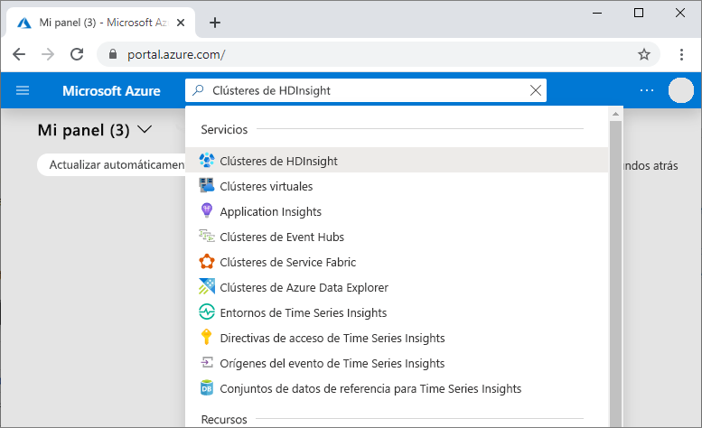
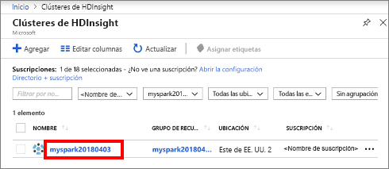
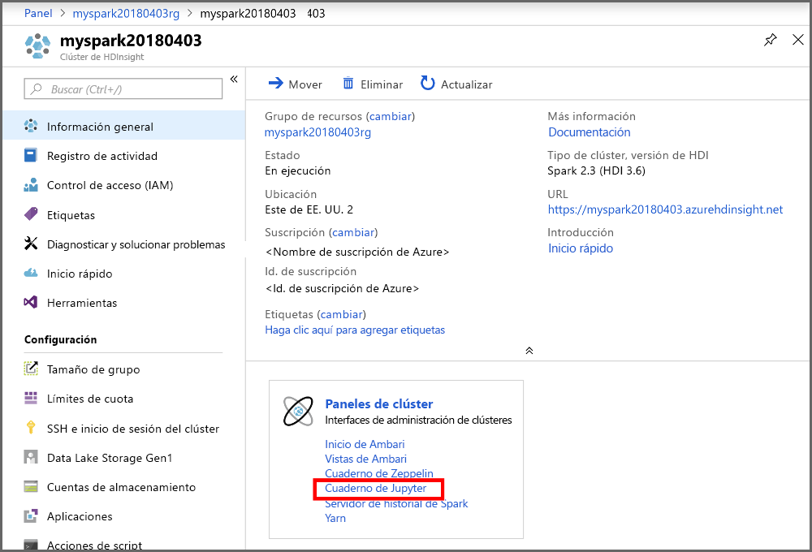
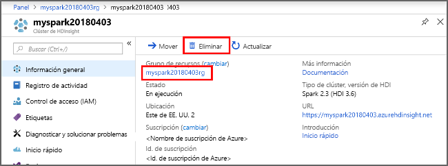

# <a name="quickstart-create-apache-spark-cluster-in-azure-hdinsight-using-powershell"></a>Inicio rápido: Creación de un clúster de Apache Spark en Azure HDInsight mediante PowerShell

En este inicio rápido, se usa Azure PowerShell para crear un clúster de Apache Spark en Azure HDInsight. Luego se crea un cuaderno de Jupyter Notebook y se usa para ejecutar consultas de Spark SQL en tablas de Apache Hive. Azure HDInsight es un servicio administrado, de espectro completo y de análisis de código abierto para empresas. El marco de Apache Spark para Azure HDInsight permite un análisis de datos y un procesamiento de clústeres rápidos con el procesamiento en memoria. Jupyter Notebook permite interactuar con los datos, combinar código con texto Markdown y realizar visualizaciones simples.

[Información general: Apache Spark en Azure HDInsight](apache-spark-overview.md) | [Apache Spark](https://spark.apache.org/) | [Apache Hive](https://hive.apache.org/) | [Jupyter Notebook](https://jupyter.org/)

## <a name="prerequisite"></a>Requisito previo

- Una cuenta de Azure con una suscripción activa. [Cree una cuenta gratuita](https://azure.microsoft.com/free/?ref=microsoft.com&utm_source=microsoft.com&utm_medium=docs&utm_campaign=visualstudio).
- El [módulo Az de PowerShell](https://docs.microsoft.com/powershell/azure/install-az-ps).

## <a name="create-an-apache-spark-cluster-in-hdinsight"></a>Creación de un clúster de Apache Spark en HDInsight

> [!IMPORTANT]  
> La facturación de los clústeres de HDInsight se prorratea por minuto, tanto si se usan como si no. Por consiguiente, es aconsejable eliminar el clúster al terminar de usarlo. Para obtener más información, consulte la sección [Limpieza de recursos](#clean-up-resources) de este artículo.

Crear un clúster de HDInsight incluye la creación de los siguientes objetos y recursos de Azure:

- Grupo de recursos de Azure. Un grupo de recursos de Azure es un contenedor para recursos de Azure.
- Una cuenta de Azure Storage o de Azure Data Lake Store.  Cada clúster de HDInsight requiere un almacenamiento de datos dependiente. En este inicio rápido, se crea un clúster que usa Azure Storage Blob como almacenamiento. Para más información sobre el uso de Data Lake Storage Gen2, consulte [Guía de inicio rápido: Configuración de clústeres en HDInsight](../../storage/data-lake-storage/quickstart-create-connect-hdi-cluster.md).
- Un clúster de diferentes tipos de clúster en HDInsight.  En esta guía de inicio rápido, creará un clúster de Spark 2.3.

Usará un script de PowerShell para crear los recursos. 

[!INCLUDE [updated-for-az](../../../includes/updated-for-az.md)]

Al ejecutar el script de PowerShell, se le solicita que escriba los valores siguientes:

|Parámetro|Value|
|------|------|
|Nombre del grupo de recursos de Azure | Proporcione un nombre único para el grupo de recursos.|
|Location| Especifique la región de Azure, por ejemplo "Centro de EE. UU.". |
|Nombre de la cuenta de almacenamiento predeterminada | Proporcione un nombre único para la cuenta de almacenamiento. |
|Nombre del clúster | Especifique un nombre exclusivo para el clúster de HDInsight.|
|Credenciales de inicio de sesión del clúster | Use esta cuenta para conectarse al panel del clúster más adelante en el inicio rápido.|
|Credenciales de usuario de SSH | Los clientes de SSH se pueden usar para crear una sesión de línea de comandos remota con los clústeres en HDInsight.|

1. Seleccione **Try It** (Probarlo) en la esquina superior derecha para que el bloque de código siguiente abra [Azure Cloud Shell](../../cloud-shell/overview.md) y siga las instrucciones para conectarse a Azure.

2. Copie y pegue el siguiente script de PowerShell en Cloud Shell.

    ```azurepowershell-interactive
    ### Create a Spark 2.3 cluster in Azure HDInsight

    # Default cluster size (# of worker nodes), version, and type
    $clusterSizeInNodes = "1"
    $clusterVersion = "3.6"
    $clusterType = "Spark"

    # Create the resource group
    $resourceGroupName = Read-Host -Prompt "Enter the resource group name"
    $location = Read-Host -Prompt "Enter the Azure region to create resources in, such as 'Central US'"
    $defaultStorageAccountName = Read-Host -Prompt "Enter the default storage account name"

    New-AzResourceGroup -Name $resourceGroupName -Location $location

    # Create an Azure storage account and container
    # Note: Storage account kind BlobStorage can only be used as secondary storage for HDInsight clusters.
    New-AzStorageAccount `
        -ResourceGroupName $resourceGroupName `
        -Name $defaultStorageAccountName `
        -Location $location `
        -SkuName Standard_LRS `
        -Kind StorageV2 `
        -EnableHttpsTrafficOnly 1

    $defaultStorageAccountKey = (Get-AzStorageAccountKey `
                                    -ResourceGroupName $resourceGroupName `
                                    -Name $defaultStorageAccountName)[0].Value

    $defaultStorageContext = New-AzStorageContext `
                                    -StorageAccountName $defaultStorageAccountName `
                                    -StorageAccountKey $defaultStorageAccountKey

    # Create a Spark 2.3 cluster
    $clusterName = Read-Host -Prompt "Enter the name of the HDInsight cluster"

    # Cluster login is used to secure HTTPS services hosted on the cluster
    $httpCredential = Get-Credential -Message "Enter Cluster login credentials" -UserName "admin"

    # SSH user is used to remotely connect to the cluster using SSH clients
    $sshCredentials = Get-Credential -Message "Enter SSH user credentials" -UserName "sshuser"

    # Set the storage container name to the cluster name
    $defaultBlobContainerName = $clusterName

    # Create a blob container. This holds the default data store for the cluster.
    New-AzStorageContainer `
        -Name $clusterName `
        -Context $defaultStorageContext

    $sparkConfig = New-Object "System.Collections.Generic.Dictionary``2[System.String,System.String]"
    $sparkConfig.Add("spark", "2.3")

    # Create the cluster in HDInsight
    New-AzHDInsightCluster `
        -ResourceGroupName $resourceGroupName `
        -ClusterName $clusterName `
        -Location $location `
        -ClusterSizeInNodes $clusterSizeInNodes `
        -ClusterType $clusterType `
        -OSType "Linux" `
        -Version $clusterVersion `
        -ComponentVersion $sparkConfig `
        -HttpCredential $httpCredential `
        -DefaultStorageAccountName "$defaultStorageAccountName.blob.core.windows.net" `
        -DefaultStorageAccountKey $defaultStorageAccountKey `
        -DefaultStorageContainer $clusterName `
        -SshCredential $sshCredentials

    Get-AzHDInsightCluster `
        -ResourceGroupName $resourceGroupName `
        -ClusterName $clusterName
    ```

   La creación del clúster tarda aproximadamente 20 minutos. El clúster debe crearse para poder pasar a la siguiente sesión.

Si surge algún problema al crear clústeres de HDInsight, podría deberse a que no tiene los permisos adecuados para hacerlo. Para más información, consulte [Requisitos de control de acceso](../hdinsight-hadoop-customize-cluster-linux.md#access-control).

## <a name="create-a-jupyter-notebook"></a>Creación de un cuaderno de Jupyter

[Jupyter Notebook](https://jupyter.org/) es un entorno de cuaderno interactivo que admite varios lenguajes de programación. El cuaderno le permite interactuar con los datos, combinar código con el texto de marcado y realizar visualizaciones básicas.

1. En [Azure Portal](https://portal.azure.com), busque y seleccione **Clústeres de HDInsight**.
   
   
   
1. En la lista, seleccione el clúster que ha creado.
   
   
   
1. En la página **Información general** del clúster, seleccione **Paneles de clúster** y, después, **Jupyter Notebook**. Cuando se le solicite, escriba las credenciales de inicio de sesión del clúster.

   

1. Seleccione **Nuevo** > **PySpark** para crear un cuaderno.

   

   Se crea y se abre un nuevo cuaderno con el nombre Untitled(Untitled.pynb).

## <a name="run-apache-spark-sql-statements"></a>Ejecución de instrucciones de Apache Spark SQL

SQL (Lenguaje de consulta estructurado) es el lenguaje más común y ampliamente utilizado en la consulta y definición de datos. Spark SQL funciona como una extensión de Apache Spark para procesar datos estructurados, mediante la conocida sintaxis de SQL.

1. Compruebe que el kernel esté preparado. El kernel está preparado cuando aparece un círculo vacío junto al nombre del kernel en el cuaderno. Un círculo sólido indica que el kernel está ocupado.

    

    Al iniciar el cuaderno por primera vez, el kernel realiza tareas en segundo plano. Espere a que el kernel esté preparado. 
1. Pegue el código siguiente en una celda vacía y presione **MAYÚS + ENTRAR** para ejecutar el código. El comando muestra las tablas Hive del clúster:

    ```PySpark
    %%sql
    SHOW TABLES
    ```

    Cuando se utiliza un cuaderno de Jupyter Notebook con el clúster de Spark en HDInsight, obtiene un valor preestablecido `sqlContext` que puede usar para ejecutar consultas de Hive mediante Spark SQL. `%%sql` indica a Jupyter Notebook que use el valor de `sqlContext` preestablecido para ejecutar la consulta de Hive. La consulta recupera las 10 primeras filas de una tabla de Hive (**hivesampletable**) que se incluye de forma predeterminada en todos los clústeres de HDInsight. Se tardan unos 30 segundos en obtener los resultados. El resultado tendrá una apariencia similar a la siguiente:

    

    Cada vez que se ejecuta una consulta en Jupyter, el título de la ventana del explorador web muestra el estado **(Busy)** (Ocupado) junto con el título del cuaderno. También verá un círculo sólido junto al texto **PySpark** en la esquina superior derecha.

1. Ejecute otra consulta para ver los datos en `hivesampletable`.

    ```PySpark
    %%sql
    SELECT * FROM hivesampletable LIMIT 10
    ```

    Debe actualizar la pantalla para mostrar la salida de la consulta.

    

1. En el menú **File** (Archivo) del cuaderno, seleccione **Close and Halt** (Cerrar y detener). Al cerrar el cuaderno, se liberan los recursos de clúster.

## <a name="clean-up-resources"></a>Limpieza de recursos

HDInsight guarda los datos en Azure Storage o Azure Data Lake Storage, por lo que puede eliminar de manera segura un clúster si no se está usando. También se le cobrará por un clúster de HDInsight aunque no se esté usando. Como en muchas ocasiones los cargos por el clúster son mucho más elevados que los cargos por el almacenamiento, desde el punto de vista económico tiene sentido eliminar clústeres cuando no se estén usando. Si tiene previsto pasar inmediatamente al tutorial de [Pasos siguientes](#next-steps), es aconsejable que no elimine el clúster.

Vuelva a Azure Portal y seleccione **Eliminar**.



También puede seleccionar el nombre del grupo de recursos para abrir la página del grupo de recursos y, a continuación, seleccionar **Eliminar grupo de recursos**. Al eliminar el grupo de recursos, se eliminan tanto el clúster de HDInsight como la cuenta de almacenamiento predeterminada.

### <a name="piecemeal-clean-up-with-powershell-az-module"></a>Limpieza por etapas con el módulo Az de PowerShell

```powershell
# Removes the specified HDInsight cluster from the current subscription.
Remove-AzHDInsightCluster `
    -ResourceGroupName $resourceGroupName `
    -ClusterName $clusterName

# Removes the specified storage container.
Remove-AzStorageContainer `
    -Name $clusterName `
    -Context $defaultStorageContext

# Removes a Storage account from Azure.
Remove-AzStorageAccount `
    -ResourceGroupName $resourceGroupName `
    -Name $defaultStorageAccountName

# Removes a resource group.
Remove-AzResourceGroup `
    -Name $resourceGroupName
```

## <a name="next-steps"></a>Pasos siguientes

En este inicio rápido, ha aprendido a crear un clúster de Apache Spark en HDInsight y a ejecutar una consulta básica de Spark SQL. Pase al siguiente tutorial, donde aprenderá a usar un clúster de HDInsight para ejecutar consultas interactivas en datos de ejemplo.

> [!div class="nextstepaction"]
> [Ejecución de consultas interactivas en Apache Spark](./apache-spark-load-data-run-query.md)
