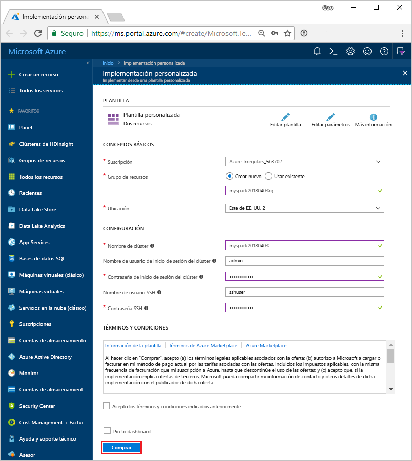
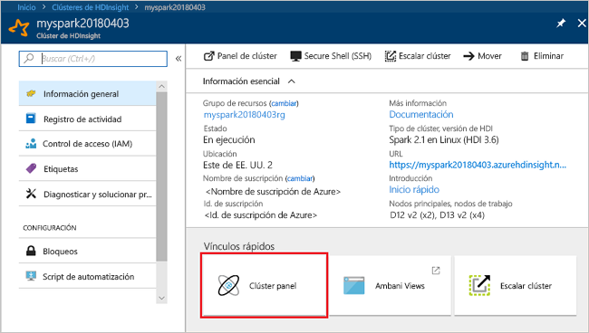
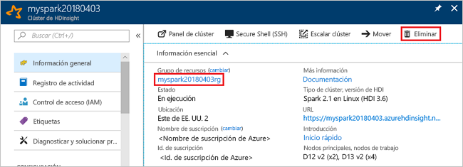

# <a name="quickstart-create-apache-spark-cluster-in-azure-hdinsight-using-resource-manager-template"></a>Inicio rápido: Creación de clústeres de Apache Spark en Azure HDInsight con plantillas de Resource Manager

En este inicio rápido, se usa una plantilla de Azure Resource Manager para crear un clúster de Apache Spark en Azure HDInsight. Luego se crea un cuaderno de Jupyter Notebook y se usa para ejecutar consultas de Spark SQL en tablas de Apache Hive. Azure HDInsight es un servicio administrado, de espectro completo y de análisis de código abierto para empresas. El marco de Apache Spark para HDInsight permite un análisis de datos y un procesamiento de clústeres rápidos mediante el procesamiento en memoria. Jupyter Notebook permite interactuar con los datos, combinar código con texto Markdown y realizar visualizaciones simples.

[Información general: Apache Spark en Azure HDInsight](apache-spark-overview.md) | [Apache Spark](https://spark.apache.org/) | [Apache Hive](https://hive.apache.org/) | [Jupyter Notebook](https://jupyter.org/) | [Plantillas de inicio rápido de Azure](https://azure.microsoft.com/resources/templates/?resourceType=Microsoft.Hdinsight&pageNumber=1&sort=Popular)

## <a name="prerequisites"></a>Prerrequisitos

- Una cuenta de Azure con una suscripción activa. [Cree una cuenta gratuita](https://azure.microsoft.com/free/?ref=microsoft.com&utm_source=microsoft.com&utm_medium=docs&utm_campaign=visualstudio).

## <a name="create-an-apache-spark-cluster"></a>Creación de un clúster de Apache Spark

Cree un clúster de Apache Spark en HDInsight mediante una plantilla de Azure Resource Manager. La plantilla se encuentra en [GitHub](https://azure.microsoft.com/resources/templates/101-hdinsight-spark-linux/). Para las propiedades del clúster y la sintaxis de JSON, consulte [Microsoft.HDInsight/clusters](/azure/templates/microsoft.hdinsight/clusters).

El clúster usa Azure Storage Blob como almacenamiento de clústeres. Para más información sobre el uso de Data Lake Storage Gen2, consulte [Guía de inicio rápido: Configuración de clústeres en HDInsight](../../storage/data-lake-storage/quickstart-create-connect-hdi-cluster.md).

> [!IMPORTANT]  
> La facturación de los clústeres de HDInsight se prorratea por minuto, tanto si se usan como si no. Por consiguiente, es aconsejable eliminar el clúster al terminar de usarlo. Para obtener más información, consulte la sección [Limpieza de recursos](#clean-up-resources) de este artículo.

1. Seleccione el vínculo siguiente para abrir la plantilla en Azure Portal en una nueva pestaña del explorador:

    <a href="https://portal.azure.com/#create/Microsoft.Template/uri/https%3A%2F%2Fraw.githubusercontent.com%2FAzure%2Fazure-quickstart-templates%2Fmaster%2F101-hdinsight-spark-linux%2Fazuredeploy.json" target="_blank">Implementación en Azure</a>

2. Escriba los siguientes valores:

    | Propiedad | Value |
    |---|---|
    |**Suscripción**|Seleccione la suscripción de Azure que se usará para crear este clúster. La suscripción que se usa en esta guía de inicio rápido es **&lt;nombre de suscripción de Azure>** . |
    | **Grupos de recursos**|Cree un grupo de recursos o seleccione uno existente. El grupo de recursos se usa para administrar los recursos de Azure para sus proyectos. El nuevo nombre del grupo de recursos usado para esta guía de inicio rápido es **myspark20180403rg**.|
    | **Ubicación**|Seleccione una ubicación para el grupo de recursos. La plantilla utiliza esta ubicación para crear el clúster, así como para el almacenamiento de clúster predeterminado. La ubicación usada para esta guía de inicio rápido es **Este de EE. UU. 2**.|
    | **ClusterName**|Escriba un nombre para el clúster que desea crear. El nombre del nuevo clúster usado para esta guía de inicio rápido es **myspark20180403**.|
    | **Nombre de inicio de sesión y contraseña del clúster**|El nombre de inicio de sesión predeterminado es admin. Elija una contraseña el inicio de sesión del clúster. El nombre de inicio de sesión utilizado para esta guía de inicio rápido es **admin**.|
    | **Nombre de usuario y contraseña de SSH**|Elija una contraseña para el usuario de SSH. El nombre de usuario de SSH utilizado para esta guía de inicio rápido es **admin**.|

    

3. Seleccione **Acepto los términos y condiciones indicados anteriormente** y **Anclar al panel** y, a continuación, seleccione **Comprar**. Verá un icono nuevo llamado **Deploying Template deployment** (Implementación de Template Deployment). La creación del clúster tarda aproximadamente 20 minutos. El clúster debe crearse para poder pasar a la siguiente sesión.

Si surge algún problema al crear clústeres de HDInsight, podría deberse a que no tiene los permisos adecuados para hacerlo. Para más información, consulte [Requisitos de control de acceso](../hdinsight-hadoop-create-linux-clusters-portal.md).

## <a name="install-intellijeclipse-for-spark-applications"></a>Instalación de IntelliJ/Eclipse para aplicaciones Spark

Use el complemento Azure Toolkit for IntelliJ/Eclipse para desarrollar aplicaciones Spark escritas en [Scala](https://www.scala-lang.org/) y enviarlas a continuación a un clúster de Azure HDInsight directamente desde el entorno de desarrollo integrado (IDE) de IntelliJ/Eclipse. Para más información, consulte [Uso de IntelliJ para crear y enviar una aplicación Spark](./apache-spark-intellij-tool-plugin.md) y [Uso de Eclipse para crear y enviar una aplicación Spark](./apache-spark-eclipse-tool-plugin.md).

## <a name="install-vscode-for-pysparkhive-applications"></a>Instalación de VSCode para aplicaciones PySpark o Hive

Aprenda a usar las Herramientas de Azure HDInsight para Visual Studio Code (VS Code) para crear y enviar trabajos por lotes de Hive, consultas interactivas de Hive, lotes de PySpark y scripts interactivos de PySpark. Las herramientas de Azure HDInsight se pueden instalar en las plataformas compatibles con VSCode. Entre ellas se incluyen Windows, Linux y macOS. Para más información, consulte [Uso de VSCode para crear y enviar una aplicación PySpark](../hdinsight-for-vscode.md).

## <a name="create-a-jupyter-notebook"></a>Creación de un cuaderno de Jupyter

[Jupyter Notebook](https://jupyter.org/) es un entorno de cuaderno interactivo que admite varios lenguajes de programación. El cuaderno le permite interactuar con los datos, combinar código con el texto de Markdown y realizar visualizaciones simples.

1. Abra [Azure Portal](https://portal.azure.com).

2. Seleccione **Clústeres de HDInsight** y, a continuación, seleccione el clúster que creó.

    

3. En el portal, en la sección **Paneles de clúster**, seleccione **Jupyter Notebook**. Cuando se le solicite, escriba las credenciales de inicio de sesión del clúster.

   

4. Seleccione **Nuevo** > **PySpark** para crear un cuaderno.

   

   Se crea y se abre un nuevo cuaderno con el nombre Untitled(Untitled.pynb).

## <a name="run-apache-spark-sql-statements"></a>Ejecución de instrucciones de Apache Spark SQL

SQL (Lenguaje de consulta estructurado) es el lenguaje más común y ampliamente usado para la consulta y la transformación de datos. Spark SQL funciona como una extensión de Apache Spark para procesar datos estructurados, mediante la conocida sintaxis de SQL.

1. Compruebe que el kernel esté preparado. El kernel está preparado cuando aparece un círculo vacío junto al nombre del kernel en el cuaderno. Un círculo sólido indica que el kernel está ocupado.

    

    Al iniciar el cuaderno por primera vez, el kernel realiza tareas en segundo plano. Espere a que el kernel esté preparado.
1. Pegue el código siguiente en una celda vacía y presione **MAYÚS + ENTRAR** para ejecutar el código. El comando muestra las tablas Hive del clúster:

    ```sql
    %%sql
    SHOW TABLES
    ```

    Cuando se usa un cuaderno de Jupyter Notebook con un clúster de HDInsight, se obtiene una sesión de `spark` preestablecida que puede usar para ejecutar consultas de Hive mediante Spark SQL. `%%sql` indica a Jupyter Notebook que use la sesión `spark` preestablecida para ejecutar la consulta de Hive. La consulta recupera las 10 primeras filas de una tabla de Hive (**hivesampletable**) que se incluye de forma predeterminada en todos los clústeres de HDInsight. La primera vez que se envíe la consulta, Jupyter creará una aplicación de Spark para el cuaderno. La operación tarda unos 30 segundos en completarse. Cuando la aplicación de Spark está preparada, la consulta se ejecuta aproximadamente en un segundo y genera los resultados. El resultado tendrá una apariencia similar a la siguiente:

    

    Cada vez que se ejecuta una consulta en Jupyter, el título de la ventana del explorador web muestra el estado **(Busy)** (Ocupado) junto con el título del cuaderno. También verá un círculo sólido junto al texto **PySpark** en la esquina superior derecha.

1. Ejecute otra consulta para ver los datos en `hivesampletable`.

    ```sql
    %%sql
    SELECT * FROM hivesampletable LIMIT 10
    ```

    Debe actualizar la pantalla para mostrar la salida de la consulta.

    

1. En el menú **File** (Archivo) del cuaderno, seleccione **Close and Halt** (Cerrar y detener). Al cerrar el cuaderno se liberan los recursos del clúster, lo que incluye la aplicación de Spark.

## <a name="clean-up-resources"></a>Limpieza de recursos

HDInsight guarda los datos y los cuadernos de Jupyter en Azure Storage o Azure Data Lake Store, por lo que puede eliminar de manera segura un clúster si no se usa. También se le cobrará por un clúster de HDInsight aunque no se esté usando. Como en muchas ocasiones los cargos por el clúster son mucho más elevados que los cargos por el almacenamiento, desde el punto de vista económico tiene sentido eliminar clústeres cuando no se estén usando. Si tiene previsto pasar inmediatamente al tutorial de [Pasos siguientes](#next-steps), es aconsejable que no elimine el clúster.

Vuelva a Azure Portal y seleccione **Eliminar**.



También puede seleccionar el nombre del grupo de recursos para abrir la página del grupo de recursos y, a continuación, seleccionar **Eliminar grupo de recursos**. Al eliminar el grupo de recursos, se eliminan tanto el clúster de HDInsight como la cuenta de almacenamiento predeterminada.

## <a name="next-steps"></a>Pasos siguientes

En este inicio rápido, ha aprendido a crear un clúster de Apache Spark en HDInsight y a ejecutar una consulta básica de Spark SQL. Pase al siguiente tutorial, donde aprenderá a usar un clúster de HDInsight para ejecutar consultas interactivas en datos de ejemplo.

> [!div class="nextstepaction"]
>[Ejecución de consultas interactivas en Apache Spark](./apache-spark-load-data-run-query.md)
