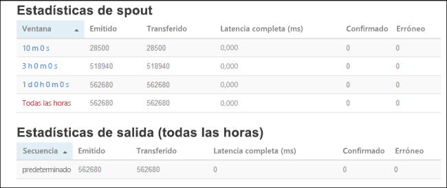

# <a name="quickstart-create-and-monitor-an-apache-storm-topology-in-azure-hdinsight"></a>Inicio rápido: Creación y supervisión de una topología de Apache Storm en Azure HDInsight

Apache Storm es un sistema de cálculo distribuido, escalable, con tolerancia a errores y en tiempo real para el procesamiento de secuencias de datos. Con Storm en HDInsight de Azure, puede crear un clúster de Storm basado en la nube que realice análisis en tiempo real de grandes cantidades de datos en tiempo real.

En esta guía de inicio rápido, usará un ejemplo del proyecto [storm-starter](https://github.com/apache/storm/tree/v2.0.0/examples/storm-starter) de Apache para crear y supervisar una topología de Apache Storm en un clúster de Apache Storm existente.

## <a name="prerequisites"></a>Requisitos previos

* Un clúster de Apache Storm en HDInsight. Consulte el artículo sobre la [Creación de clústeres de Apache Hadoop mediante Azure Portal](../hdinsight-hadoop-create-linux-clusters-portal.md) y seleccione **Storm** como **Tipo de clúster**.

* Un cliente SSH. Para más información, consulte [Conexión a través de SSH con HDInsight (Apache Hadoop)](../hdinsight-hadoop-linux-use-ssh-unix.md).

## <a name="create-the-topology"></a>Creación de la topología

1. Conéctese a su clúster de Storm. Modifique el comando siguiente: reemplace `CLUSTERNAME` por el nombre del clúster de Storm y, luego, escriba el comando:

    ```cmd
    ssh sshuser@CLUSTERNAME-ssh.azurehdinsight.net
    ```

2. El ejemplo de **WordCount** se incluye en su clúster de HDInsight en `/usr/hdp/current/storm-client/contrib/storm-starter/`. La topología genera frases aleatorias y cuenta cuántas veces aparecen las palabras. Use el siguiente comando para iniciar la topología **wordcount** en el clúster:

    ```bash
    storm jar /usr/hdp/current/storm-client/contrib/storm-starter/storm-starter-topologies-*.jar org.apache.storm.starter.WordCountTopology wordcount
    ```

## <a name="monitor-the-topology"></a>Supervisión de la topología

Storm ofrece una interfaz web para trabajar con topologías en ejecución y se incluye en el clúster de HDInsight.

Siga estos pasos para supervisar la topología mediante la interfaz de usuario de Storm:

1. Para mostrar la interfaz de usuario de Storm, abra `https://CLUSTERNAME.azurehdinsight.net/stormui` en el explorador web. Reemplace `CLUSTERNAME` por el nombre del clúster.

2. En **Topology Summary** (Resumen de la topología), seleccione la entrada **wordcount** de la columna **Nombre**. Se muestra información sobre la topología.

    

    En esta nueva página se ofrece la siguiente información:

    |Propiedad | DESCRIPCIÓN |
    |---|---|
    |Estadísticas de topología|Información básica sobre el rendimiento de la topología, organizada en ventanas de tiempo. Al seleccionar una ventana de tiempo específica, se cambia la ventana de tiempo de la información que aparece en otras secciones de la página.|
    |Spouts|Información básica sobre spouts, entre la que se incluye el último error que ha devuelto cada spout.|
    |Bolts|Información básica sobre bolts.|
    |Configuración de la topología|Información detallada sobre la configuración de la topología.|
    |Activar|reanuda el procesamiento de una topología desactivada.|
    |Desactivación|pausa una topología en ejecución.|
    |Reequilibrar|ajusta el paralelismo de la topología. Debe volver a equilibrar las topologías en ejecución después de haber cambiado el número de nodos del clúster. De esta forma, la topología ajusta el paralelismo para compensar el mayor o menor número de nodos del clúster. Para más información, consulte la entrada de blog [Understanding the parallelism of an Apache Storm topology](https://storm.apache.org/documentation/Understanding-the-parallelism-of-a-Storm-topology.html) (Entender el paralelismo de una topología de Apache Storm).|
    |Terminar|finaliza una topología de Storm tras el tiempo de espera especificado.|

3. En esta página, seleccione una entrada en la sección **Spouts** o **Bolts**. Se muestra información sobre el componente seleccionado.

    

    En la nueva página se muestra la siguiente información:

    |Propiedad | DESCRIPCIÓN |
    |---|---|
    |Estadísticas de spouts/bolts|Información básica sobre el rendimiento de los componentes, organizada en ventanas de tiempo. Al seleccionar una ventana de tiempo específica, se cambia la ventana de tiempo de la información que aparece en otras secciones de la página.|
    |Estadísticas de entrada (solo bolt)|Información sobre los componentes que generan los datos que consume el bolt.|
    |Estadísticas de salida|Información sobre los datos que emite este bolt.|
    |Ejecutores|Información sobre las instancias de este componente.|
    |Errors|Errores que ha generado este componente.|

4. Al ver los detalles de un spout o bolt, seleccione una entrada de la columna **Puerto** en la sección **Ejecutores** para ver los detalles de una instancia específica del componente.

        2015-01-27 14:18:02 b.s.d.task [INFO] Emitting: split default ["with"]
        2015-01-27 14:18:02 b.s.d.task [INFO] Emitting: split default ["nature"]
        2015-01-27 14:18:02 b.s.d.executor [INFO] Processing received message source: split:21, stream: default, id: {}, [snow]
        2015-01-27 14:18:02 b.s.d.task [INFO] Emitting: count default [snow, 747293]
        2015-01-27 14:18:02 b.s.d.executor [INFO] Processing received message source: split:21, stream: default, id: {}, [white]
        2015-01-27 14:18:02 b.s.d.task [INFO] Emitting: count default [white, 747293]
        2015-01-27 14:18:02 b.s.d.executor [INFO] Processing received message source: split:21, stream: default, id: {}, [seven]
        2015-01-27 14:18:02 b.s.d.task [INFO] Emitting: count default [seven, 1493957]

    En este ejemplo, la palabra **seven** se ha producido 1493957 veces. Este es el número de veces que se ha encontrado la palabra desde que se iniciara esta topología.

## <a name="stop-the-topology"></a>Detención de la topología

Vuelva a la página **Resumen de la topología** de la topología de recuento de palabras y seleccione el botón **Eliminar** de la sección **Acciones de topología**. Cuando se le solicite, escriba 10 como los segundos de espera antes de detener la topología. Tras el período de tiempo de espera, ya no aparece la topología cuando visita la sección **IU de Storm** del panel.

## <a name="clean-up-resources"></a>Limpieza de recursos

Después de completar el inicio rápido, puede ser conveniente eliminar el clúster. Con HDInsight, los datos se almacenan en Azure Storage, por lo que puede eliminar un clúster de forma segura cuando no se esté usando. También se le cobrará por un clúster de HDInsight aunque no se esté usando. Como en muchas ocasiones los cargos por el clúster son mucho más elevados que los cargos por el almacenamiento, desde el punto de vista económico tiene sentido eliminar clústeres cuando no se estén usando.

Para eliminar un clúster, consulte [Eliminación de un clúster de HDInsight con el explorador, PowerShell o la CLI de Azure](../hdinsight-delete-cluster.md).

## <a name="next-steps"></a>Pasos siguientes

En esta guía de inicio rápido, usó un ejemplo del proyecto [storm-starter](https://github.com/apache/storm/tree/v2.0.0/examples/storm-starter) de Apache para crear y supervisar una topología de Apache Storm en un clúster de Apache Storm existente. Avance hasta el siguiente artículo para obtener información sobre los conceptos básicos de la administración y supervisión de topologías de Apache Storm.

> [!div class="nextstepaction"]
>[Implementación y administración de topologías de Apache Storm en Azure HDInsight](./apache-storm-deploy-monitor-topology-linux.md)