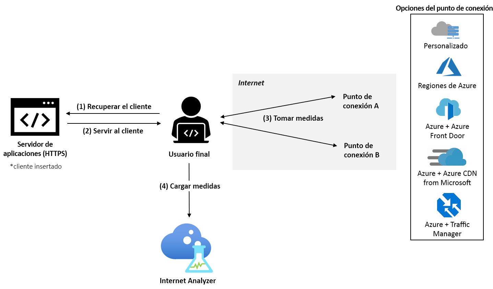

# ¿Qué es Azure Internet Analyzer? (versión preliminar)

Internet Analyzer es una plataforma de medición que se encuentra en el cliente y con la que se puede probar cómo afectan los cambios en la infraestructura de red al rendimiento de los clientes. Tanto si va a migrar del entorno local a Azure como si va a evaluar un nuevo servicio de Azure, Internet Analyzer le permite obtener información a partir de los datos de sus usuarios y la completa funcionalidad de análisis de Microsoft para comprender mejor y optimizar su arquitectura de red con Azure, antes de llevar a cabo la migración.

Internet Analyzer usa un pequeño cliente de JavaScript insertado en su aplicación web para medir la latencia entre los usuarios finales y el conjunto seleccionado de destinos de red, a los que llamamos _puntos de conexión_. Internet Analyzer permite configurar varias pruebas en paralelo, lo que permite evaluar distintos tipos de escenarios a medida que evolucionan las necesidades de la infraestructura y del cliente. Internet Analyzer proporciona puntos de conexión preconfigurados y personalizados, lo que ofrece la comodidad y flexibilidad necesarias para tomar buenas decisiones acerca del rendimiento para los usuarios finales. 

> [!IMPORTANT]
> Esta versión preliminar pública se proporciona sin un acuerdo de nivel de servicio y no debe usarse para cargas de trabajo de producción. Puede que algunas características no se admitan, que tengan funcionalidades limitadas o que no estén disponibles en todas las ubicaciones de Azure. Para más información, consulte [Términos de uso complementarios de las versiones preliminares de Microsoft Azure](https://azure.microsoft.com/support/legal/preview-supplemental-terms/).
>

## Pruebas rápidas y personalizables

Internet Analyzer aborda las preguntas relacionadas con el rendimiento en la migración a la nube, la implementación en una región nueva de Azure o en regiones adicionales, o la prueba de nuevas plataformas de aplicaciones y entrega de contenido en Azure, como [Azure Front Door](https://azure.microsoft.com/services/frontdoor/) y [Microsoft Azure CDN](https://azure.microsoft.com/services/cdn/). 

Las pruebas que se crean en Internet Analyzer constan de dos puntos de conexión: el punto de conexión A y el punto de conexión B, y se analiza el rendimiento de este último en relación con el primero. 

Puede configurar su propio punto de conexión personalizado o seleccionar uno de los preconfigurados. Los puntos de conexión personalizados deben usarse para evaluar las cargas de trabajo locales, sus instancias en otros proveedores en la nube o sus configuraciones personalizadas de Azure. Las pruebas pueden constar de dos puntos de conexión personalizados, pero al menos uno de ellos debe estar hospedado en Azure. Los puntos de conexión preconfigurados de Azure son una forma rápida y sencilla de evaluar el rendimiento de las plataformas de red de Azure más conocidas, como Azure Front Door, Azure Traffic Manager y Azure CDN. 

Durante la versión preliminar están disponibles los siguientes puntos de conexión preconfigurados: 

* **Regiones de Azure**
    * Sur de Brasil
    * Centro de la India
    * Centro de EE. UU.
    * Asia oriental
    * Este de EE. UU.
    * Japón Occidental
    * Norte de Europa
    * Norte de Sudáfrica
    * Sudeste asiático 
    * Norte de Emiratos Árabes Unidos
    * Oeste de Reino Unido  
    * Oeste de Europa
    * Oeste de EE. UU. 
    * Oeste de EE. UU. 2
* **Varias combinaciones de regiones de Azure** 
    * Este de EE. UU., Sur de Brasil 
    * Este de EE. UU., Asia Oriental 
    * Oeste de Europa, Sur de Brasil
    * Oeste de Europa, Sudeste Asiático
    * Oeste de Europa, Norte de Emiratos Árabes Unidos
    * Oeste de EE. UU., Este de EE. UU. 
    * Oeste de EE. UU., Oeste de Europa
    * Oeste de EE. UU., Norte de Emiratos Árabes Unidos
    * Oeste de Europa, Norte de Emiratos Árabes Unidos, Sudeste Asiático
    * Oeste de EE. UU., Oeste de Europa, Asia Oriental
    * Oeste de EE. UU., Norte de Europa, Sudeste Asiático, Norte de Emiratos Árabes Unidos, Norte de Sudáfrica 
* **Azure + Azure Front Door**: implementados en una o varias de las combinaciones de regiones de Azure de la lista anterior.
* **Azure + Azure CDN de Microsoft**: implementados en una o varias de las combinaciones de regiones de Azure de la lista anterior.
* **Azure + Azure Traffic Manager**: implementados en cualquier combinación de varias de las regiones de Azure de la lista anterior.

## Escenarios de prueba que se sugieren 

Para ayudarle a tomar decisiones para mejorar el rendimiento de sus clientes, Internet Analyzer le permite evaluar dos puntos de conexión para su población específica de usuarios finales. 

Aunque Internet Analyzer puede responder a muchas preguntas, algunas de las más habituales son: 
* ¿Cuál es el impacto, en cuanto a rendimiento, de la migración a la nube? 
    * *Prueba sugerida: personalizado (la infraestructura local actual) frente a Azure (cualquier punto de conexión preconfigurado)*
* ¿Qué valor aporta poner los datos en el borde, en lugar de hacerlo en un centro de datos? 
    *  *Prueba sugerida: Azure frente a Azure Front Door, Azure frente a Azure CDN de Microsoft*
* ¿Cuál es el beneficio, en cuanto a rendimiento, de usar Azure Front Door?
    *  *Prueba sugerida: personalizado/Azure/CDN frente a Azure Front Door*
* ¿Cuál es el beneficio, en cuanto a rendimiento, de usar Azure CDN de Microsoft? 
    *  *Prueba sugerida: personalizado/Azure/AFD frente a Azure CDN de Microsoft*
* ¿Cómo funciona Azure CDN de Microsoft? 
    *  *Prueba sugerida: personalizado (otro punto de conexión de CDN) frente a Azure CDN de Microsoft*
* ¿Cuál es la mejor nube para su población de usuarios finales en cada región? 
    *  *Prueba sugerida: personalizado (otro servicio en la nube) frente a Azure (cualquier punto de conexión preconfigurado)*

## Cómo funciona

Para usar Internet Analyzer, configure un recurso de Internet Analyzer en Microsoft Azure Portal e instale el pequeño cliente de JavaScript en la aplicación. El cliente mide la latencia entre los usuarios finales y los puntos de conexión seleccionados, para lo cual descarga una imagen de un píxel a través de HTTPS. Después de recopilar las medidas de latencia, el cliente envía los datos a Internet Analyzer.

Cuando un usuario visita la aplicación web, el cliente de JavaScript selecciona dos puntos de conexión para realizar la medición en todas las pruebas configuradas. En cada uno de ellos, el cliente realiza una medición _en frío_ y otra _en caliente_. La primera de ellas tiene una latencia adicional, además de la latencia _pura_ de la red entre el usuario y el punto de conexión, como la resolución DNS, el protocolo de enlace de la conexión TCP y la negociación SSL/TLS. La segunda se realiza inmediatamente después de que finaliza la primera y aprovecha la administración de conexiones TCP persistente de los exploradores modernos para obtener una medida precisa de la latencia de un extremo a otro. Si el explorador del usuario lo admite, se utiliza la API de control de tiempo de recursos de W3C para realizar un control preciso del tiempo de las mediciones. Actualmente, para los análisis solo se usan las medidas de latencia en caliente.

## Cuadros de mandos 

Una vez que se inicia una prueba, los datos de telemetría se pueden ver en el recurso de Internet Analyzer en la pestaña Scorecard (Cuadro de mandos). Estos datos siempre son agregados. Use los siguientes filtros para cambiar la vista de los datos: 

* **Prueba:** seleccione la prueba cuyos resultados desea ver. Los datos de prueba aparecen cuando haya datos suficientes para completar el análisis (en la mayoría de los casos, tardarán menos de 24 horas). 
* **Período de tiempo y fecha de finalización:** Internet Analyzer genera tres cuadros de mandos cada día y cada uno de ellos refleja un período de agregación diferente: las 24 horas anteriores (día), los siete días anteriores (semana) y los 30 días anteriores (mes). Use el filtro "End Date" (Fecha de finalización) para seleccionar el período que desee ver. 
* **País:** utilice este filtro para ver los datos específicos de los usuarios finales que residen en un país. El filtro global muestra los datos de todas las zonas geográficas.  

En la página de [interpretación del cuadro de mandos](internet-analyzer-scorecard.md) encontrará más información sobre los cuadros de mandos. 

## Pasos siguientes

* Aprenda a [crear su primer recurso de Internet Analyzer](internet-analyzer-create-test-portal.md).
* Consulte las [preguntas frecuentes sobre Internet Analyzer](internet-analyzer-faq.md). 
