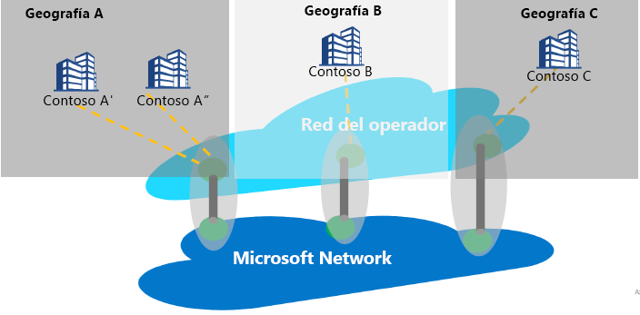

# Emparejamiento de Internet frente a Peering Service

El emparejamiento de Internet hace referencia a cualquier interconexión entre la red global de Microsoft (AS8075) y la red de los operadores o los proveedores de servicios. Un proveedor de servicios puede convertirse en un asociado de Peering Service si implementa los requisitos de asociación de Peering Service que se explican a continuación para proporcionar conectividad pública confiable y de alto rendimiento con un enrutamiento óptimo del cliente a la red de Microsoft.

## Acerca de Peering Service
Peering Service es un programa de asociación con proveedores de servicios clave para proporcionar la mejor conectividad pública de Internet a los usuarios empresariales. Los asociados que forman parte del programa tendrán conexiones directas con redundancia geográfica, alta disponibilidad y enrutamiento optimizado a Microsoft. Peering Service es una adición a la cartera de conectividad de Microsoft:
*   ExpressRoute para la conectividad privada con los recursos de IaaS o PaaS (compatibilidad con el espacio de IP privado)
    *   Conectividad basada en asociados
    *   Conectividad directa de 100G con Microsoft
*   IPSEC a través de Internet para la conectividad VPN con la nube
*   Conectividad SD-WAN con Azure mediante Virtual WAN

El segmento de destino de Peering Service es la conectividad de SaaS, los clientes de SD-WAN que desean realizar el desglose de Internet por sucursales y los clientes que tienen un MPLS de estrategia dual y una red de Internet de nivel empresarial.

El objetivo principal a la hora de conectarse a la nube de Microsoft debe ser minimizar la latencia reduciendo el tiempo de ida y vuelta (RTT) de un sitio del usuario a la red global de Microsoft, que es la red troncal pública de Microsoft que conecta todos los centros de datos de Microsoft y varios puntos de entrada de aplicaciones en la nube. Consulte [Obtención de la mejor conectividad y rendimiento en Office 365](https://techcommunity.microsoft.com/t5/Office-365-Blog/Getting-the-best-connectivity-and-performance-in-Office-365/ba-p/124694).

> [!div class="mx-imgBorder"]
> 

En la ilustración anterior, cada sucursal de una empresa global se conecta a la ubicación de Microsoft Edge más cercana posible mediante la red del asociado.

**Ventajas para el cliente de Peering Service:**
* El mejor enrutamiento público a través de Internet hacia Microsoft Cloud Services para conseguir un rendimiento y una confiabilidad óptimos.
* Posibilidad de seleccionar el proveedor de servicios que prefiera para conectarse a la nube de Microsoft.
* Información sobre el tráfico como, por ejemplo, notificaciones sobre la latencia y supervisión de prefijos.
* Saltos de red óptimos (saltos AS) desde la nube de Microsoft.
* Análisis y estadísticas de rutas: eventos de anomalías (detección de fugas y secuestros) de enrutamiento del Protocolo de puerta de enlace de borde ([BGP](https://en.wikipedia.org/wiki/Border_Gateway_Protocol)) y enrutamiento no óptimo.

## Requisitos de asociación de Peering Service
* Conectividad con la nube de Microsoft en la ubicación más cercana al cliente. Un proveedor de servicios asociado enrutará el tráfico de usuario a la red perimetral de Microsoft más cercana al usuario. Del mismo modo, en el tráfico hacia el usuario, Microsoft enrutará el tráfico (mediante la etiqueta BGP) a la ubicación perimetral más cercana al usuario y el proveedor de servicio enviará el tráfico al usuario.
* El asociado mantendrá una conectividad de alta disponibilidad, alto rendimiento y redundancia geográfica con la red global de Microsoft.
* El asociado puede utilizar el emparejamiento existente para admitir Peering Service si este cumple los requisitos.

## Preguntas más frecuentes
Para ver las preguntas más frecuentes, consulte [Preguntas más frecuentes sobre Peering Service](service-faqs.md).

## Pasos siguientes

* Obtenga más información sobre las ventajas del cliente con [Peering Service](https://docs.microsoft.com/azure/peering-service/).
* Obtenga información sobre los pasos para habilitar un emparejamiento directo para Peering Service en [Tutorial para asociados de Peering Service](walkthrough-peering-service-all.md).
