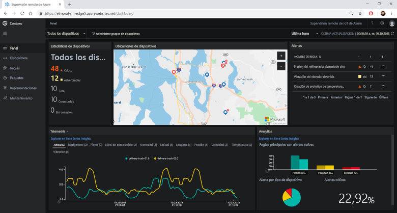
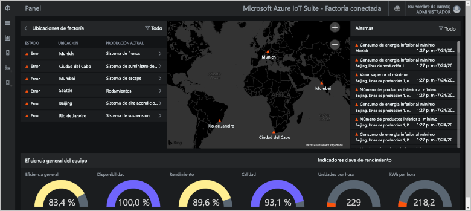
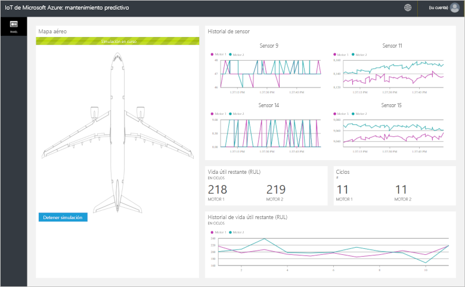
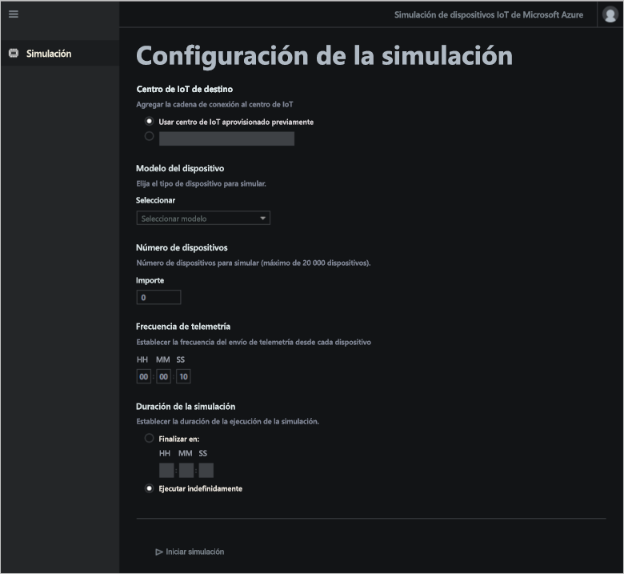

# ¿Qué son los aceleradores de soluciones de Azure IoT?

Una solución IoT basada en la nube normalmente usa código personalizado y servicios en la nube para administrar la conectividad de los dispositivos, el procesamiento y el análisis de los datos y su presentación.

Los aceleradores de soluciones IoT son soluciones IoT completas y listas para implementar escenarios comunes de IoT. Los escenarios incluyen supervisión remota, fábrica conectada, mantenimiento predictivo y simulación de dispositivo. Al implementar un acelerador de soluciones, la implementación incluye todos los servicios basados en la nube necesarios, junto con el código de aplicación requerido.

Los aceleradores de soluciones son puntos de partida para sus propias soluciones de IoT. El código fuente para todos los aceleradores de soluciones es código abierto y está disponible en GitHub. Le recomendamos que descargue y personalice los aceleradores de soluciones para cumplir sus requisitos.

También puede utilizarlos como herramientas de aprendizaje antes de crear una solución de IoT personalizada desde cero. Implementan prácticas probadas para soluciones de IoT basadas en la nube de modo que pueda realizar su seguimiento.

El código de la aplicación de cada acelerador de soluciones incluye una aplicación web que le permite administrar dicho acelerador.

## Escenarios de IoT admitidos

Actualmente, hay cuatro aceleradores de soluciones disponibles para implementar:

### Supervisión remota

Use este acelerador de soluciones para recopilar datos de telemetría procedentes de dispositivos remotos y para controlarlos. Algunos dispositivos de ejemplo serían los sistemas de refrigeración instalados en las instalaciones de los clientes o las válvulas instaladas en estaciones de bombeo remotas.

Puede usar el panel de supervisión remota para ver los datos de telemetría de los dispositivos conectados, aprovisionar nuevos dispositivos o actualizar el firmware de los dispositivos conectados:

### Fábrica conectada

Use este acelerador de soluciones para recopilar datos de telemetría de recursos industriales con una interfaz [OPC Unified Architecture](https://opcfoundation.org/about/opc-technologies/opc-ua/) y para controlarlos. Los recursos industriales podrían incluir estaciones de prueba y ensamblado en una línea de producción de una fábrica.

Puede utilizar el panel de fábrica conectada para supervisar y administrar sus dispositivos industriales:

### Mantenimiento predictivo

Use este acelerador de soluciones para predecir cuándo se espera que un dispositivo remoto sufra un error, de modo que pueda realizar tareas de mantenimiento antes de que se produzca un error en el dispositivo. Este acelerador de soluciones utiliza algoritmos de aprendizaje automático para predecir los errores de la telemetría de los dispositivos. Algunos dispositivos de ejemplo podrían ser los motores de un avión o los ascensores.

Puede utilizar el panel de mantenimiento predictivo para ver el análisis de mantenimiento predictivo:

### Simulación de dispositivo

Use este acelerador de soluciones para ejecutar dispositivos simulados que generan datos de telemetría realistas. Puede utilizar este acelerador de soluciones para probar el comportamiento de los demás aceleradores de soluciones o para probar sus propias soluciones personalizadas de IoT.

Puede usar la aplicación web de simulación de dispositivos para configurar y ejecutar simulaciones:

## Principios de diseño

Todos los aceleradores de soluciones siguen los mismos principios de diseño y objetivos. Están diseñados para ser:

* **Escalables**, lo que le permite conectar y administrar millones de dispositivos conectados.
* **Extensibles**, lo que le permite personalizarlos para satisfacer sus requisitos.
* **Comprensibles**, lo que le permite comprender cómo funcionan y cómo se implementan.
* **Modulares**, lo que le permite intercambiar servicios alternativos.
* **Seguros**, combinando la seguridad de Azure con características de seguridad integradas de dispositivos y de conectividad.

## Arquitecturas y lenguajes

Los aceleradores de soluciones originales se escribieron con .NET usando una arquitectura Model-View-Controller (MVC). Microsoft está actualizando los aceleradores de soluciones con una nueva arquitectura basada en microservicios. En la siguiente tabla se muestra el estado actual de los aceleradores de soluciones con vínculos a los repositorios de GitHub:

| Acelerador de soluciones   | Arquitectura  | Lenguajes     |
| ---------------------- | ------------- | ------------- |
| Supervisión remota      | Microservicios | [Java](https://github.com/Azure/azure-iot-pcs-remote-monitoring-java) y [.NET](https://github.com/Azure/azure-iot-pcs-remote-monitoring-dotnet) |
| Mantenimiento predictivo | MVC           | [.NET](https://github.com/Azure/azure-iot-predictive-maintenance)          |
| Fábrica conectada      | MVC           | [.NET](https://github.com/Azure/azure-iot-connected-factory)          |
| Simulación de dispositivo      | Microservicios | [.NET](https://github.com/Azure/device-simulation-dotnet)          |

Para más información sobre las arquitecturas de microservicios, consulte [.NET Application Architecture](https://www.microsoft.com/net/learn/architecture) (Arquitectura de la aplicación .NET) y [Microservices: An application revolution powered by the cloud](https://azure.microsoft.com/blog/microservices-an-application-revolution-powered-by-the-cloud/) (Microservicios: una revolución de aplicaciones con la tecnología de la nube).

## Opciones de implementación

Puede implementar los aceleradores de soluciones desde el sitio [Aceleradores de soluciones de Microsoft Azure IoT](https://www.azureiotsolutions.com/Accelerators#) o mediante la línea de comandos.

Puede implementar el acelerador de la solución de supervisión remota en las siguientes configuraciones:

* **Estándar:** implementación ampliada de la infraestructura para desarrollar una implementación de producción. Azure Container Service implementa los microservicios en varias máquinas virtuales de Azure. Kubernetes orquesta los contenedores de Docker que hospedan los microservicios individuales.
* **Básica:** versión de menor costo para ver una demostración o probar una implementación. Todos los microservicios se implementan en una máquina virtual de Azure.
* **Local:** implementación de la máquina local para desarrollo y pruebas. Este enfoque implementa los microservicios en un contenedor Docker local y se conecta a IoT Hub, Azure Cosmos DB y los servicios de almacenamiento de Azure en la nube.

El costo que supone ejecutar un acelerador de soluciones es una combinación del [costo de ejecutar los servicios de Azure subyacentes](https://azure.microsoft.com/pricing). Consulte los detalles de los servicios de Azure utilizados al elegir las opciones de implementación.

## Pasos siguientes

Para probar uno de los aceleradores de soluciones de IoT, consulte las siguientes guías de inicio rápido:

* [Prueba de una solución de supervisión remota](quickstart-remote-monitoring-deploy.md)
* [Prueba de una solución de fábrica conectada](quickstart-connected-factory-deploy.md)
* [Prueba de una solución de mantenimiento predictivo](quickstart-predictive-maintenance-deploy.md)
* [Prueba de una solución de simulación de dispositivos](quickstart-device-simulation-deploy.md)
