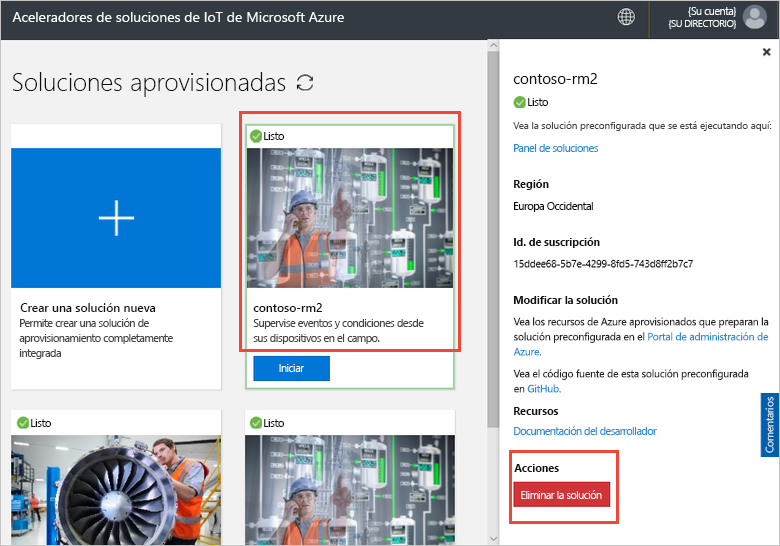

# Conexión del dispositivo IoT DevKit al acelerador de soluciones de supervisión remota

[!INCLUDE [iot-suite-selector-connecting](../../includes/iot-suite-selector-connecting.md)]

En esta guía paso a paso se muestra cómo ejecutar una aplicación de ejemplo en el dispositivo IoT DevKit. El código de ejemplo envía telemetría desde los sensores del dispositivo DevKit al acelerador de soluciones.

[MXChip IoT DevKit](https://aka.ms/iot-devkit) es una placa integral compatible de Arduino con periféricos y sensores varios. Puede desarrollar con [Azure IoT Device Workbench](https://aka.ms/iot-workbench) o el paquete de extensión [Azure IoT Tools](https://aka.ms/azure-iot-tools) en Visual Studio Code. El [catálogo de proyectos](https://microsoft.github.io/azure-iot-developer-kit/docs/projects/) contiene aplicaciones de ejemplo para ayudarlo a crear prototipos de las soluciones de IoT.

## Antes de empezar

Para completar los pasos de este tutorial, deberá realizar las siguientes tareas:

* Prepare su DevKit siguiendo los pasos descritos en [Conexión de IoT DevKit AZ3166 a Azure IoT Hub en la nube](/azure/iot-hub/iot-hub-arduino-iot-devkit-az3166-get-started).

## Abra el proyecto de ejemplo

Para abrir el ejemplo de supervisión remota en VS Code:

1. Asegúrese de que el dispositivo IoT DevKit no esté en su equipo. Primero, inicie VS Code y luego conecte DevKit al equipo.

1. Haga clic en `F1` para abrir la paleta de comandos, escriba y seleccione **Azure IoT Device Workbench: Open Examples...** (Abrir ejemplos...). A continuación, seleccione **IoT DevKit** como placa.

1. Busque **Supervisión remota** y haga clic en **Open Sample** (Abrir ejemplo). Se abre una nueva ventana de VS Code que muestra la carpeta del proyecto:

   

## Configuración del dispositivo

Para configurar la cadena de conexión del dispositivo IoT Hub en el dispositivo DevKit:

1. Cambie el dispositivo IoT DevKit al **modo de configuración**:

    * Mantenga presionado el botón **A**.
    * Presione y suelte el botón de **restablecimiento**.

1. La pantalla muestra el identificador de DevKit y `Configuration`.

    

1. Presione **F1** para abrir la paleta de comandos, escriba y seleccione **Azure IoT Device Workbench: Configurar opciones de dispositivo... > Config Device Connection String (Configurar cadena de conexión de dispositivo)**.

1. Pegue la cadena de conexión que copió anteriormente y presione **ENTRAR** para configurar el dispositivo.

## Compilación del código

Para compilar y cargar el código del dispositivo:

1. Presione `F1` para abrir la paleta de comandos, escriba y seleccione **Azure IoT Device Workbench: Upload Device Code**  (Carga del código de dispositivo):

1. VS Code compila y carga el código en el dispositivo DevKit:

    

1. El dispositivo DevKit se reinicia y ejecuta el código que se cargó.

## Prueba del ejemplo

Para comprobar que la aplicación de ejemplo que cargó en el dispositivo DevKit funciona, complete estos pasos:

### Visualización de los datos de telemetría enviados a la solución de Supervisión remota

Cuando se ejecuta la aplicación de ejemplo, el dispositivo de DevKit envía telemetría desde sus datos de sensores a través de Wi-Fi al acelerador de soluciones. Para ver los datos de telemetría:

1. Vaya al panel de solución y haga clic en **Device Explorer**.

1. Haga clic en el nombre de dispositivo DevKit. En la pestaña de la derecha, puede ver los datos de telemetría del dispositivo DevKit en tiempo real:

    

### Control del dispositivo DevKit

El acelerador de soluciones de supervisión remota le permite controlar el dispositivo de manera remota. El código de ejemplo implementa tres métodos que se pueden ver en el **método** sección cuando se selecciona el dispositivo en el **Device Explorer** página:

Para cambiar el color de una de las luces LED de DevKit, use el método **LedColor**:

1. Seleccione el nombre del dispositivo en la lista de dispositivos y haga clic en **Jobs** (Trabajos):

    

1. Configure los trabajos con los siguientes valores y haga clic en **Aplicar**:

   * Select Job (Seleccione un trabajo): **Método Run**
   * Method name (Nombre de método): **LedColor**
   * Job Name (Nombre del trabajo): **ChangeLedColor**

     

1. Después de un par de segundos, el color de la luz LED RGB (debajo del botón A) en el dispositivo DevKit cambia:

    

## Limpieza de recursos

Si va a pasar a los tutoriales, deje el acelerador de soluciones de supervisión remota implementado.

Si ya no necesita el acelerador de soluciones, elimínelo de la página Soluciones aprovisionadas. Para ello, selecciónelo y, a continuación, haga clic en Eliminar solución:

## Problemas y comentarios

Si tiene problemas, consulte las [preguntas más frecuentes de IoT DevKit](https://microsoft.github.io/azure-iot-developer-kit/docs/faq/) o póngase en contacto con nosotros mediante los siguientes canales:

* [Gitter.im](https://gitter.im/Microsoft/azure-iot-developer-kit)
* [Stack Overflow](https://stackoverflow.com/questions/tagged/iot-devkit)

## Pasos siguientes

Ahora que sabe cómo conectar un dispositivo DevKit al acelerador de soluciones de supervisión remota, le sugerimos estos próximos pasos:

* [Introducción a los aceleradores de la solución de Azure IoT](https://docs.microsoft.com/azure/iot-accelerators/)
* [Personalización de la interfaz de usuario](iot-accelerators-remote-monitoring-customize.md)
* [Conexión de IoT DevKit a una aplicación de Azure IoT Central](../iot-central/howto-connect-devkit.md)