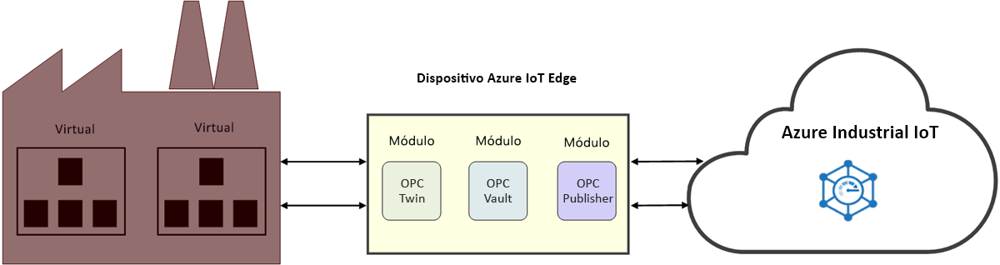

# ¿Qué es IoT industrial (IIoT)?

IIoT es Internet de las cosas industrial. IIoT aplica IoT al sector de fabricación con el objetivo de mejorar la eficiencia industrial. 

## Mejora de la eficiencia industrial

Mejore su productividad y rentabilidad operativas con un acelerador de soluciones de factoría conectada. Conecte y supervise sus equipos y dispositivos industriales en la nube, incluidas sus máquinas que ya funcionan en la planta de producción. Analice sus datos de IoT para obtener conclusiones que le ayuden a aumentar el rendimiento de toda la planta de producción.

Reduzca el laborioso proceso de acceder a las máquinas de la planta de producción con OPC Twin y dedique su tiempo a crear soluciones IIoT. Agilice la administración de certificados y la integración de recursos industriales con OPC Vault y tenga la seguridad de que la conectividad a los recursos está protegida. Estos microservicios proporcionan una API de estilo REST a partir de [componentes de Azure IoT industrial](https://github.com/Azure/azure-iiot-opc-ua). La API de servicio le otorga el control de la funcionalidad del módulo de Edge. 

> [!NOTE]
> Para más información sobre los servicios de Azure IoT industrial, consulte el [repositorio ](https://github.com/Azure/azure-iiot-services) de GitHub.
Si no está familiarizado con cómo funcionan los módulos de Azure IoT Edge, comience con los siguientes artículos:
- [Acerca de Azure IoT Edge](../iot-edge/about-iot-edge.md)
- [Módulos de Azure IoT Edge](../iot-edge/iot-edge-modules.md)

## Fábrica conectada

[Factoría conectada](../iot-accelerators/iot-accelerators-connected-factory-features.md) es una implementación de la arquitectura de referencia de Microsoft Azure IoT industrial que se puede adaptar a necesidades empresariales específicas. La solución es íntegramente de código abierto y está disponible en el repositorio del acelerador de soluciones Factoría conectada de GitHub. Puede usarla como punto de partida para un producto comercial e implementar una solución precompilada en su suscripción de Azure en cuestión de minutos. 

## Conectividad de la planta de producción

OPC Twin es un componente de IIoT que automatiza la detección y el registro de dispositivos, y ofrece el control remoto de los dispositivos industriales mediante API REST. OPC Twin usa Azure IoT Edge e IoT Hub para conectar la nube y la red de la fábrica. OPC Twin permite a los desarrolladores de IIoT centrase en crear aplicaciones de IIoT sin tener que preocuparse de cómo acceder de forma segura a las máquinas del entorno local.

## Seguridad

OPC Vault es una implementación del servidor de detección global (GDS) de OPC UA que puede configurar, registrar y administrar el ciclo de vida de los certificados para aplicaciones cliente y servidor de OPC UA en la nube. OPC Vault simplifica la implementación y el mantenimiento de conectividad segura a los recursos en el espacio industrial. Al automatizar la administración de certificados, OPC Vault libera a los operadores de fábrica de los procesos manuales y complejos asociados con la conectividad y la administración de certificados.

## Pasos siguientes

Después de esta introducción a IoT industrial y sus componentes, este es el siguiente paso sugerido:

> [!div class="nextstepaction"]
> [¿Qué es OPC Twin?](overview-opc-twin.md)
