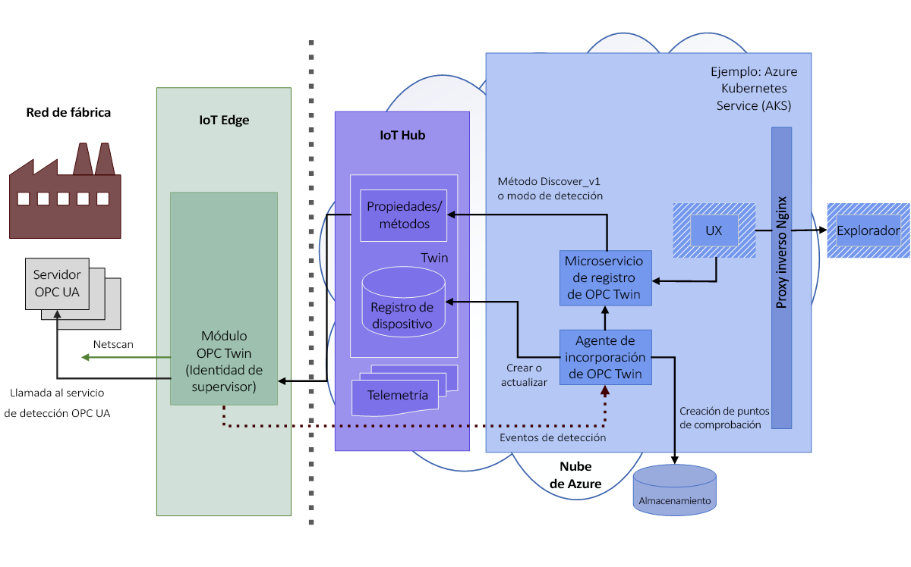
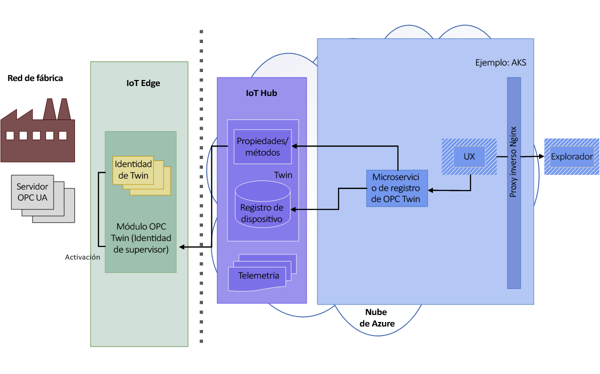
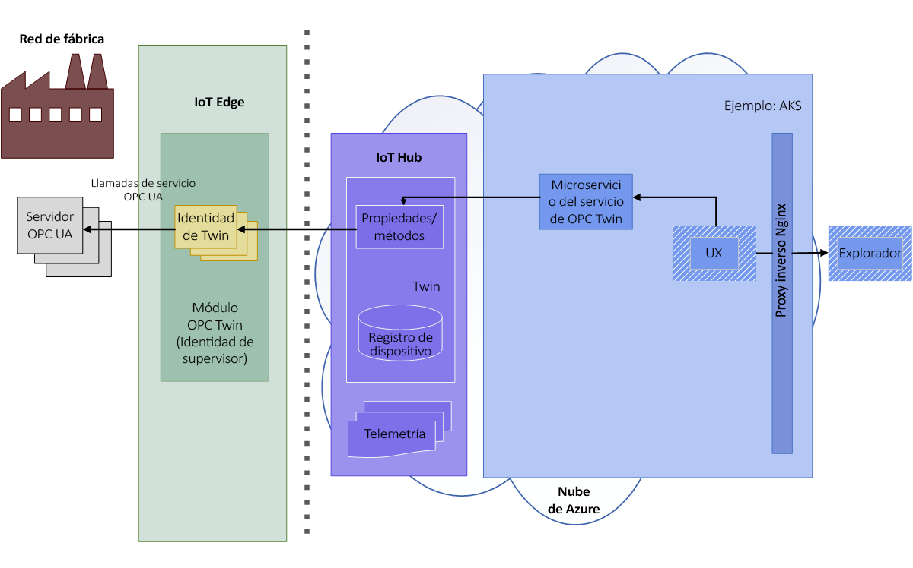
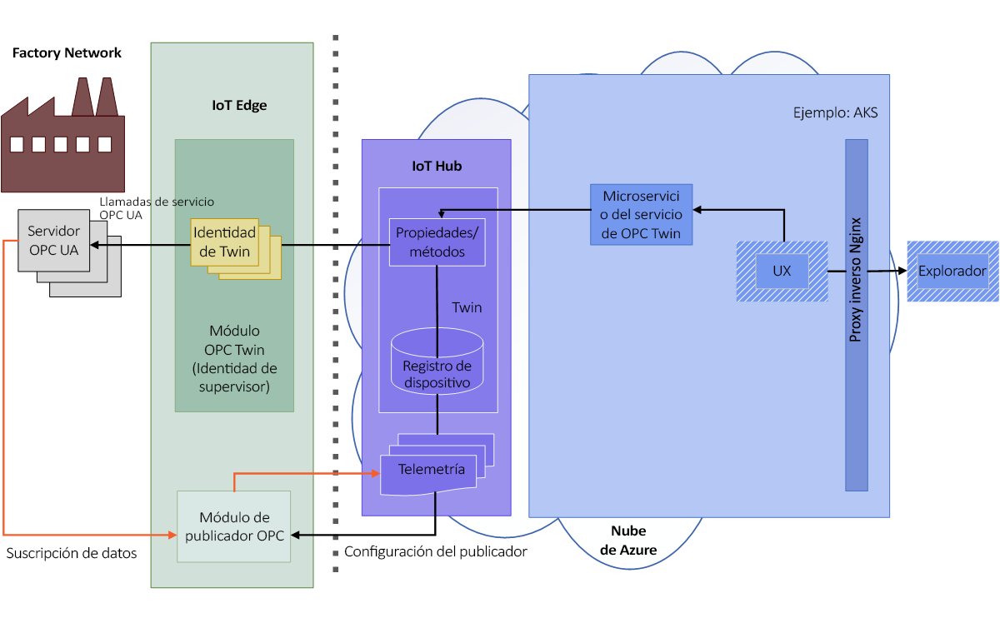

# Arquitectura de OPC Twin

Los siguientes diagramas ilustran la arquitectura de OPC Twin.

## Detección y activación

1. El operador permite el examen de la red en el módulo o crea una detección puntual mediante una dirección URL de detección. Los puntos de conexión detectados y la información de la aplicación se envían mediante telemetría al agente de incorporación para su procesamiento.  El agente de incorporación de dispositivos OPC UA procesa los eventos de detección de servidores OPC UA enviados por el módulo de IoT Edge de OPC Twin cuando se encuentra en modo de examen o detección. Los eventos de detección dan lugar al registro de aplicaciones y a actualizaciones del registro de dispositivos OPC UA.

   

1. El operador inspecciona el certificado del punto de conexión detectado y activa el punto de conexión gemelo registrado para proporcionar acceso. 

   

## Examen y supervisión

1. Una vez activado, el operador puede usar la API REST del servicio Twin para examinar o inspeccionar el modelo de información de servidor, leer o escribir variables de objeto y llamar a métodos.  El usuario emplea una API de OPC UA simplificada expresada totalmente en HTTP y JSON.

   

1. La interfaz REST del servicio Twin también puede usarse para crear suscripciones y elementos supervisados en OPC Publisher. OPC Publisher permite el envío de telemetría desde sistemas de servidor de OPC UA hasta IoT Hub. Para más información sobre OPC Publisher, consulte [What is OPC Publisher](overview-opc-publisher.md) (¿Qué es OPC Publisher?).

   
