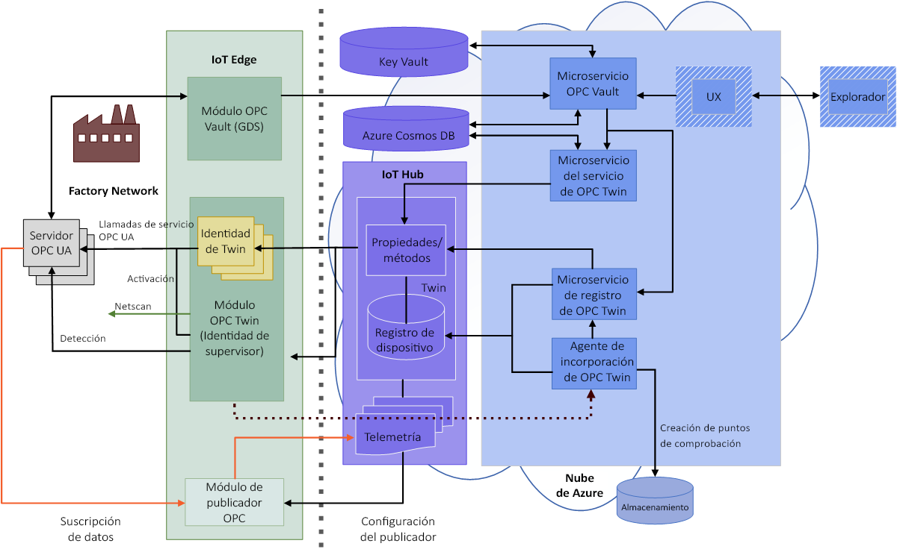

# ¿Qué es OPC Vault?

OPC Vault es un microservicio que puede configurar, registrar y administrar el ciclo de vida de los certificados para aplicaciones cliente y servidor de OPC UA en la nube. En este artículo se describen los casos de uso sencillos de OPC Vault.

## Administración de certificados

Por ejemplo, una empresa de fabricación debe conectar su máquina servidor de OPC UA a su aplicación cliente recién creada. Cuando el fabricante crea el acceso inicial de la máquina servidor, se muestra inmediatamente un mensaje de error en la aplicación servidor de OPC UA para indicar que la aplicación cliente no es segura. Este mecanismo se incorpora en la máquina servidor de OPC UA para evitar el acceso no autorizado a las aplicaciones, y así impedir la piratería feroz en la planta.

## Administración de la seguridad de aplicaciones
Un profesional de seguridad usa el microservicio OPC Vault para permitir que el servidor OPC UA se comunique fácilmente con cualquier aplicación cliente, porque OPC Vault tiene todas las funciones para el registro, el almacenamiento y la administración del ciclo de vida de los certificados. Ahora que el servidor de OPC UA está conectado de forma segura, se puede comunicar con la aplicación cliente recién creada.

## La arquitectura completa de OPC Vault
El siguiente diagrama ilustra la arquitectura completa de OPC Vault.

## Pasos siguientes

Ahora que ha aprendido sobre OPC Vault y sus usos, este es el siguiente paso sugerido:

> [!div class="nextstepaction"]
> [Arquitectura de OPC Vault](overview-opc-vault-architecture.md)
