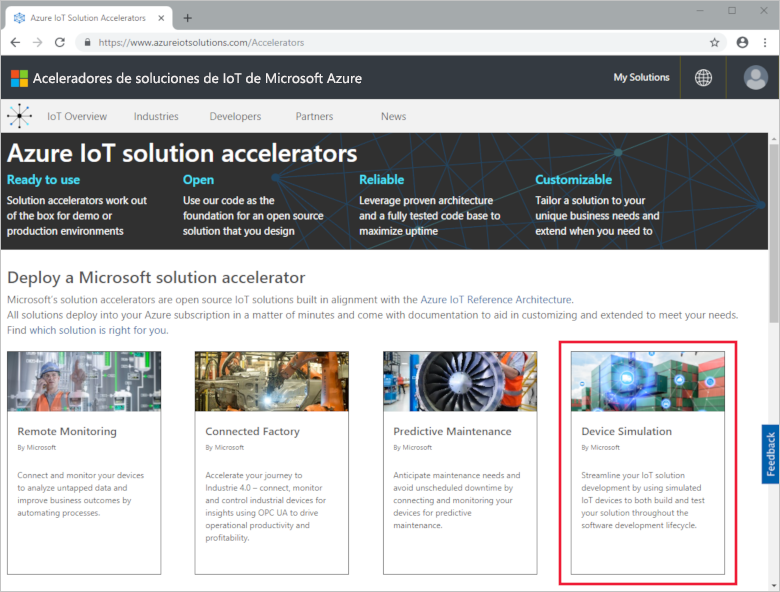
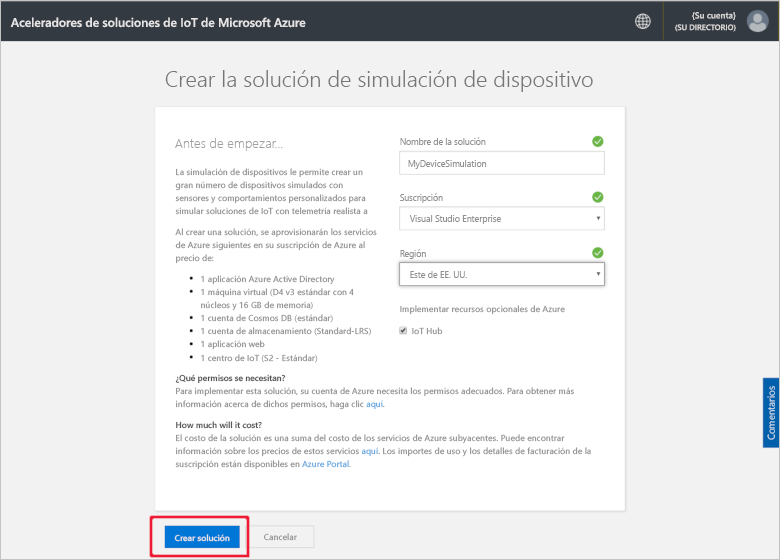
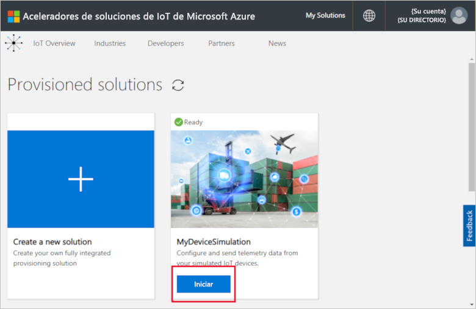
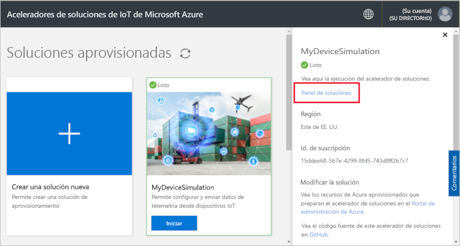
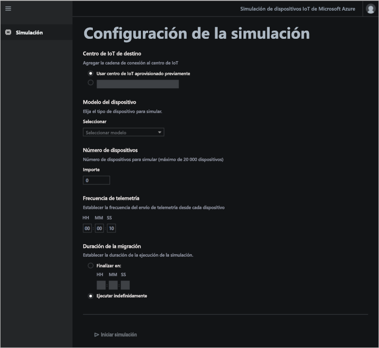
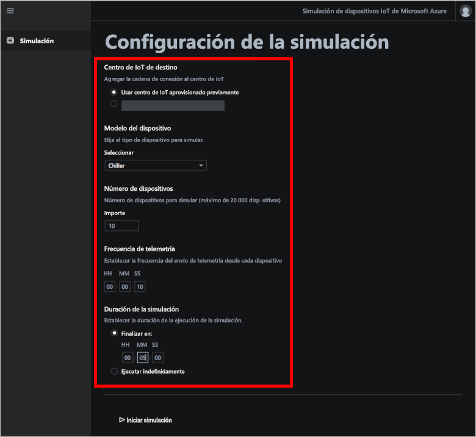
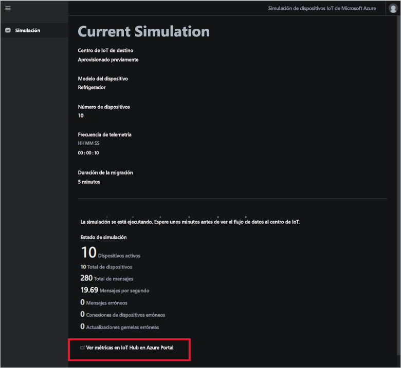
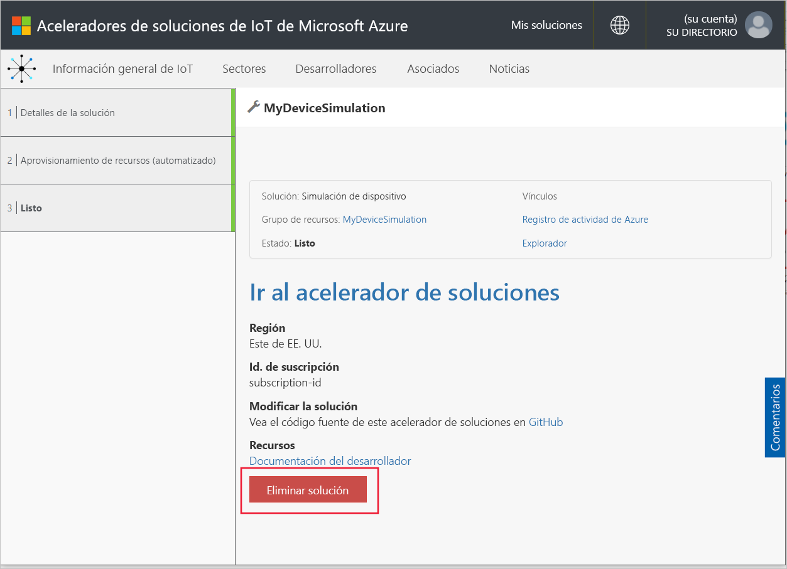

# Guía de inicio rápido: Implementación y ejecución de una solución de simulación de dispositivos basada en la nube

Esta guía de inicio rápido le muestra cómo implementar el acelerador de soluciones Simulación de dispositivo de Azure IoT para probar su solución IoT. Después de implementar el acelerador de soluciones, debe utilizar la página **Simulación** para crear y ejecutar una simulación.

Para completar esta guía de inicio rápido, necesita una suscripción de Azure.

Si no tiene ninguna, cree una [cuenta gratuita](https://azure.microsoft.com/free/?WT.mc_id=A261C142F) antes de empezar.

## Implementación de la solución

Al implementar el acelerador de soluciones para la suscripción de Azure, debe establecer algunas opciones de configuración.

Inicie sesión en [azureiotsolutions.com](https://www.azureiotsolutions.com/Accelerators) con las credenciales de su cuenta de Azure.

Haga clic en **Probar ahora** en el icono **Simulación de dispositivo**.

En la página **Crear la solución Simulación de dispositivo**, escriba un **nombre de la solución único**. Tome nota del nombre de la solución, ya que será el nombre del grupo de recursos de Azure que contiene todos los recursos de la solución.

Seleccione la **Suscripción** y la **Región** que desea usar para implementar el acelerador de soluciones. Generalmente, elegirá la región más cercana. Debe ser un [administrador global o un usuario](iot-accelerators-permissions.md) en la suscripción.

Active la casilla para implementar un centro de IoT para usar con la solución Simulación de dispositivo. Siempre puede cambiar el centro de IoT que la simulación utiliza más adelante.

Haga clic en **Crear solución** para comenzar a aprovisionar la solución. Este proceso tarda al menos cinco minutos en ejecutarse:

## Inicio de sesión en la solución

Una vez completado el proceso de aprovisionamiento, puede iniciar sesión en el panel del acelerador de soluciones de simulación de dispositivo.

En la página **Soluciones aprovisionadas**, haga en el nuevo acelerador de soluciones de simulación de dispositivo:

Puede consultar información sobre el acelerador de soluciones Simulación de dispositivo en el panel que aparece. Elija el **panel de la solución** para ver el acelerador de soluciones Simulación de dispositivo:

Haga clic en **Aceptar** para aceptar la solicitud de permisos; el panel de la soluciones de simulación de dispositivo se muestra en el explorador:

## Configuración de la simulación

Puede configurar y ejecutar una simulación desde el panel. Use los valores de la tabla siguiente para configurar la simulación:

| Configuración             | Valor                       |
| ------------------- | --------------------------- |
| IoT Hub de destino      | Usar un centro de IoT aprovisionado previamente |
| Modelo de dispositivo        | Refrigerador                     |
| Número de dispositivos   | 10                          |
| Frecuencia de telemetría | 10 segundos                  |
| Duración de la simulación | 5 minutos                   |

## Ejecución de la simulación

Haga clic en **Iniciar simulación**. La simulación se ejecuta durante la duración que ha elegido. Puede detener la simulación en cualquier momento haciendo clic en **Detener simulación**. La simulación muestra las estadísticas de la ejecución actual. Haga clic en **View IoT Hub metrics in the Azure portal** (Ver métricas de IoT Hub en Azure Portal) para ver las métricas notificadas por el centro de IoT:

Solo se puede ejecutar una simulación cada vez desde una instancia aprovisionada del acelerador de soluciones.

## Limpieza de recursos

Si tiene previsto explorar más a fondo, deje implementado el acelerador de soluciones de simulación de dispositivo.

Si ya no necesita el acelerador de soluciones, elimínelo de la página [Soluciones aprovisionadas](https://www.azureiotsolutions.com/Accelerators#dashboard). Para ello, selecciónelo y, a continuación, haga clic en **Eliminar solución**:

## Pasos siguientes

En esta guía de inicio rápido, ha implementado el acelerador de soluciones de simulación de dispositivo y ha ejecutado una simulación de dispositivo IoT.

Para más información sobre cómo usar una instancia de IoT Hub existente en una simulación, consulte la siguiente guía de procedimientos:

> [!div class="nextstepaction"]
> [Uso de un centro de IoT existente con el acelerador de soluciones Simulación de dispositivo](iot-accelerators-device-simulation-choose-hub.md)