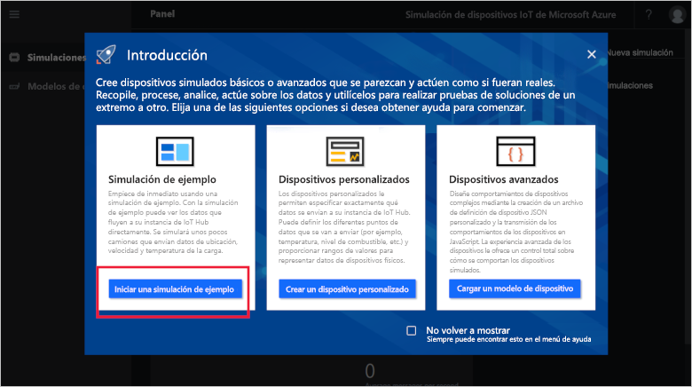
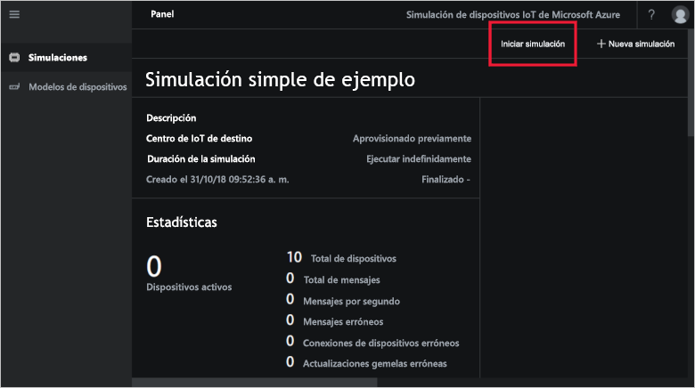
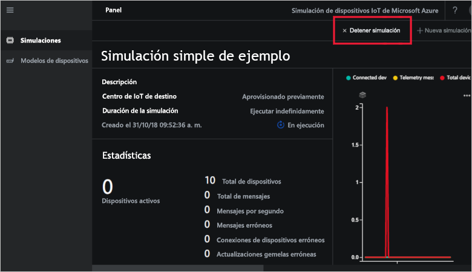

# Guía de inicio rápido: Implementación y ejecución de una simulación de dispositivo IoT en Azure

En esta guía de inicio rápido se muestra cómo implementar una simulación de dispositivo Azure IoT para probar la solución IoT. Después de implementar el acelerador de soluciones, se ejecuta una simulación de ejemplo para empezar a trabajar.

Para completar esta guía de inicio rápido, necesita una suscripción de Azure.

Si no tiene una suscripción a Azure, cree una [cuenta gratuita](https://azure.microsoft.com/free/?WT.mc_id=A261C142F) antes de empezar.

## Implementación de una simulación de dispositivo

Al implementar la simulación de dispositivo en la suscripción de Azure, debe establecer algunas opciones de configuración.

Inicie sesión en [azureiotsolutions.com](https://www.azureiotsolutions.com/Accelerators) con las credenciales de su cuenta de Azure.

Haga clic en el icono **Simulación de dispositivo**:

Haga clic en **Probar ahora** en la página de descripción de Device Simulation:

En la página **Crear la solución Simulación de dispositivo**, escriba un **nombre de la solución único**.

Seleccione la **Suscripción** y la **Región** que desea usar para implementar el acelerador de soluciones. Generalmente, elegirá la región más cercana. Debe ser un [administrador global o un usuario](iot-accelerators-permissions.md) en la suscripción.

Active la casilla para implementar un centro de IoT para usar con la solución Simulación de dispositivo. Siempre puede cambiar el centro de IoT que la simulación utiliza más adelante.

Haga clic en **Crear solución** para comenzar a aprovisionar la solución. Este proceso tarda al menos cinco minutos en ejecutarse:

## Inicio de sesión en la solución

Una vez completado el proceso de aprovisionamiento, puede hacer clic en el botón **Iniciar** para iniciar sesión en la simulación de dispositivo:

Haga clic en **Aceptar** para aceptar la solicitud de permisos; la solución de simulación de dispositivo se muestra en el explorador.

Cuando se abre por primera vez, verá el panel de la simulación de dispositivo con una guía de **Introducción**. Haga clic en el primer icono para abrir una simulación de ejemplo. Si cierra la guía de **Introducción**, puede abrir la **simulación sencilla de ejemplo** desde el panel; para ello, haga clic en su icono:

## Simulación de ejemplo

Al ser una simulación de ejemplo, no se puede modificar. La simulación está configurada con los siguientes valores:

| Configuración             | Valor                       |
| ------------------- | --------------------------- |
| IoT Hub de destino      | Usar un centro de IoT aprovisionado previamente |
| Modelo de dispositivo        | Camión                       |
| Número de dispositivos   | 10                          |
| Frecuencia de telemetría | 10 segundos                  |
| Duración de la simulación | Ejecución indefinida            |

## Ejecución de la simulación

Haga clic en **Iniciar simulación**. La simulación se ejecutará indefinidamente, como se ha configurado. Puede detener la simulación en cualquier momento haciendo clic en **Detener simulación**. La simulación muestra las estadísticas de la ejecución actual.

Solo se puede ejecutar una simulación cada vez desde una instancia de la simulación de dispositivo.

## Limpieza de recursos

Si tiene previsto explorar más a fondo, mantenga la implementación de la simulación de dispositivo.

Si ya no necesita la simulación de dispositivo, puede eliminarla en la página [Soluciones aprovisionadas](https://www.azureiotsolutions.com/Accelerators#dashboard); para ello, haga clic en su icono y, a continuación, haga clic en **Eliminar solución**:

## Pasos siguientes

En esta guía de inicio rápido, ha implementado una solución de simulación de dispositivo y ha ejecutado una simulación de dispositivo IoT de ejemplo.

> [!div class="nextstepaction"]
> [Creación de una simulación con uno o varios tipos de dispositivos](iot-accelerators-device-simulation-create-simulation.md)