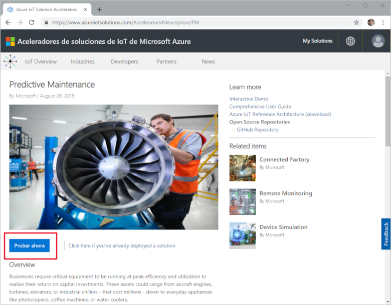
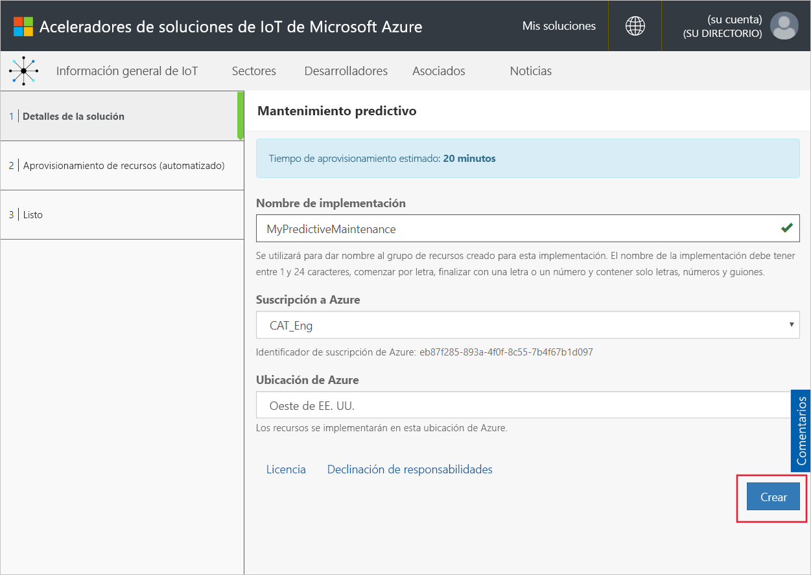
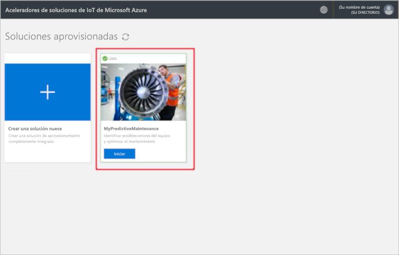
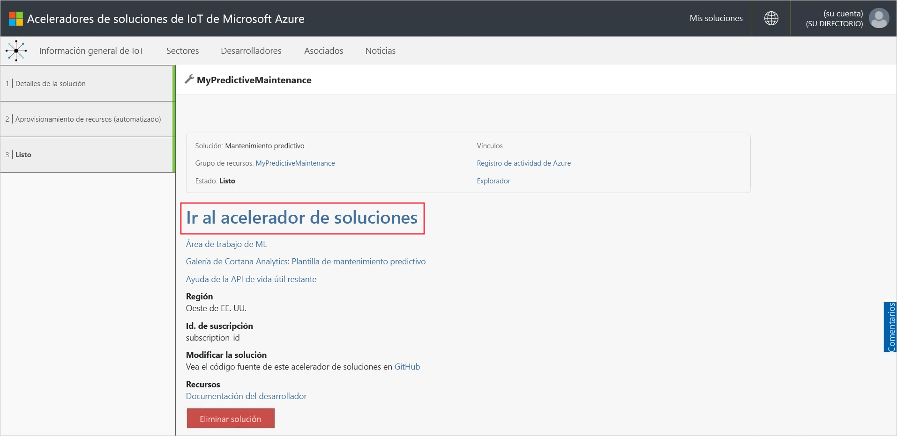
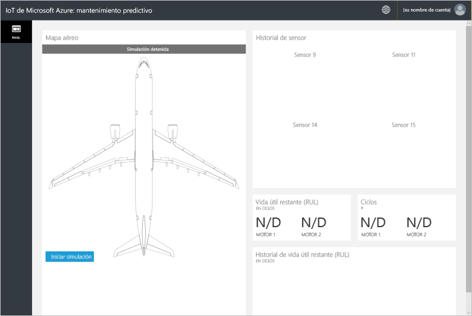
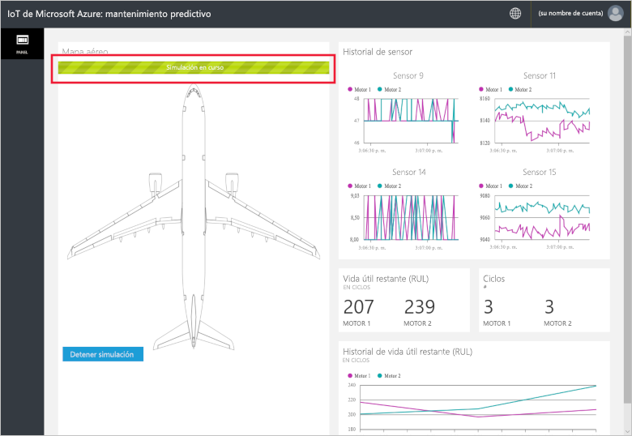
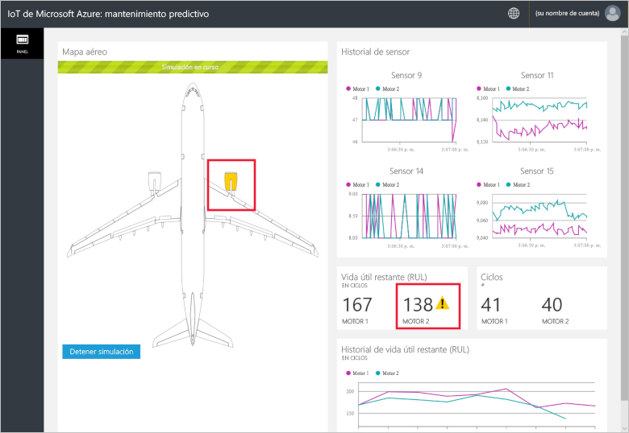
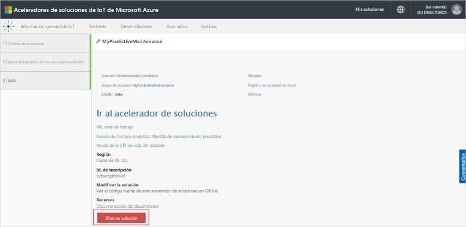

# Inicio rápido: Prueba de una solución basada en la nube para ejecutar un análisis de mantenimiento predictivo en los dispositivos conectados

En esta guía de inicio rápido se muestra cómo implementar el acelerador de soluciones de mantenimiento predictivo de Azure IoT para ejecutar una simulación de mantenimiento predictivo basada en la nube. Después de implementar el acelerador de soluciones, puede utilizar la página **Panel** de la solución para ejecutar un análisis de mantenimiento predictivo sobre datos procedentes de un motor de aeronave simulado. Puede utilizar este acelerador de soluciones como punto de partida de su propia implementación o como una herramienta de aprendizaje.

En esta simulación, Fabrikam es una compañía aérea regional que se centra en proporcionar una experiencia magnífica a los clientes a precios competitivos. Una causa de los retrasos en los vuelos son los problemas de mantenimiento y el mantenimiento de los motores de los aviones supone especialmente un desafío. Fabrikam debe evitar los errores en los motores durante el vuelo a toda costa, por lo que inspecciona sus motores con regularidad y se ajusta a un programa de mantenimiento programado. Sin embargo, los motores de aviones no siempre llevan el mismo. En los motores se realizan algunas tareas de mantenimiento innecesarias. Lo que es aún más importante, surgen problemas que pueden hacer que un avión quede inmovilizado hasta que se realice el mantenimiento. Estos problemas pueden resultar muy costosos si un avión está en una ubicación donde no se encuentran disponibles los técnicos o las piezas de repuesto adecuados.

Los motores de los aviones de Fabrikam están equipados con sensores que supervisan las condiciones del motor durante el vuelo. Fabrikam conserva años de datos de errores y operacionales del motor procedentes de estos sensores. Los científicos de datos de Fabrikam han utilizado estos datos para desarrollar un modelo para predecir la vida útil restante (RUL) de un motor de avión. El modelo emplea una correlación entre los datos de cuatro de los sensores del motor con el desgaste del motor que lleva a averías ocasionales. Mientras Fabrikam continúa las inspecciones periódicas para garantizar la seguridad, ahora puede usar los modelos para calcular el RUL de cada motor después de cada vuelo. Fabrikam puede predecir ahora de antemano los puntos futuros de error y el plan de mantenimiento para minimizar el tiempo en tierra de los aviones. Este proceso reduce los costos operativos y garantiza la seguridad de los pasajeros y tripulación.

Para completar esta guía de inicio rápido, necesita una suscripción de Azure.

Si no tiene ninguna, cree una [cuenta gratuita](https://azure.microsoft.com/free/?WT.mc_id=A261C142F) antes de empezar.

## Implementación de la solución

Al implementar el acelerador de soluciones para la suscripción de Azure, debe establecer algunas opciones de configuración.

Vaya a [aceleradores de soluciones de IoT de Microsoft Azure](https://www.azureiotsolutions.com) e inicie sesión con las credenciales de la cuenta de Azure.

Haga clic en el icono **Mantenimiento predictivo**. En la página **Mantenimiento predictivo**, haga clic en **Probar ahora**:

En la página **Crear una solución de mantenimiento predictivo**, escriba un **nombre de solución** único para el acelerador de soluciones de mantenimiento predictivo. En esta guía de inicio rápido, vamos a usar **MyPredictiveMaintenance**.

Seleccione la **Suscripción** y la **Región** que desea usar para implementar el acelerador de soluciones. Generalmente, elegirá la región más cercana. En esta guía de inicio rápido, vamos a usar **Visual Studio Enterprise** y **Este de EE. UU**. Debe ser un [administrador global o un usuario](iot-accelerators-permissions.md) en la suscripción.

Haga clic en **Crear** para comenzar la implementación. Este proceso tarda al menos cinco minutos en ejecutarse:

## Inicio de sesión en la solución

Una vez completada la implementación en su suscripción de Azure, verá una marca de verificación verde y **Listo** en el icono de la solución. Ahora ya puede iniciar sesión en el panel del acelerador de soluciones de mantenimiento predictivo.

En la página **Soluciones aprovisionadas**, haga clic en su nuevo acelerador de soluciones de mantenimiento predictivo.

 Puede consultar información sobre el acelerador de soluciones en la página que aparece. Elija **Go to your solution accelerator** (Ir al acelerador de soluciones) para ver el acelerador de soluciones de mantenimiento predictivo:

Haga clic en **Aceptar** para aceptar la solicitud de permisos; el panel de la soluciones de mantenimiento predictivo se muestra en el explorador:

Haga clic en **Iniciar simulación** para empezar la simulación. El historial del sensor, la vida útil restante, los ciclos y el historial de vida útil restante rellenan con datos el panel:

Si la vida útil restante es inferior a 160 (un umbral arbitrario elegido para fines de demostración), el portal de la solución muestra un símbolo de advertencia junto a la presentación de la vida útil restante. El portal de la solución también resalta en amarillo el motor del avión. Observe cómo los valores de la vida útil restante presentan una tendencia descendente en general pero tienden a rebotar hacia arriba y hacia abajo. Este comportamiento es consecuencia de las longitudes del ciclo que varían y de la precisión del modelo.

La simulación completa tarda alrededor de 35 minutos en finalizar 148 ciclos. Se alcanza el umbral de vida útil restante de 160 por primera vez en unos 5 minutos y ambos motores alcanzan el umbral en aproximadamente unos 8 minutos.

La simulación ejecuta el conjunto de datos completo para 148 ciclos y se establece en los valores finales de la vida útil existente y de ciclos.

Puede detener la simulación en cualquier punto, pero al hacer clic en **Iniciar simulación** se reproduce la simulación desde el principio del conjunto de datos.

## Limpieza de recursos

Si tiene previsto explorar más a fondo, deje implementado el acelerador de soluciones de mantenimiento predictivo.

Si ya no necesita el acelerador de soluciones, elimínelo de la página [Soluciones aprovisionadas](https://www.azureiotsolutions.com/Accelerators#dashboard). Para ello, selecciónelo y, a continuación, haga clic en **Eliminar solución**:

## Pasos siguientes

En esta guía de inicio rápido, ha implementado el acelerador de soluciones de mantenimiento predictivo y ha ejecutado una simulación.

Para más información sobre el acelerador de soluciones y los motores de avión simulados, consulte el artículo siguiente.

> [!div class="nextstepaction"]
> [Introducción al acelerador de la solución de mantenimiento predictivo](iot-accelerators-predictive-walkthrough.md)
