# Inicio rápido: Prueba de una solución de supervisión remota basada en la nube

En esta guía de inicio rápido se muestra cómo implementar el acelerador de soluciones de supervisión remota de Azure IoT. En esta solución basada en la nube, se usa la página **Panel** para visualizar los dispositivos simulados en un mapa y la página **Mantenimiento** para responder a una alerta de presión de un dispositivo refrigerador simulado. Puede utilizar este acelerador de soluciones como punto de partida de su propia implementación o como una herramienta de aprendizaje.

La implementación inicial configura el acelerador de soluciones para una empresa llamada Contoso. Como un operador de Contoso, administra una selección de diferentes tipos de dispositivos, como los refrigeradores, implementados en diferentes entornos físicos. Un dispositivo refrigerador envía los datos de telemetría de la presión, la temperatura y la humedad al acelerador de soluciones de supervisión remota.

Para completar esta guía de inicio rápido, necesita una suscripción de Azure.

Si no tiene ninguna, cree una [cuenta gratuita](https://azure.microsoft.com/free/?WT.mc_id=A261C142F) antes de empezar.

## Implementación de la solución

Al implementar el acelerador de soluciones para la suscripción de Azure, debe establecer algunas opciones de configuración.

Inicie sesión en [azureiotsolutions.com](https://www.azureiotsolutions.com/Accelerators) con las credenciales de su cuenta de Azure.

Haga clic en el icono **Supervisión remota**. En la página **Supervisión remota**, haga clic en **Probar ahora**:

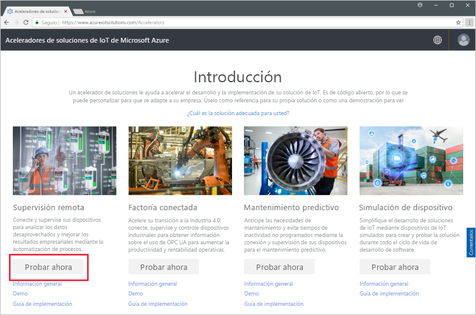

En la página **Create Remote Monitoring solution** (Crear solución de supervisión remota), seleccione una implementación **Básica**. Si implementa el acelerador de soluciones para saber cómo funciona o para ejecutar una demostración, elija la opción **Básica** para aminorar los costos.

Elija **.NET** como lenguaje. Las implementaciones de Java y de .NET tienen las mismas características.

Escriba un valor único de **Nombre de la solución** para el acelerador de soluciones de supervisión remota. En esta guía de inicio rápido, llamamos a nuestro **contoso-rm**.

Seleccione la **Suscripción** y la **Región** que desea usar para implementar el acelerador de soluciones. Generalmente, elegirá la región más cercana. Para este tutorial, vamos a usar **Este de EE. UU**.
Puede elegir **Visual Studio Enterprise**, pero debe ser un [administrador o usuario global](iot-accelerators-permissions.md) para hacerlo.

Haga clic en **Crear solución** para comenzar la implementación. Este proceso tarda al menos cinco minutos en ejecutarse:

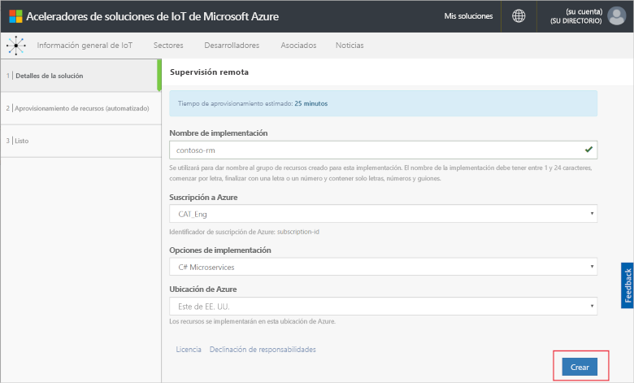

## Inicio de sesión en la solución

Una vez completada la implementación en su suscripción de Azure, verá una marca de verificación verde y **Listo** en el icono de la solución. Ahora puede iniciar sesión en el panel del acelerador de soluciones de supervisión remota.

En la página **Soluciones aprovisionadas**, haga clic en su nuevo acelerador de soluciones de supervisión remota:

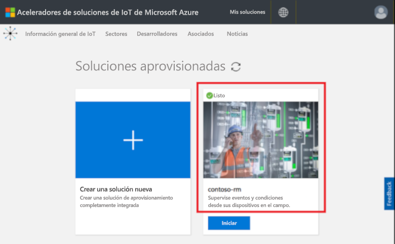

Puede consultar información sobre el acelerador de soluciones de supervisión remota en el panel que aparece. Elija el **Panel de soluciones** para ver el acelerador de soluciones de supervisión remota:

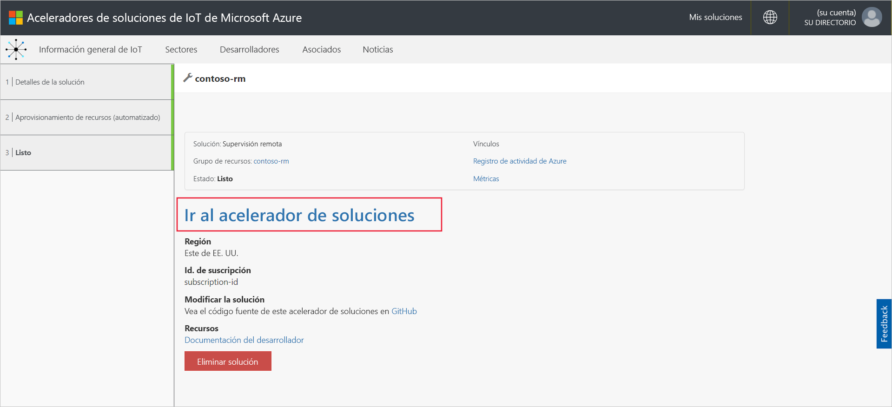

Haga clic en **Aceptar** para aceptar la solicitud de permisos; el panel de la soluciones de supervisión remota se muestra en el explorador:

[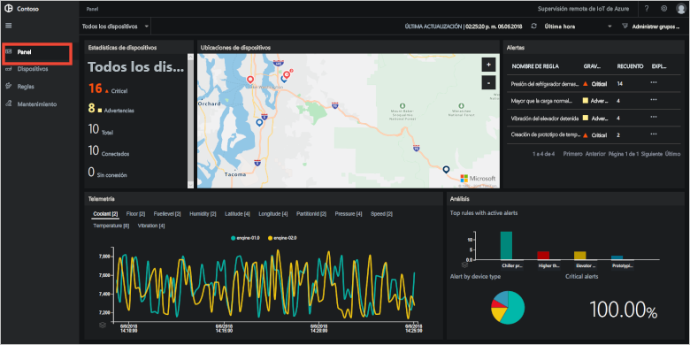](./media/quickstart-remote-monitoring-deploy/solutiondashboard-expanded.png#lightbox)

## Visualización de los dispositivos

El panel de soluciones muestra la siguiente información acerca de los dispositivos simulados de Contoso:

* El panel **Estadísticas del dispositivo** muestra información resumida sobre las alertas y el número total de dispositivos. En la implementación predeterminada, Contoso tiene 10 dispositivos simulados de diferentes tipos.

* El panel **Ubicaciones de dispositivos** muestra dónde se ubican físicamente los dispositivos. El color de la marca muestra cuándo existen alertas del dispositivo.

* El panel **Alertas** muestra detalles de las alertas de los dispositivos.

* El panel **Telemetría** muestra los datos de telemetría de los dispositivos. Para ver los distintos flujos de telemetría, haga clic en los tipos de telemetría en la parte superior.

* El panel **Análisis** muestra información combinada sobre las alertas de los dispositivos.

## Respuesta a una alerta

Como operador de Contoso, puede supervisar los dispositivos desde el panel de la solución. El panel **Estadísticas del dispositivo** muestra que ha habido diversas alertas críticas y el panel **Alertas** muestra que la mayoría de ellas procede de un dispositivo refrigerador. Para los dispositivos refrigerador de Contoso, una presión interna de más de 250 PSI indica que el dispositivo no funciona correctamente.

### Identificación del problema

En la página **Panel**, en el panel **Alertas**, puede ver la alerta **Chiller pressure too high** (Presión del refrigerador demasiado alta). El refrigerador tiene una marca roja en el mapa (puede que tenga que desplazarse y hacer zoom en el mapa):

[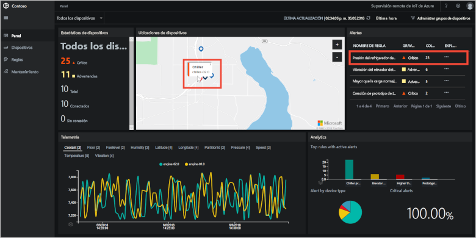](./media/quickstart-remote-monitoring-deploy/dashboardalarm-expanded.png#lightbox)

En el panel **Alertas**, haga clic en **...**  en la columna **Explorar** junto a la regla **Chiller pressure too high** (Presión del refrigerador demasiado alta). Al hacerlo, aparece la página **Mantenimiento**, donde puede ver los detalles de la regla que desencadenó la alerta.

En la página **Chiller pressure too high** (Presión del refrigerador demasiado alta), puede ver los detalles de la regla que desencadenó la alerta de presión del refrigerador. La página también muestra cuándo se han producido las alertas y qué dispositivo las desencadenó:

[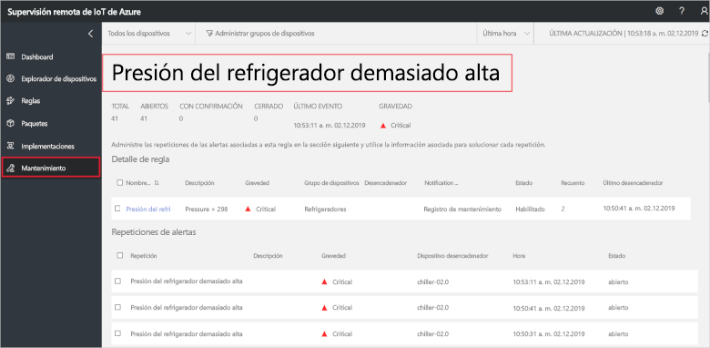](./media/quickstart-remote-monitoring-deploy/maintenancealarmlist-expanded.png#lightbox)

Ahora ha identificado el problema que desencadenó la alerta y el dispositivo asociado. Como operador, los pasos siguientes son confirmar la alerta y corregir el problema.

### Corrección del problema

Para indicar a otros operadores que está trabajando en la alerta, selecciónela y cambie el **Estado de la alerta** a **Confirmada**:

[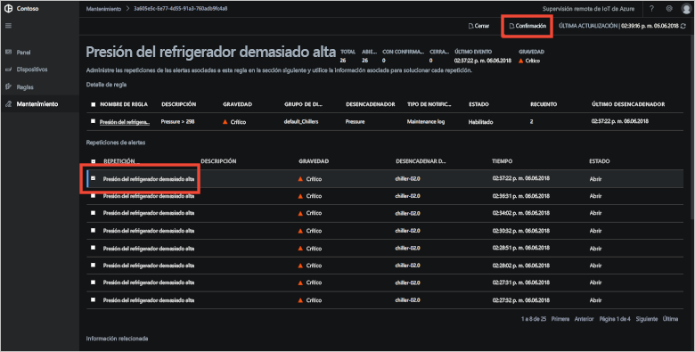](./media/quickstart-remote-monitoring-deploy/maintenanceacknowledge-expanded.png#lightbox)

El valor de la columna de estado cambia a **Reconocida**.

Para actuar en el refrigerador, desplácese hacia abajo hacia **Información relacionada**, seleccione el dispositivo refrigerador en la lista **Alerted devices** (Dispositivos con alerta) y, a continuación, elija **Trabajos**:

[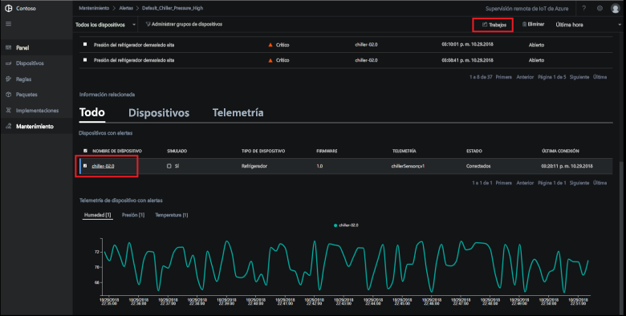](./media/quickstart-remote-monitoring-deploy/maintenanceschedule-expanded.png#lightbox)

En el panel **Trabajos**, elija **Run method** (Método de ejecución) y, después, el método **EmergencyValveRelease**. Agregue el nombre del trabajo **ChillerPressureRelease** y haga clic en **Aplicar**. Esta configuración crea un trabajo que se ejecuta de inmediato.

Para ver el estado del trabajo, vuelva a la página **Mantenimiento** y vea la lista de trabajos en la vista **Trabajos**. Puede que tenga que esperar unos segundos para poder ver que el trabajo se ejecutó para liberar la presión de la válvula del refrigerador:

[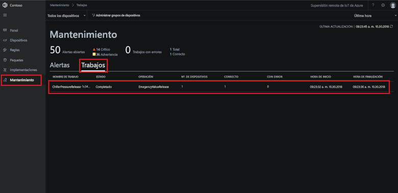](./media/quickstart-remote-monitoring-deploy/maintenancerunningjob-expanded.png#lightbox)

### Comprobación d que la presión ha vuelto a la normal

Para ver la telemetría de presión para el refrigerador, vaya a la página **Panel**, seleccione **Presión** en el panel de telemetría y confirme que la presión de **chiller-02.0** ha vuelto a la normal:

[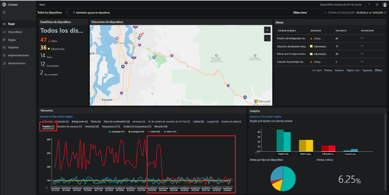](./media/quickstart-remote-monitoring-deploy/pressurenormal-expanded.png#lightbox)

Para cerrar el incidente, vaya a la página **Mantenimiento**, seleccione la alerta y establezca el estado en **Cerrada**:

[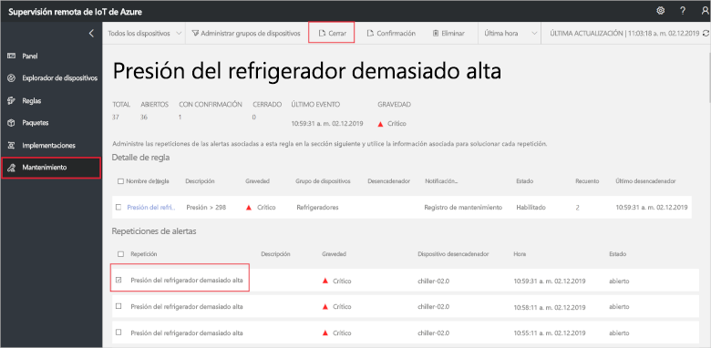](./media/quickstart-remote-monitoring-deploy/maintenanceclose-expanded.png#lightbox)

El valor de la columna de estado cambia a **Cerrada**.

## Limpieza de recursos

Si va a pasar a los tutoriales, deje el acelerador de soluciones de supervisión remota implementado.

Si ya no necesita el acelerador de soluciones, elimínelo de la página [Soluciones aprovisionadas](https://www.azureiotsolutions.com/Accelerators#dashboard). Para ello, selecciónelo y, a continuación, haga clic en **Eliminar solución**:

## Pasos siguientes

En esta guía de inicio rápido, ha implementado el acelerador de soluciones de supervisión remota y ha completado una tarea de supervisión con los dispositivos simulados en la implementación predeterminada de Contoso.

Para más información sobre el acelerador de soluciones con dispositivos simulados, consulte el tutorial siguiente.

> [!div class="nextstepaction"]
> [Tutorial: Supervisión de los dispositivos IoT](iot-accelerators-remote-monitoring-monitor.md)