# Un paseo por la interfaz de usuario de Azure IoT Central

Este artículo presenta la interfaz de usuario de Microsoft Azure IoT Central. Puede usar la interfaz de usuario para crear, administrar y usar una solución de Azure IoT Central y sus dispositivos conectados.

Como el _generador de soluciones_, puede usar la interfaz de usuario de Azure IoT Central para definir la solución de Azure IoT Central. Puede usar la interfaz de usuario para:

* Definir los tipos de dispositivos que se conectan a la solución.
* Configurar las reglas y las acciones para sus dispositivos. 
* Personalizar la interfaz de usuario para un _operador_ que utiliza la solución.

Como _operador_, usará la interfaz de usuario de Azure IoT Central para administrar la solución de Azure IoT Central. Puede usar la interfaz de usuario para:

* Supervisar los dispositivos.
* Configurar los dispositivos.
* Solucionar los problemas y errores de los dispositivos.
* Aprovisionar dispositivos nuevos.

## Página principal de IoT Central

En la [página de inicio de IoT Central](https://aka.ms/iotcentral-get-started) es el lugar donde puede obtener más información sobre las noticias y características más recientes disponibles en IoT Central, crear nuevas aplicaciones y ver e iniciar la aplicación existente.

> [!div class="mx-imgBorder"]
> 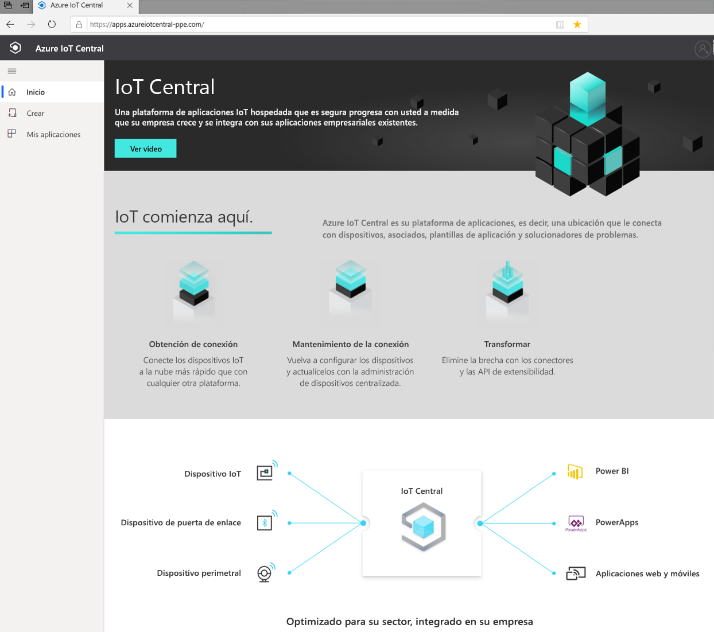

### Crear una aplicación

En la sección Compilación puede examinar la lista de plantillas de IoT Central relevantes para el sector para ayudarle a empezar a trabajar rápidamente o empezar desde cero con una plantilla de aplicación personalizada.  
> [!div class="mx-imgBorder"]
> 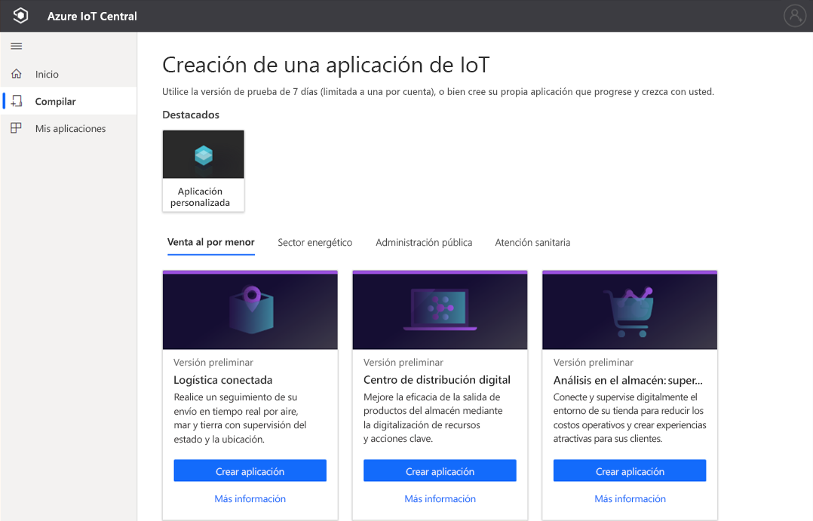

Para más información, consulte la guía de inicio rápido [Creación de una aplicación de Azure IoT Central](quick-deploy-iot-central.md).

### Iniciar la aplicación

Para iniciar la aplicación de IoT Central, vaya a la dirección URL que usted o el generador de soluciones elija durante la creación de la aplicación. También puede ver una lista de todas las aplicaciones a las que tiene acceso en el [administrador de aplicaciones de IoT Central](https://aka.ms/iotcentral-apps).

> [!div class="mx-imgBorder"]
> 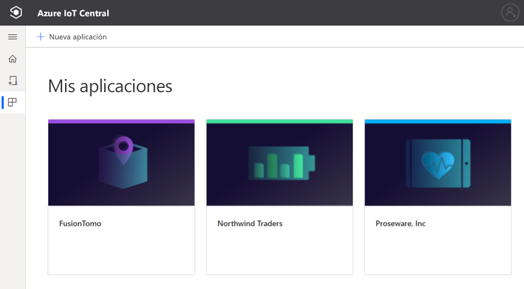

## Navegue por su aplicación

Una vez que esté dentro de la aplicación de IoT, use el panel izquierdo para acceder a las distintas áreas. Para expandir o contraer el panel izquierdo, seleccione el icono de tres líneas situado en la parte superior del panel:

> [!NOTE]
> Los elementos que se ven en el panel izquierdo dependen del rol de usuario. Más información sobre [administración de usuarios y roles](howto-manage-users-roles.md). 

:::row:::
  :::column span="":::
      > [!div class="mx-imgBorder"]
      > 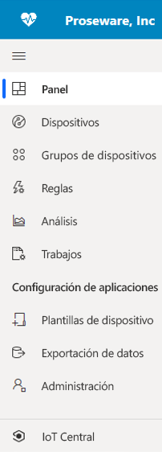
  :::column-end:::
  :::column span="2":::
     **Dashboard** (Panel) muestra el panel de la aplicación. Como un *generador de soluciones*, puede personalizar el panel global para los operadores. De acuerdo de su rol de usuario, los operadores también pueden crear sus propios paneles personales.
     
     **Dispositivos** permite administrar los dispositivos conectados: real y simulado.

     **Grupos de dispositivos** permite ver y crear colecciones lógicas de dispositivos especificados por una consulta. Puede guardar esta consulta y usar los grupos de dispositivos a través de la aplicación para realizar operaciones masivas.

     Las **reglas** permiten crear y editar reglas para supervisar los dispositivos. Las reglas se evalúan en función de la telemetría del dispositivo y desencadenan acciones personalizables.

     **Analytics** permite crear vistas personalizadas sobre los datos del dispositivo para obtener información de la aplicación.

     **Trabajos** le permite administrar los dispositivos a escala mediante la ejecución de operaciones masivas.

     **Plantillas de dispositivo** es donde se crean y administran las características de los dispositivos que se conectan a la aplicación.

     La **exportación de datos** le permite configurar una exportación continua a servicios externos, como almacenamiento y colas.

     La **administración** es donde puede administrar la configuración de la aplicación, la personalización, la facturación, los usuarios y los roles.

     **IoT Central** permite *a los administradores* volver al administrador de aplicaciones de IoT Central.
     
   :::column-end:::
:::row-end:::

### Búsqueda, ayuda, tema y soporte técnico

El menú superior aparece en todas las páginas:

> [!div class="mx-imgBorder"]
> 

* Para buscar plantillas de dispositivos y dispositivos, escriba un valor **Buscar**.
* Para cambiar el idioma o el tema de la interfaz de usuario, elija el icono **Configuración**. Más información sobre [administración de las preferencias de la aplicación](howto-manage-preferences.md)
* Para cerrar la sesión de la aplicación, elija el icono **Cuenta**.
* Para obtener ayuda y soporte técnico, elija el menú desplegable **Ayuda** para obtener una lista de recursos. En una aplicación del plan de precios gratuito, los recursos de soporte técnico incluyen acceso al [chat en directo](howto-show-hide-chat.md).

Puede elegir entre un tema claro o un tema oscuro para la interfaz de usuario:

> [!NOTE]
> La opción de elegir entre temas claros y oscuros no está disponible si su administrador ha configurado un tema personalizado para la aplicación.

> [!div class="mx-imgBorder"]
> 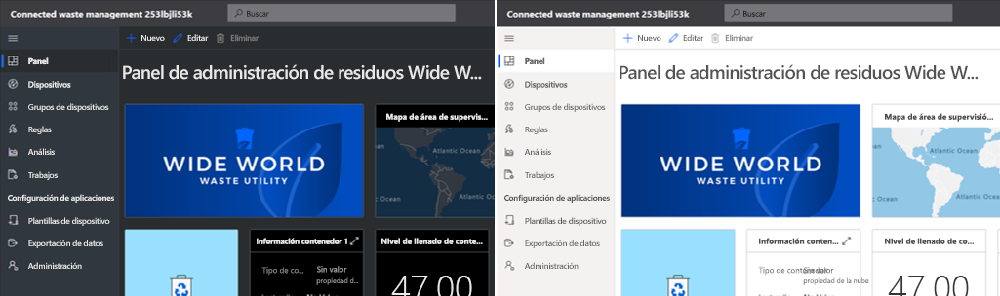

### Panel
> [!div class="mx-imgBorder"]
> 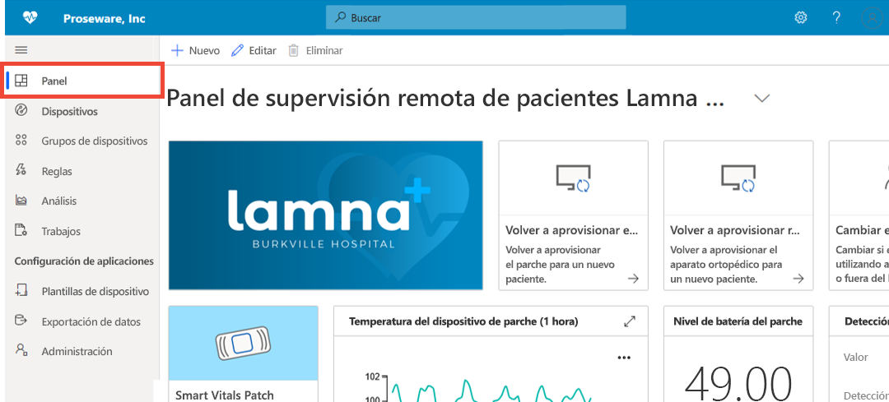

* El panel es la primera página que verá cuando inicie sesión en la aplicación de Azure IoT Central. Como *creador de soluciones*, puede crear y personalizar varios paneles de aplicaciones globales para otros usuarios. Más información sobre [agregar iconos al panel](howto-add-tiles-to-your-dashboard.md)

* Como *operador*, si su rol de usuario lo permite, puede crear paneles personales para supervisar lo que le interesa. Para más información, consulte el artículo [Creación de paneles personales de Azure IoT Central](howto-create-personal-dashboards.md).

### Dispositivos

> [!div class="mx-imgBorder"]
> 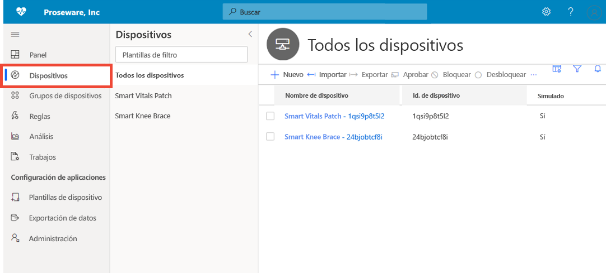

La página del explorador muestra los _dispositivos_ que hay en la aplicación de Azure IoT Central agrupados por _plantilla del dispositivo_. 

* Una plantilla de dispositivo define un tipo de dispositivo que se puede conectar a la aplicación.
* Un dispositivo representa un dispositivo real o simulado en la aplicación.

Para más información, consulte la guía de inicio rápido [Supervisar los dispositivos](./quick-monitor-devices.md). 

### Grupos de dispositivos

> [!div class="mx-imgBorder"]
> 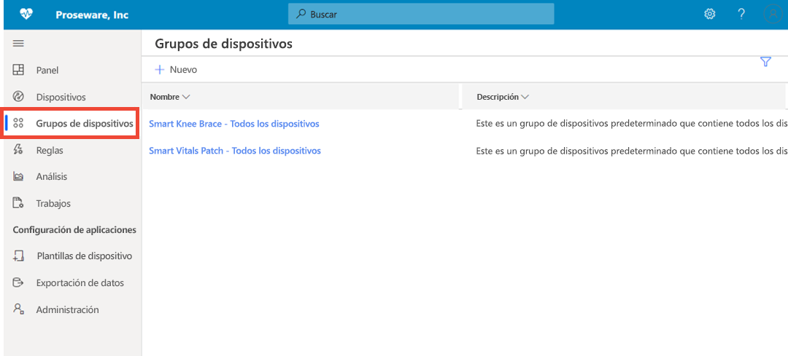

El grupo de dispositivos es una colección de dispositivos relacionados. Un *generador de soluciones* define una consulta para identificar los dispositivos que se incluyen en un grupo de dispositivos. Los grupos de dispositivos se usan para realizar operaciones masivas en la aplicación. Para más información, consulte el artículo [Uso de grupos de dispositivos en la aplicación de Azure IoT Central](tutorial-use-device-groups.md).

### Reglas
> [!div class="mx-imgBorder"]
> 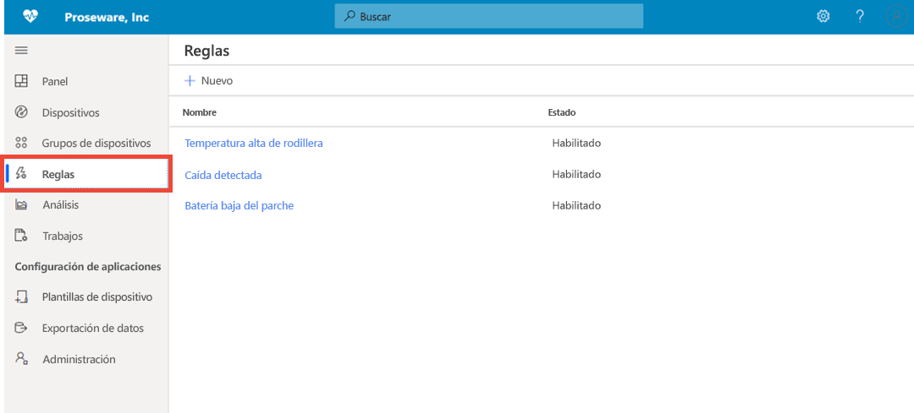

La página de reglas permite definir reglas basadas en la telemetría, el estado o los eventos de los dispositivos. Cuando se activa una regla, puede desencadenar una o varias acciones, como enviar un correo, notificar a un sistema externo a través de alertas de webhook, etc. Para más información, consulte el tutorial de [Configuración de reglas](tutorial-create-telemetry-rules.md). 

### Análisis

> [!div class="mx-imgBorder"]
> 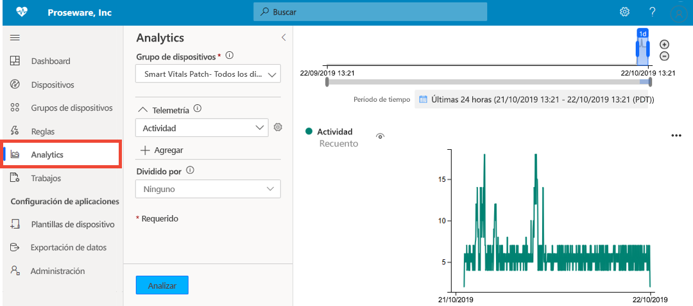

El análisis permite crear vistas personalizadas sobre los datos del dispositivo para obtener información de la aplicación. Para más información, consulte el artículo [Crear análisis para su aplicación de Azure IoT Central](howto-create-analytics.md).

### Trabajos

> [!div class="mx-imgBorder"]
> 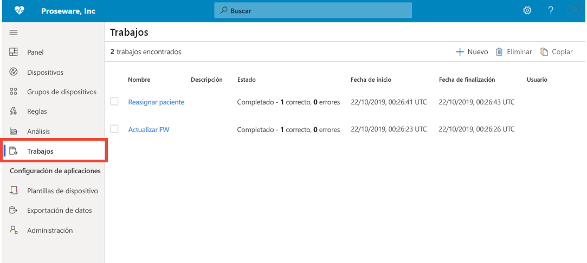

La página de trabajos le permite realizar operaciones de administración de dispositivos en masa. Puede actualizar las propiedades del dispositivo, la configuración y ejecutar comandos en grupos de dispositivos. Para obtener más información, consulte el artículo [Run a job](howto-run-a-job.md) (Ejecución de un trabajo).

### Plantillas de dispositivo

> [!div class="mx-imgBorder"]
> 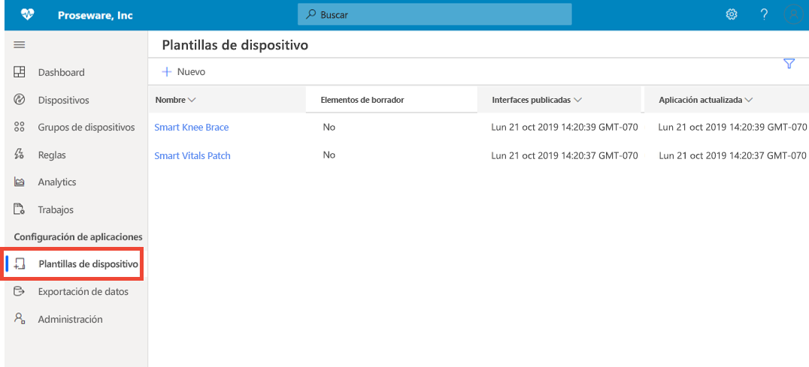

La página de plantillas de dispositivos es donde un generador crea y administra las plantillas de dispositivo en la aplicación. Una plantilla de dispositivo especifica características de dispositivos como:

* Medidas de telemetría, estado y eventos.
* Propiedades
* Comandos:
* Vistas

El *generador de soluciones* también puede crear formularios y paneles para que los operadores los usen para administrar dispositivos.

Para más información, consulte el tutorial [Define a new device type in your Azure IoT Central application](howto-set-up-template.md) (Definición de un nuevo tipo de dispositivo en la aplicación de Azure IoT Central). 

### Exportación de datos
> [!div class="mx-imgBorder"]
> 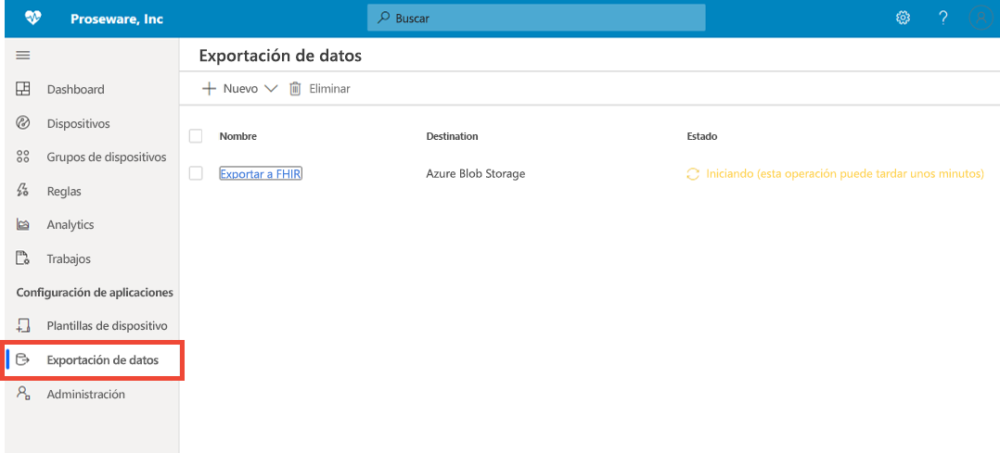

La exportación de datos permite configurar flujos de datos, como la telemetría, de la aplicación a sistemas externos. Para más información, consulte el artículo [Exportación de datos a Azure IoT Central](./howto-export-data.md).

### Administración
> [!div class="mx-imgBorder"]
> 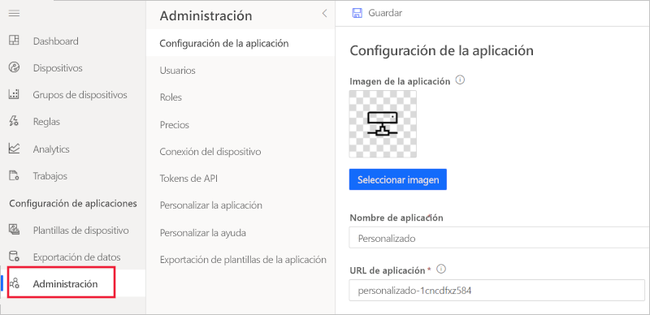

La página de administración permite configurar y personalizar la aplicación IoT Central. Aquí puede cambiar el nombre de la aplicación, la dirección URL, las funciones, administrar usuarios y roles, crear tokens de API y exportar la aplicación. Para más información, consulte el artículo [Administer your Azure IoT Central application](howto-administer.md) (Administración de la aplicación de Azure IoT Central).

## Pasos siguientes

Ahora que ya tiene información general sobre Azure IoT Central y está familiarizado con el diseño de la interfaz de usuario, el siguiente paso sugerido es completar la guía de inicio rápido [Create an Azure IoT Central application](quick-deploy-iot-central.md) (Creación de una aplicación de Azure IoT Central).
