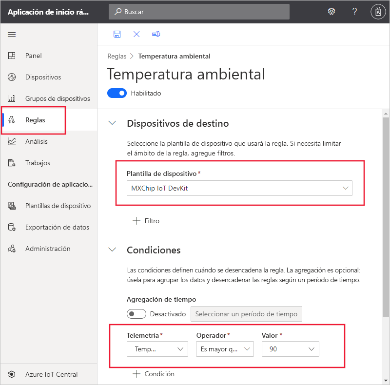
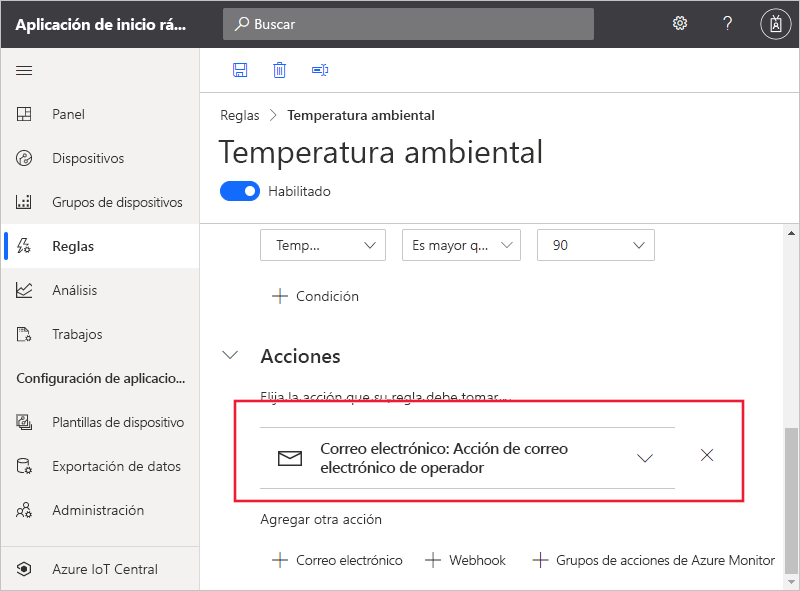

# Inicio rápido: Configuración de reglas y acciones para el dispositivo en Azure IoT Central

*Este artículo se aplica a los administradores, operadores y compiladores.*

En este inicio rápido, se crea una regla que envía un correo cuando la temperatura que notifica el sensor de algún dispositivo supera los 90&deg; F.

## Prerrequisitos

Antes de comenzar, debe completar los dos inicios rápidos anteriores [Crear una aplicación de Azure IoT Central](./quick-deploy-iot-central.md) y [Agregar un dispositivo simulado a la aplicación de IoT Central](./quick-create-pnp-device.md) para crear la plantilla de dispositivo **MXChip IoT DevKit** con la que trabajar.

## Crear una regla basada en la telemetría

1. Para agregar una nueva regla basada en telemetría a la aplicación, en el panel izquierdo, seleccione **Reglas**.

1. Para crear una regla, seleccione **+** .

1. Especifique **Environmental temperature** (Temperatura ambiental) como nombre de la regla.

1. En la sección **Dispositivos de destino**, seleccione **MXChip IoT DevKit** como plantilla de dispositivo. Esta opción filtra los dispositivos a los que se aplica la regla por tipo de plantilla de dispositivo. Para agregar más criterios de filtro, seleccione **+ Filtro**.

1. En la sección **Condiciones**, se define lo que desencadena la regla. Use la siguiente información para definir una condición basada en los datos de telemetría de temperatura:

    | Campo        | Value            |
    | ------------ | ---------------- |
    | Medición  | Temperatura      |
    | Operator     | es mayor que  |
    | Value        | 90               |

    Para agregar más condiciones, seleccione **+ Condition** (+ Condición).

    

1. Para agregar una acción de correo para que se ejecute cuando se desencadene la regla, seleccione **+ Correo electrónico**.

1. Use la información de la tabla siguiente para definir la acción y, después, seleccione **Listo**:

    | Configuración   | Value                                             |
    | --------- | ------------------------------------------------- |
    | Nombre para mostrar | Adición de una acción de correo electrónico                          |
    | A        | La dirección de correo electrónico propia                                |
    | Notas     | La temperatura ambiental superó el umbral. |

    > [!NOTE]
    > Para recibir una notificación por correo electrónico, la dirección debe ser un [identificador de usuario de la aplicación](howto-administer.md) y ese usuario debe haber iniciado sesión en la aplicación al menos una vez.

    

1. Seleccione **Guardar**. La regla se muestra en la página **Reglas**.

## Prueba de la regla

Poco después de guardar la regla, esta se activa. Cuando se cumplan las condiciones definidas en la regla, la aplicación enviará un mensaje a la dirección de correo electrónico que especificó en la acción.

> [!NOTE]
> Una vez terminada la prueba, desactive la regla para dejar de recibir alertas en la bandeja de entrada.

## Pasos siguientes

En este tutorial, ha aprendido a hacer lo siguiente:

* Crear una regla basada en la telemetría
* Agregar una acción

Para más información sobre la supervisión de dispositivos conectados a la aplicación, continúe con la guía de inicio rápido:

> [!div class="nextstepaction"]
> [Uso de Azure IoT Central para supervisar los dispositivos](quick-monitor-devices.md).
