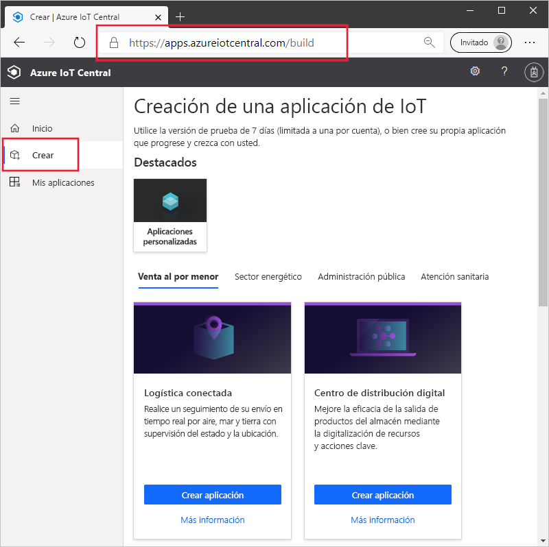
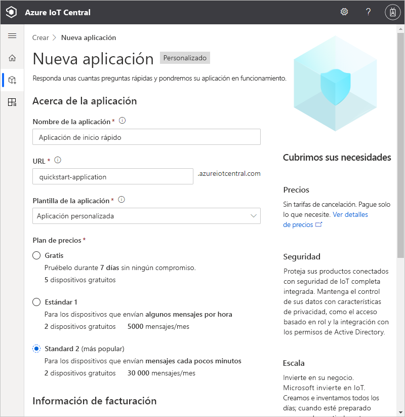
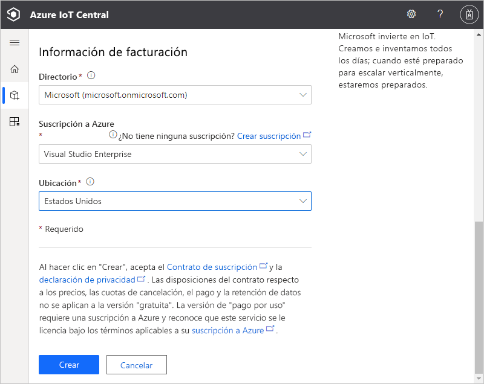
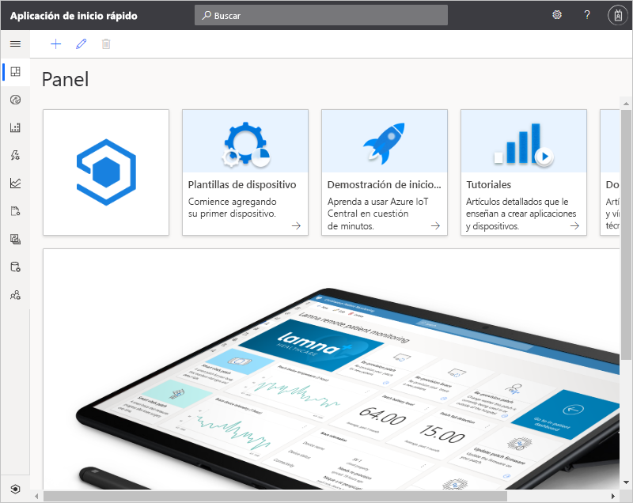

# Creación de una aplicación de Azure IoT Central

En este inicio rápido se muestra cómo crear una aplicación de Azure IoT Central.

## Crear una aplicación

Navegue al sitio de [Compilación Azure IoT Central](https://aka.ms/iotcentral). Después, inicie sesión con una cuenta Microsoft personal, profesional o educativa.

Puede crear una nueva aplicación desde la lista de plantillas de IoT Central relevantes del sector, lo que le ayudaría a empezar a trabajar rápidamente, o bien partir de cero con una plantilla de **Aplicaciones personalizadas**. En este inicio rápido se usa la plantilla **Aplicación personalizada**.

Para crear una aplicación de Azure IoT Central a partir de la plantilla **Aplicación personalizada**:

1. Vaya a la página **Compilar**:

    

1. Elija **Aplicaciones personalizadas** y asegúrese de que está seleccionada la plantilla **Aplicación personalizada**.

1. Azure IoT Central sugiere automáticamente un **nombre de aplicación** en función de la plantilla de aplicación que ha seleccionado. Puede usar este nombre o escribir su propio nombre descriptivo de la aplicación.

1. Azure IoT Central también genera un único prefijo de **dirección URL de aplicación**, según el nombre de la aplicación. Esta dirección URL se usa para tener acceso a la aplicación. Si quiere, cambie el prefijo de esta URL por algo más fácil de recordar.

    

    

    > [!NOTE]
    > Si seleccionó **Aplicación personalizada** en la página anterior, verá el elemento desplegable**Plantilla de aplicación**. Desde ahí puede cambiar entre plantillas personalizadas y heredadas. También puede ver otras plantillas que se han puesto a disposición de la organización.

1. Elija si desea crear esta aplicación mediante el plan de precios de evaluación gratuita durante siete días o uno de los planes de precios Estándar:

    - Las aplicaciones que se crean mediante el plan *gratuito* no tienen costo durante siete días y admiten un máximo de cinco dispositivos. En cualquier momento antes de que expiren puede convertirlas para que usen un plan de precios estándar.
    - Las aplicaciones que se crean con un plan *estándar* se facturan por dispositivo y se pueden elegir el plan de precios **Estándar 1** o **Estándar 2** y los dos primeros dispositivos son gratis. Obtenga más información sobre los planes de precios gratuito y estándar en la [página de precios de Azure IoT Central](https://azure.microsoft.com/pricing/details/iot-central/). Si crea una aplicación que use un plan de precios estándar, tendrá que seleccionar su *directorio*, *suscripción de Azure* y *ubicación*:
        - *Directorio* es la instancia de Azure Active Directory en que se crea la aplicación. Azure Active Directory contiene identidades de usuario, credenciales y otra información de la organización. Si no tiene Azure Active Directory, se crea uno automáticamente al crear una suscripción de Azure.
        - Una *suscripción de Azure* permite crear instancias de los servicios de Azure. IoT Central aprovisiona los recursos de su suscripción. Si no tiene una suscripción a Azure, puede crear la de forma gratuita en la [página de suscripción a Azure](https://aka.ms/createazuresubscription). Después de crear la suscripción a Azure, vuelva a la página **Nueva aplicación**. La nueva suscripción aparece en el cuadro de lista desplegable **Suscripción de Azure**.
        - *Ubicación* es la [zona geográfica](https://azure.microsoft.com/global-infrastructure/geographies/) en la que desea crear la aplicación. Normalmente, se debe elegir la ubicación más cercana físicamente a los dispositivos para un rendimiento óptimo. Una vez que elija una ubicación, no puede mover la aplicación a otra más adelante.

1. Revise los Términos y Condiciones y seleccione **Crear** en la parte inferior de la página. Después de unos minutos, IoT Central aplicación está lista para usarse:

    

## Pasos siguientes

En esta guía de inicio rápido, ha creado una aplicación de IoT Central. Este es el siguiente paso que le sugerimos:

> [!div class="nextstepaction"]
> [Agregar un dispositivo simulado a la aplicación IoT Central](./quick-create-pnp-device.md)
