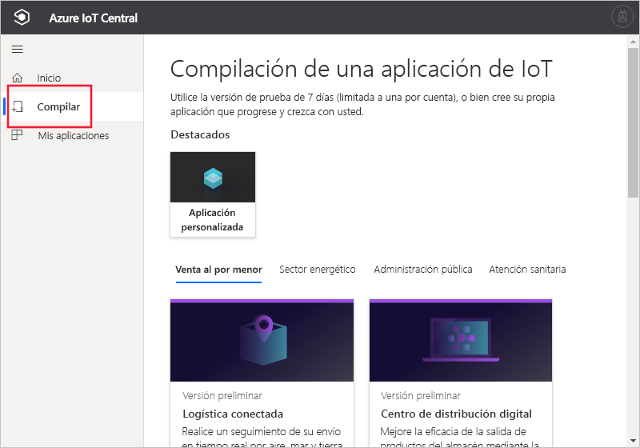

# Creación de una aplicación de Azure IoT Central

[!INCLUDE [iot-central-original-pnp](../../../includes/iot-central-original-pnp-note.md)]

Como _generador_, usará la interfaz de usuario de Azure IoT Central para definir la aplicación de Azure IoT Central. En esta guía de inicio rápido se muestra cómo crear una aplicación de Azure IoT Central que contenga un ejemplo de _plantilla de dispositivo_. La aplicación que cree no utilizará ninguna característica de vista previa.

## Crear una aplicación

Vaya al sitio web de la [compilación de Azure IoT Central](https://aka.ms/iotcentral). Después, inicie sesión con una cuenta Microsoft personal, profesional o educativa.

Para empezar a crear una aplicación de Azure IoT Central sin características de versión preliminar habilitadas, seleccione **Compilación**. Este vínculo le lleva a la página **Crear su propia aplicación de IoT**.

A continuación, seleccione **Aplicación personalizada**.

Para crear una nueva aplicación de Azure IoT Central:

1. Azure IoT Central sugiere automáticamente un nombre de aplicación basado en la plantilla de aplicación que ha seleccionado. Puede aceptar este nombre o escribir su propio nombre descriptivo de aplicación, como **Contoso IoT**. Azure IoT Central también genera una dirección URL única, en función del nombre de la aplicación. Cambiar si lo desea este prefijo de dirección URL por algo más fácil de recordar.

1. Seleccione la plantilla **Aplicación heredada** que no use características en vista previa (gb).

    | Plantilla de la aplicación | Descripción |
    | -------------------- | ----------- |
    | Aplicación heredada   | Permite crear una aplicación vacía para que pueda rellenarla con sus propias plantillas de dispositivo y dispositivos. |

1. Elija un plan de pago:
   - Las aplicaciones de la **prueba gratuita de 7 días** son gratuitas durante siete días y, luego, expiran. Se pueden convertir a **pago por uso** en cualquier momento antes de que expiren. Si crea una aplicación de **evaluación gratuita**, deberá escribir la información de contacto y elegir si desea recibir información y sugerencias de Microsoft.
   - Las aplicaciones de **Pago por uso** se cobran por dispositivo y los cinco primeros dispositivos son gratuitos. Si crea una aplicación de **Pago por uso**, deberá seleccionar su *directorio*, *suscripción de Azure* y *ubicación*:
        - El *Directorio* es la instancia de Azure Active Directory (AD) para crear la aplicación. Contiene las identidades de usuario, las credenciales y otra información de la organización. Si no tiene un inquilino de Azure AD, se crea uno automáticamente al crearse una suscripción de Azure.
        - Una *suscripción de Azure* permite crear instancias de los servicios de Azure. IoT Central aprovisiona los recursos de su suscripción. Si no tiene una suscripción de Azure, puede crear una en [la página de suscripción a Azure](https://aka.ms/createazuresubscription). Después de crear la suscripción de Azure, vuelva a la página **Crear aplicación**. La nueva suscripción aparecerá en el cuadro de lista desplegable **Suscripción de Azure**.
        - *Ubicación* es la [zona geográfica](https://azure.microsoft.com/global-infrastructure/geographies/) donde quiere crear la aplicación. Normalmente, se debe elegir la ubicación más cercana físicamente a los dispositivos para un rendimiento óptimo. Azure IoT Central está disponible actualmente en **Estados Unidos**, **Australia**, **Asia Pacífico** o **Europa**.  Una vez elegida una ubicación, no podrá mover la aplicación a otra más adelante.

        Obtenga más información sobre los precios en la [página de precios de Azure IoT Central](https://azure.microsoft.com/pricing/details/iot-central/).

1. Rellene la información adicional necesaria para el plan de pago que seleccionó anteriormente en el paso 1.

1. En la parte inferior de la página, seleccione **Crear**.

## Pasos siguientes

En esta guía de inicio rápido, ha creado una aplicación de IoT Central. Este es el siguiente paso que le sugerimos:

> [!div class="nextstepaction"]
> [Definición de un nuevo tipo de dispositivo en la aplicación de Azure IoT Central](./tutorial-define-device-type.md)
