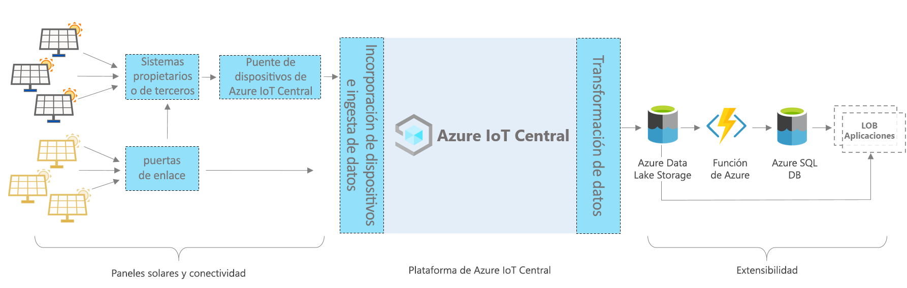

# Azure IoT Central: arquitectura de aplicaciones de panel solar

En este artículo se proporciona información general sobre la arquitectura de la plantilla de aplicaciones de supervisión de paneles solares. En el diagrama siguiente se muestra una arquitectura de uso común de aplicaciones de paneles solares en Azure que usa la plataforma de IoT Central.

> [!div class="mx-imgBorder"]
> 

Esta arquitectura consta de los siguientes componentes. Puede que algunas aplicaciones no requieran todos los componentes que se mencionan aquí.

## Paneles solares y conectividad 

Los paneles solares son una fuente significativa de energía renovable. En función del tipo de panel solar y de la configuración, puede conectarlo mediante puertas de enlace u otros dispositivos intermedios y sistemas de propiedad. Puede que necesite crear un dispositivo de puente de IoT Central para conectar los dispositivos que no pueden hacerlo directamente. El puente de dispositivo de IoT Central es una solución de código abierto y puede encontrar los detalles completos [aquí](https://docs.microsoft.com/azure/iot-central/core/howto-build-iotc-device-bridge). 

## Plataforma de IoT Central
Azure IoT Central es una plataforma que simplifica la compilación de su solución de IoT y permite reducir la carga y los costos de la administración, las operaciones y el desarrollo de IoT. Con IoT Central, puede conectar, supervisar y administrar fácilmente sus recursos de Internet de las cosas (IoT) a escala. Después de conectar los paneles solares a IoT Central, la plantilla de aplicación usa características integradas, como modelos de dispositivos, comandos y paneles. La plantilla de la aplicación también usa el almacenamiento de IoT Central para escenarios de ruta de acceso activa, como la supervisión, el análisis, las reglas y la visualización de datos de medición casi en tiempo real.

## Opciones de extensibilidad para la compilación con IoT Central
La plataforma de IoT Central proporciona dos opciones de extensibilidad: Exportación de datos continua (CDE) y API. Los clientes y asociados pueden elegir entre estas opciones en función de la personalización de sus soluciones para necesidades específicas. Por ejemplo, uno de nuestros asociados configuró CDE con Azure Data Lake Storage (ADLS). Usa ADLS para la retención de datos a largo plazo y otros escenarios de almacenamiento de la ruta de acceso pasiva, como el procesamiento por lotes, la auditoría e informes. 

## Pasos siguientes

* Ahora que ya conoce la arquitectura, [cree una aplicación de panel solar de forma gratuita](https://apps.azureiotcentral.com/build/new/solar-panel-monitoring).
* Para más información acerca de IoT Central, consulte [Introducción a IoT Central](https://docs.microsoft.com/azure/iot-central/).