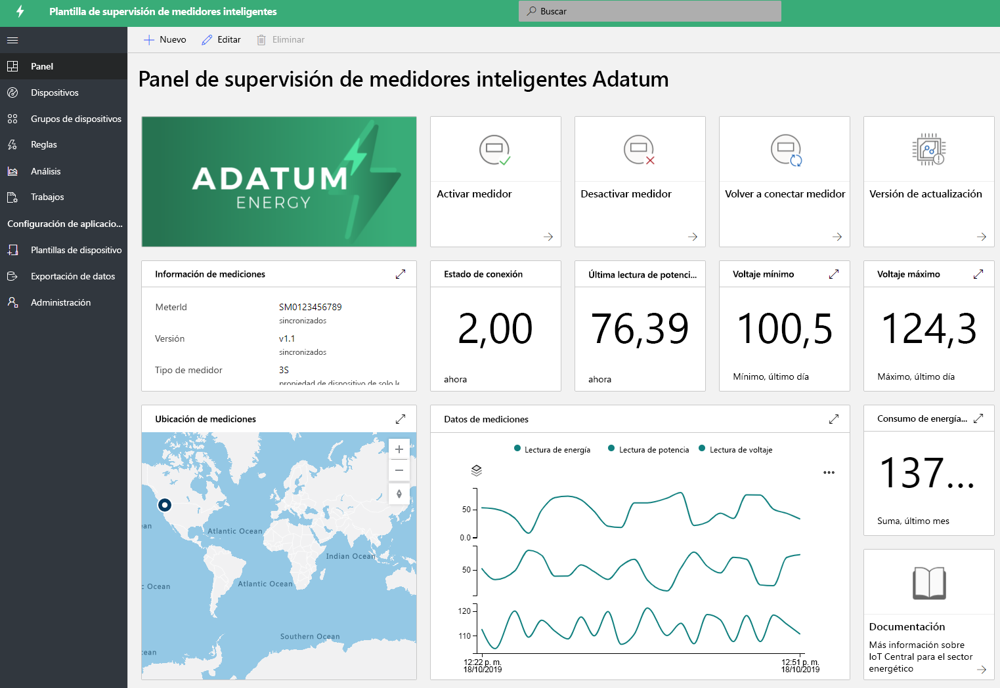
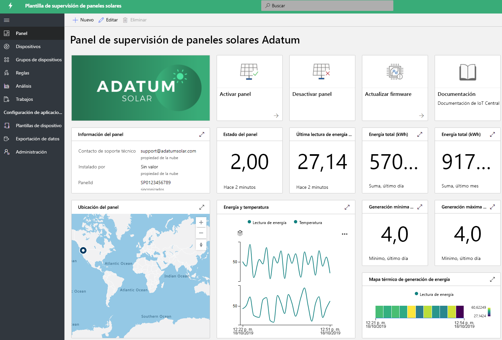

# Creación de soluciones de energía con IoT Central 

Los paneles solares y los medidores inteligentes desempeñan un papel importante en la transformación del sector energético. Los medidores inteligentes proporcionan más controles e información en tiempo real sobre los consumos energéticos, y el aumento de los paneles solares está impulsando un gran avance en la generación de energía renovable. Las aplicaciones de supervisión de paneles solares y medidores inteligentes son plantillas de ejemplo que muestran distintas funcionalidades. Los asociados pueden aprovechar estas plantillas para crear soluciones energéticas con IoT Central que satisfagan sus necesidades específicas. No se requiere ningún nuevo código ni costo adicional para implementar y usar estas aplicaciones. Obtenga más información acerca de las plantillas de aplicaciones energéticas y sus funcionalidades.

## ¿Qué es la aplicación de supervisión de medidores inteligentes?
 Los medidores inteligentes no solo permiten la facturación automática, sino que también casos de uso de medición avanzada, como las lecturas en tiempo real y la comunicación bidireccional. La plantilla de aplicaciones de medidores inteligentes permite a los servicios públicos y los asociados supervisar el estado y los datos de los medidores inteligentes, así como definir alarmas y notificaciones. Proporciona comandos de muestra, como, por ejemplo, para desconectar el medidor y actualizar el software. Los datos del medidor se pueden configurar para que se dirijan a otras aplicaciones empresariales y para desarrollar soluciones personalizadas. 

Funcionalidades clave de la aplicación: 

* Ejemplo de un modelo de dispositivo de medidor 
* Información del medidor y estado activo 
* Lecturas de los medidores, como energía, alimentación y voltajes
* Ejemplos de comandos de medidor 
* Visualizaciones y paneles integrados
* Extensibilidad para el desarrollo de soluciones personalizadas

Puede probar la [aplicación de supervisión de medidores inteligentes de forma gratuita](https://apps.azureiotcentral.com/build/new/smart-meter-monitoring) sin ninguna suscripción a Azure y sin compromiso.

Después de implementar la aplicación, verá los datos de medición simulados en el panel, tal como se muestra en la ilustración siguiente. Esta plantilla es una aplicación de ejemplo que puede extender y personalizar fácilmente para sus casos de uso específicos.

> [!div class="mx-imgBorder"]
> 

## ¿Qué es la aplicación de supervisión de paneles solares?
La aplicación de supervisión de paneles solar permite a los servicios públicos y los asociados supervisar paneles solares, como su estado de conexión y de generación de energía casi en tiempo real. Puede enviar notificaciones basadas en criterios de umbral definidos. Proporciona comandos de ejemplo, como, por ejemplo, para actualizar el firmware y otras propiedades. Los datos de los paneles solares se pueden configurar para que se dirijan a otras aplicaciones empresariales y para desarrollar soluciones personalizadas. 

Funcionalidades clave de la aplicación: 

* Ejemplo de un modelo de dispositivo de paneles solares 
* Información sobre paneles solares y estado activo
* Generación de la energía solar y otras lecturas
* Ejemplos de comandos y controles
* Visualizaciones y paneles integrados
* Extensibilidad para el desarrollo de soluciones personalizadas

Puede probar la [aplicación de supervisión de paneles solares de forma gratuita](https://apps.azureiotcentral.com/build/new/solar-panel-monitoring) sin ninguna suscripción a Azure y sin compromiso.

Después de implementar la aplicación, verá los datos de los paneles solares simulados en un plazo de 1 o 2 minutos, tal como se muestra en el panel siguiente. Esta plantilla es una aplicación de ejemplo que puede extender y personalizar fácilmente para sus casos de uso específicos. 

> [!div class="mx-imgBorder"]
> 

## Pasos siguientes
Para empezar a crear una solución energética:
* Cree plantillas de aplicación de forma gratuita: [aplicación de medidores inteligentes](https://apps.azureiotcentral.com/build/new/smart-meter-monitoring), [aplicación de paneles solares](https://apps.azureiotcentral.com/build/new/solar-panel-monitoring)
* Más información sobre [conceptos de aplicaciones de supervisión de medidores inteligentes](https://docs.microsoft.com/azure/iot-central/energy/concept-iot-central-smart-meter-app)
* Más información sobre [conceptos de aplicaciones de supervisión del paneles solares](https://docs.microsoft.com/azure/iot-central/energy/concept-iot-central-solar-panel-app)
* Más información sobre la [plataforma de IoT Central](https://docs.microsoft.com/azure/iot-central/)
