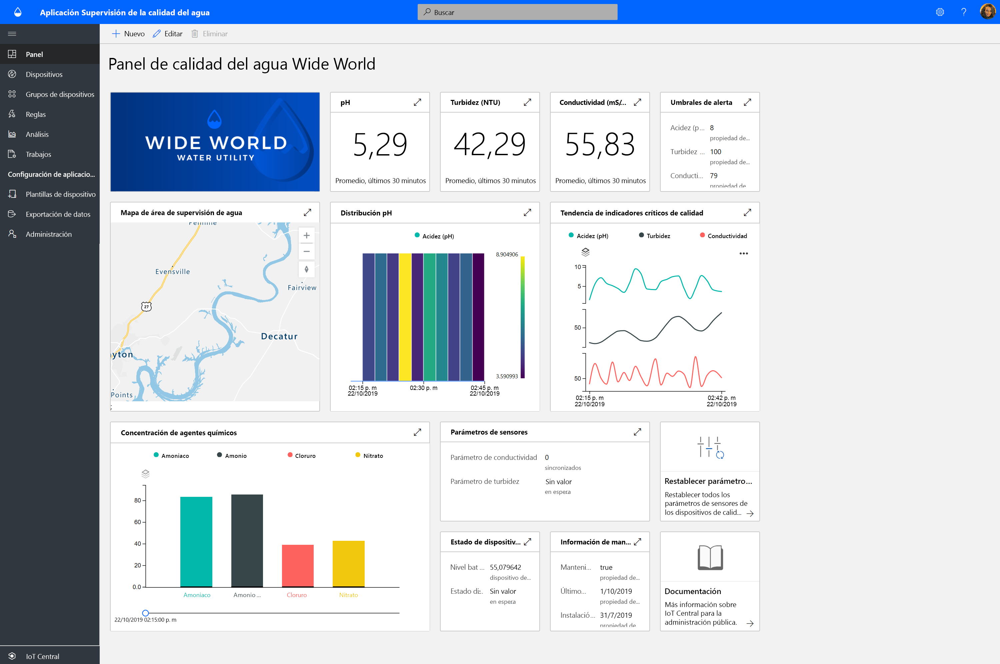
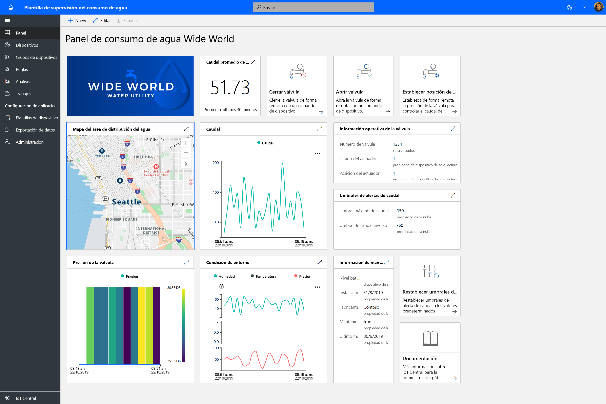
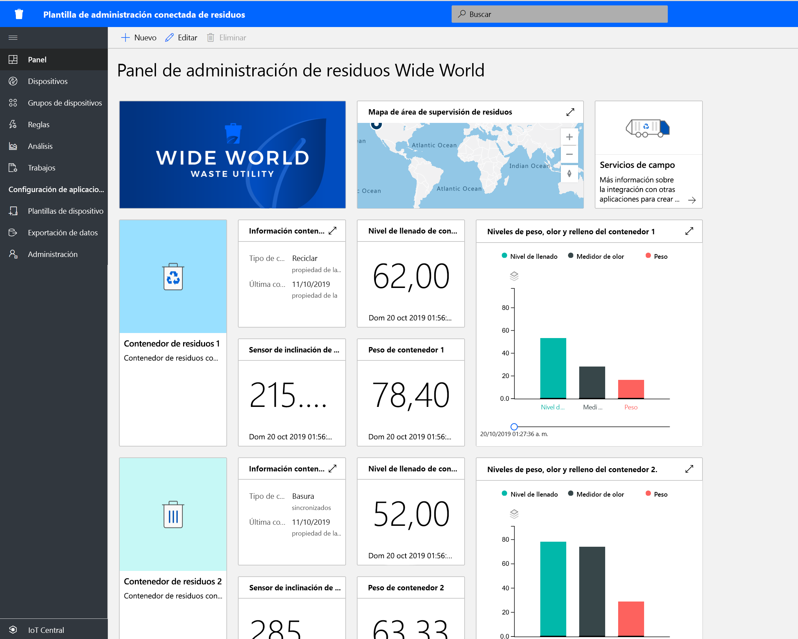

# Creación de soluciones gubernamentales con Azure IoT Central

Empiece con la creación de soluciones inteligentes para la ciudad mediante las plantillas de aplicación de Azure IoT Central. Empiece ahora con la **supervisión de la calidad del agua**, la **supervisión del consumo de agua** y la **administración de residuos conectados**.

## ¿Qué es la plantilla de la aplicación Water Quality Monitoring?   

La supervisión de la calidad del agua tradicional se basa en técnicas de muestreo manual y análisis de laboratorio de campo, lo que lleva mucho tiempo y dinero. Mediante la supervisión remota de la calidad del agua en tiempo real, se pueden administrar los problemas de calidad del agua antes de que los ciudadanos resulten afectados. Además, con el análisis avanzado, los servicios de agua y los organismos ambientales pueden actuar rápidamente si se aparecen problemas de calidad del agua y planear por adelantado el tratamiento que se da al agua.  

La aplicación Water Quality Monitoring es una plantilla de aplicación de IoT Central que le ayuda a iniciar el desarrollo de su solución de IoT y permite que los servicios de agua supervisen digitalmente la calidad del agua en las ciudades inteligentes. 

La plantilla de la aplicación consta de:
* Paneles de operadores de ejemplo
* Plantillas de dispositivos de supervisión de la calidad del agua de ejemplo
* Dispositivos de supervisión de la calidad del agua simulados
* Reglas y trabajos preconfigurados
* Personalización de marca mediante etiquetado en blanco 

Empiece a trabajar con el tutorial de la aplicación [Water Quality Monitoring](./tutorial-water-quality-monitoring.md).

## ¿Qué es la plantilla de la aplicación Water Consumption Monitoring? 

Tradicionalmente, para realizar el seguimiento del consumo de agua las empresas distribuidoras de agua leen manualmente los contadores de consumo de agua en los sitios de medición. Cada vez más ciudades están reemplazando los contadores tradicionales por contadores inteligentes avanzados, lo que permite la supervisión remota del consumo y el control remoto de las válvulas que controlan el flujo de agua. La supervisión del consumo de agua, junto con el mensaje de comentarios digitales al ciudadano, pueden aumentar la concienciación y reducir el consumo de agua. 

La aplicación Water Consumption Monitoring es una plantilla de aplicación de IoT Central que le ayuda a iniciar el desarrollo de su solución de IoT para que los servicios de agua y las ciudades supervisen y controlen de forma remota el flujo de agua para reducir el consumo. 

  

La plantilla de la aplicación Water Consumption Monitoring consta de varios elementos preconfigurados:
* Paneles de operadores de ejemplo
* Plantillas de dispositivos de supervisión de la calidad del agua de ejemplo
* Dispositivos de supervisión de la calidad del agua simulados
* Reglas y trabajos preconfigurados
* Personalización de marca mediante etiquetado en blanco 

 Empiece a trabajar con el tutorial de la aplicación [Water Consumption Monitoring](./tutorial-water-consumption-monitoring.md).

## ¿Qué es la plantilla de la aplicación Connected Waste Management? 

La aplicación Connected Waste Management es una plantilla de aplicación de IoT Central que le ayuda a iniciar el desarrollo de su solución de IoT para que las ciudades inteligentes realicen una supervisión remota para maximizar la recogida eficaz de residuos. 

 

La plantilla de la aplicación Connected Waste Management consta de los siguientes elementos preconfigurados:
* Paneles de operadores de ejemplo
* Plantillas de dispositivos de cubo de basura conectados
* Dispositivos de cubo de basura conectados
* Reglas y trabajos preconfigurados
* Personalización de marca mediante etiquetado en blanco 

Empiece a trabajar con el [tutorial de la aplicación Connected Waste Management](./tutorial-connected-waste-management.md).

## Pasos siguientes

* Pruebe cualquiera de las plantillas de la aplicación Government en IoT Central de forma gratuita [crear aplicación](https://apps.azureiotcentral.com/build/government)
* Más información sobre los [conceptos de la supervisión de la calidad del agua](./concepts-waterqualitymonitoring-architecture.md)
* Más información sobre los [conceptos de la supervisión del consumo de agua](./concepts-waterconsumptionmonitoring-architecture.md)
* Más información sobre los [conceptos de administración de residuos conectados](./concepts-connectedwastemanagement-architecture.md)  
* Para más información acerca de IoT Central, consulte [Introducción a IoT Central](https://docs.microsoft.com/azure/iot-central/core/overview-iot-central)
 