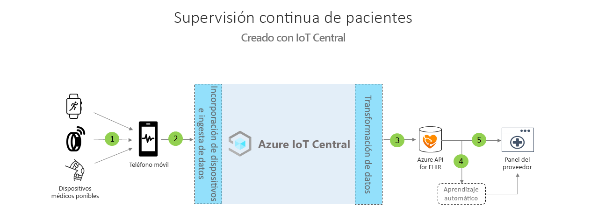

# Arquitectura de la supervisión de pacientes continua

Para crear soluciones de supervisión continua de pacientes se puede utilizar la plantilla de aplicación proporcionada y se puede usar la arquitectura que se describe a continuación como guía.

>[!div class="mx-imgBorder"] 
>

1. Dispositivos médicos que se comunican mediante Bluetooth de bajo consumo (BLE)
1. La puerta de enlace de teléfono móvil recibe datos de BLE y los envía a IoT Central
1. Exportación continua de datos de estado de pacientes a Azure API for FHIR&reg;
1. Aprendizaje automático basado en datos interoperables
1. Panel del equipo de asistencia basado en los datos de FHIR

## Detalles
En esta sección se describe cada parte del diagrama de la arquitectura con más detalle.

### Dispositivos médicos de BLE
Muchos dispositivos médicos ponibles que se usan en el espacio de IoT sanitario tienen Bluetooth de bajo consumo. No pueden hablar directamente en la nube, por lo que deberán pasar por una puerta de enlace. Esta arquitectura sugiere el uso de una aplicación de teléfono móvil como puerta de enlace.

### Puerta de enlace de teléfono móvil
La función principal de la aplicación de teléfono móvil es ingerir datos de BLE de dispositivos médicos y comunicarse con Azure IoT Central. Además, la aplicación puede ayudar a guiar a los pacientes en la configuración y flujo de aprovisionamiento de dispositivos, así como a ver sus datos sanitarios. Otras soluciones pueden utilizar una puerta de enlace de tableta o una puerta de enlace estática si se encuentra dentro de una habitación de hospital para lograr el mismo flujo de comunicación.

### Exportar a Azure API for FHIR&reg;
Azure IoT Central cumple las directrices que establece HIPAA y cuenta con la certificación HITRUST&reg;, pero también puede enviar datos relacionados con la salud de los pacientes a Azure API for FHIR. [Azure API for FHIR](../../healthcare-apis/overview.md) es una API totalmente administrada, basada en estándares para datos clínicos que le permite crear nuevos sistemas de interacción con los datos clínicos. Permite el intercambio rápido de datos con API para FHIR y cuenta con el respaldo de una oferta de plataforma como servicio (PaaS) administrada en la nube. Con la funcionalidad de exportación continua de datos de IoT Central, puede enviar datos a Azure API for FHIR.

### Machine Learning
Después de agregar los datos y convertirlos al formato FHIR, puede crear modelos de aprendizaje automático que puedan enriquecer las conclusiones y habilitar una toma de decisiones más inteligente para el equipo de atención. Hay distintos tipos de servicios que se pueden usar para crear, entrenar e implementar modelos de aprendizaje automático. Puede encontrar más información sobre el uso de las ofertas de aprendizaje automático de Azure en la [documentación sobre el aprendizaje automático](../../machine-learning/index.yml).

### Panel del proveedor
Los datos que se encuentran en Azure API for FHIR se pueden usar para crear un panel de conclusiones de pacientes o se pueden integrar directamente en un EMR para ayudar a los equipos de atención al paciente a visualizar el estado de los pacientes. Los equipos de atención médica pueden usar este panel para atender a pacientes que necesiten asistencia y detectar signos de deterioro alarmantes lo antes posible. Para obtener información sobre cómo crear un panel de proveedor en tiempo real de Power BI, siga nuestra [guía de procedimientos ](howto-health-data-triage.md).

## Pasos siguientes
* [Más información sobre cómo implementar una plantilla de aplicación de supervisión continua de pacientes](tutorial-continuous-patient-monitoring.md)