# Paseo por la interfaz de usuario de Azure IoT Central (características en versión preliminar)

[!INCLUDE [iot-central-pnp-original](../../includes/iot-central-pnp-original-note.md)]

Este artículo presenta la interfaz de usuario de Microsoft Azure IoT Central. Puede usar la interfaz de usuario para crear, administrar y usar una solución de Azure IoT Central y sus dispositivos conectados.

Como _compilador_, usará la interfaz de usuario de Azure IoT Central para definir la solución de Azure IoT Central. Puede usar la interfaz de usuario para:

* Definir los tipos de dispositivos que se conectan a la solución.
* Configurar las reglas y las acciones para sus dispositivos.
* Personalizar la interfaz de usuario para un _operador_ que utiliza la solución.

Como _operador_, usará la interfaz de usuario de Azure IoT Central para administrar la solución de Azure IoT Central. Puede usar la interfaz de usuario para:

* Supervisar los dispositivos.
* Configurar los dispositivos.
* Solucionar los problemas y errores de los dispositivos.
* Aprovisionar dispositivos nuevos.

## Uso del menú de navegación izquierdo

Use el menú de navegación izquierdo para acceder a las diferentes áreas de la aplicación. Puede expandir o contraer la barra de navegación mediante la selección de **<** o **>** :

| Menú | Descripción |
| ---- | ----------- |
| 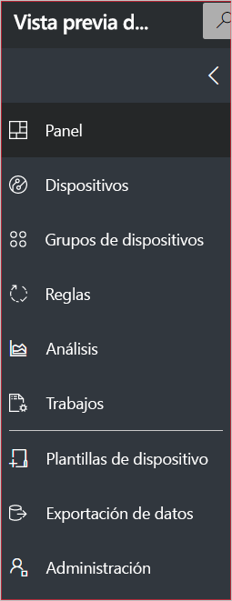 | <ul><li>La página **Dashboard** (Panel) muestra el panel de la aplicación. Como generador, puede personalizar el panel para los operadores. Los usuarios también pueden crear sus propios paneles.</li><li>La página **Devices** (Dispositivos) muestra los dispositivos simulados y reales asociados a cada plantilla de la aplicación. Los operadores usan **Devices** (Dispositivos) para administrar los dispositivos conectados.</li><li>La página **Device groups** (Grupos de dispositivos) permite ver y crear grupos de dispositivos. Los operadores pueden crear grupos de dispositivos como una colección lógica de los dispositivos especificados por una consulta.</li><li>La página **Rules** (Reglas) permite editar reglas que se activan en función de la telemetría del dispositivo y desencadenan acciones personalizables.</li><li>La página **Analytics** (Análisis) muestra los análisis derivados de los datos de telemetría del dispositivo y de los grupos de dispositivos. Como operador, puede crear vistas personalizadas a partir de los datos de los dispositivos para obtener información detallada de la aplicación.</li><li>La página **Jobs** (Trabajos) habilita la administración de dispositivos en masa, ya que es preciso crear y ejecutar trabajos para actualizar los dispositivos a escala.</li><li>La página **Device templates** (Plantillas de dispositivo) muestra las herramientas que utiliza un generador para crear y administrar las plantillas de dispositivo.</li><li>La página **Data Export** (Exportación de datos) permite a un administrador configurar una exportación continua a otros servicios de Azure, como el almacenamiento y las colas.</li><li>La página **Administration** (Administración) muestra las páginas de administración de aplicaciones en las que un administrador puede administrar la configuración, los usuarios y los roles de una aplicación.</li></ul> |

## Búsqueda, ayuda y soporte técnico

El menú superior aparece en todas las páginas:

* Para buscar plantillas de dispositivos y dispositivos, escriba un valor **Buscar**.
* Para cambiar el idioma o el tema de la interfaz de usuario, elija el icono **Configuración**.
* Para cerrar la sesión de la aplicación, elija el icono **Cuenta**.
* Para obtener ayuda y soporte técnico, elija el menú desplegable **Ayuda** para obtener una lista de recursos. En una aplicación de prueba, los recursos de soporte técnico incluyen acceso al [chat en directo](howto-show-hide-chat.md?toc=/azure/iot-central-pnp/toc.json&bc=/azure/iot-central-pnp/breadcrumb/toc.json).

Puede elegir entre un tema claro o un tema oscuro para la interfaz de usuario:

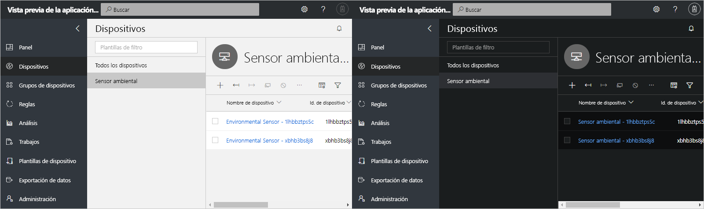

> [!NOTE]
> La opción de elegir entre temas claros y oscuros no está disponible si su administrador ha configurado un tema personalizado para la aplicación.

## panel

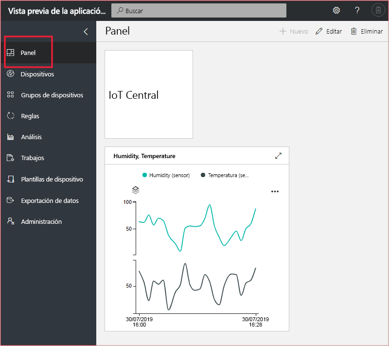

* El panel es la primera página que verá cuando inicie sesión en la aplicación de Azure IoT Central. Como generador, puede personalizar el panel de la aplicación para otros usuarios mediante la adición de iconos. Para más información, consulte el tutorial [Configuración de una plantilla de dispositivo](tutorial-define-device-type-pnp.md?toc=/azure/iot-central-pnp/toc.json&bc=/azure/iot-central-pnp/breadcrumb/toc.json).

* Como operador, puede crear paneles personalizados y cambiar entre ellos y el panel predeterminado. Para más información, consulte el artículo de procedimientos [Crear y administrar paneles personales](howto-personalize-dashboard.md?toc=/azure/iot-central-pnp/toc.json&bc=/azure/iot-central-pnp/breadcrumb/toc.json).

## Dispositivos

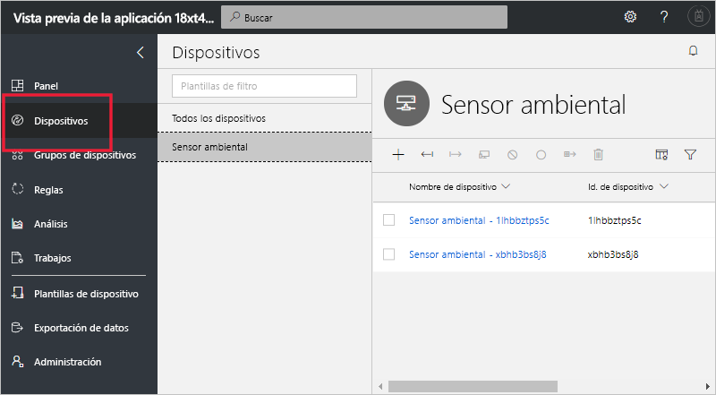

La página del explorador muestra los _dispositivos_ que hay en la aplicación de Azure IoT Central agrupados por _plantilla del dispositivo_.

* Una plantilla de dispositivo define un tipo de dispositivo que se puede conectar a la aplicación. Para más información, consulte [Define a new device type in your Azure IoT Central application](tutorial-define-device-type-pnp.md?toc=/azure/iot-central-pnp/toc.json&bc=/azure/iot-central-pnp/breadcrumb/toc.json) (Definición de un nuevo tipo de dispositivo en la aplicación de Azure IoT Central).
* Un dispositivo representa un dispositivo real o simulado en la aplicación. Para más información, consulte [Add a real device to your Azure IoT Central application](tutorial-add-device-pnp.md?toc=/azure/iot-central-pnp/toc.json&bc=/azure/iot-central-pnp/breadcrumb/toc.json) (Adición de un nuevo dispositivo a la aplicación de Azure IoT Central).

## Grupos de dispositivos

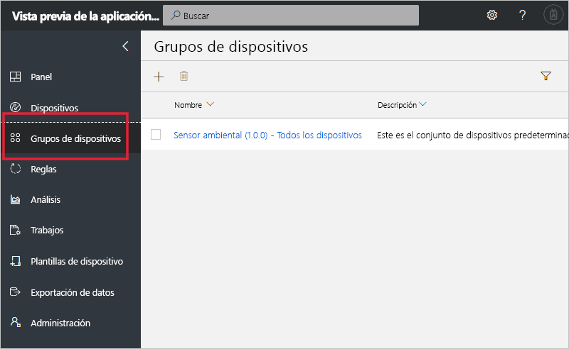

La página _device groups_ (Grupos de dispositivos) muestra los conjuntos de dispositivos que ha creado el generador. Un grupo de dispositivos es una colección de dispositivos relacionados. Un generador define una consulta para identificar los dispositivos que se incluyen en un grupo de dispositivos. Los grupos de dispositivos se utilizan para personalizar el análisis en la aplicación. Para más información, consulte el artículo [Uso de grupos de dispositivos en la aplicación de Azure IoT Central](howto-use-device-groups-pnp.md?toc=/azure/iot-central-pnp/toc.json&bc=/azure/iot-central-pnp/breadcrumb/toc.json).

## Reglas

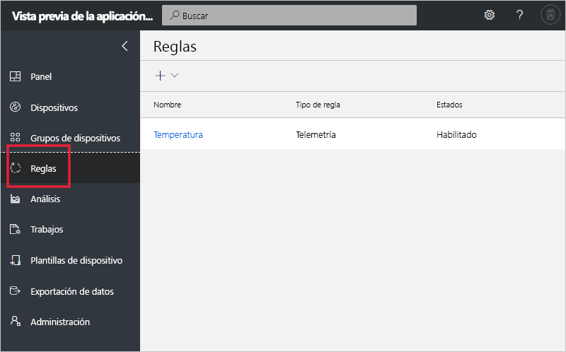

La página de reglas permite definir reglas en función de la telemetría, el estado del dispositivo o los eventos del dispositivo. Cuando se activa una regla, puede desencadenar cualquier acción, como el envío de un correo a un proveedor. El generador usa esta página para crear y administrar reglas. Para más información, consulte el tutorial [Configuración de reglas y acciones para sus dispositivos en Azure IoT Central](tutorial-configure-rules-pnp.md?toc=/azure/iot-central-pnp/toc.json&bc=/azure/iot-central-pnp/breadcrumb/toc.json).

## Análisis

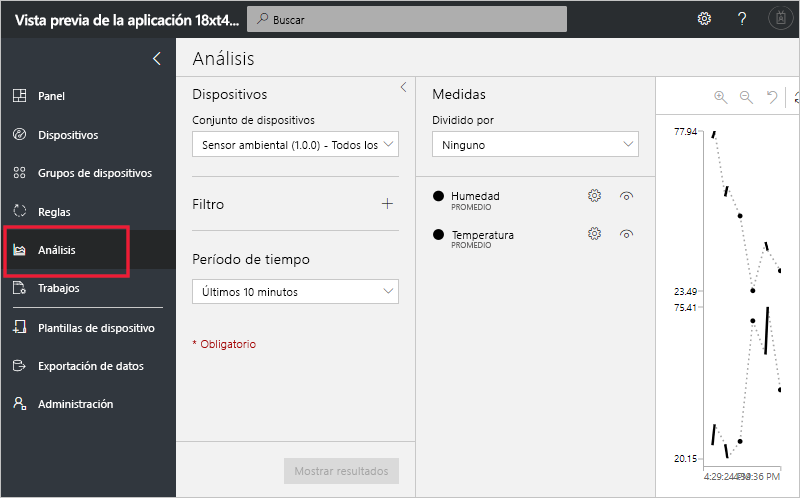

La página de análisis muestra gráficos que le ayudarán a entender cómo se comportan los dispositivos conectados a la aplicación. Un operador usará esta página para supervisar e investigar los problemas de los dispositivos conectados. El compilador puede definir los gráficos que se muestran en esta página. Para más información, consulte el artículo [Create custom analytics for your Azure IoT Central application](howto-use-device-groups-pnp.md?toc=/azure/iot-central-pnp/toc.json&bc=/azure/iot-central-pnp/breadcrumb/toc.json) (Creación de análisis personalizados para la aplicación de Azure IoT Central).

## Trabajos

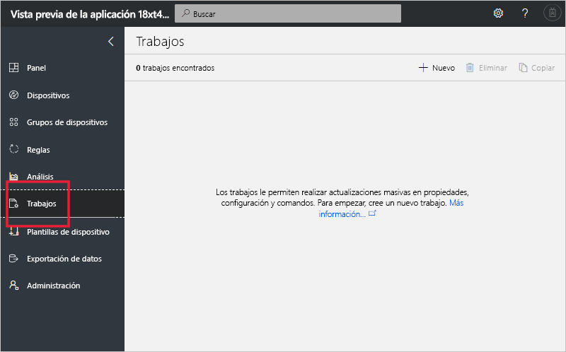

La página de trabajos le permite realizar operaciones de administración de dispositivos en masa. El compilador usa esta página para actualizar los comandos, la configuración y las propiedades del dispositivo. Para obtener más información, consulte el artículo [Run a job](howto-run-a-job.md?toc=/azure/iot-central-pnp/toc.json&bc=/azure/iot-central-pnp/breadcrumb/toc.json) (Ejecución de un trabajo).

## Plantillas de dispositivo

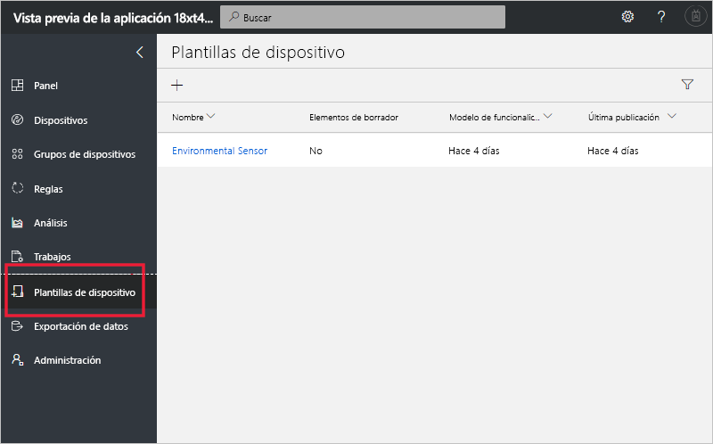

La página de plantillas de dispositivos es donde un generador crea y administra las plantillas de dispositivo en la aplicación. Una plantilla de dispositivo especifica las características del dispositivo, por ejemplo:

* Medidas de telemetría, estado y eventos
* Propiedades.
* Comandos

El generador también puede crear formularios y paneles para que los operadores los usen para administrar dispositivos.

Para más información, consulte el tutorial [Define a new device type in your Azure IoT Central application](tutorial-define-device-type-pnp.md?toc=/azure/iot-central-pnp/toc.json&bc=/azure/iot-central-pnp/breadcrumb/toc.json) (Definición de un nuevo tipo de dispositivo en la aplicación de Azure IoT Central).

## Exportación de datos

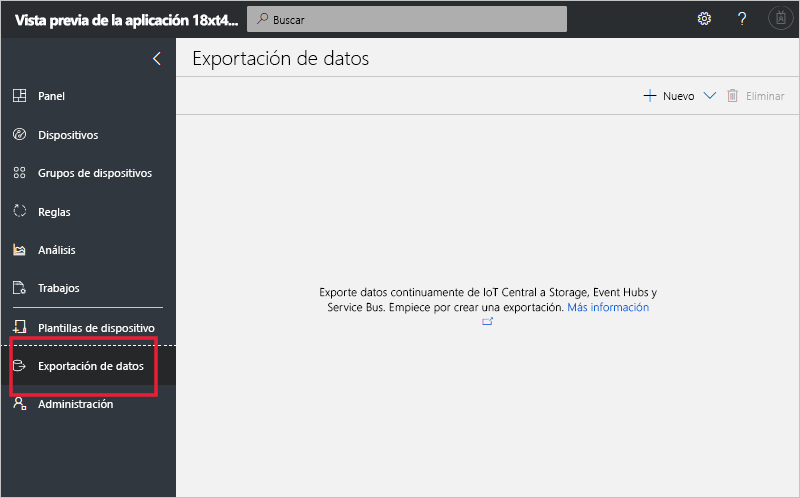

La página de exportación de datos es el lugar en que los administradores definen cómo transmitir datos en secuencias, como la telemetría, desde la aplicación. Otros servicios pueden almacenar los datos exportados o utilizarlos para el análisis. Para más información, consulte el artículo [Exportación de datos a Azure IoT Central](howto-export-data.md?toc=/azure/iot-central-pnp/toc.json&bc=/azure/iot-central-pnp/breadcrumb/toc.json).

## Administración

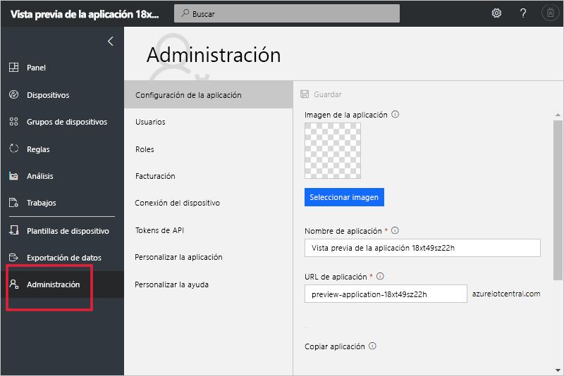

La página de administración contiene vínculos a las herramientas que usa un administrador, como definir los usuarios y roles de la aplicación y personalizar la interfaz de usuario. Para más información, consulte el artículo [Administer your Azure IoT Central application](howto-administer-pnp.md?toc=/azure/iot-central-pnp/toc.json&bc=/azure/iot-central-pnp/breadcrumb/toc.json) (Administración de la aplicación de Azure IoT Central).

## Pasos siguientes

Ahora que ya tiene información general sobre Azure IoT Central y está familiarizado con el diseño de la interfaz de usuario, el siguiente paso sugerido es completar la guía de inicio rápido [Create an Azure IoT Central application](quick-deploy-iot-central-pnp.md?toc=/azure/iot-central-pnp/toc.json&bc=/azure/iot-central-pnp/breadcrumb/toc.json) (Creación de una aplicación de Azure IoT Central).
