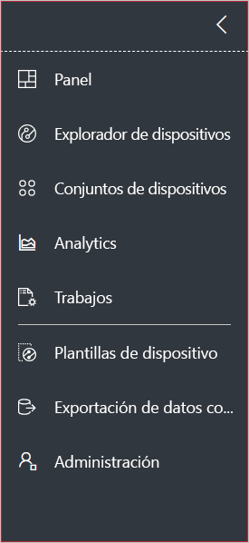
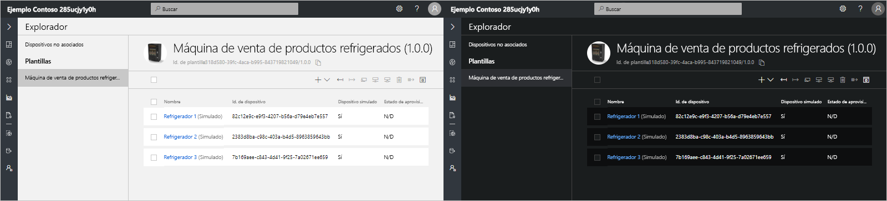
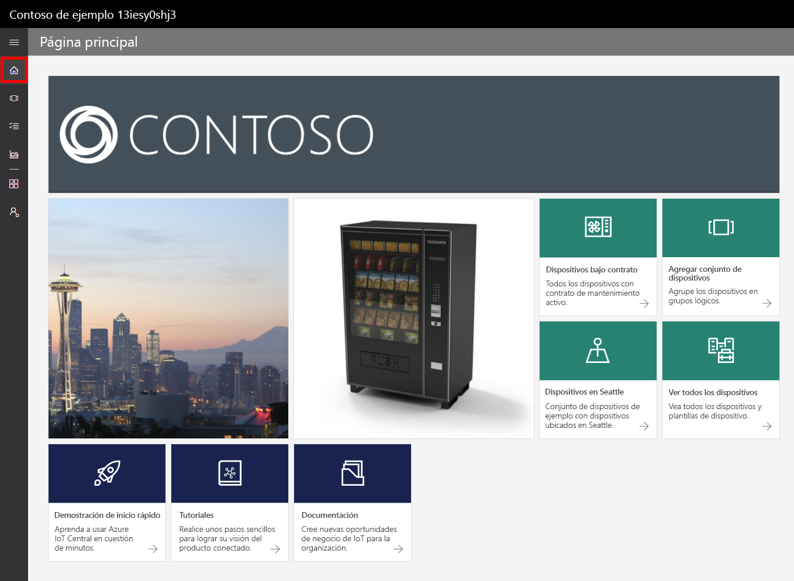
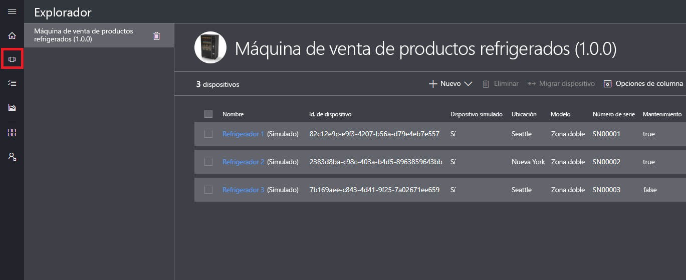
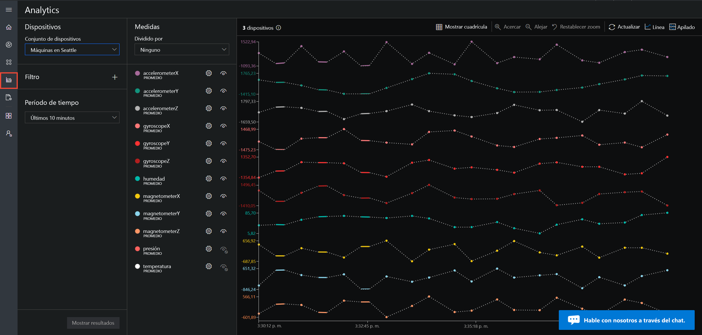
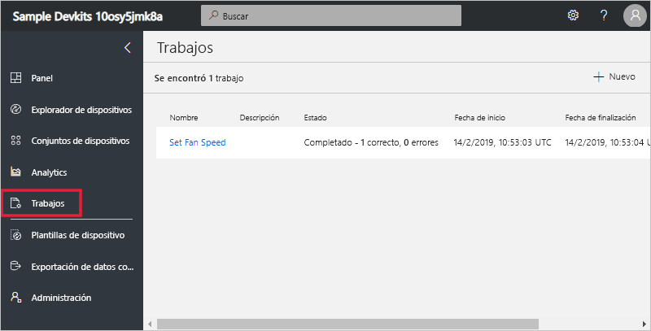
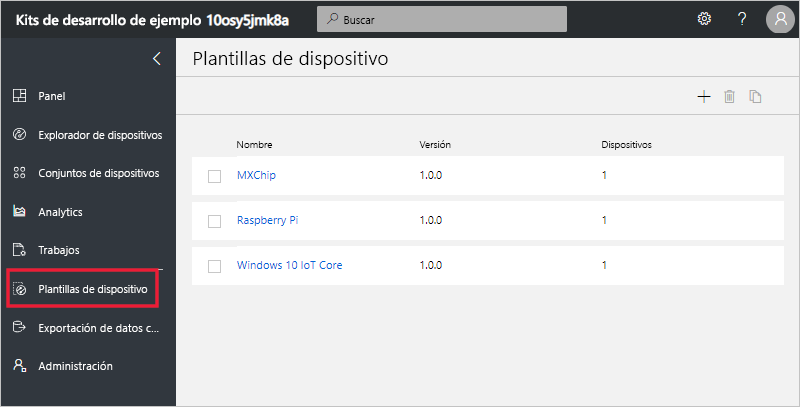
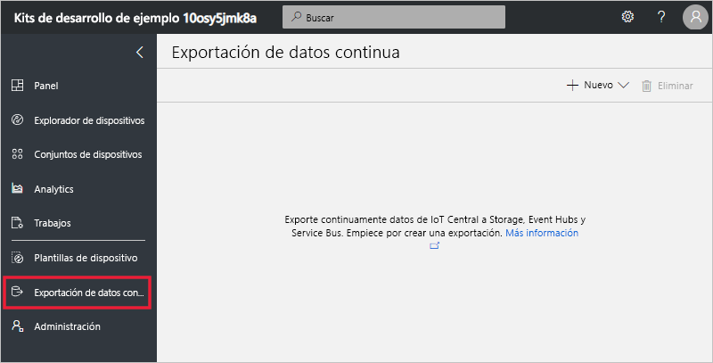

# Un paseo por la interfaz de usuario de Azure IoT Central

Este artículo presenta la interfaz de usuario de Microsoft Azure IoT Central. Puede usar la interfaz de usuario para crear, administrar y usar una solución de Azure IoT Central y sus dispositivos conectados.

Como _compilador_, usará la interfaz de usuario de Azure IoT Central para definir la solución de Azure IoT Central. Puede usar la interfaz de usuario para:

- Definir los tipos de dispositivos que se conectan a la solución.
- Configurar las reglas y las acciones para sus dispositivos.
- Personalizar la interfaz de usuario para un _operador_ que utiliza la solución.

Como _operador_, usará la interfaz de usuario de Azure IoT Central para administrar la solución de Azure IoT Central. Puede usar la interfaz de usuario para:

- Supervisar los dispositivos.
- Configurar los dispositivos.
- Solucionar los problemas y errores de los dispositivos.
- Aprovisionar dispositivos nuevos.

## Uso del menú de navegación izquierdo

Use el menú de navegación izquierdo para acceder a las diferentes áreas de la aplicación. Puede expandir o contraer la barra de navegación mediante la selección de **<** o **>**:

| Menú | DESCRIPCIÓN |
| ---- | ----------- |
|  | <ul><li>El botón **Panel** muestra el panel de la aplicación. Como generador, puede personalizar el panel para los operadores. Los usuarios también pueden crear sus propios paneles.</li><li>El botón **Device Explorer** (Explorador de dispositivos) muestra los dispositivos simulados y reales asociados a cada plantilla de la aplicación. Como operador, usará **Device Explorer** (Explorador de dispositivos) para administrar los dispositivos conectados.</li><li>El botón **Device Sets** (Conjuntos de dispositivos) permite ver y crear conjuntos de dispositivos. Como operador, puede crear conjuntos de dispositivos como una colección lógica de los dispositivos especificados por una consulta.</li><li>El botón **Analytics** (Análisis) muestra los análisis derivados de los datos de telemetría de los dispositivos y conjuntos de dispositivos. Como operador, puede crear vistas personalizadas a partir de los datos de los dispositivos para obtener información detallada de la aplicación.</li><li>El botón **Trabajos** habilita la administración masiva de dispositivos al tener que crear y ejecutar trabajos para llevar a cabo actualizaciones a escala.</li><li>El botón **Plantillas de dispositivo** muestra las herramientas que utiliza un generador para crear y administrar las plantillas de dispositivo.</li><li>El botón **Exportación de datos continua** permite al administrador configurar una exportación continua a otros servicios de Azure, como almacenamiento y colas.</li><li>El botón **Administration** (Administración) muestra las páginas de administración de aplicaciones donde un administrador puede administrar la configuración de la aplicación, los usuarios y los roles.</li></ul> |

## Búsqueda, ayuda y soporte técnico

El menú superior aparece en todas las páginas:

- Para buscar plantillas de dispositivos y dispositivos, escriba un valor **Buscar**.
- Para cambiar el idioma o el tema de la interfaz de usuario, elija el icono **Configuración**.
- Para cerrar la sesión de la aplicación, elija el icono **Cuenta**.
- Para obtener ayuda y soporte técnico, elija el menú desplegable **Ayuda** para obtener una lista de recursos. En una aplicación de prueba, los recursos de soporte técnico incluyen acceso al [chat en directo](howto-show-hide-chat.md).

Puede elegir entre un tema claro o un tema oscuro para la interfaz de usuario:

> [!NOTE]
> La opción de elegir entre temas claros y oscuros no está disponible si su administrador ha configurado un tema personalizado para la aplicación.

## panel

El panel es la primera página que verá cuando inicie sesión en la aplicación de Azure IoT Central. Como generador, puede personalizar el panel de la aplicación para otros usuarios mediante la adición de iconos. Para más información, consulte el tutorial [Customize the Azure IoT Central operator's view](tutorial-customize-operator.md) (Personalización de la vista del operador de Azure IoT Central). Los usuarios también pueden [crear sus propios paneles personales](howto-personalize-dashboard.md).

## Explorador de dispositivos

La página del explorador muestra los _dispositivos_ que hay en la aplicación de Azure IoT Central agrupados por _plantilla del dispositivo_.

* Una plantilla de dispositivo define un tipo de dispositivo que se puede conectar a la aplicación. Para más información, consulte [Define a new device type in your Azure IoT Central application](tutorial-define-device-type.md) (Definición de un nuevo tipo de dispositivo en la aplicación de Azure IoT Central).
* Un dispositivo representa un dispositivo real o simulado en la aplicación. Para más información, consulte [Add a real device to your Azure IoT Central application](tutorial-add-device.md) (Adición de un nuevo dispositivo a la aplicación de Azure IoT Central).

## Conjuntos de dispositivos

La página _Device Sets_ (Conjuntos de dispositivos) muestra los conjuntos de dispositivos creados por el compilador. Un conjunto de dispositivos es una colección de dispositivos relacionados. Un compilador define una consulta para identificar los dispositivos que se incluyen en un conjunto de dispositivos. Los conjuntos de dispositivos se utilizan para personalizar el análisis en la aplicación. Para más información, consulte el artículo [Use device sets in your Azure IoT Central application](howto-use-device-sets.md) (Uso de conjuntos de dispositivos en la aplicación de Azure IoT Central).

## Análisis

La página de análisis muestra gráficos que le ayudarán a entender cómo se comportan los dispositivos conectados a la aplicación. Un operador usará esta página para supervisar e investigar los problemas de los dispositivos conectados. El compilador puede definir los gráficos que se muestran en esta página. Para más información, consulte el artículo [Create custom analytics for your Azure IoT Central application](howto-use-device-sets.md) (Creación de análisis personalizados para la aplicación de Azure IoT Central).

## Trabajos

La página de trabajos le permite realizar operaciones de administración en los dispositivos de forma masiva. El compilador usa esta página para actualizar los comandos, la configuración y las propiedades del dispositivo. Para obtener más información, consulte el artículo [Run a job](howto-run-a-job.md) (Ejecución de un trabajo).

## Plantillas de dispositivo

La página de plantillas de dispositivos es donde un generador crea y administra las plantillas de dispositivo en la aplicación. Para más información, consulte el tutorial [Define a new device type in your Azure IoT Central application](tutorial-define-device-type.md) (Definición de un nuevo tipo de dispositivo en la aplicación de Azure IoT Central).

## Exportación de datos continua

La página de exportación de datos continua es donde un administrador define cómo exportar datos, como la telemetría, desde la aplicación. Otros servicios pueden almacenar los datos exportados o utilizarlos para el análisis. Para más información, consulte el artículo [Exportación de datos a Azure IoT Central](howto-export-data.md).

## Administración

La página Administration contiene vínculos a las herramientas de administrador que se utiliza como definir usuarios y roles en la aplicación. Para más información, consulte el artículo [Administer your Azure IoT Central application](howto-administer.md) (Administración de la aplicación de Azure IoT Central).

## Pasos siguientes

Ahora que ya tiene información general sobre Azure IoT Central y está familiarizado con el diseño de la interfaz de usuario, el siguiente paso sugerido es completar la guía de inicio rápido [Create an Azure IoT Central application](quick-deploy-iot-central.md) (Creación de una aplicación de Azure IoT Central).