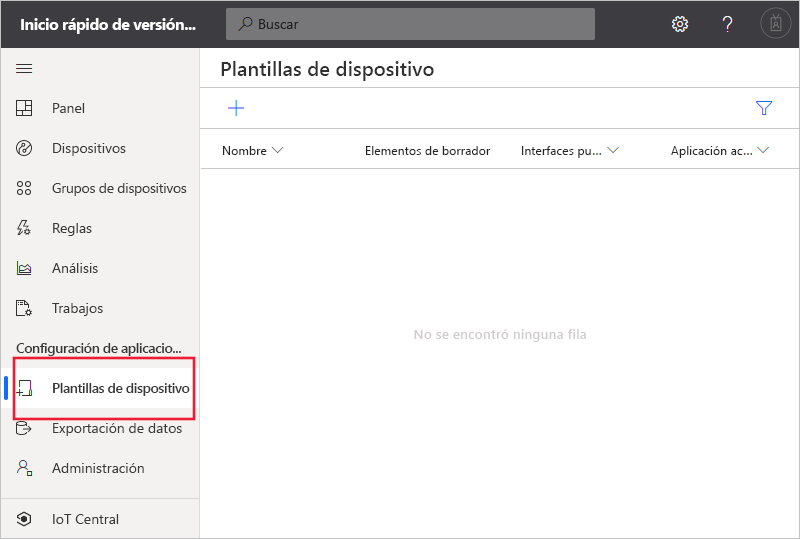
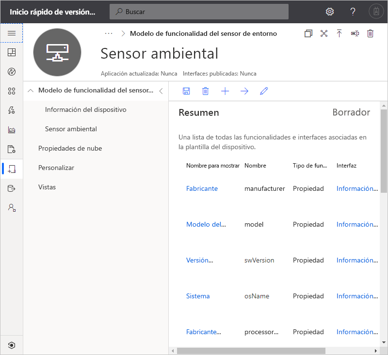
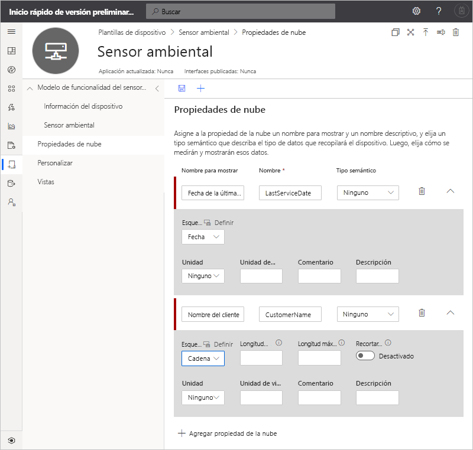
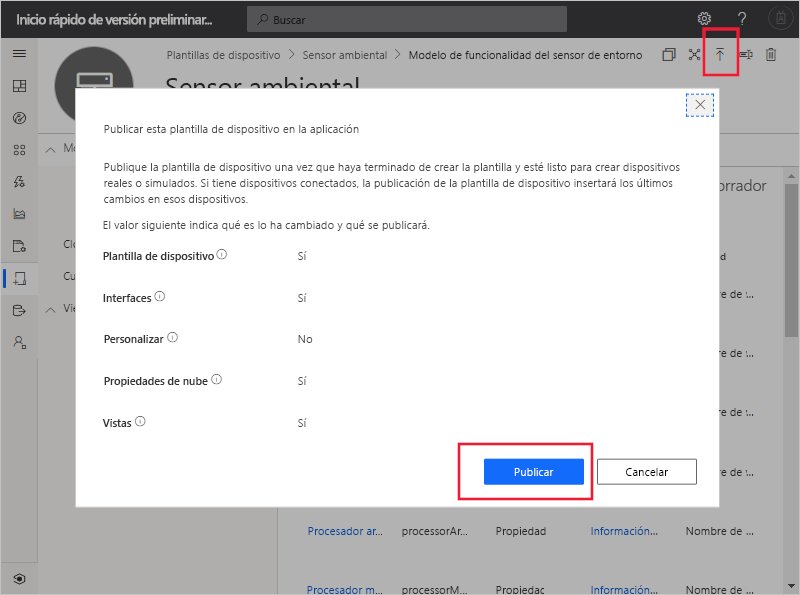
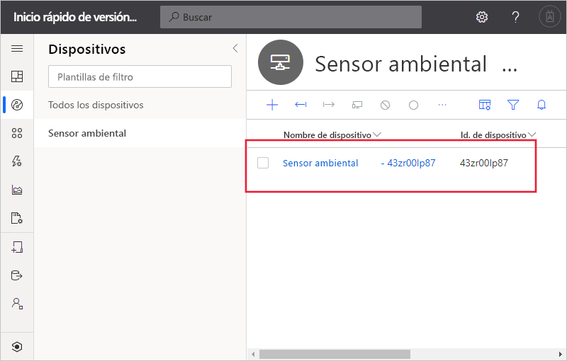
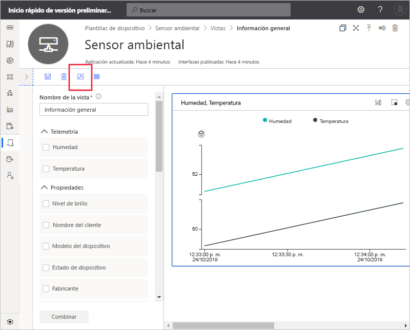

# Inicio rápido: Agregar un dispositivo simulado a la aplicación de IoT Central (características de vista previa)

*Este artículo se aplica a los administradores, operadores y compiladores.*

[!INCLUDE [iot-central-pnp-original](../../../includes/iot-central-pnp-original-note.md)]

Una plantilla de dispositivo define las capacidades de un dispositivo que se conecta a la aplicación IoT Central. Entre estas se incluyen la telemetría que envía el dispositivo, las propiedades del dispositivo y los comandos a los que responde un dispositivo. En una plantilla de dispositivo, un generador u operador puede agregar dispositivos reales y simulados a una aplicación. Los dispositivos simulados son útiles para probar el comportamiento de la aplicación IoT Central antes de conectar dispositivos reales.

En esta guía de inicio rápido, creará una plantilla de dispositivo **Sensor ambiental** y agregará un dispositivo simulado. Un dispositivo sensor de entorno:

* Envía datos de telemetría, como la temperatura.
* Notifica propiedades específicas del dispositivo, como el nivel de brillo.
* Responde a comandos como, por ejemplo, activar y desactivar.
* Notifica propiedades genéricas del dispositivo, como la versión de firmware y el número de serie.

## Requisitos previos

Complete el inicio rápido de [Creación de una aplicación de Azure IoT Central (características de versión preliminar)](./quick-deploy-iot-central.md) para crear una aplicación de IoT Central mediante la Plantilla de la**Aplicación personalizada > Versión preliminar de la aplicación**.

También necesita una copia local del archivo **EnvironmentalSensorInline.capabilitymodel.json** que contenga el modelo de funcionalidad del dispositivo [IoT Plug and Play](../../iot-pnp/overview-iot-plug-and-play.md). Puede descargarla [aquí](https://raw.githubusercontent.com/Azure/IoTPlugandPlay/master/samples/EnvironmentalSensorInline.capabilitymodel.json). Haga clic con el botón derecho en la página y seleccione **Guardar como**.

Después de descargar el archivo, ábralo en un editor de texto y reemplace las dos instancias de `<YOUR_COMPANY_NAME_HERE>` por su nombre. Use solo los caracteres a-z, A-Z, 0-9 y el carácter de subrayado.

## Creación de una plantilla

Como desarrollador, puede crear y editar plantillas de dispositivo de la aplicación. Después de publicar una plantilla de dispositivo, puede generar un dispositivo simulado o conectar dispositivos reales que implementan la plantilla de dispositivo. Los dispositivos simulados permiten probar el comportamiento de la aplicación antes de conectar un dispositivo real.

Para agregar una nueva plantilla de dispositivo a la aplicación, debe ir a la página **Device Templates** (Plantillas de dispositivo). Para ello, seleccione la pestaña **Plantillas del dispositivo** en el panel izquierdo.

### Adición de un modelo de funcionalidad del dispositivo

Hay varias opciones para crear un modelo de funcionalidad del dispositivo en IoT Central. Puede optar por crear un modelo personalizado desde cero, importarlo desde un archivo, seleccionarlo en el catálogo de dispositivos o conectar un dispositivo IoT Plug and Play mediante una primera conexión del dispositivo en la que el modelo de funcionalidad del dispositivo se ha publicado en el repositorio público. En este tutorial, importará un modelo de funcionalidad del dispositivo desde un archivo.

En los pasos siguientes se muestra cómo importar el modelo de funcionalidad de un dispositivo **Environmental Sensor**. Estos dispositivos envían telemetría a la aplicación, por ejemplo, los datos de temperatura:

1. Para agregar una nueva plantilla de dispositivo, seleccione **+** en la página **Plantillas de dispositivo**.

1. Elija **Dispositivo IoT** en la lista de plantillas de dispositivo personalizadas, seleccione **Siguiente: Personalice**y, después, seleccione **Siguiente: Revise**y, luego, seleccione **Crear**.

1. Escriba **Environmental Sensor** como nombre de la plantilla de dispositivo.

1. Elija **Import Capability Model** (Importar modelo de funcionalidad) para crear un modelo de funcionalidad del dispositivo a partir de un archivo JSON. Vaya a la carpeta donde guardó el archivo **EnvironmentalSensorInline.capabilitymodel.json** en la máquina local. Seleccione el archivo **EnvironmentalSensorInline.capabilitymodel.json** y, luego, **Open** (Abrir). El modelo de funcionalidad del sensor ambiental incluye las interfaces **Environmental Sensor** (Sensor ambiental) e **Device Information** (Información del dispositivo):

    

    Estas interfaces definen las funcionalidades de un dispositivo **Environmental Sensor**. Entre las funcionalidades se incluyen la telemetría que envía un dispositivo, las propiedades que notifica un dispositivo y los comandos a los que responde un dispositivo.

### Adición de propiedades de la nube

Una plantilla de dispositivo puede incluir propiedades de la nube. Las propiedades de la nube solo existen en la aplicación IoT Central y nunca se envían a un dispositivo ni se reciben de él.

1. Seleccione **Cloud Properties** (Propiedades de nube) y, luego, **+ Add Cloud Property** (+ Agregar propiedad de la nube). Use la información de la tabla siguiente para agregar una propiedad de la nube a la plantilla de dispositivo.

    | Display Name (Nombre para mostrar)      | Tipo semántico | Schema |
    | ----------------- | ------------- | ------ |
    | Fecha de la última revisión | None          | Date   |
    | Nombre del cliente     | None          | Cadena |

1. Seleccione **Save** (Guardar) para guardar los cambios.

    

## Creación de vistas

Como desarrollador, puede personalizar la aplicación para mostrar información pertinente sobre el dispositivo sensor ambiental a un operador. Las personalizaciones permiten al operador administrar estos dispositivo conectados a la aplicación. Puede crear dos tipos de vistas para que un operador interactúe con los dispositivos:

* Formularios para ver y editar las propiedades del dispositivo y la nube
* Paneles para visualizar los dispositivos

### Generación de vistas predeterminadas

La generación de vistas predeterminadas es una forma rápida de empezar a visualizar la información importante del dispositivo. Puede generar hasta tres vistas predeterminadas para la plantilla de dispositivo:

* La vista **Commands** (Comandos) permite que el operador envíe comandos al dispositivo.
* La vista **Overview** (Información general) usa gráficos y métricas para mostrar la telemetría del dispositivo.
* La vista **About** (Acerca de) muestra las propiedades del dispositivo.

Seleccione **Vistas** y, después, **Generar vistas predeterminadas**.

### Configuración de una vista para visualizar los dispositivos

Un panel de dispositivos permite a un operador visualizar un dispositivo mediante gráficos y métricas. Como generador, puede definir qué información se muestra en el panel del dispositivo. Puede definir varios paneles para los dispositivos. Para crear un panel y visualizar la telemetría del sensor ambiental, seleccione **Views** (Vistas) y, luego, **Visualizing the Device** (Visualización del dispositivo):

1. Todas las propiedades del dispositivo, las propiedades de la nube, la telemetría y las opciones estáticas se muestran en **Properties** (Propiedades). Puede arrastrar y colocar cualquiera de estos elementos en la vista. Arrastre la propiedad **Brightness Level** (Nivel de brillo) a la vista. Puede configurar el icono mediante el icono de engranaje.

1. Para agregar un gráfico que represente la telemetría, seleccione **Humidity** (Humedad) y **Temperature** (Temperatura) y, luego, **Combine** (Combinar). Para ver este gráfico en otro formato, como un gráfico circular o un gráfico de barras, seleccione el botón **Change Visualization** (Cambiar visualización) de la parte superior del icono.

1. Seleccione **Save** (Guardar) para guardar la vista:

Puede agregar más iconos que muestren otras propiedades o valores de telemetría. También puede agregar texto estático, vínculos e imágenes. Para mover o cambiar el tamaño de un icono en el panel, mueva el puntero del mouse sobre el icono y arrastre el icono a una nueva ubicación o cambie su tamaño.

### Adición de un formulario de dispositivo

Un formulario de dispositivo permite que un operador edite las propiedades del dispositivo y de la nube grabables. Como desarrollador, puede definir varios formularios y elegir qué propiedades de la nube y del dispositivo se van a mostrar en cada uno. También puede mostrar las propiedades de un dispositivo de solo lectura en un formulario.

Para crear un formulario y ver y editar las propiedades del sensor ambiental, siga estos pasos:

1. Vaya a **Views** (Vistas) en la plantilla **Environmental Sensor** (Sensor del entorno). Seleccione el icono **Editing Device and Cloud data** (Editar datos del dispositivo y de la nube) para agregar una vista nueva.

1. Escriba el nombre del formulario **Propiedades del sensor ambiental**.

1. Arrastre las propiedades de la nube **Customer name** (Nombre del cliente) y **Last service date** (Última fecha del servicio) a la sección existente del formulario.

1. Seleccione las propiedades del dispositivo **Brightness Level** (Nivel de brillo) y **Device State** (Estado del dispositivo). Después, seleccione **Add Section** (Agregar sección). Edite el título de la sección para que sea **Propiedades del sensor**. Seleccione **Aplicar**.

1. Seleccione las propiedades del dispositivo **Device Model** (Modelo del dispositivo), **Software versión** (Versión del software), **Manufacturer** (Fabricante) y **Processor manufacturer** (Fabricante del procesador). Después, seleccione **Add Section** (Agregar sección). Edite el título de la sección para que sea **Propiedades del dispositivo**. Seleccione **Aplicar**.

1. Seleccione **Save** (Guardar) para guardar la vista.

## Publicación de la plantilla de dispositivo

Antes de poder crear un sensor ambiental simulado o de conectar un sensor ambiental real, debe publicar la plantilla de dispositivo.

Para publicar una plantilla de dispositivo, siga estos pasos:

1. Vaya a la plantilla de dispositivo en la página **Device Templates** (Plantillas de dispositivo).

1. Seleccione **Publicar**.

1. En el cuadro de diálogo **Publish a Device Template** (Publicar una plantilla de dispositivo), elija **Publish** (Publicar):

    

Una vez publicada una plantilla de dispositivo, es visible en la página **Devices** (Dispositivos) y para el operador. En una plantilla de dispositivo publicada, no se puede editar un modelo de funcionalidad del dispositivo sin crear una versión. Sin embargo, puede hacer actualizaciones en las propiedades de la nube, las personalizaciones y las vistas en una plantilla de dispositivo publicada sin control de versiones. Después de realizar los cambios, seleccione **Publish** (Publicar) para enviar esos cambios al operador.

## Adición de un dispositivo simulado

Para agregar un dispositivo simulado a la aplicación, use la plantilla de dispositivo **Sensor ambiental** que creó.

1. Para agregar un nuevo dispositivo como operador, elija **Dispositivos** en el panel izquierdo. La pestaña **Devices** (Dispositivos) muestra **All devices** (Todos los dispositivos) y la plantilla de dispositivo **Environmental Sensor** (Sensor ambiental). Seleccione **Sensor ambiental**.

1. Para agregar un dispositivo de sensor ambiental simulado, seleccione **+ New** (+ Nuevo). Use el valor de **Device ID** (Id. de dispositivo) que se sugiere o escriba el **identificador de su dispositivo** en minúsculas. También puede escribir el nombre del nuevo dispositivo. Conmute el botón de alternancia **Simulated** (Simulado) a **On** (Activado) y seleccione **Create** (Crear).

    

Ya puede interactuar con las vistas que creó el generador para la plantilla de dispositivo mediante datos simulados.

## Uso de un dispositivo simulado para mejorar las vistas

Después de crear un dispositivo simulado, el generador puede usarlo para mejorar y desarrollar las vistas de la plantilla de dispositivo.

1. Elija **Plantillas de dispositivos** en el panel izquierdo y seleccione la plantilla de **Sensor ambiental**.

1. Seleccione la vista que desea editar o cree una. Haga clic en **Configurar dispositivo de vista previa** y, después, **Seleccione de un dispositivo en ejecución**. Aquí puede elegir entre no tener ningún dispositivo de vista previa, mediante un dispositivo real que se pueda configurar para las pruebas o desde un dispositivo existente agregado en IoT Central.

1. Elija el dispositivo simulado en la lista. Después, seleccione **Aplicar**. Ahora puede ver el mismo dispositivo simulado en la experiencia de creación de las vistas de plantilla de dispositivos. Esta vista es útil para gráficos y otras visualizaciones.

    

## Pasos siguientes

En esta guía de inicio rápido, ha aprendido a crear una plantilla de dispositivo **Sensor ambiental** y a agregar un dispositivo simulado a la aplicación.

Para más información sobre la supervisión de dispositivos conectados a la aplicación, continúe con la guía de inicio rápido:

> [!div class="nextstepaction"]
> [Configuración de reglas y acciones](./quick-configure-rules.md)
