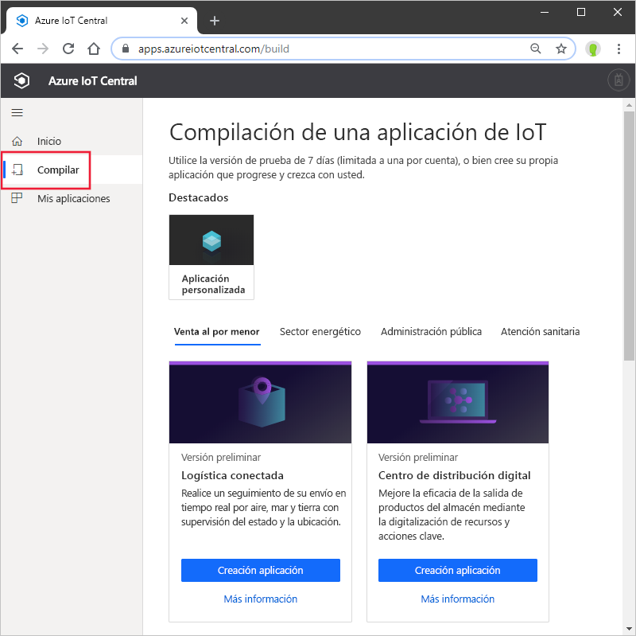
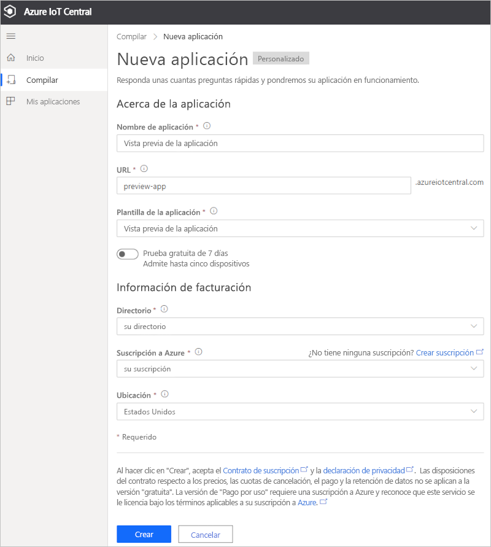

# Creación de una aplicación de Azure IoT Central (características en versión preliminar)

[!INCLUDE [iot-central-pnp-original](../../../includes/iot-central-pnp-original-note.md)]

En esta guía de inicio rápido se muestra cómo crear una aplicación de Azure IoT Central que contiene características de vista previa como IoT Plug and Play.

> [!WARNING]
> Las funcionalidades de IoT Plug and Play en Azure IoT Central se encuentran actualmente en versión preliminar pública. No use ninguna aplicación de IoT Central preparada para IoT Plug and Play para cargas de trabajo de producción. Para entornos de producción, use una aplicación de IoT Central creada con una plantilla de aplicación actual y disponible con carácter general.

## Creación de una aplicación

Navegue al sitio de [Compilación Azure IoT Central](https://aka.ms/iotcentral). Después, inicie sesión con una cuenta Microsoft personal, profesional o educativa.

Puede crear una nueva aplicación desde la lista de plantillas de IoT Central relevantes del sector para ayudarle a empezar a trabajar rápidamente, o desde cero con la plantilla de **Aplicaciones personalizadas**.

Para crear una nueva aplicación de Azure IoT Central:

1. Para crear una nueva aplicación de Azure IoT Central a partir de una *Plantilla del sector*, seleccione una plantilla de aplicación en la lista de plantillas disponibles en una de las industrias. También puede empezar desde cero seleccionando *Aplicación personalizada*.
1. Azure IoT Central sugiere automáticamente un **nombre de aplicación** en función de la plantilla de aplicación que ha seleccionado. Puede usar este nombre o escribir su propio nombre descriptivo de la aplicación.
1. Azure IoT Central también genera un único prefijo de **dirección URL de aplicación**, según el nombre de la aplicación. Esta dirección URL se usa para tener acceso a la aplicación. Cambiar si lo desea este prefijo de dirección URL por algo más fácil de recordar.

    

    > [!NOTE]
    > Si está usando la plantilla de aplicación personalizada, verá un campo desplegable de **Plantilla de aplicación**. Desde aquí puede cambiar entre las plantillas de vista previa y disponibles con carácter general. También puede ver otras plantillas que se han puesto a disposición de la organización.

1. Elija si quiere crear esta aplicación con una evaluación gratuita de 7 días o use una suscripción de pago por uso.
    - Las aplicaciones de **prueba** son gratis durante siete días y admiten hasta cinco dispositivos. Se pueden convertir a pago por uso en cualquier momento antes. Si crea una aplicación de prueba, debe escribir su información de contacto y elegir si desea recibir información y sugerencias de Microsoft.
    - Las aplicaciones de **Pago por uso** se cobran por dispositivo, con los dos primeros dispositivos gratis. Más información sobre los [precios de IoT Central](https://aka.ms/iotcentral-pricing). Si crea una aplicación de Pago por uso, tendrá que seleccionar su *directorio*, *suscripción de Azure* y *ubicación*:
        - El *Directorio* es el directorio de Azure Active Directory (AAD) en que creará la aplicación. Azure AD contiene identidades de usuario, credenciales y otra información de la organización. Si no tiene un inquilino de Azure AD, se crea uno automáticamente al crearse una suscripción de Azure.
        - Una *suscripción de Azure* permite crear instancias de los servicios de Azure. IoT Central aprovisiona los recursos de su suscripción. Si no tiene una suscripción de Azure, puede crear una en [la página de suscripción a Azure](https://aka.ms/createazuresubscription). Después de crear la suscripción de Azure, vuelva a la página **Crear aplicación**. La nueva suscripción aparecerá en la lista desplegable **Suscripción de Azure**.
        - *Ubicación* es la [zona geográfica](https://azure.microsoft.com/global-infrastructure/geographies/) donde desea crear la aplicación. Normalmente, se debe elegir la ubicación más cercana físicamente a los dispositivos para un rendimiento óptimo. La versión preliminar pública de Azure IoT Central está disponible actualmente en **Estados Unidos** o en **Europa**. Una vez elegida una ubicación, no podrá mover la aplicación a otra más adelante.

        > [!NOTE]
        > Durante la versión preliminar pública, las únicas regiones disponibles para las **aplicaciones en versión preliminar** son **Europa** y **Estados Unidos**.

1. Revise los Términos y Condiciones y seleccione **Crear** en la parte inferior de la página.

## Pasos siguientes

En esta guía de inicio rápido, ha creado una aplicación de IoT Central. Este es el siguiente paso que le sugerimos:

> [!div class="nextstepaction"]
> [Agregar un dispositivo simulado a la aplicación IoT Central](./quick-create-pnp-device.md)
