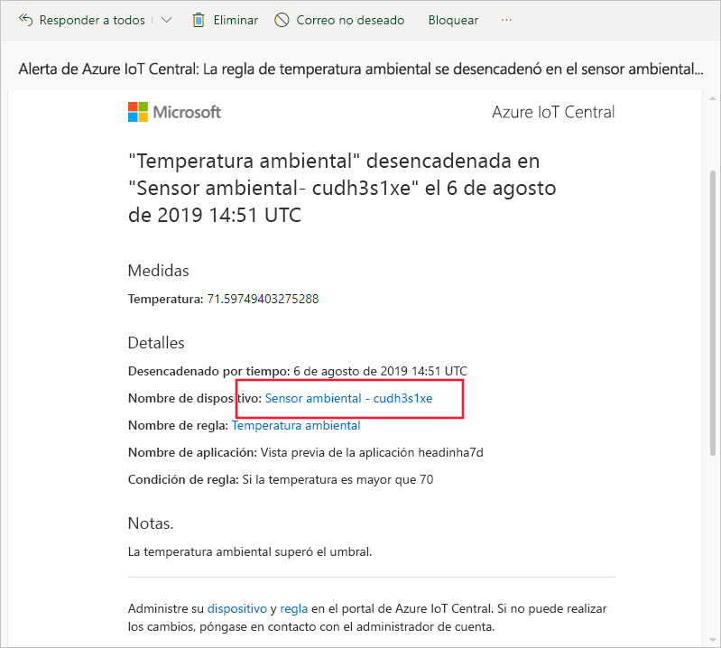
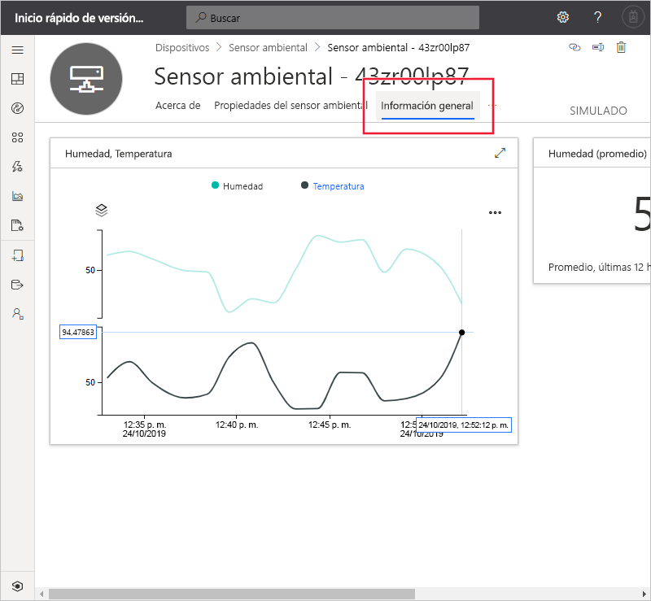
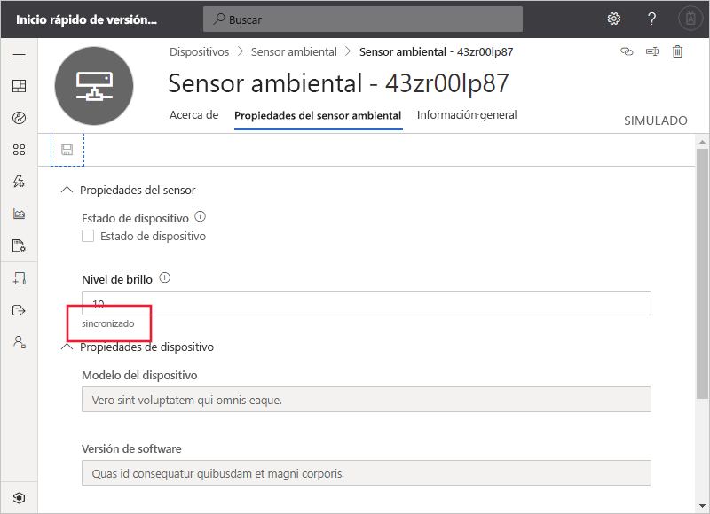

# Inicio rápido: Uso de Azure IoT Central para supervisar los dispositivos (características en versión preliminar)

*Este artículo se aplica a los administradores, operadores y compiladores.*

[!INCLUDE [iot-central-pnp-original](../../../includes/iot-central-pnp-original-note.md)]

En esta guía de inicio rápido se muestra, como operador, cómo usar la aplicación Microsoft Azure IoT Central para supervisar los dispositivos y cambiar la configuración.

## Requisitos previos

Antes de comenzar, debe completar los tres inicios rápidos anteriores [Crear una aplicación de Azure IoT Central](./quick-deploy-iot-central.md), [Agregar un dispositivo simulado a la aplicación de IoT Central](./quick-create-pnp-device.md) y [Configurar reglas y acciones para el dispositivo](quick-configure-rules.md).

## Recibir una notificación

Azure IoT Central envía notificaciones acerca de los dispositivos como mensajes de correo electrónico. El desarrollador ha agregado una regla para enviar una notificación cuando la temperatura en un dispositivo sensor ambiental conectado supera un umbral. Compruebe los correos electrónicos enviados a la cuenta que el desarrollador ha elegido para recibir notificaciones.

Abra el mensaje de correo que recibió al final del inicio rápido de [Configurar reglas y acciones para el dispositivo](quick-configure-rules.md). En el correo electrónico, seleccione el vínculo al dispositivo:

En el explorador se abre la vista del **panel** para el dispositivo simulado del sensor ambiental que creó en las guías de inicio rápido anteriores:

## Investigar un problema

Como operador, puede ver información sobre el dispositivo en las páginas**Información general**, **Propiedades del sensor ambiental**y **Comandos**. El generador personalizó las páginas **Dashboard** (Panel) y **Environmental Sensor properties** (Propiedades del sensor ambiental) para mostrar información importante sobre un dispositivo sensor ambiental conectado.

Elija la vista **Información general** para ver información sobre el dispositivo.

El gráfico del panel muestra un trazado de la temperatura del dispositivo. Decide que la temperatura del dispositivo es demasiado alta.

## Corregir un problema

Para hacer un cambio en el dispositivo, use la página **Propiedades del sensor ambiental**.

Elija **Environmental Sensor properties** (Propiedades del sensor ambiental). Cambie el valor de **Brightness Level** (Nivel de brillo) a 10. Elija **Guardar** para actualizar el dispositivo. Cuando el dispositivo confirma el cambio en la configuración, el estado del valor cambia a **sincronizado**:

## Pasos siguientes

En este tutorial, ha aprendido a hacer lo siguiente:

* Recibir una notificación
* Investigar un problema
* Corregir un problema

Ahora que sabe cómo supervisar un dispositivo, el siguiente paso que se recomienda es:

> [!div class="nextstepaction"]
> [Cree y administre una plantilla de dispositivo](howto-set-up-template.md).
