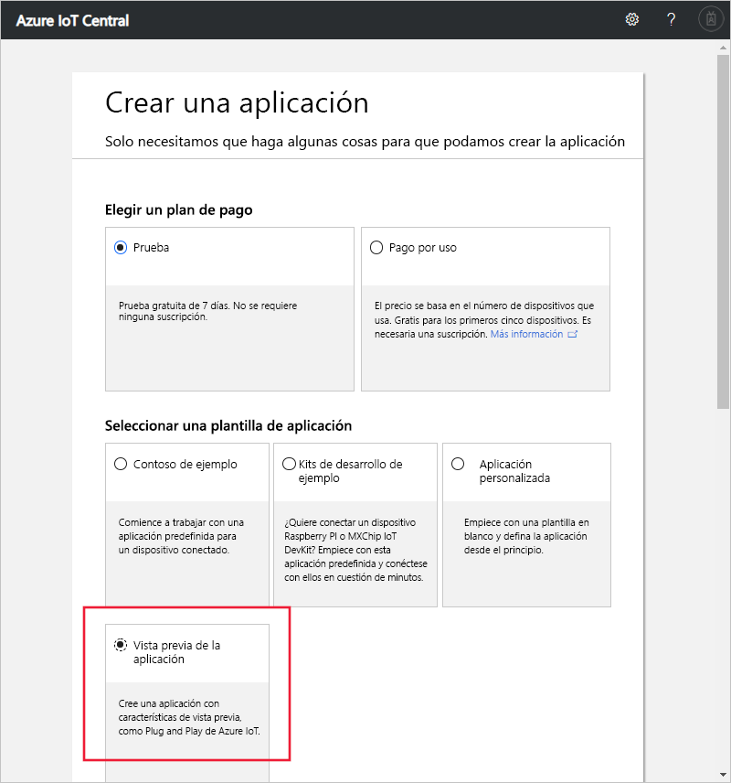

# Creación de una aplicación de Azure IoT Central (características en versión preliminar)

[!INCLUDE [iot-central-pnp-original](../../includes/iot-central-pnp-original-note.md)]

En este inicio rápido se muestra cómo crear una aplicación de Azure IoT Central que use características en versión preliminar como IoT Plug and Play.

> [!WARNING]
> Las funcionalidades de IoT Plug and Play en Azure IoT Central se encuentran actualmente en versión preliminar pública. No use ninguna aplicación de IoT Central preparada para IoT Plug and Play para cargas de trabajo de producción. Para entornos de producción, use una aplicación de IoT Central creada con una plantilla de aplicación actual y disponible con carácter general.

## Creación de una aplicación

Vaya a la página [Application Manager](https://aka.ms/iotcentral) (Administrador de aplicaciones) de Azure IoT Central. Luego, inicie sesión con una cuenta Microsoft personal, profesional o educativa.

Para empezar a crear una nueva aplicación de Azure IoT Central, seleccione **New Application** (Nueva aplicación). Este vínculo le lleva a la página **Create an application** (Crear aplicación).

Para crear una aplicación de Azure IoT Central que incluya características en versión preliminar, como IoT Plug and Play, siga estos pasos:

1. Elija un plan de pago:
   - Las aplicaciones de **versión de prueba** son gratuitas durante siete días y luego expiran. Se pueden convertir a pago por uso en cualquier momento antes. Si crea una aplicación de **evaluación gratuita**, deberá escribir la información de contacto y elegir si desea recibir información y sugerencias de Microsoft.
   - Las aplicaciones de **Pago por uso** se cobran por dispositivo y los cinco primeros dispositivos son gratuitos. Si crear una aplicación de **pago por uso**, deberá seleccionar su *directorio*, *suscripción de Azure* y *región*:
      - El *Directorio* es la instancia de Azure Active Directory (AD) para crear la aplicación. Contiene las identidades de usuario, las credenciales y otra información de la organización. Si no tiene un inquilino de Azure AD, se crea uno automáticamente al crearse una suscripción de Azure.
      - Una *suscripción de Azure* permite crear instancias de los servicios de Azure. IoT Central aprovisionará los recursos de su suscripción. Si no tiene una suscripción de Azure, puede crear una en [la página de suscripción a Azure](https://aka.ms/createazuresubscription). Después de crear la suscripción de Azure, vuelva a la página **Crear aplicación**. La nueva suscripción aparecerá en el cuadro de lista desplegable **Suscripción de Azure**.
      - *Región* es la ubicación física donde desea crear la aplicación. Normalmente, se elige la región más cercana físicamente a los dispositivos a fin de obtener un rendimiento óptimo. Puede ver las regiones en las que Azure IoT Central está disponible en la página [Productos disponibles por región](https://azure.microsoft.com/regions/services/). Una vez que elija una región, no podrá mover la aplicación a otra región más adelante.

      Obtenga más información sobre los precios en la [página de precios de Azure IoT Central](https://azure.microsoft.com/pricing/details/iot-central/).

1. Elija un nombre de aplicación descriptivo, como **Contoso IoT**. Azure IoT Central genera un prefijo de dirección URL único. Puede cambiar este prefijo de dirección URL por algo más fácil de recordar.

1. Elija la plantilla **Preview application** (Aplicación de versión preliminar). Una plantilla de aplicación puede contener elementos predefinidos, como plantillas de dispositivos y paneles que le ayudarán a empezar a trabajar.

1. En la parte inferior de la página, seleccione **Crear**.

## Pasos siguientes

En este inicio rápido, ha creado una aplicación de IoT Central que usa las características en versión preliminar. El siguiente paso que le sugerimos es:

> [!div class="nextstepaction"]
> [Dé un paseo por IoT Central](overview-iot-central-tour-pnp.md?toc=/azure/iot-central-pnp/toc.json&bc=/azure/iot-central-pnp/breadcrumb/toc.json)
