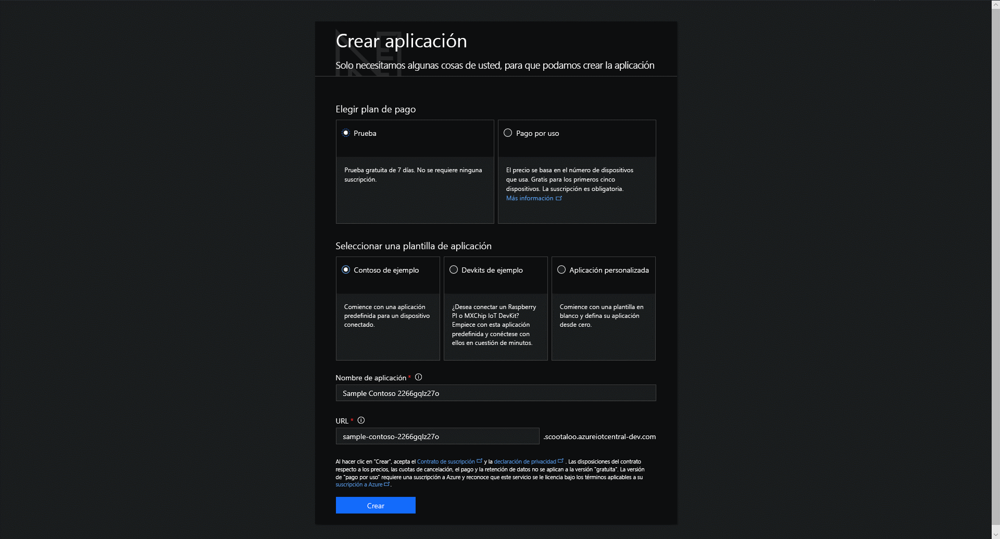

# Creación de una aplicación de Azure IoT Central

Como _generador_, usará la interfaz de usuario de Azure IoT Central para definir la aplicación de Azure IoT Central. En esta guía de inicio rápido se muestra cómo crear una aplicación de Azure IoT Central que contenga un ejemplo de _plantilla de dispositivo_ y _dispositivos_ simulados.

## Creación de una aplicación

Vaya a la página [Application Manager](https://aka.ms/iotcentral) (Administrador de aplicaciones) de Azure IoT Central. Tendrá que iniciar sesión con una cuenta Microsoft personal, profesional o educativa.

Para empezar a crear una nueva aplicación de Azure IoT Central, seleccione **New Application** (Nueva aplicación). De este modo, ira a la página **Create Application** (Crear Aplicación).

Para crear una nueva aplicación de Azure IoT Central:

1. Elija un plan de pago:
   - Las aplicaciones de **versión de evaluación** son gratuitas durante siete días y luego expiran. Se pueden convertir a pago por uso en cualquier momento antes. Si crea una aplicación de **evaluación gratuita**, deberá escribir la información de contacto y elegir si desea recibir información y sugerencias de Microsoft.
   - Las aplicaciones de **pago por uso** se cobran por dispositivo y los cinco primeros dispositivos son gratuitos. Si crear una aplicación de **pago por uso**, deberá seleccionar su *directorio*, *suscripción de Azure* y *región*:
      - El *Directorio* es la instancia de Azure Active Directory (AD) para crear la aplicación. Contiene las identidades de usuario, las credenciales y otra información de la organización. Si no tiene un inquilino de Azure AD, se crea uno automáticamente al crearse una suscripción de Azure.
      - Una *suscripción de Azure* permite crear instancias de los servicios de Azure. IoT Central aprovisionará los recursos de su suscripción. Si no tiene una suscripción de Azure, puede crear una en [la página de suscripción a Azure](https://aka.ms/createazuresubscription). Después de crear la suscripción de Azure, vuelva a la página **Crear aplicación**. La nueva suscripción aparecerá en el cuadro de lista desplegable **Suscripción de Azure**.
      - *Región* es la ubicación física donde desea crear la aplicación. Normalmente, debe elegir el área que se encuentre físicamente más cercana a los dispositivos para obtener un rendimiento óptimo. Puede ver las regiones en las que Azure IoT Central está disponible en la página [Productos disponibles por región](https://azure.microsoft.com/regions/services/). Una vez que elija una región, no podrá mover la aplicación a otra región más adelante.

      Obtenga más información sobre los precios en la [página de precios de Azure IoT Central](https://azure.microsoft.com/pricing/details/iot-central/).

1. Elija un nombre de aplicación descriptivo, como **Contoso IoT**. Azure IoT Central genera un prefijo de dirección URL único. Puede cambiar este prefijo de dirección URL por algo más fácil de recordar.

1. Elija una plantilla de aplicación. Una plantilla de aplicación puede contener elementos predefinidos, como plantillas de dispositivos y paneles que le ayudarán a empezar a trabajar.

    | Plantilla de la aplicación | DESCRIPCIÓN |
    | -------------------- | ----------- |
    | Ejemplo Contoso       | Crea una aplicación que incluye una plantilla de dispositivo que ya se ha creado para una máquina expendedora de refrigerados. Utilice esta plantilla para empezar a explorar Azure IoT Central. |
    | Ejemplo Devkits       | Permite crear una aplicación con plantillas de dispositivo preparadas para que se conecte a un dispositivo MXChip o Raspberry Pi. Utilice esta plantilla si es un desarrollador de dispositivos que experimenta con alguno de estos dispositivos. |
    | Aplicación personalizada   | Permite crear una aplicación vacía para que pueda rellenarla con sus propias plantillas de dispositivo y dispositivos. |

1. Seleccione **Crear**.

## Pasos siguientes

En esta guía de inicio rápido, ha creado una aplicación de IoT Central. Este es el siguiente paso que le sugerimos:

> [!div class="nextstepaction"]
> [Dé un paseo por IoT Central](overview-iot-central-tour.md)
