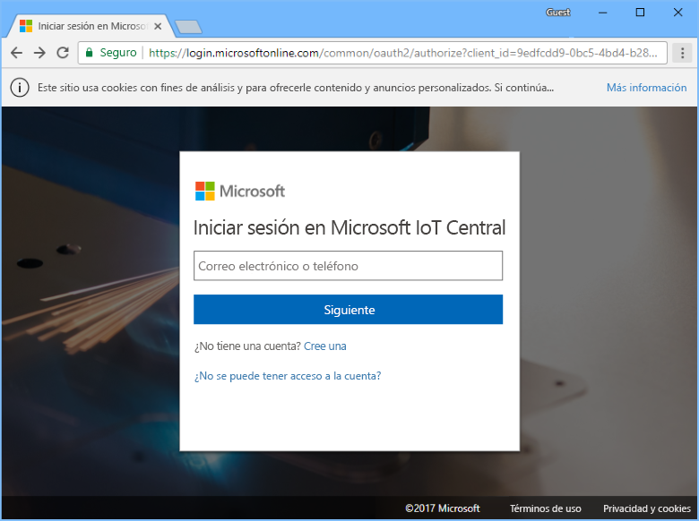

# Creación de una aplicación de Azure IoT Central

Como _generador_, usará la interfaz de usuario de Azure IoT Central para definir la aplicación de Azure IoT Central. Esta guía de inicio rápido le muestra cómo:

- Crear una aplicación de Azure IoT Central que contenga un ejemplo de _plantilla de dispositivo_ y _dispositivos_ simulados.
- Ver las características de la plantilla de dispositivo **Refrigerated Vending Machine** en la aplicación.
- Ver la telemetría y los análisis de los dispositivos simulados **Refrigerator**.

En esta guía de inicio rápido se crea un dispositivo simulado **Refrigerator** a partir de una plantilla de dispositivo. El dispositivo simulado:

* Envía telemetría a la aplicación, como la temperatura y la presión.
* Informa a la aplicación de los valores de propiedad del dispositivo, por ejemplo, las alertas de movimiento.
* Tiene una configuración de dispositivo que se puede establecer en la aplicación, como la velocidad del ventilador.

Con un dispositivo simulado creado a partir de una plantilla de dispositivo en la aplicación de Azure IoT Central se puede probar la aplicación antes de conectar un dispositivo real.

## Creación de la aplicación

Para completar esta guía de inicio rápido debe crear una aplicación de Azure IoT Central a partir de la plantilla de aplicación **Sample Contoso**.

Vaya a la página [Application Manager](https://aka.ms/iotcentral) (Administrador de aplicaciones) de Azure IoT Central. A continuación, escriba la dirección de correo electrónico y la contraseña que usa para acceder a la suscripción de Azure:

Para empezar a crear una nueva aplicación de Azure IoT Central, elija **New Application** (Nueva aplicación):

Para crear una nueva aplicación de Azure IoT Central:

1. Elija el plan de pago **Free Trial Application** (Evaluación gratuita de la aplicación).
1. Elija un nombre de aplicación descriptivo, como **Contoso IoT**. Azure IoT Central genera un prefijo de dirección URL único. Puede cambiar este prefijo de dirección URL por algo más fácil de recordar.
1. Elija la plantilla de aplicación **Sample Contoso**.
1. Luego elija **Crear**.

## Pasos siguientes

En esta guía de inicio rápido se ha creado una aplicación de Azure IoT Central previamente rellenada que contiene una plantilla de dispositivo **Refrigerated Vending Machine** y dispositivos simulados. Consulte el artículo de [definición de una nueva plantilla de dispositivo en la aplicación](tutorial-define-device-type.md) para más información sobre cómo definir sus propias plantillas de dispositivo como generador.
