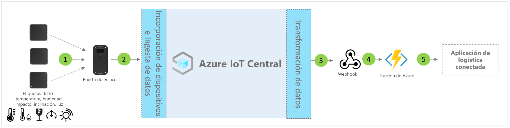

# Arquitectura de la plantilla de aplicación Logística conectada de IoT Central

Tanto los asociados como los clientes pueden usar la plantilla de la aplicación y las siguientes instrucciones para desarrollar **soluciones de logística conectada** integrales.

> [!div class="mx-imgBorder"]
> 

1. Conjunto de etiquetas de IoT que envían datos de telemetría a un dispositivo de puerta de enlace
2. Dispositivos de puerta de enlace que envían telemetría y conclusiones agregadas a IoT Central
3. Los datos se enrutan al servicio de Azure que se quiera para su manipulación
4. Se pueden usar servicios de Azure (como ASA o Azure Functions) para volver a formatear flujos de datos y enviarlos a las cuentas de almacenamiento que se desee 
5. Pueden potenciarse diversos flujos de trabajo empresariales mediante aplicaciones empresariales de usuario final.

## Detalles
En la siguiente sección se describen todos los elementos de la ingesta de telemetría de la arquitectura conceptual de puertas de enlace y etiquetas de IoT

## Etiquetas de IoT
Las etiquetas de IoT ofrecen funcionalidades de sensores físicos, ambientales y medioambientales tales como temperatura, humedad, choque, inclinación y luz. Las etiquetas de IoT habitualmente se conectan al dispositivo de puerta de enlace mediante ZigBee (802.15.4). Las etiquetas son sensores más baratos; por lo tanto, se pueden descartar al final de una jornada de logística típica para evitar problemas con la logística inversa.

## Puerta de enlace
Las puertas de enlace también pueden actuar como etiquetas de IoT con sus funcionalidades de detección ambiental. La puerta de enlace habilita la conectividad ascendente en la nube de IoT de Azure (MQTT) mediante Wi-Fi y telefonía móvil.  Se usan los modos de red de sensor inalámbrico (WSN) de Bluetooth, NFC y 802.15.4 para la comunicación descendente con etiquetas de IoT. Las puertas de enlace proporcionan conectividad segura en la nube de un extremo a otro, emparejamiento de etiquetas de IoT, agregación de datos de sensores, retención de datos y la posibilidad de configurar umbrales de alarma.

## Administración de dispositivos con IoT Central 
Azure IoT Central es una plataforma de desarrollo de soluciones que simplifica la conectividad, configuración y administración de dispositivos IoT. La plataforma reduce significativamente la carga y los costos de la administración, las operaciones y los desarrollos relacionados con los dispositivos IoT. Los clientes y partners pueden crear soluciones empresariales integrales para lograr un bucle de comentarios digital en logística.

## Información y acciones de la empresa mediante la salida de datos 
La plataforma de IoT Central proporciona opciones de extensibilidad enriquecidas a través de la exportación continua de datos (CDE) y las API. La información empresarial basada en el procesamiento de datos de telemetría o la telemetría sin procesar se suele exportar a una aplicación de línea de negocio preferida. Para lograrlo se usa un webhook, bus de servicio, centro de eventos o almacenamiento de blobs para compilar, entrenar e implementar modelos de Machine Learning y mejorar aún más la información.

## Pasos siguientes
* Aprenda a implementar una [plantilla de solución de logística conectada](./tutorial-iot-central-connected-logistics-pnp.md)
* Más información sobre las [plantillas de venta minorista de IoT Central](./overview-iot-central-retail-pnp.md).
* Para obtener más información acerca de IoT Central, consulte [Introducción a IoT Central](../core/overview-iot-central.md).
