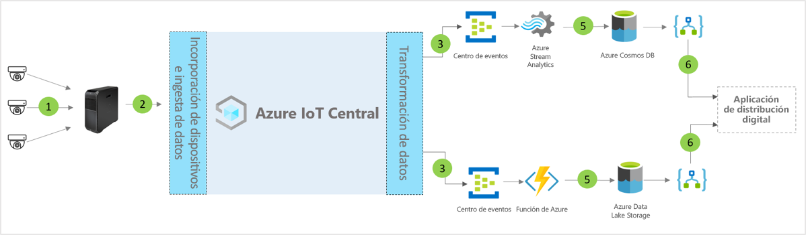

# Arquitectura de la plantilla de aplicación del centro de distribución digital de IoT Central

[!INCLUDE [iot-central-pnp-original](../../../includes/iot-central-pnp-original-note.md)]

Los asociados y los clientes pueden aprovechar la plantilla de la aplicación y las siguientes instrucciones para desarrollar soluciones integrales del **centro de distribución digital**.

> [!div class="mx-imgBorder"]
> 

1. Conjunto de sensores de IoT que envían datos de telemetría a un dispositivo de puerta de enlace.
2. Dispositivos de puerta de enlace que envían datos de telemetría y conclusiones agregadas a IoT Central.
3. Los datos se enrutan al servicio de Azure deseado para su manipulación.
4. Se pueden aprovechar los servicios de Azure (como ASA o Azure Functions) para volver a dar formato a las secuencias de datos y enviarlas a las cuentas de almacenamiento deseadas. 
5. Los datos procesados se almacenan en el almacenamiento de acceso frecuente para las acciones casi en tiempo real, o en el almacenamiento en frío para las mejoras de información adicionales basadas en Machine Learning o el análisis por lotes. 
6. Logic Apps puede usarse para potenciar varios flujos de trabajo empresariales en aplicaciones empresariales de usuario final.

## Detalles
En la siguiente sección se describen todos los elementos de la arquitectura conceptual.

## Videocámaras 
Las videocámaras son los sensores principales de este ecosistema de escala empresarial conectado digitalmente. Los avances en aprendizaje automático e inteligencia artificial permiten que el vídeo se convierta en datos estructurados y se procese en Edge antes de enviarlo a la nube. Se pueden usar cámaras IP para capturar imágenes, comprimirlas en la cámara y, a continuación, enviar los datos comprimidos a través de un proceso perimetral para la canalización de análisis de vídeo. También se pueden usar cámaras de visión GigE para capturar imágenes en el sensor y, a continuación, enviar estas imágenes directamente a Azure IoT Edge, que las comprime antes de procesarlas en una canalización de análisis de vídeo. 

## Puerta de enlace de Azure IoT Edge
Las cargas de trabajo de "cámaras como sensores" y las perimetrales se administran de forma local mediante Azure IoT Edge y la transmisión de la cámara la procesa la canalización de análisis. La canalización de procesamiento de análisis de vídeo en Azure IoT Edge ofrece numerosas ventajas, como un menor tiempo de respuesta y un bajo consumo de ancho de banda, lo que da lugar a una latencia baja para un rápido procesamiento de datos. Solo se envían a la nube los metadatos, la información o las acciones más esenciales para realizar acciones o investigaciones posteriores. 

## Administración de dispositivos con IoT Central 
Azure IoT Central es una plataforma de desarrollo de soluciones que simplifica la conectividad, la configuración y la administración de dispositivos IoT y la puerta de enlace de Azure IoT Edge. La plataforma reduce significativamente la carga y los costos de la administración, las operaciones y los desarrollos relacionados con los dispositivos IoT. Los clientes y asociados pueden crear soluciones empresariales completas para lograr un bucle de comentarios digital en los centros de distribución.

## Información y acciones empresariales a través de la salida de datos 
La plataforma de IoT Central proporciona opciones de extensibilidad enriquecidas a través de la exportación continua de datos (CDE) y las API. La información empresarial basada en el procesamiento de datos de telemetría o la telemetría sin procesar se suele exportar a una aplicación de línea de negocio preferida. Esto se puede lograr a través de un webhook, bus de servicio, centro de eventos o almacenamiento de blobs para crear, entrenar e implementar modelos de Machine Learning y mejorar aún más la información.

## Pasos siguientes
* Aprenda a implementar una [plantilla de centro de distribución digital](./tutorial-iot-central-digital-distribution-center-pnp.md)
* Más información sobre las [plantillas de venta minorista de IoT Central](./overview-iot-central-retail-pnp.md).
* Para obtener más información acerca de IoT Central, consulte [Introducción a IoT Central](../core/overview-iot-central-pnp.md).
