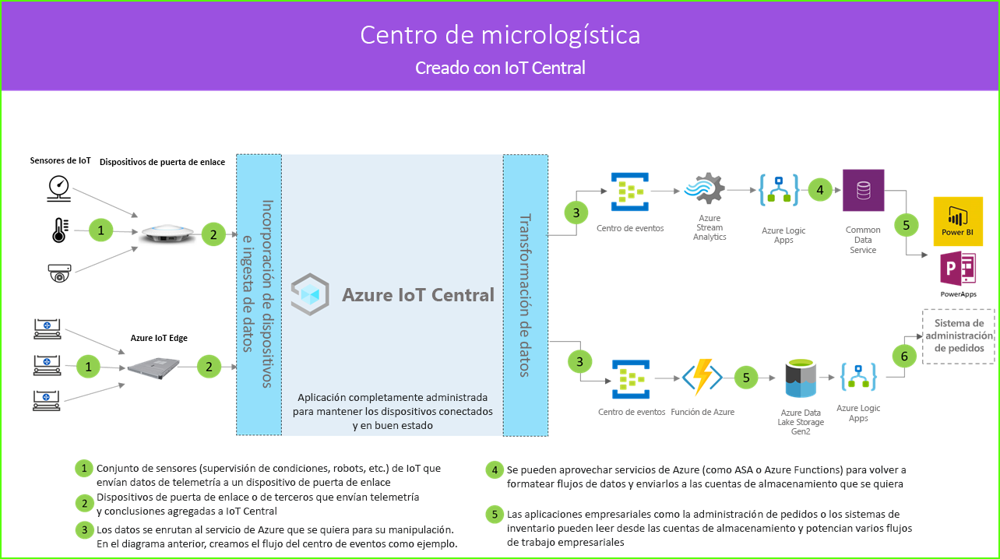

# Arquitectura del centro de micrologística

Las soluciones del centro de micrologística le permiten conectar, supervisar y administrar de forma digital todos los aspectos de un centro de logística totalmente automatizado para reducir los costos eliminando el tiempo de inactividad y aumentando la seguridad y la eficiencia general. Estas soluciones se pueden compilar mediante una de las plantillas de aplicación de IoT Central y la arquitectura siguiente como guía.

- Conjunto de sensores de IoT que envían datos de telemetría a un dispositivo de puerta de enlace
- Dispositivos de puerta de enlace que envían telemetría y conclusiones agregadas a IoT Central
- Exportación continua de datos al servicio de Azure que se quiera para su manipulación
- Los datos se pueden estructurar en el formato que se quiera y enviarse a un servicio de almacenamiento
- Las aplicaciones empresariales pueden consultar datos y generar conclusiones que impulsen las operaciones comerciales
 
Echemos un vistazo a los componentes clave que generalmente desempeñan algún papel en una solución de centro de micrologística.

## Operadores robóticos

Es probable que una solución de centro de micrologística tenga un gran conjunto de operadores robóticos que generen diferentes tipos de señales de telemetría. Estas señales se pueden ingerir mediante un dispositivo de puerta de enlace, agregar y enviar a IoT Central como se refleja en el lado izquierdo del diagrama de la arquitectura.  

## Sensores de supervisión del estado

Una solución de IoT comienza con un conjunto de sensores que capturan señales significativas desde dentro del centro de logística. Se refleja en diferentes tipos de sensores en el extremo izquierdo del diagrama de arquitectura anterior.

## Dispositivos de puerta de enlace

Muchos sensores de IoT pueden alimentar señales sin procesar directamente en la nube o en un dispositivo de puerta de enlace situado cerca de ellas. El dispositivo de puerta de enlace realiza la agregación de datos en el perímetro antes de enviar conclusiones de resumen a una aplicación de IoT Central. Los dispositivos de puerta de enlace también son responsables de la retransmisión de operaciones de comando y control a los dispositivos de sensor cuando proceda. 

## Aplicación de IoT Central

La aplicación de Azure IoT Central ingiere datos de diferentes tipos de sensores de IoT, robots, así como dispositivos de puerta de enlace, en el entorno del centro de logística y genera un conjunto de conclusiones significativas.

Azure IoT Central también ofrece una experiencia personalizada para el operador de tienda que le permite supervisar y administrar de forma remota los dispositivos de infraestructura.

## Transformación de datos
Puede configurarse la aplicación de Azure IoT Central dentro de una solución para exportar conclusiones sin procesar o agregadas a un conjunto de servicios de plataforma como servicio (PaaS) de Azure que pueden realizar manipulación de datos y enriquecer estas conclusiones antes de colocarlas en una aplicación empresarial. 

## Aplicación empresarial
Los datos de IoT se pueden usar para potenciar diferentes tipos de aplicaciones empresariales implementadas en un entorno minorista. El administrador del centro de logística o un empleado pueden utilizar estas aplicaciones para visualizar conclusiones empresariales y tomar medidas significativas en tiempo real. Para obtener información sobre cómo crear un panel de Power BI en tiempo real para el equipo comercial, consulte el [tutorial](./tutorial-in-store-analytics-create-app-pnp.md).

## Pasos siguientes
* Introducción a la plantilla de aplicación del [centro de micrologística](https://aka.ms/checkouttemplate). 
* Eche un vistazo al [tutorial](https://aka.ms/mfc-tutorial) que le guía en la creación de una solución mediante la plantilla de aplicación del centro de micrologística.
