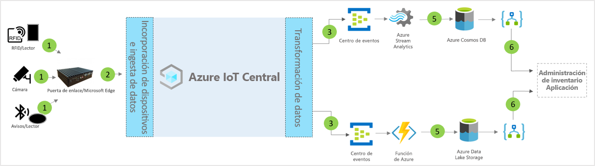

# Arquitectura de la plantilla de la aplicación de administración inteligente del inventario de IoT Central

Los asociados y clientes pueden usar la plantilla de aplicación y las siguientes instrucciones para desarrollar soluciones de **administración inteligente del inventario**.

> [!div class="mx-imgBorder"]
> 

1. Conjunto de sensores de IoT que envían datos de telemetría a un dispositivo de puerta de enlace
2. Dispositivos de puerta de enlace que envían telemetría y conclusiones agregadas a IoT Central
3. Los datos se enrutan al servicio de Azure que se quiera para su manipulación
4. Se pueden usar servicios de Azure (como ASA o Azure Functions) para volver a formatear flujos de datos y enviarlos a las cuentas de almacenamiento que se desee 
5. Los datos procesados se almacenan en un almacenamiento de acceso frecuente para las acciones casi en tiempo real o en un almacenamiento en frío para las mejoras de información adicionales basadas en Machine Learning o en el análisis por lotes. 
6. Logic Apps puede usarse para potenciar varios flujos de trabajo empresariales en aplicaciones empresariales de usuario final.

## Detalles
En la siguiente sección se describen las partes de la ingesta de datos de telemetría de la arquitectura conceptual a partir de las etiquetas de identificación por radiofrecuencia (RFID) y las etiquetas de Bluetooth de baja energía (BLE).

## Etiquetas RFID
Las etiquetas RFID transmiten datos sobre un elemento a través de ondas de radio. Normalmente, las etiquetas RFID no tienen batería, salvo que se especifique. Las etiquetas reciben energía de las ondas de radio generadas por el lector y transmiten una señal de vuelta hacia el lector RFID.

## Etiquetas BLE
La baliza de energía emite paquetes de datos a intervalos regulares. Los lectores de BLE o los servicios instalados en los smartphones detectan los datos de la baliza y, a continuación, los transmiten a la nube.

## Lectores de BLE y RFID
El lector de RFID convierte las ondas de radio en una forma de datos más utilizable. Posteriormente, la información que se recopila de las etiquetas se almacena en un servidor perimetral local o se envía a la nube mediante JSON-RPC 2.0 a través de MQTT.
Los lectores de BLE, también conocidos como puntos de acceso (AP), son similares al lector de RFID. Se usa para detectar señales Bluetooth cercanas y retransmitir su mensaje a una instancia de Azure IoT Edge local o en la nube mediante un JSON-RPC 2.0 a través de MQTT.
Muchos lectores son capaces de leer señales de RFID y de baliza, y de proporcionar una funcionalidad adicional del sensor relacionada con la temperatura, la humedad, el acelerómetro y el giroscopio.

## Puerta de enlace de Azure IoT Edge
El servidor de Azure IoT Edge proporciona un lugar para preprocesar los datos localmente antes de enviarlos a la nube. También podemos implementar cargas de trabajo en la nube de inteligencia artificial, Azure y servicios de terceros o de lógica de negocios mediante contenedores estándar.

## Administración de dispositivos con IoT Central 
Azure IoT Central es una plataforma de desarrollo de soluciones que simplifica la conectividad, configuración y administración de dispositivos IoT. La plataforma reduce significativamente la carga y los costos de la administración, las operaciones y los desarrollos relacionados con los dispositivos IoT. Los clientes y partners pueden crear soluciones empresariales integrales para lograr un bucle de comentarios digital en la administración del inventario.

## Información y acciones empresariales mediante la salida de datos 
La plataforma de IoT Central proporciona opciones de extensibilidad enriquecidas a través de la exportación continua de datos (CDE) y las API. La información empresarial basada en el procesamiento de datos de telemetría o la telemetría sin procesar se suele exportar a una aplicación de línea de negocio preferida. Para lograrlo se usa un webhook, bus de servicio, centro de eventos o almacenamiento de blobs para compilar, entrenar e implementar modelos de Machine Learning y mejorar aún más la información.

## Pasos siguientes
* Aprenda a implementar una [plantilla de administración inteligente del inventario](./tutorial-iot-central-smart-inventory-management-pnp.md)
* Más información sobre las [plantillas de venta minorista de IoT Central](./overview-iot-central-retail-pnp.md).
* Para obtener más información acerca de IoT Central, consulte [Introducción a IoT Central](../core/overview-iot-central.md).
