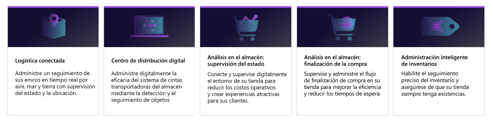
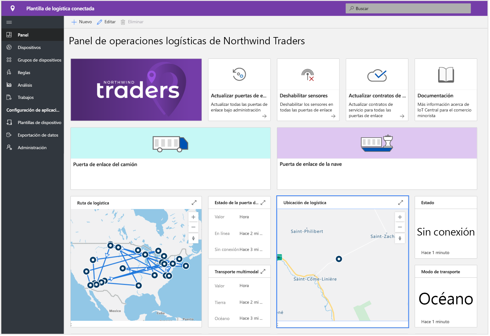
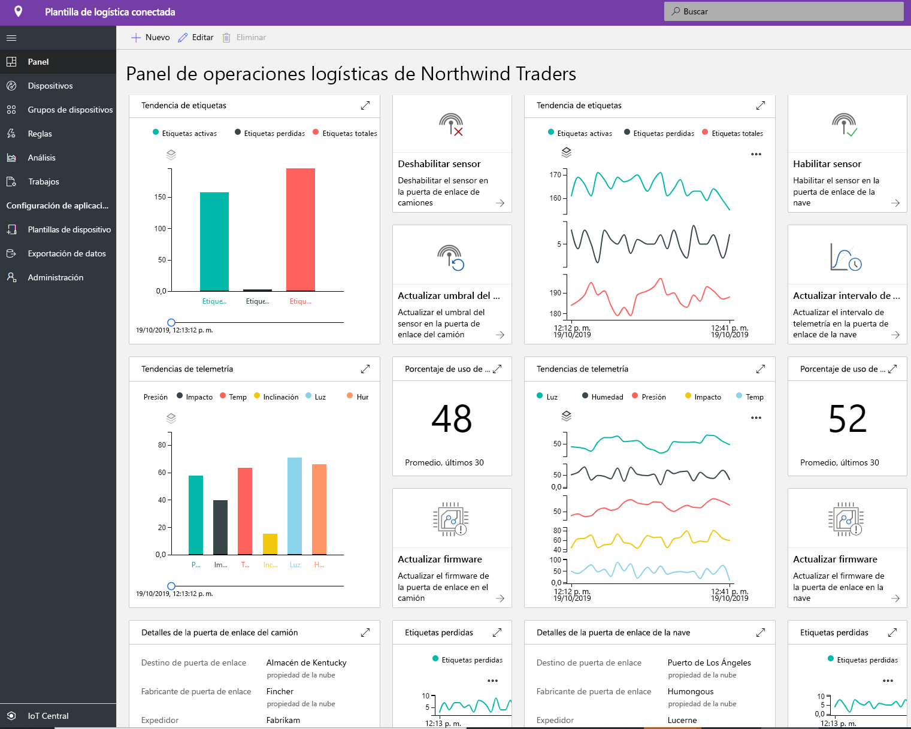
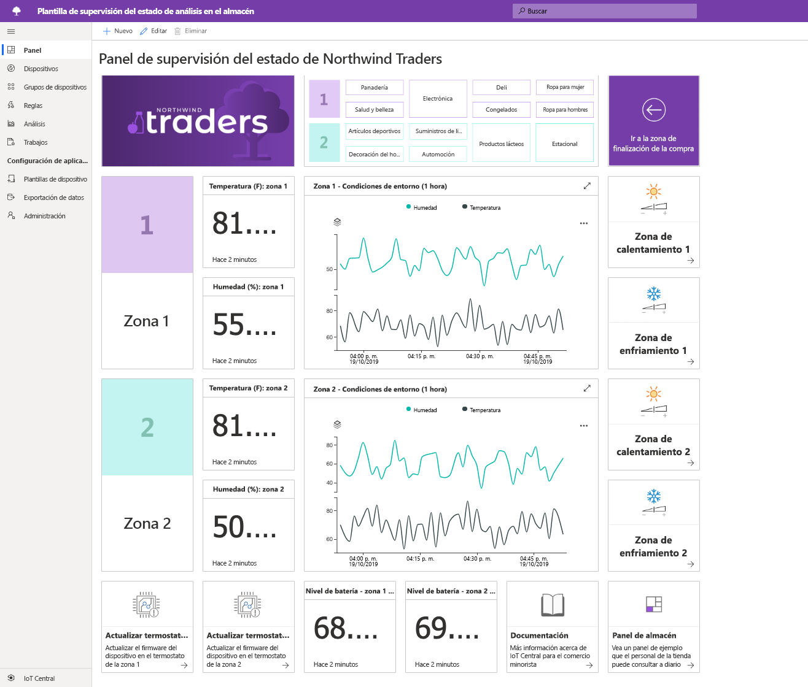
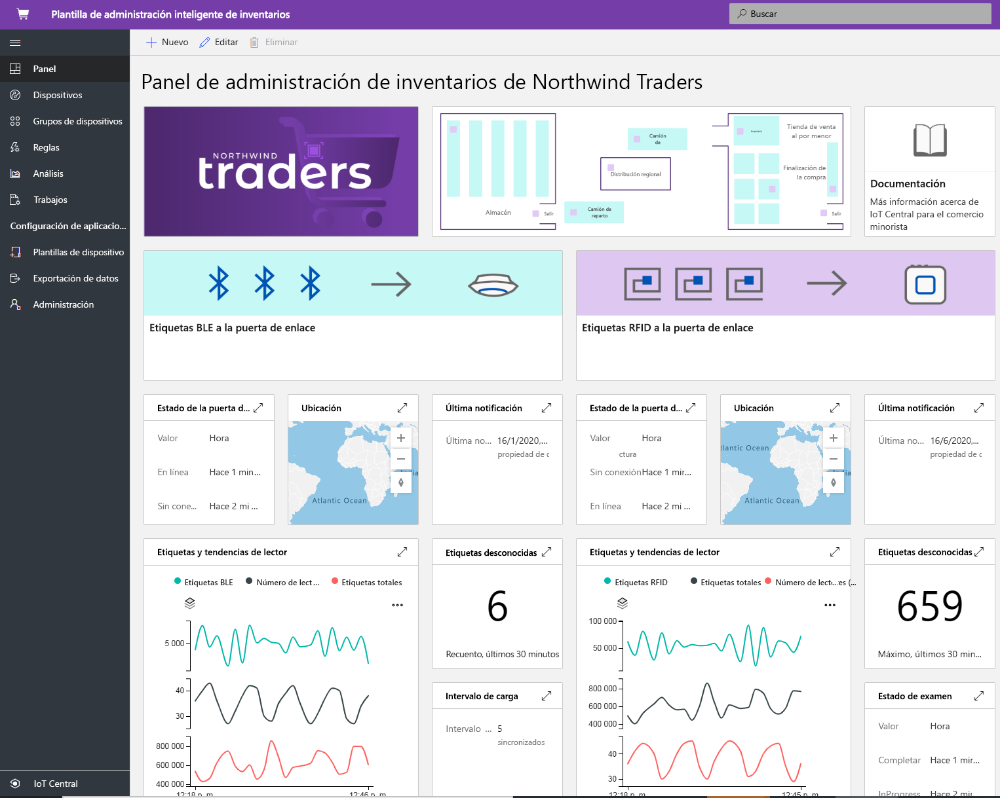

# Creación de soluciones de comercio minorista con Azure IoT Central

Azure IoT Central es una plataforma de aplicaciones de IoT que reduce la carga y el costo asociado con el desarrollo, la administración y el mantenimiento de soluciones de IoT de nivel empresarial. La elección de compilar con Azure IoT Central ofrece la oportunidad de centrar su tiempo, dinero y energía en transformar su negocio con datos de IoT, en lugar de simplemente mantener y actualizar una infraestructura de IoT compleja y continuamente en constante evolución.

En este artículo, se describen varias plantillas de aplicación de IoT Central específicas para el comercio minorista. Como creador de soluciones, puede usar estas plantillas para crear soluciones de IoT que optimizan la cadena de suministro, mejoran la experiencia de los clientes en el almacén y realizan un seguimiento del inventario de forma más eficaz.

> [!div class="mx-imgBorder"]
> 

En las secciones siguientes se describen las funcionalidades de estas plantillas de aplicación:

## Logística conectada

Se espera que el gasto logístico global alcance los 10,6 billones de dólares en 2020. El transporte de mercancías representa la mayor parte de este gasto. Los proveedores de servicios de envío están sujetos a restricciones y sufren una gran presión debido a la fuerte competencia.

Use los sensores de IoT para recopilar y supervisar las condiciones ambientales tales como temperatura, humedad, inclinación, golpes, luz y ubicación de un envío. Puede combinar la telemetría recopilada de sensores y dispositivos de IoT con otros orígenes de datos, como información meteorológica y de tráfico, en sistemas de inteligencia empresarial basados en la nube.

Entre las ventajas de la solución de logística conectada se incluyen:

* Supervisión del envío con seguimiento y trazabilidad en tiempo real 
* Integridad del envío con supervisión de las condiciones ambientales en tiempo real
* Seguridad contra los robos, las pérdida o el daño de los envíos
* Geovallado, optimización de rutas, administración de flotas y análisis de vehículos
* Previsión para la salida y llegada predecibles de los envíos

Las siguientes capturas de pantallas muestran el panel integrado en la plantilla de aplicación. El panel es totalmente personalizable para satisfacer los requisitos específicos de la solución:

> [!div class="mx-imgBorder"]
> 

> [!div class="mx-imgBorder"]
> 

Para más información, consulte el tutorial para [implementar y recorrer la plantilla de aplicación de logística conectada](./tutorial-iot-central-connected-logistics-pnp.md).

## Centro de distribución digital

A medida que los fabricantes y minoristas establecen su presencia en todo el mundo, sus cadenas de suministro se diversifican y se vuelven más complejas. Ahora, los consumidores esperan que haya grandes selecciones de productos disponibles y que las mercancías lleguen uno o dos días después de haberlas comprado. Los centros de distribución deben adaptarse a estas tendencias y, al mismo tiempo, superar las ineficiencias existentes. 

En la actualidad, una dependencia del trabajo manual implica que la selección y el empaquetado supone entre el 55 y el 65 % de los costos del centro de distribución. La selección y el empaquetado manual también son más lentos que los sistemas automatizados y las necesidades de personal que fluctúa rápidamente hacen aún más difícil cumplir con los volúmenes de envío. Esta fluctuación estacional da como resultado una gran rotación del personal y aumenta la probabilidad de que se produzcan errores costosos.

Las soluciones basadas en cámaras habilitadas para IoT pueden ofrecer ventajas transformacionales, ya que habilitan un bucle de comentarios digitales. Los datos de todo el centro de distribución genera conocimientos prácticos que, a su vez, dan como resultado mejores datos.

Entre las ventajas de un centro de distribución digital se incluyen las siguientes:

* Cámaras que supervisan las mercancías a medida que llegan y pasan por el sistema transportador
* Identificación automática de las mercancías defectuosas
* Seguimiento de pedidos eficaz
* Costos reducidos, mayor productividad y uso optimizado

En la captura de pantalla siguiente se muestra el panel integrado en la plantilla de aplicación. El panel es totalmente personalizable para satisfacer los requisitos específicos de la solución: 

> [!div class="mx-imgBorder"]
> 

Para más información, consulte el tutorial para [implementar y recorrer la plantilla de aplicación del centro de distribución digital](./tutorial-iot-central-digital-distribution-center-pnp.md).

## Análisis en el almacén: supervisión de condiciones

Para muchos minoristas, las condiciones ambientales dentro de sus almacenes son un diferenciador clave de sus competidores. Los minoristas quieren mantener condiciones agradables en sus almacenes para el beneficio de sus clientes.  

Como creador de soluciones, puede usar la plantilla de aplicación de supervisión de la condición del análisis en el almacén de IoT Central para crear una solución integral. La plantilla de aplicación le permite conectarse digitalmente al entorno de un comercio minorista, y a supervisarlo, mediante diferentes tipos de dispositivos sensores. Estos dispositivos sensores generan telemetría que se puede convertir en información empresarial, lo que ayuda al minorista a reducir los costos operativos y crear una gran experiencia para sus clientes.

Utilice la plantilla de aplicación para:

* Conectar varios sensores de IoT a una instancia de la aplicación IoT Central.
* Supervisar y administrar el estado de la red de sensores, así como los dispositivos de puerta de enlace del entorno.
* Crear reglas personalizadas basadas en las condiciones del entorno de un almacén para desencadenar las alertas para los administradores del almacén.
* Transformar las condiciones del entorno del almacén en información que el equipo del almacén del comercio minorista pueda usar para mejorar la experiencia del cliente.
* Exportar la información agregada a aplicaciones empresariales nuevas o existentes que dan al personal del comercio minorista información útil u oportuna.

La plantilla de aplicación incluye un conjunto de plantillas de dispositivo y usa un conjunto de dispositivos simulados para rellenar el panel. 

En la captura de pantalla siguiente se muestra el panel integrado en la plantilla de aplicación. El panel es totalmente personalizable para satisfacer los requisitos específicos de la solución: 

> [!div class="mx-imgBorder"]
> 

Para más información, consulte el tutorial para [crear una aplicación de análisis en el almacén en Azure IoT Central](./tutorial-in-store-analytics-create-app-pnp.md).

## Análisis en el almacén: finalización de la compra

Para algunos minoristas, la experiencia de la finalización de la compra dentro de sus almacenes es un elemento diferenciador clave frente a la competencia. Los minoristas desean ofrecer una experiencia de finalización de la compra fluida en sus almacenes para animar a los clientes a volver.  

Como creador de soluciones, puede usar la plantilla de aplicación de finalización de la compra de análisis en el almacén de IoT Central para crear una solución que proporcione información de la zona de finalización de la compra de un almacén al personal minorista. Por ejemplo, los sensores pueden proporcionar información sobre las longitudes de cola y el promedio de tiempo de espera para cada carril de finalización de la compra.

Utilice la plantilla de aplicación para:

* Conectar varios sensores de IoT a una instancia de la aplicación IoT Central.
* Supervisar y administrar el estado de la red de sensores, así como los dispositivos de puerta de enlace del entorno.
* Crear reglas personalizadas basadas en el estado de la finalización de la compra en un almacén para desencadenar las alertas para el personal de ventas minorista.
* Transformar el estado de la finalización de la compra en el almacén en información que pueda usar el equipo del almacén minorista para mejorar la experiencia del cliente.
* Exportar la información agregada a aplicaciones empresariales nuevas o existentes que dan al personal del comercio minorista información útil u oportuna.

La plantilla de aplicación incluye un conjunto de plantillas de dispositivo y usa un conjunto de dispositivos simulados para rellenar el panel con los datos de ocupación del carril. 

En la captura de pantalla siguiente se muestra el panel integrado en la plantilla de aplicación. El panel es totalmente personalizable para satisfacer los requisitos específicos de la solución: 

> [!div class="mx-imgBorder"]
> 

Para más información, consulte el tutorial para [crear una aplicación de análisis en el almacén en Azure IoT Central](./tutorial-in-store-analytics-create-app-pnp.md).

## Administración inteligente del inventario

El inventario son las existencias de mercancías que mantiene un minorista. La administración del inventario es fundamental para asegurarse de que el producto correcto se encuentra en el lugar adecuado en el momento preciso. El minorista debe equilibrar los costos de almacenar demasiado inventario con los costos de no tener suficientes artículos en existencia para satisfacer la demanda.

Los datos de IoT generados a partir de etiquetas de identificación de radiofrecuencia (RFID), señalizaciones y cámaras ofrecen oportunidades para mejorar los procesos de administración del inventario. Puede combinar la telemetría recopilada de sensores y dispositivos de IoT con otros orígenes de datos, como información meteorológica y de tráfico, en sistemas de inteligencia empresarial basados en la nube.

Las ventajas de la administración inteligente del inventario son las siguientes:

* Reducción del riesgo de que los artículos estén agotados y garantía del nivel de servicio deseado por el cliente. 
* Análisis exhaustivo e información sobre la exactitud del inventario casi en tiempo real.
* Herramientas para ayudar a decidir la cantidad adecuada de inventario para atender los pedidos de los clientes.

Esta plantilla de aplicación se centra en la conectividad de dispositivos y en la configuración y administración de dispositivos de lectura RFID y Bluetooth de bajo consumo (BLE).

En la captura de pantalla siguiente se muestra el panel integrado en la plantilla de aplicación. El panel es totalmente personalizable para satisfacer los requisitos específicos de la solución:

> [!div class="mx-imgBorder"]
> 

Para más información, consulte el tutorial para [implementar y recorrer la plantilla de aplicación de administración inteligente](./tutorial-iot-central-smart-inventory-management-pnp.md).

## Centro de micrologística

En el panorama cada vez más competitivo del comercio minorista, los minoristas se enfrentan constantemente a la presión de cerrar la brecha entre la demanda y la satisfacción. Una nueva tendencia que ha surgido para satisfacer la creciente demanda de consumidores es alojar el inventario cerca de los clientes finales y de los almacenes que visitan.

La plantilla de aplicación del centro de micrologística de IoT Central permite a los creadores de soluciones supervisar y administrar todos los aspectos de sus centros logísticos totalmente automatizados. La plantilla incluye un conjunto de sensores de supervisión de condiciones simuladas y operadores robóticos para acelerar el proceso de desarrollo de la solución. Dichos dispositivos capturan señales significativas que se pueden convertir en información empresarial que permita al comercio minorista reducir sus costos de explotación y crear experiencias para sus clientes.

La plantilla de aplicación le permite: 

- Conectar sin problemas diferentes tipos de sensores de IoT como robots o sensores de supervisión de condiciones a una instancia de la aplicación IoT Central.
- Supervisar y administrar el estado de la red de sensores, y los dispositivos de puerta de enlace del entorno.
- Crear reglas personalizadas basadas en las condiciones ambientales en un centro logístico para desencadenar las alertas apropiadas.
- Transformar las condiciones ambientales en el centro logístico en información que el equipo del almacén minorista pueda aprovechar.
- Exportar la información agregada a aplicaciones empresariales nuevas o existentes en beneficio de los miembros del personal del comercio minorista.

En la captura de pantalla siguiente se muestra el panel integrado en la plantilla de aplicación. El panel es totalmente personalizable para satisfacer los requisitos específicos de la solución:

> [!div class="mx-imgBorder"]
> 

Para más información, consulte el tutorial para [implementar y recorrer la plantilla de aplicación del centro de micrologística](./tutorial-iot-central-smart-inventory-management-pnp.md).

## Pasos siguientes

Para empezar a crear una solución para el comercio minorista:

* Empiece con el tutorial para [crear una aplicación de análisis en el almacén en Azure IoT Central](./tutorial-in-store-analytics-create-app-pnp.md) que le ayudará a crear una solución con una de las plantillas de aplicación de análisis en el almacén.
* [Implementación y recorrido por la plantilla de aplicación de logística conectada](./tutorial-iot-central-connected-logistics-pnp.md)
* [Implementación y recorrido por la plantilla de aplicación del centro de distribución digital](./tutorial-iot-central-digital-distribution-center-pnp.md)
* [Implementación y recorrido de la plantilla de aplicación de administración de inventario inteligente](./tutorial-iot-central-smart-inventory-management-pnp.md)
* [Implementación y recorrido de la plantilla de aplicación del centro de micrologística](./tutorial-iot-central-smart-inventory-management-pnp.md)
* Para más información sobre IoT Central, consulte [Introducción a IoT Central](../preview/overview-iot-central.md).
